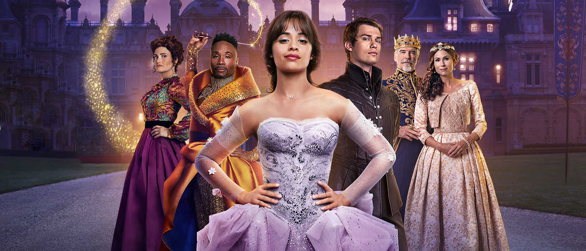

# Cinderella, un cuento de autoayuda envuelto en un cuento de hadas en tono de musical
 (EEUU/GB 2021, Sony/Columbia y distribuida por Amazon Studios  basada en cuento tradicional folklórico).

 Este es un film que privilegia los discursos emergentes de autoayuda, feminismo, movimiento por la diversidad sexual y la lucha contra la discriminación. Tales son los temas que este film toma bajo el paraguas del cuento clásico. Se trata de una película de la cultura de masas, que se ampara en el conocido cuento para forjar una versión libre con asuntos de actualidad. Lo que menos importa aquí es el cuento de hadas, su contenido tradicional, su esquema cognitivista, ahora el centro del cuento está en la puesta en perspectiva de un conjunto de tensiones sociales que se han venido abriendo su espacio narrativo con las luchas que promueve el derecho de la diversidad en todo orden de las prácticas sociales. 
	 
## Autoayuda como cultura contemporánea
Asombra la cantidad de dinero que mueve la autoayuda en los Estado Unidos. Es un mercado atractivo y sumamente amplio. Incluye libros, conferencias, coaching emocional, influencers de redes sociales y un largo etcétera. Su fuerza económica nos dará una idea de esta industria, facturó 12 mil millones en el año 2012, según [Laura Vanderkamí][1]. Es una enorme cifra si la comparamos con el PIB de Honduras, por ejemplo, que en ese mismo año fue 18,53 miles de millones o El Salvador (21,39). En el mundo actual el individuo tiene un rol que no tenía en siglos pasado, en la edad media o en la antigüedad. Tiempos en los que los esquemas estaban claramente definidos. La iglesia, las monarquías, el poder en general, dice Foucault (1) no tomaba en cuenta al individuo. Los individuos no estaban identificados; se les reconocía por ser hijos de tal, vecinos de tal sitio, por practicar tal o cual oficio. El poder, los monarcas, defendían feudos y buscaban ampliarlos para expoliarlos y los plebeyos debían pagar impuestos y servicio militar. La iglesia respondía todas las inquietudes de lo humano y lo divino. Con el advenimiento del capitalismo se comenzó a darle importancia a lo individual, se le identifica y el individuo goza hora iniciativa personal. Dice el profesor Ullmann (2) que el campo de palabras asociadas a lo individual (persona, individualismo y otros de ese campo) se forjaron en el siglo XVIII."Persona" en griego significa lo que hoy significa para nosotros "careta", un objeto de la utilería del teatro. La vida individual, la persona ha ido cobrando importancia en la medida en que ni el absolutismo ni la iglesia rigen la vida social como lo hacían antes de nuestras sociedades industriales y urbanas. *‌Individuo* se usaba con el mismo sentido de la palabra átomo en griego (indivisible).  Lipovetsky (3) describe nuestra era como una época donde el placer sustituye la prohibición, lo anónimo por lo personalizado. Nuestro medio está pletórico de animadores, SOS de amistad. Se ha definido -dice Lipovetsky- como una sociedad de servicios, de autoservicio. Estamos en la era de la "revolución de de la seducción", agrega. En esta cultura actual, el individuo puede sufrir derrotas, aflicciones, puede pugnar por figurar en las redes sociales o en los *mass media* (recuerden *Requiem for a* *Dream*). La autoayuda ha devenido en un mecanismo para apoyar a las esperanzas de la gente a ser felices, a aprovechar las oportunidades en un medio altamente interactivo y urbano, además de una competencia feroz. Ya no se trata sólo de Carpe diem, cazar un chance y disfrutarlo, se trata de crear una *zona de seguridad* y permanecer en ella. Este es el discurso en el cual el film *Cinderella* va tejiendo su significado: la igualdad de la mujer, el paso del reino a una sociedad laica, el respeto por los derechos de las minorías no son sólo para la protagonista, son derechos para todos en el simulacro de sociedad construido en el film. Beatrice, la reina madre del príncipe, se queja de que su trono es más pequeño que el del rey.
	 
## Disney mantiene la tradición de los cuentos populares
De no ser por Disney, seguramente mucha literatura folklórica antigua se hubiera perdido o circularía sólo en grupos especializados de historiadores de la literatura. Disney ha tomado un viejo testigo continuando la tradición literaria al adaptar obras de la literatura al medio audiovisual; los ha puesto en circulación  con un nuevo modo de difusión, las ha hecho rentables. Hoy, seguramente, esos cuentos son tan populares que en sus remotos orígenes. Es posible que los ancestrales oyentes o lectores de esos cuentos les costaría entender nuestras versiones actuales, como a nosotros nos sorprenden algunos contenidos, como por ejemplo la mutilación que las hermanastras intentaran calzarse la zapatilla mágica cortando dedos de sus pies o el el talón en la versión de los hermanos Grimm.
	 
 
## La ruptura de Cinderella con su pasado de mujer rescatada por el príncipe azul
Cinderella ha sido recreada desde la literatura oral por, entre otros, Gianbattista Basile (*La Gatta cenerentola*, 1634), Charles Perraoult (*Cendrillon Ou La Petite pentoufle de Verre)*, los hermanos Grimm (1812); y actualmente en el medio audiovisual, Disney (1950 en la versión de animación) y en 2015 protagonizada por Cate Blanchett, Elena Bonham, Lily James, Halary Doff). La última versión de la saga es la de 2021 (con Camila Cabello y Bonham Carter). 	En la versión de 2021, Cinderella rechaza al príncipe azul y finalmente no se conjunta con el poder y la gloria de pertenecer a la realeza y el príncipe abdica al trono a favor de su hermana, asegurando la sucesión con su hermana. El príncipe se dedica entonces a apoyar a su amada Cinderella en su proyecto privado. Al  dársele prioridad a su propio proyecto empresarial sobre el amor, el giro ha operado y esta versión ya no es lo que era. Ella (Cinderella) antepone sus sueños a el matrimonio con su príncipe y el príncipe prefiere apoyarla.  Cinderella antepone su visión emprendedora e independiente. El diálogo de la película (1:35") es revelador de la perspectiva privilegiada. El príncipe Robert deja de ser azul y dice a Cinderella:
> 	 -Nunca pensé que podría elegir mi propio destino. Siempre creí que ya estaba escrito. Pero al verte me di cuenta que todo es posible.  
> 	 Cinderella le responde:  
> 	 -Qué encantador, pero tengo mucha prisa.  
> 	 Robert insiste:  
> 	 -Lo que trato de decirte es que me elijo a mí. No tengo que ser rey, ya no es lo que quiero. Te quiero a tí. Lo que digo es que elegirme a mí es elegirnos a nosotros, mientras tú sientas lo mismo.  
	 
 Esto sería incomprensible para la gente de que leía ese cuento de los hermanos Grimm (1812) o de Gianbattista Basile (1634) en los cuales el rescate de la infortunada joven la conducía al palacio, en un acto de justicia, con un matrimonio asegurado. El objeto de valor ahora en la versión de 2021 es otro, no es el ascenso social, la lucha contra el mal. Esta Cinderella privilegia el valor de la iniciativa, la diversidad, la libertad de las mujeres para avanzar en la sociedad y ser reconocidas como seres capaces que no dependen de un hombre (así ese hombre sea un príncipe). En una palabra, para decidir por sí mismas, y allí está la gracias del planteamiento. En nuestros tiempos la sociedad ha ido confeccionado un discurso para ayudar a las personas a estar seguras de ese principio sin renunciar en la adversidad; eso parece ser muy importante para el hombre contemporáneo. Esto corre en la versión de 2021 y la diferencia de todas las versiones anteriores. Para un lector antiguo, esto haría que  la Cinderella de 2021 fuera texto casi irreconocible, no el mismo de la tradición. Eso hace de esta versión, una versión libre y de verdadera actualización a los tiempos que corren.  Sostengo que  Cinderella 2021 es una obra de autoayuda bajo el género del musical y que ese significado tiene que ver con el espíritu individualista imperante en las sociedades occidentales contemporáneas. No podemos aun anticipar su éxito y consolidación como  cuento adoptado de manera institucional, esto dependerá de la aceptación y de factores imponderables seguramente. También puede que pase sin pena ni gloria.
 

## Identidad de Cinderella con sus antecesoras versiones.
 
La versión de 2021 mantiene el nombre clásico y se apega a algunas características del cuento de hadas, como "Érase una vez en un reino", pero de una vez crea la oposición que atraviesa toda la narración: "en un reino anticuado atado a las tradiciones". Será entonces la tensión cambio-conservación de la tradición lo que permite la introducción de una narración que se sale de los esquemas clásicos de la niña marginada y el príncipe azul. Además de esta señal lingüística del género, esta Cinderella mantiene la ayuda del hada madrina, con su varita mágica. Esta vez la narración sorprende con un hada diferente, un hombre negro y no una mujer como en las versiones anteriores. No hay una palabra con género masculino para "Hada". Acá vemos cómo se introduce en la narración el discurso social de la igualdad de género, muy propio de nuestros tiempo. Las doce campanadas, las zapatillas y otras muestras permiten al espectador identificar esta versión con las anteriores. Ese es su paraguas de contenidos de los que se sirve para introducir giros definitivos en esta versión. En definitiva, lo que importa a Cinderella 2021 es la oportunidad para hablar de los temas actuales. 
		  		  
## ‌Diversidad racial y temporalidad

Diversidad racial, en la versión 2021 aparecen pobladores negros en el reino. Es negro el hada madrina, el pregonero, una reina invitada al baile y muchos más. Son preocupaciones propias de la actualidad, discursos que se han ido conformando y han ido ganando terreno en la vida social. No eran asuntos que importaran en los tiempos pasados.
La temporalidad se disuelve a propósito, ya que a la par de la recreación de artefactos de una temporalidad medieval, aparecen artefactos de la modernidad como máquinas Singer de coser, guitarras, pavimento, ropa con estampados y confección de la era industrial. Esto no es un gazapo sino la intención de signar la narración de tiempo presente, de retrotraer la temática a la vida de hoy con sus consecuente vigencia de lo tratado en sus contenidos. este film hace algunas concesiones en favor de cubrirse, de crear el efecto de que se y trata del mismo cuento tradicional y que se ciñe a su época, pero al mismo tiempo debe crear un sentido de actualidad, por lo que debe introducir efectos actuales. De esa manera salva su propuesta de cobijarse en el paraguas del cuento clásico para discursear y mantener el título del cuento.
		   
## ‌Atenuación de las tensiones en Cinderella 2021
			  
La trama de la versión 2021 busca quitar peso 
semántico a la relación de Cinderella con su madrastra. Las versiones anteriores ponen mucho peso en esa relación de humillación para crear un estado de solidaridad con la débil Cinderella. En el guión Vivian, la madrastra habla con Cinderella, le pide que se case con Thomas para que ayude a la familia: "hazlo por nosotras, por tu familia". A lo cual Cinderella responde: "Ayudaré a la familia, puedo ganar dinero". Ahora vemos atenuada esa relación, aparecen escenas de desprecio, pero no tienen el mismo significado pleno que tienen en la versión de Perrault,  ya que lo que esta última versión le interesa narrativamente es la fuerza interior del personaje Cinderella para la vida de emprendimiento e independencia. Cinderella baila, diseña en un sótano y va al mercado a vender sus productos; realiza transacciones, es libre para emprender como diseñadora  y comerciante. Tal es su sueño, no casarse con un príncipe azul. Allí está la gran diferencia, Cinderella ve en su emprendimiento la oportunidad de ser libre y reconocida, mientras que en otras versiones es el príncipe azul el que la saca de la miseria. Su madrastra confiesa que ella perdió su sueño al dejar la música por aceptar los esquemas que le hacían adoptar un modo de vida lejos de su realización personal. No obstante, intenta casar a Cinderella con Thomas, un empresario de verduras del reino sin el consentimiento de la chica. Lo que más sorprendería a un espectador medieval es ver como una chica decide su destino y rechaza a Thomas y también rechaza un buen partido, un partido de la realeza.
			  
## Musical e intertextos para modernizar
			  
Se llama *‌intertexto* al mecanismo de introducir un texto establecido en la cultura para crear refuerzos, contenidos que interactúan con los textos en desarrollo. Un intertexto garantiza la resonancia y aprovechamiento para aportar su sentido en el texto que lo acoge. No se trata de plagio o de falta de creatividad, sino de incorporación para generar una polifonía de significados en provecho del sentido de la obra. Así, las resonancias múltiples dotan al texto de diversas fuentes de contenidos. Allí tenemos la música de Queen en el palacio real (*‌Somebody to love)* Freddy Mercury y *‌Material Girl* de Brown y Rams. Son dos piezas que apuntalan el sentido del film. La primera para expresar la soledad y la esperanza del príncipe de cara al futuro ("He creído en ti todos estos años, pero no encuentro alivio, Señor, encontrar a alguien a quien amar" dice la letra de la canción). La segunda es la famosa canción que popularizó Madonna y sirve para aportar información de la mentalidad de la madrastra de Cinderella, Vivian, para educar a sus hijas a casarse en un matrimonio que las saque de la decadencia en que se encuentran. La letra de las otras canciones simplemente apuntalan la perspectiva de la autoayuda,la afirmación del yo , la independencia, la libertad de iniciativa privada y la fuerza para vivir en un mundo: 

> -"No quiero desperdiciar la vida, aunque tenga miedo". Cuando el príncipe en el baile en palacio le dice a Cinderella:  
> -Eres tú. Eres la elegida, no me importa que no seas de la casa real. Nos casaremos y el resto de la vida serás de la realeza". Obtiene por respuesta de Cinderella:  
> -¿Realeza?, ¿y mis vestidos?.. Alto. Una vida saludando atrapada en un palacio real. Tengo sueños que seguir. Si puedo elegir, me elijo a mí.

Finalmente el amor triunfa, pero la iniciativa está en la perspectiva femenina y no el lo masculino. Ambos amantes se reencuentran en un plan que eligen ambos. Se dedicarán al emprendimiento con la bendición de la corona y vivieron felices para siempre. Allí el cuento de hadas vuelve por sus fueros narrativos clásicos. Cierro volviendo sobre la manera en que la sociedad va encontrando maneras discursivas para enfrentar modos de vida. Se puede entender la vida social como la pugna de significados puestos en los más diversos textos, de oda índole, no sólo artísticos. Lo que parece un poco extemporáneo es que se haga apología de discursos emergentes como los que he indicado frente al discurso del absolutismo medieval. No es extraño que el poder suela hacer defensa permanente de sus principios. La sociedad industrial hace defensa de sus principios liberales, hoy no amenazados por la realeza sino por los totalitarismos radicales y antiliberales actuales, pero eso es muy costoso. Es mejor oponerse a quien ya no puede defenderse. En eso puede observarse un dislate del planteamiento del juego de las oposiciones del film Cinderella 2021.

## Referencias  
1. Foucault, M.(2012) *El poder, una bestia magnífica.* Argentina: Siglo Veintiuno Editores.
2. Ullmann, S.(1977).*Lenguaje y estilo* Madrid: Aguilar.
3. Lipovetsky, G. (1986). La era del vacío. Barcelona:Anagrama.		  
			  
  [1]: https://kripkit.com/autoayuda/ 
	  
	 