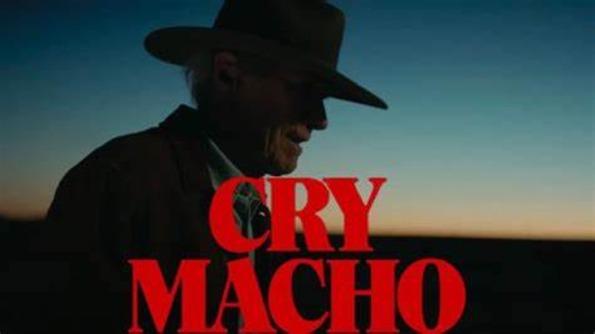
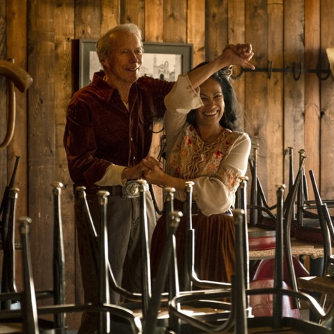
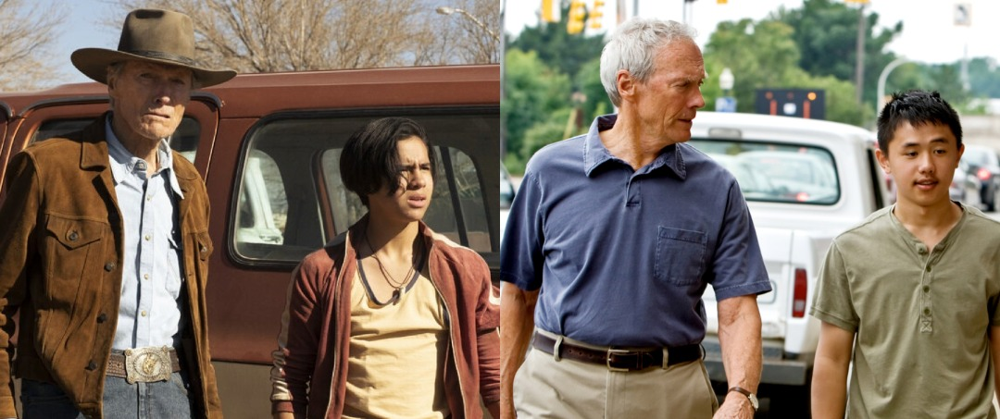
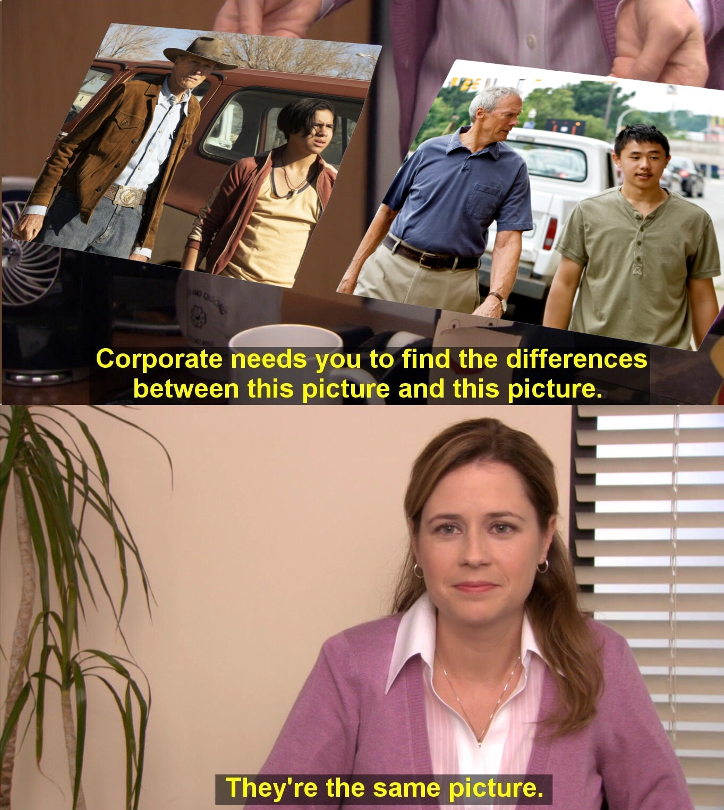

# Cry Macho
## La saga de la tolerancia en dos filmes de Clint Eastwood

Muchos espectadores de películas no les gusta que le cuenten la película porque les arruinan el desenlace. Esto es comprensible en algún tipo de películas, especialmente en películas de detectives, donde algún giro inesperado cambia la expectativa del espectador. No toda obra narrativa funciona en ese esquema. El contenido de una película puede ser sumamente anecdótico, trillado y sin embargo están hechas con calidad técnica, con una narrativa atractiva o con actores que le agregan a la narración un valor especial. Lo único a valorar en un film no está es su contenido, muchos espectadores disfrutan el film en sus aspectos sensitivos: la locación, los actores, la música, la fotografía, la iluminación, etc. Un film está hecho de muchas cosas, además de mensaje o contenido.

Hay obras importantes que se basan en contenidos espurios. Nada se crea de la nada, el significado de obras narrativas siempre tiene empalmes temáticos, tanto en su estructura narrativa, con otras obras o con acontecimientos históricos, con mitos, fílmicos, entre otros muchos. ¿Qué podemos inventar si hacemos una narración sobre el texto bíblico José y sus hermanos, por ejemplo, o sobre el mito de un héroe que logra hacer justicia, atribuyendo orden donde sólo había caos e injusticia. *Rango* (la animación de 2011 dirigida por Gore Verbinski) es eso;  un justiciero que pasa algunas pruebas donde no “actúa” con honestidad. Cuando Rango encuentra su papel (honestidad) logra transformar su entorno. 

Me centro ahora en la película objeto de esta nota: *Cry Macho* (2021 Dirección de Clint Eastwood). Su contenido argumental es simple y en nada pretende revolucionar la narrativa cinematográfica; no obstante esa sencillez, es una pieza que participa en mundo de significado, vuelve, abunda, trata un hilo de significado que nuestras sociedades tienen siempre el tapete: la sociología del ser marginal rodeado de condiciones adversas. Decía Rousseau que el hombre nace bueno y la sociedad lo corrompe. Esa visión sociológica determinista y realista (causa-efecto) la que soporta este film de Eastwood. Tema ya recurrente en la filmografía de Eastwood, como por ejemplo  *Gran Torino* (2008). Ambas películas tributan esta estética realista, las condiciones materiales hacen que un ser humano  joven (en ambos filmes: Rafo es el equivalente a Thao de *Gran Torino*) están en riesgo de transitar el camino del mal. La sociedad (sus mayores, el buen ejemplo) pueden salvarlos de ese camino. En *Cry Macho* el joven Rafo está a punto de entrar en el submundo de la violencia (peleas de gallos, malandraje, mal vivir). Su madre piensa que él (Rafo) es un ser despreciable, peligroso. Su madre es mexicana y su padre es estadounidense.

El padre de Rafo cobra un favor a Mike Millo (Clint Eastwood) encomendándole traer a los Estados Unidos a su hijo. Un hijo que éste ciudadano estadounidense tuvo con una mexicana que anda en una vida antisocial. Ella intenta seducir a Mike con sexo para que se ponga de su lado, sin éxito. Mike, a través de varias acciones logra llevar a Rafo con su padre. A Rafo se lo disputan sus padres porque a su nombre están algunas propiedades que la ex pareja tienen en común. Este asunto tiene poca importancia en el desarrollo del film ya que aparece cuando ya la travesía de México a los Estados Unidos ha avanzado. Ese argumento es una excusa para lo que el film en realidad quiere decir: los prejuicios raciales de una sociedad sobre otras.

En el trayecto del mandado podemos ver elementos de la realidad mexicana: corrupción de las autoridades, vandalismo, violencia, etc. Pero también podemos ver, la película se encarga de ponerlas en escena: una población humana, niños sordos,  campesinos desasistidos, gastronomía, música. No todo en México es detestable; los otros son unos seres humanos cálidos, amables, honestos, con valores y tradiciones dignas. De eso trata la película; de ofrecer al gran público una mirada diferente del otro. *Cry Macho* no ofrece una mirada maniqueista. Generalmente los buenos son la sociedad estadounidense y los malos los mexicanos.  Mike logra llevar al mestizo Rafo y a su gallo (Macho) de los bajos fondos y le lleva con su padre donde tendrá oportunidades que por ley le corresponden. Esta pasantía del “gringo” en el México profundo es la sociología de la película. Mike encuentra en México  el amor senil en una mujer mexicana y, al cumplir su compromiso, Mike se devuelve para reencontrarse con ella. Esa buena mujer que brindó apoyo desinteresado a Mike y a Rafo en su travesía. De México a los Estados Unidos.

Mike Millo no discrimina, aprecia al otro, al diferente. Es una mirada de un estadounidense a la cultura mexicana. El film se suma en su perspectiva a la solidaridad, a romper los prejuicios raciales y en eso *Cry Macho*  se integra al discurso social de la no discriminación, de un mundo en contacto abierto con otro. Como en *Gran Torino*, la acción desprejuiciada y solidaria puede ayudar a enmendar seres que tienen las condiciones de caer en el mal. Son filmes donde revelan la visión sociológica, realista; participes de un hilo narrativo del que tributan infinidad de películas, relatos literarios, ensayos, etc.

Mike Millo es el personaje de Clint Eastwood (nacido en 1930 y con 91 años en la vida real) y el el universo de la actuación los actores van creando una serie de perfiles que muchas veces los condenan. Los actores de *Friends* (excepto Jennifer Aniston) no logran salir del manto de sentido humorístico que se crearon a lo largo de la serie. Actores como Eastwood tienen las marcas del actor del western. Son marcar indelebles su sombrero, su chamarra, su valentía y mirada adusta, escenarios polvorientos y caballos. No obstante, los actores deben lidiar con esas marcas que Hollywood le hizo con años de filmes. Eastwood es un ícono del cine western y carga con sus marcas cinematográficas. Aún así, el actor de carne y hueso, con dirección postal y vida legal ciudadana debe ser diferenciado del personaje fílmico. Son dos asuntos diferentes: vivir en la vida y vivir en el film. El personaje de nuestro film es Mike pero la industria del cine busca darle fuerza a su narración y a la taquilla con actores que tengan arrastre y Eastwood es uno de ellos. Suena raro que en *Cry Macho* un anciano haga el papel protagónico de vaquero americano en un pueblito mexicano, conquiste mujeres y tenga peleas a puños con hombre más fuertes y salga airoso. 

Federico Marín escribe en un diario español [Crítica ABC](https://www.abc.es/play/cine/criticas/abci-critica-macho-gigantesco-cine-menor-y-leccion-vida-viejo-clint-eastwood-202109240246_noticia.html) de esas marcas a las que aludí antes (sombreo, mirada, etc.), el vaquero del western y pretende asimilarlo al actor de carne y huesos del film *Cry Macho*: “Clint es huesos, sombrero, mirada y manos”. Si el personaje Mike Millo hubiese sido hecho por un actor joven, fuerte y actual tipo Chris Pratt, ese crítico se quedaría sin nada que decir; no es que Pratt no tenga condiciones para moralizar, sino que el film *Cry Macho* aprovecha las condiciones de Eastwood como capital con significado garantizado. Mike Millo es un personaje que explota la tradición creada por Hollywood en el actor Clint Eastwood, es un personaje que respalda con fuerza la perspectiva sociológica que la película promueve. La composición de los elementos del film (incluidos los huesos y la piel arrugada) están reaprovechados de su tradición fílmica para armar este film. Se trata de un viejo que con sus años es capaz de ir a otro país y disfrutarlo sin prejuzgarlo.

Un anciano que promueve el entendimiento, desprejuiciado y solidario con lo alternativo, con los otros (lo diferente). Mejor que un anciano haga lo que hizo en la película, diga lo que dice porque ello le otorga credibilidad al argumento fílmico. El, Clint Eastwood en la vida real puede ser como le guste y pensar como le parezca. Una cosa es el actor de carne, hueso y dirección postal y otra es el personaje fílmico, insisto. Estoy seguro que Clint Eastwood nunca disparó a nadie, como si lo hizo en sus westerns. Por otro lado, la industria del cine recurre a todo lo que haga posible dotar de credibilidad a su narración. Por último, vale la pena destacar la magnífica factura técnica de *Cry Macho*. Su fotografía es magistral, hecha con profesionalismo para tratar un tema baladí y con un desarrollo previsible cono en esta película. ¿Vale la pena ver *Cry Macho*? Yo soy de la idea de que vale la pena verlo todo; es un producto que nos conecta con nuestra realidad y nos invita a compartir su perspectiva y a disfrutar su arte. Su significado actualiza un tema social y nos invita a renovar nuestras mejores creencias: tolerancia y apoyo a los jóvenes para que no sean víctimas de lo peor de la sociedad.

