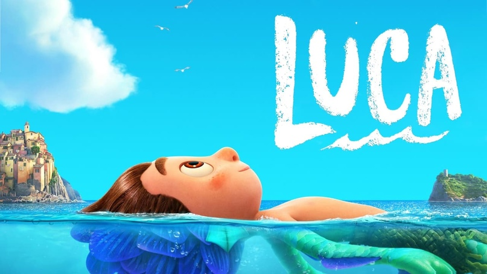
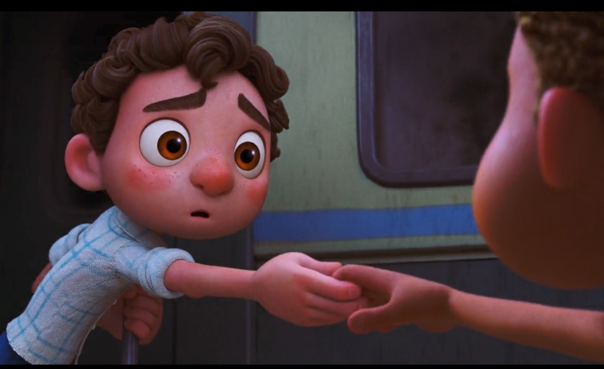
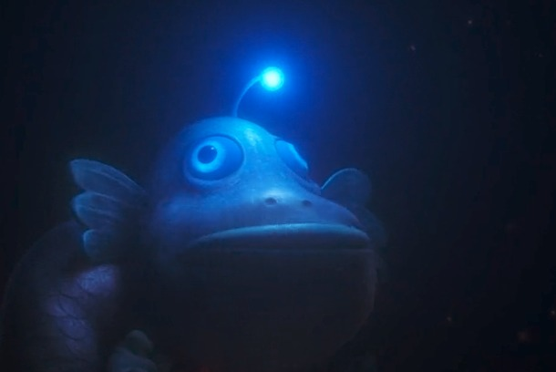

# Luca
> Disney-Pixar 2021 (EE. UU.). Dirigida por Enrico Casarosa. Ha recaudado más de 50 millones de dólares en taquilla.

## ***Luca y la crítica***
Luca es un film de animación que aborda el del hastío y la curiosidad de unos niños. Parte de la transgresión de uno niño (Luca) a las órdenes de la familia de no salir de su medio: el agua. Luca transgrede y se traslada a un medio diferente al suyo (superficie terrestre), fascinado por las maravillas de la civilización humana. Luca (12 años) se deja arrastrar por otro niño (Alberto) a la aventura en un espacio diferente al natural. Juntos corren la aventura de ir a otro mundo y salen triunfantes de esa aventura donde se presentan no como monstruos marinos sino como personas comunes hasta que finalmente son descubiertos, reconocidos y aceptados como *relegados* (diferentes) por la comunidad del pueblo Portorosa. Esa metamorfosis ha dado pie a interpretaciones libres que asimilan ese film al discurso gay; pero, igualmente, podría ser interpretado como diferentes racialmente, o como extranjeros-migrantes. La interpretación funciona como un proceso de *equivalencia* y cualquiera de las alternativas antes ofrecidas podría ser acertada porque finalmente se trata de la aceptación de lo *diferente*. El *motivo* (término de la crítica de la literatura para fijar el concepto a aquello que recrea un tema asentado en la tradición narrativa). Es un *motivo* el tema de un hombre que regresa a su tierra después de años de ausencia y nadie le reconoce hasta que muestra la mitad de un anillo que encaja perfectamente con la otra mitad de alguien en el pueblo, o la idea de viajar al pasado para cambiar el presente (*Terminator* y su saga). En el *motivo* se juntan situaciones, personajes y esquemas que como unidades suelen aparecer en variadas combinaciones [(1)](#refs). El arte de masas suele recurrir a esta forma narrativa por asuntos de comercialización. *La sirenita* de Disney es un claro ejemplo si la comparamos con *Luca*. Ambas obras le deben el motivo a Hans Christensen Andersen. La factoría Disney ha hecho del motivo una seriación en la que debe incluirse a *Luca*.

## **Luca y la alegoría gay**
La recepción de esta animación de Pixar ha girado en torno a dos opciones. Una que ve un contenido inocente de las aventuras de dos niños en un medio que no es el suyo. Por otro lado, la perspectiva de un film alusivo a la comunidad LGBT. En las notas bibliohemerográficas están los links [(2)](#refs) de varias reseñas que trabajan esa idea. El discurso gay viene de una tradición del *parecer a ser*. Es decir, ha sido una narrativa sumergida, escondida, ocultada, negada hasta hace poco y aun lucha por su reconocimiento y por el orgullo. La moral social ha hecho que el discurso gay se mantuviera tabuado (del polinesio *tabú*, prohibido). Esa condición ha guiado a la crítica no profesional a ver discurso gay en mucha narrativa que participe de lo oculto, de lo reprimido y de lo tabuado. Como tema tabú, lo gay se ha mostrado socialmente bajo procedimientos *alegóricos, indirectos* para evadir la censura.  Así, se ha visto como discurso gay a Batman y Robin, a Bob Esponja, entre otros muchos. La censura ha coartado la discursividad directa de la temática gay y esa condición ha modelado la aparición de un recurso retórico de la *alusión*. Sociológicamente, para la comunidad LGBT que ha padecido esa discriminación, la aparición de textos gays es causa de beneplácito. Especialmente si se trata de una gran productora cinematográfica. De allí que ciertas opiniones interpreten a *Luca* como un film gay.

## **Hermes alegórico y tabuado**
 La *alusión* toca el tema de manera indirecta, habla de las cosas sin mencionarlas, "a través de otras que hacen pensar en ellas" [(3)](#refs). Una de esas maneras ha sido la que bajo la forma fraseológica *salir del clóset* ha englobado el mundo prohibido de la vida gay. Salir del clóset ha sido una práctica de atreverse a ser públicamente algo: sexualidad alternativa, sin tabúes, sin que el juicio moral impida asumirlo y sin esconderse. Quizá por ello *Luca* al salir del agua sea entendido como salir del clóset, mostrar su preferencia sexual. Ahora bien ¿*Luca* muestra *evidencias* de que esa lectura sea posible? ¿Es posible asimilar la salida del agua a la salida del clóset? ¿Es la alusión suficientemente razonable como para incluir a *Luca* en la categoría de discurso gay? El discurso gay tiene ciertas similitudes con el discurso *hermético* medieval. El hermetismo parte del principio de que la verdad se oculta en un texto literal que le sirve de soporte. Un texto en el que lo literal no es lo que realmente quiso decir el autor. El *Modus* racionalista es incapaz de dar con el verdadero significado y el significado hermético oculta una extraña verdad en libros. La alusión y la alegoría pueden guiar la búsqueda de esa revelación que el oráculo cifró. En el discurso fílmico que nos ocupa, el discurso gay conoce su verdad, pero busca su *ser en la manifestación*, en la transgresión a la norma que lo condena a no manifestarse. Cuando se manifiesta, alegóricamente, el goce reside en la alegría que supone decir lo indecible, en confesar su ser, en atreverse a mostrarse de manera indirecta. Eso oculto, tabú, suele interpretarse a través del mecanismo alusivo y requiere cierta exégesis que interprete y revele el verdadero y solapado significado. Volveré sobre este asunto luego, al hablar del *Modus* tal como lo explica Eco (1992).

## **La crítica es un bien social**
Me permito un paréntesis para hablar de la crítica (cinematográfica o cualquier otro objeto artístico o no). La crítica profesional ayuda a pensar y a decidir nuestra valoración sobre objetos de significado con los que entramos en interacción. La crítica consiste en formularse preguntas sobre esos bienes de significado y procurar darles respuestas adecuadas. La crítica no pretende sustituir los objetos que critica, son dos asuntos distintos y ambos edificantes. Tampoco se hace para complacer a quien produce o distribuye esos bienes culturales. La crítica a los objetos culturales (cine, literatura, arte, danza, etcétera) no es la única que se practica; hay críticas muy prácticas como la que hacen los expertos sobre bienes materiales lavadoras, televisores, teléfonos hasta un curso de cocina en línea; en síntesis, cualquier cosa es digna de crítica. La crítica es un bien social y debe cultivarse como tal. La crítica ayuda a la evolución de nuestra percepción de los objetos de significado, ya que nos ofrece maneras de entender; o nos evita comprar objetos de dudosa calidad.  La crítica no anula el goce de las obras, por el contrario, afina la percepción, el pensamiento sobre ellas. Nadie entra en contacto con una obra de manera virginal, sin creencias o gustos y esos gustos generalmente se encuentran moldeados por factores sociales o comerciales, entre otros. Lo que quiero decir es que es necesaria cierta crítica especializada para que aporte ideas sobre las tendencias de pensamiento social a través de los textos que circulan en la cultura de masas, especialmente. Es una defensa de la crítica y u con una crítica comprometida con el saber. Es pertinente formularse preguntas sobre otras críticas. Por ejemplo: ¿Es *Luca* es una animación que trata sobre el género gay? ¿Su significado está desarrollado de manera indirecta, alegórica? Al mismo tiempo caben preguntas sobre las herramientas que se hace la crítica. Es pertinente, por ejemplo, preguntarse si el significado se encuentra en el objeto de significado con el que se entra en contacto. ¿Es autosuficiente y estable el significado de un film? ¿Hay elementos externos a la obra que inciden en la valoración del significado de una obra? ¿El significado depende del sujeto espectador y sus creencias? Tenemos ahora tres elementos en torno a la obra (de arte en este caso, pero es extensible a cualquier objeto con significado): a) la obra en sí, b) el espectador y c) el entorno. Estos elementos constituyen *criterios fuertes* a la hora de evaluar críticamente un film, una obra literaria, o cualquier objeto de significado. La crítica académica ha ido construyendo estas herramientas a lo largo de su historia.

## **¿Realmente se dice eso en Luca?**
Eco [(4)](#refs) ha estudiado el tema del significado en las tres categorías antes anunciadas: *textual, entorno y espectador*. Progresivamente, el estudio del significado de las cosas se ha desplazado desde el objeto-significado hacia el entorno y hacia el destinatario-receptor. El significado parece no estar enteramente en el texto-objeto como se pensó durante siglos. Si el significado fuera monopolio del *texto en sí*, todos estaríamos de acuerdo siempre al entrar en contacto con el mismo texto. No encontraríamos discrepancias en la percepción de algo, reinaría el consenso. *Luca* (como objeto-film en sí) tendría solo una interpretación y ya. Las cosas significarían una cosa sin lugar a otras interpretaciones. La verdad emanaría de manera natural de cualquier objeto significante. ¿Son compatibles la interpretación *ingenuas*y la interpretación *alusiva* a la que he hecho referencia? En principio no lo son. Tomando en cuenta el parte del *entorno*: productor y distribuidor del film (Disney) no cabe pensar en esa posibilidad dado su tradición conservadora (aunque ya se ha ido actualizando a la perspectiva de cambio en vista del avance de que ello reporta beneficios económicos; así hemos visto héroes gays en algunos de sus filmes).
Umberto Eco escribió un par de libros sobre este asunto del significado. En el primero (*Obra abierta de 1962*) y *Los límites de la interpretación de 1990*. Allí Eco aboga por dos modelos de lecturas distintas e irreconciliables. En 1962 creía que era el lector quien depositaba en la obra el significado. En el de 1990, Eco cambia de opinión y dice que la obra está sometida a lo que llama *El Modus* (un contrato social que exige cooperación del espectador para desplegar su significado dentro de los límites marcados por la frontera del contrato social). Ahora ya podemos comenzar a sacar conclusiones en torno a la pregunta de si *Luca* dice lo que dicen algunas opiniones en torno su perspectiva gay. No he encontrado ninguna evidencias que ofrezcan la *creencia razonable*. Este último concepto lo tomo de de Putnam [(5)](#refs) para explicar lo que este pensador llama *El significado como una noción normativa*, una hipótesis de significado muy similar a de Eco. Putnam agrega el concepto de *grado de confirmación* para que el procesamiento de información tome las evidencias a favor de tal o cual significado. Las continuas metamorfosis y de ocultamiento de los chicos de la película para que no los descubran como seres de otra naturaleza (marina) no son suficiente evidencia como para transpolar el significado hasta la temática gay. Primero porque son muy chicos como para tener ese asunto en sus preocupaciones. Luca y su amigo están más interesados en la aventura, en el juego, en la experiencia. El ser (marinos) y parecer (terrestres) no da pie para inferir una interpretación de *Luca* como un discurso *alegórico*. Tenemos en *La Sirenita* (Disney 1989) un antecedente al que nadie se vería tentado a pensar que su salida del medio líquido al sólido tiene que ver con mensajes alusivos a tal o cual condición. Las transformaciones, los cambios de espacio, de tiempo, de estado real a ficción es lo propio de la narratividad. Debe ocurrir algo extraordinario para que la transformación, el giro narrativo, se produzca y la narración cobre fuerza. *Luca* es la versión masculina, el tritón de *La Sirenita*. Es una puesta al día para el mercado actual, para un público de hoy 32 años después, cuando los niños de entonces son los adultos de hoy.

## **¿Cuál es el significado de Luca entonces?**
Luca Paguro es un niño que desea saciar su curiosidad y encuentra en Alberto Scorfaro un adyuvante. Se trata de dos niños que se transforman en niños comunes una que dejan de tener contacto con el agua. Luca recibe una *revelación* en un cártel de una moto Vespa. Ambos deciden adquirir una y dedicarse a recorrer el mundo. La revelación que menciono tiene más que ver con un deseo que introduce un giro en la vida de alguien que de una epifanía. Greimas y Fontanille [(6)](#refs) hablan de la semiótica de las pasiones para mostrar la manera como un sujeto no sintáctico busca fundirse con aquello que considera *perfecto* y que le impulsa al devenir. Ambos niños comparten esa revelación y descubren, junto a otra niña (Giulia) que pueden adquirir la moto si ganan un triatlón que se realizará en el pueblo. El asunto es que el espíritu que Alberto Scorfaro había insuflado en Luca pronto se hace pequeño y sin mucho sentido para Luca cuando descubre que "dormir bajo los peces" no era en realidad peces sino el cosmos, las estrellas de un universo mayor e infinito. Luca se entera de que eso es información y que la escuela la proporciona. Entra entonces en conflicto con Alberto y rompen porque la nueva *revelación* de Luca es mucho más atractiva que la de la Vespa. Esto se resuelve en un par de diálogos que tienen los protagonistas:

> [00:50’] Alberto: Queremos la Vespa para valernos solos. No necesitamos la escuela. No necesitamos a nadie… Los monstruos marinos no podemos ir a la escuela. 
> [1:05’] Giulia: Mi padre caza monstruos marinos. Luca, debes irte de aquí.
> Luca: Pero creí que éramos *relegados*
> Giulia: Arriesgas la vida por una Vespa?

Finalmente, los chicos participan y ganan el triatlón, pero en plena competencia llueve y se ven descubiertos con el pueblo entero. Una vez descubiertos el pueblo los proclama vencedores y deciden tolerar las diferencias que lo separan. Lo demás es rutina narrativa: Luca va a la escuela con la anuencia de sus padres y Alberto se queda como ayudante de pescador. Lo que promueve el film *Luca* es la grandeza de mira, el no conformismo y la tolerancia. Alberto creía como totalidad (Portoroso y la Vespa), Luca mira aún más alto, al saber, a la educación formal. Son esas dos cosas lo que el film quiere dar a entender: la tolerancia a lo diferente y aquello está más allá de lo inmediato, lo trascendente.

## **Castoriadis y el cine**
Castoriadis [(7)](#refs) hace una rápida explicación del punto de vista del filósofo Castoriadis sobre el cine. Se pregunta Cuál es el estado actual de nuestra cultura a través de la historia del cine.

> Dice Castoriadis que: El cine es muchas más veces un espacio-tiempo abierto al modo de ser de una sociedad, una ventana abierta al caos, a la fragmentación. También puede ser una ventana aguda sobre la subjetividad.

El cine, según Castoriadis ha entrado en un frenesí de efectos especiales, en un culto a la imagen vacía, a la tecnología. Se ha metido en una veloz carrera que le sustrae del significado. Esa *insignificancia* hipnótica le permite manosear los temas sin profundizar en ellos. Si aplicamos estos criterios vemos la casi totalidad de los filmes de la cultura de masas como un ritornelo temático de temas de solidaridad, tolerancia, justicia que lo colocan en el *abismo de la superficialidad*. Valga la pena atacar la industria fílmica con ideas como estas, sin temor a caer mal en un público domado que busca en la repetición vacía la satisfacción y el olvido de lo mismo. *Luca* no escapa a esta crítica. Es un film de refritos manoseados hasta el cansancio.

> Dice castoriadis: La gran mayoría de las producciones del cine actual… Confunde matiz con brillo superficial, y creatividad "variada" con repetición de lo mismo. Un cine paradójicamente homogéneo. Cine fábrica que inventa una matriz sobre la que se propone débiles variaciones en el resto de la serie.

## El pez linterna y la idea del cine de masas
La imagen del tío de Luca, Ugo (pez linterna) podría servir de idea de esto que expresa Castoriadis. El pez linterna lleva una especie de bombillo en un apéndice que sale de su cabeza y que le sirve para atraer a las presas. La imagen de la luz que atrapa a espectadores inocentes de un verdadero monstruo que está detrás de la luz, del film: el monstruo de la insignificancia. Quien se acerca deslumbrado por la tecnología, cae presa de esta fábrica de repeticiones y amnesia, de la insignificancia. Del manoseo de temas trascendentes de la cultura contemporánea.

## **Referencias**
- (1) Kayser, W.(1948).*Interpretación y análisis de la obra lieraria. Madrid: Gredos*  

- (2)
    - (2.1) https://www.epicstream.com/article/is-pixar-and-disneys-movieluca-a-queer-coming-of-age-story-explained   
    - (2.2) https://www.hipertextual.com/2021/06/la-metafora-oculta-tras-luca-la-ultima-pelicula-de-pixar   
    - (2.3) https://www.vanityfair.com/hollywood/2021/06/review-luca-pixars-first-gay-movie-love-victor 

- (3) Marchese A. y J. Forradellas. (1997). *Diccionario de retórica, crítica y terminología literaria*. Barcelona: Ariel.  

- (4) [Eco, U. (1992). *Los límeites de la interpretación*. Barcelona: Lumen.](https://docuval.netlify.app/fichas/eco%201992%20los%20l%C3%ADmites%20de%20la%20interpretación/)  

- (5) [Putnam, H. (1990). *Representación y realidad*. Barcelona: Gedisa.](https://docuval.netlify.app/fichas/putnam%201990%20representación%20y%20realidad/)  

- (6) [Greimas, A. J. y Fontanille. (1994). *Semiótica de las pasiones*. México Benemérita Universidad Autónoma de Puebla-Siglo XXI Editores.](https://docuval.netlify.app/fichas/greimas,%20fontanille%201994%20semiótica%20de%20las%20pasiones/)  

- (7) Castoriadis C. en Freire H. J. (2007). *Cine e insignificancia*. Buenos Aires: Biblios  