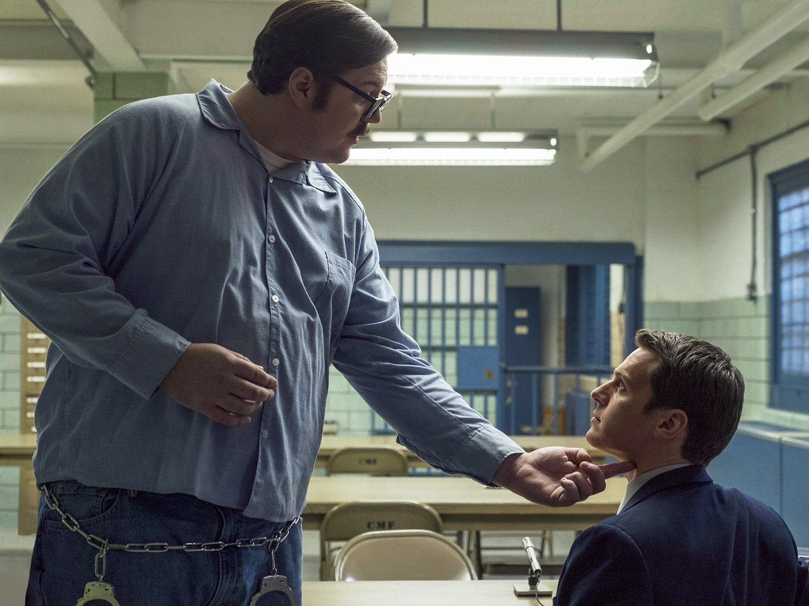

# Sherlock Holmes filósofo, C. S. Peirce detective: a propósito de Mindhunter de Netflix

## Una saga que cubre tres siglos

Han pasado ciento setenta y siete (176) años desde la publicación en el siglo XIX de *Los crímenes de la calle Morgue* (1841) de Edgar Allan Poe, y ciento treinta y uno (128) desde la publicación de *Las aventuras de Sherlock Holmes* (1889) hasta la aparición de *Mindhunter* (serie de Netflix 2017 y dirigida por David Fincher); a lo largo de tres siglos el género policíaco se ha mantenido circulando sin apenas sentir desgaste narrativo. El género policíaco ha sido un género prolífico, definitivamente; durante el siglo XX aparecieron incontables obras literarias y audiovisuales que explotan el género. Son famosas las investigaciones del policía de televisión *Columbo* (Peter Falk) y, en literatura, autores como Agatha Christie, Dashiell Hammett, Patricia Highsmith, entre otros muchos.

*Mindhunter* se ha emitido en dos temporadas y se espera la tercera (la serie ha ido creando en cada capítulo las condiciones narrativas para muchos capítulos más). Al parecer no ha sido lo rentable que se esperaba y se duda de una tercera temporada. Esta serie está basada en el libro de nombre homónimo (1995) de John Douglas. El texto de Douglas es testimonial; se trata de un policía del FBI inquieto que va más allá de su deber y lleva su compromiso hasta convertirlo en una manera de proceder inteligente y eficaz, sorprendente, un Sherlock Holmes moderno (así le bautiza un policía agradecido con el protagonista, Holden Ford), por haber resuelto un crimen que no conseguían resolver. La serie de Netflix es bastante fiel a los contenidos expuestos por Douglas en el libro; aunque la serie es una obra independiente del libro, se trata de dos textos diferentes.

Podemos ver *Mindhunter* como una *saga* (serie de obras con unidad argumental, de intención o de personajes, dice el *Diccionario de la Lengua Española*). La serie de Netflix se agrega como género a la saga policíaca iniciada por Edgar Allan Poe y Sir Conan Doyle en el siglo XIX. *Las aventuras de Sherlock Holmes* constituye el texto por antonomasia del género policíaco. También es hermana de la saga, por estar inspirada en el relato de Douglas, la célebre película *El silencio de los inocentes* (*The Silence of the Lambs, 1981)* dirigida por Jonathan Demme y protagonizada por Anthony Hopkins y Jodie Foster. Una película que trata de los recursos desplegados por la investigadora Clarice Starling para descubrir a un asesino en serie que en su locura confecciona vestidos con la piel de sus víctimas. Clarice consigue, a partir de la experiencia de un asesino en serie (Hannibal Lecter), resolver el caso y dar con el asesino. Esta película trata de lo mismo que *Mindhunter*, ciencia aplicada: pistas observables, deducciones e hipótesis sensatas. Clarice elabora un perfil de la vida psíquica de un asesino; de eso mismo trata el género policíaco: producción de conocimiento vía hipótesis e intuición.

## El mundo es como es con independencia de los intereses de quien lo describa (W. James)

Los planteamientos de la serie de Netflix siguen un esquema argumental similar a la saga policíaca: ¿cómo saber quién fue el asesino (en serie) de los crímenes que se investigan? Más que saber quién es el asesino, la novela de Conan Doyle se hace una pregunta previa:*cómo saber*, cómo conocer el procedimiento que utilizó el asesino, cómo pensó. El asunto está en la reconstrucción del crimen para descartar sospechosos y dar con el culpable. El género policíaco pretende construir un modelo de pensamiento que le permita **esclarecer** los hechos criminales. Esclarecer es una palabra muy usada en el medio policial (ilustrar, iluminar, poner en claro o dilucidar un asunto). Es decir, los hechos y sus evidencias no son suficientes, están sumidos en la oscuridad resistente y misteriosa de la "realidad" y si no se dispone de un sistema de conocimiento que arroje luz sobre el caso, todo se estancará o se culpará a un inocente. Muchos crímenes quedan sin resolver, archivados, Douglas dice en su libro que, en California, el 35 % queda sin solución. Hay dos casos ([1](#biblio)) que demuestran que la criminología trabaja no sólo con evidencias, sino que también lo hace con lenguaje. Muestra de casos de Samuel Littel (confesó 93  crímenes) y Thomas Quick (se autoincriminó, en treinta casos, juzgado y condenado y todo resultó ser mentira). De esto trata la novela policíaca y esto prueba que el crimen también, de es un asunto de significado, de interpretación. El caso de Quick mueve a reflexión, ya que contrario a lo usual, cuando el sospechoso se ve descubierto suele decir: *Me tienes*, me descubrieron, soy culpable. Quick dice "Estoy atrapado" he mentido, soy inocente. Le anularon las condenas y Quick vive libre, el relato no era real, ni verificable. No basta el relato porque es solo un relato. Independientemente de que el crimen es *innato* o una *conducta socialmente condicionada*( lo innato contra lo ambiental) lo cierto es que el crimen debe entrar en la narratividad, ser lenguaje, para poder lidiar con ellos.

Holden Ford, el detective protagonista de *Mindhunter* encuentra en las entrevistas a asesinos en serie, detenidos y juzgados, una fuente de conocimientos de primera mano. Consigue en las cárceles estadounidenses un conjunto de asesinos que le proporcionan claves para conocer la vida psíquica de estos asesinos. Ed Kemper, entre otros, es el equivalente de Hannibal Lecter de *El silencio de los inocentes*. Holden es capaz de distanciarse de los criterios *principistas* del FBI que impiden acercarse a estos asesinos y ver en ellos material para investigar crímenes en serie que están en pleno desarrollo: casos como los de los chicos negros de Atlanta y el caso de un chico que quiere matar a las señoras mayores y solitarias (Caso González) que tienen un perro. Un criminal que *desplaza* el odio que siente hacia su madre, lo dirige a señoras a las que identifica con ella. La hipótesis hipótesis de la policía local es que el crimen lo cometió un latino o un negro, porque en el barrio es de negros y latinos; Holden hipotetiza que fue un joven blanco y esa intuición pronto la argumenta y dan con el criminal. Esta investigación es preparatoria de la investigación central en Atlanta. Se trata de un caso menor que le da margen para conseguir apoyo y reconocimiento en la institución y, más adelante, para el caso central de la película. El FBI que encuentra Holden Ford es un FBI heredado de la época Hoover, lleno de prejuicios y regulaciones coercitivas. Un ejemplo de esto está en la prohibición de transcribir o de utilizar en los entrenamientos y clases aquellas palabras que están prohibidas (una verdadera tontería que Holden logra erradicar). El jefe de Ford observa una clase donde Holden simula una situación de secuestro con los alumnos del FBI:

> -  Shepard, Jefe de Holden Ford: Holden, disfruté eso muchísimo. ¿Cómo se llama?
> - HF: Juego de roles, es una situación simulada de rehenes
> - Jefe:¿Estimulada?
> - HF: Simulada.
> - Jefe: ¿Y las obscenidades, son estrategia académica?
> - HF: Solo improvisan, aprenden a crear un diálogo.
> - Jefe:¿Cómo es que groserías aprenden a crear un diálogo? Apuesto a que es moderno y bien visto en círculos académicos, pero a mí me parece muy dramático.

En otro momento el jefe de Holden le responde ante las sugerencias de renovación del FBI:

> - Jefe Shepard: Te voy a hablar con franqueza. Te voy a decir algo que de hecho no quiero que repitas. Hasta donde concierne a la agencia, la psicología es para los muchachos del fondo, ¿entiendes lo que quiero decir?
> - HF: No. ¿Qué quiere decir muchacho del fondo?
> - Jefe: Solo es algo mal visto.

Hay dos situaciones más que se despliegan en la temporada uno que generan las condiciones para mostrar una institución distante y desactualizada del querer aprender de otras instituciones (como la académica) por un lado, y la caracterización de la sociedad estadounidense de los años setenta. La que se esboza en el diálogo que sostiene Temporada 1, capítulo 1) Holden Ford con un instructor conferencista del FBI (prof. Peter Rathman):

> - HF: Es como si ya no supiéramos qué motiva a las personas a asesinar.
> - Prof. P.R: En otros tiempos, si había una víctima con cincuenta puñaladas buscabas al amante herido, al exsocio estafado; ahora podría ser un encuentro al azar. Un cartero enojado.
> - HF: Es una nueva era, no más apéguese a los hechos, ¿verdad?, cambió el crimen.
> - Prof. P. R:Así es, mira la lista sin precedentes que ocurrieron en la última década y media: lucha una guerra impopular que no se ganó, un presidente asesinado.
> - HF: La GN asesinó a cuatro universitarios.
> - Prof. P. R:Apenas si puedes asimilarlo. Watergate, nuestra democracia se desvanece hacia... ¿Qué?
> - HF: ¿A eso se debe todo? ¿Es una respuesta a la agitación?
> - Prof. P. R: El gobierno era, simbólicamente, una institución paternal; ahora... una batalla campal.
> - HF: El mundo casi no tiene sentido y es lógico que el crimen tampoco.
> - Prof. P. R: Mira, podríamos teorizar toda la noche, pero de verdad, no tengo ni puta idea. Nadie sabe.
> - HF: Deberíamos, ¿verdad?
> - Prof.P. R: Claro, pero ese es el problema. Nadie hace ninguna pregunta.
> - HF: Nosotros sí.

Otro diálogo que muestra el estado de la sociedad estadounidense, la pacatería del FBI y la distancia entre las instituciones (académica y el FBI) está en el diálogo con un profesor. Holden critica al FBI por centrarse en contratar contadores y abogados en lugar de buscar aprender de los académicos e investigar para crear un sistema de pensamiento confiable y científico. Finalmente, Holden es autorizado a cursar en la universidad de Charlottesville y allí sostiene el siguiente diálogo con el profesor Buchanan.

> - HF: Yo no sabía del proyecto Belleville.
> - Prof. B: Pues deberías.
> - HF: De donde vengo, los criminales siempre nacen así.
> - Prof. B: Algunas personas nunca dejan de creerlo. Es muy fácil.
> - HF: Es liberador.
> - Prof. B: En esencia, somos una nación puritana. Culpamos de nuestros problemas a una minoría de manzanas podridas.
> - HF: Soy Holden.
> - Prof. B: Ya sé quién eres, lo saben todos.
> - HF: Sí, he notado las miradas que me lanzan.
> - Prof. B: Las miradas no son un delito federal, aún solo tienen curiosidad.
> - HF: Pues no soy espía. Esto no es una fachada.
> - Prof. B: ¿De qué quieres hablar?
> - HF: Quiero iniciar un diálogo con usted. ¿Eso estaría bien?
> - Prof. B: ¿Un diálogo sobre qué? Disculpe, ¿quiere usted reclutarme?
> - HF: Para conocer sus perspectivas y su visión.
> - Prof. B: Disculpe, ¿está tratando de reclutarme? Disculpe, pero no quiero hablar con la rama educativa del FBI. Reflejo de los tiempos, viejo.

En un diálogo con Debbie (novia de Holden, una estudiante de postgrado, intelectual universitaria) muestra los prejuicios sociales entre la policía y la contracultura universitaria de la época:

> - HF: Estos tontos hippies de mierda; ¿en serio creen que valen el enorme costo y labor de una operación de vigilancia federal intensa?
>
> - Debbie: Parece que el desprecio es mutuo.
> - HF: ¿No crees que la contracultura tradicional de odio a los cuerpos policiales es un poco anticuada?
> - Debbie: Jamás los perdonarán por haber acosado a John y a Yoko.

## *Mindhunter* tiene la estructura de un proyecto de investigación científica. Una nueva interpretación para los nuevos tiempos sociales, un Sherlock Holmes del siglo XX

Todo proyecto de investigación debe crear un diagnóstico del asunto a conocer, justificarlo; debe mostrar el estado de la cuestión; todo esto se hace en el capítulo primero de la temporada uno: Una institución (FBI) cerrada al cambio y a la investigación, cercada por los procedimientos burocráticos, en una sociedad puritana y frustrada por los "nuevos tiempos", un desprecio mutuo entre la institución policial y la académica; pero sobre todo, una sociedad que no quiere hacer las preguntas sobre lo que le pasa como colectivo y prefiere consolarse con una caduca narratividad, creencias colectivas que no terminan de convencer a los policías inquietos como Holden. Considero que *Mindhunter* trata sobre estos temas y le preocupa poner en perspectiva construir una explicación de esos *nuevos tiempos*, una interpretación sobre lo que ocurre con el crimen. No quiere ver la institución policial (FBI) como un cuerpo punitivo-burocrático que entiende que el criminal simplemente nace (tesis del innatismo) y prefiere pensar que el crimen se fragua en la conflictividad social y en la vida psíquica de los asesinos. Una nueva interpretación para los nuevos tiempos sociales, un Sherlock Holmes del siglo XX (recordemos que está ambientada en los años setenta). Este conjunto de tensiones narrativas se van estableciendo en medio de una policía que responde con honestidad a sus compañeros que acuden a la unidad de Ciencias de la conducta para solicitar respuestas a casos que no logran resolver y Holden Ford responde: "¡No lo sé!". No lo sabe porque el mundo es *con independencia de quien lo describe* como sostiene el filósofo William James. El saber sobre las cosas no está en las cosas mismas. Las cosas, la realidad, amerita modelos de pensamiento que produzcan conocimiento confiable, tal es el tema de *Mindhunter*, el mismo que inicia el género policíaco en el siglo XIX con Poe y Conan Doyle. La serie está estructurada como una investigación científica: primero el diagnóstico de la situación ("no sabemos", la respuesta de Holden a los requerimientos del inspector McGraw sobre el caso de la madre e hijos asesinados y sodomizados con un palo de escoba). Luego, después del diagnóstico y la justificación, la búsqueda de una metodología y, finalmente, la aplicación del modelo de pensamiento. La temporada 2 está centrada en aplicar el método *abductivo* en el caso de la serie de niños asesinados en Atlanta, después de haber aplicado el método de investigación al Caso González con éxito y haber alcanzado reconocimiento de su institución y de la opinión pública.

## *Mindhunter* procura superar las dificultades que confrontaban las policías (FBI) estadounidenses en el caso de crímenes en serie

*Omnipresente y multiforme*, así define Greimas ([2](#biblio)) al significado. Agrega: "Nos asombramos ingenuamente cuando nos proponemos reflexionar acerca de la situación del hombre que, desde la mañana a la noche y desde el período prenatal hasta la muerte, se ve literalmente asaltado por las significaciones que le solicitan por doquier y por los mensajes que le alcanzan en todo momento y bajo cualquier forma". Interpretar es lo propio de vivir y la interpretación no consiste en abrir los sentidos y permitir que la percepción haga el trabajo de mediar entre la realidad y el significado en nuestra mente. No hay una *interface* que cree una película en miniatura en nuestras mentes, como dice Putnam. Me parece que Putnam ([3](#biblio)) aclara este asunto al decir que "no existen criterios de identidad del significado exceptuando la práctica real de interpretación" y la interpretación no es un acto ingenuo, espontáneo. Si el significado fuese algo que crece espontáneamente en la realidad, no hubiesen florecido algunas teorías sobre la verdad: *psíquicos* que hacen de médiums para revelar la verdad, *dogmas* que imponen sus criterios y una gama variada de charlatanes que dicen *saber*. El siglo XIX encontró en la pseudociencia llamada *frenología* un procedimiento para explicar la criminalidad en las medidas del cráneo. En cráneos de individuos de pueblos subdesarrollados, de etnias discriminadas, de pobres y marginales medidas craneales que los hacían propensos a la criminalidad. Su autor, el alemán Joseph Gall (1758-1828), pensaba que el cerebro estaba conformado por órganos con facultades que iban desde la benevolencia y la destructividad, etcétera.  Mediadores entre el *más allá* y el saber que la policía requiere cuando no puede esclarecer un caso; mediadores entre las propiedades latentes y omnipresentes de un crimen pasado y el presente. Ese también es un modelo de saber al que aún hoy aún se acude.

Ciertamente, el significado *nos requiere por doquier*, ya que saber no emerge ante nuestra mirada ingenua, ni de los charlatanes (aunque les demos crédito). La historia del pensamiento indica que hemos construido gran variedad de aparatos cognoscitivos, maneras de conocer la realidad y que eso nos ha llevado a la ciencia y a la filosofía. "¿Qué tiene que ver todo esto con la novela policíaca?", dice Harrowitz ([4](#biblio)). La novela policíaca ha sido y todavía es hoy la forma literaria dedicada a la expresión de la *abducción*. El género policíaco ha transitado y dado con un método de conocer y eso lo emparienta con la filosofía. Ese parentesco estriba en el método científico del que hacen gala policías como Sherlock Holmes. Dicen Sebeok y Umiker-Sebeok ([5](#biblio)) que "Arthur Conan Doyle se siente absorbido por el entusiasmo general que la ciencia despierta en la Inglaterra de su tiempo." Agregan: "Un héroe que triunfa gracias a los recursos de la lógica y del método científico". El siglo XIX experimentó una gran explosión del pensamiento científico y la literatura policíaca consiguió en los procedimientos del realismo positivista propio de la época para darle un rango científico y literario al género. Concretamente, hablamos del método *abductivo* descrito por el filósofo. Estadounidense Chales Sanders Peirce (1839-1914).

## Decir que la verdad trasciende a su reconocimiento no supone nada más que decir que unos asesinatos trascienden a su reconocimiento ([6](#biblio))

**La abducción** en el filósofo policía C. S. Peirce.

Eco, Sebeok y Harowitz ([7](#biblio)) definen *abducción* como una manera de producir conocimiento confiable. Se trata de practicar una interpretación que supere la idea de que las evidencias percibidas son suficientes para atrapar a un criminal. La evidencia permite la formulación de una *hipótesis confiable*, deducida lógicamente sobre la base de las creencias del investigador criminal. La hipótesis se formula por *retroducción*, una manera de formularse una pregunta para reconstruir los hechos a partir de las evidencias. Abducción es una *conjetura* dice Peirce ([8](#biblio)): "Peirce argumenta que para considerar el desarrollo del conocimiento, se debe asumir la idea de que la mente humana tiene una natural capacidad para imaginar correctamente algunas teorías, cierto principio de *abducción* que pone los límites a la hipótesis admisible". Es necesario para un investigador apelar a un saber intuitivo, a una cultura o creencias que le permitan formularse preguntas que puedan ser verificadas. Este tipo de razonamiento que hoy parece de descarte no lo era en el siglo XIX y tampoco lo es hoy. Los asesinos suelen ver las series policíacas, acercarse a los cuerpos policiales para saber cómo piensan los policías y tratar de innovar su método de crimen. La fascinación de los consumidores del género policíaco está en disponer de una forma de razonamiento metódico que logra resultados justos (lo de “justos”, dice Douglas en su relato, es la guía ética que lo guiaba en sus pesquisas). Este tipo de razonamiento abductivo logra un conocimiento nuevo, un saber necesario para la institución policíaca: "su única justificación es que si alguna vez queremos entender totalmente las cosas, debe ser a partir de él" ([9](#biblio)). Sebeok y Umiker-Sebeok puntualizan que "Peirce sostenía que una hipótesis debe considerarse como una pregunta y, mientras que todo conocimiento nuevo proviene de conjeturas, estas son inútiles si no se prueban en la investigación".

## *No hay nada más engañoso que un hecho obvio* dice Sherlock Holmes

Veamos unos de ejemplos para aclarar un poco este asunto de la abducción

El primer ejemplo proviene del propio Peirce, el segundo de Sherlock Holmes y el tercero de Douglas del FBI.

### Primer ejemplo

Peirce extravió el viernes 20 de julio de 1879, cuenta, un valioso reloj y un abrigo en un viaje en barco. Se dio cuenta de su pérdida luego de abandonar el barco en el puerto en Nueva York. Peirce volvió rápidamente al barco y habían desaparecido. Hizo que se reunieran y se pusieran en fila todos los camareros de color. “Charlé un poco con cada uno de ellos sobre cualquier cosa en que pudieran mostrar interés, pero que a mí menos me comprometiera, con la esperanza de parecer tan tonto que pudiera detectar algún síntoma en el ladrón”. Recorrida toda la fila, me volví y di unos pasos, aunque sin alejarme, y me dije: 'No tengo ni el menor destello de luz por el que guiarme'. A lo cual, sin embargo, mi otro yo me dijo: No tienes más que apuntar al hombre con el dedo. ‘No importa que carezcas de motivo, tienes que decir quién te parece que es el ladrón'. Di un pequeño rodeo en mi paseo, que no había durado más de un minuto y cuando me volví hacia ellos, toda sombra de duda había desaparecido. No había autocrítica. Nada de eso venía a cuento. Peirce buscó a un detective y esperaron a que el ladrón empeñara el reloj (Peirce le dio al policía el número de serie del reloj y los datos de la marca previamente). En efecto, el sospechoso fue a la casa de empeños para empeñar el reloj y allí se comprobó la hipótesis de Peirce. Luego fueron a casa del ladrón y allí estaba el resto del botín. 

### Segundo ejemplo

El conocido caso en el que Sherlock Holmes ve que en los zapatos de Watson hay rastros de barro rojo. Holmes deduce, por los datos con los que cuenta, que Watson estuvo en el edificio de correos poniendo un telegrama. Watson le pregunta cómo pudo formular tal conocimiento tan exacto, a lo cual Sherlock Holmes responde que frente al edificio de correos hay tierra roja por una obra en la entrada, que iría a mandar un telegrama porque no lo ha visto redactando una carta, etc. Los datos recogidos por el detective le permiten construir un relato verosímil y comprobable con los que demuestra que el conocimiento expuesto es cierto: *Elemental, mi querido Watson*, dice Holmes ante la curiosidad de Watson.

### Tercer ejemplo

Lo cuenta Douglas en el libro matriz de la serie Mindhunter. Un psicólogo asesor de la policía que es consultado por el caso del *Bombardero loco* y la policía le entrega en expediente con fotos, cartas a los diarios al psiquiatra James Brussel, quien estudió las fotografías de los escenarios de las bombas y analizó las cartas burlonas del atacante y concluyó:\\
*Busquen un hombre pesado, de mediana edad, nacido en el extranjero. Católico romano, soltero. Vive con un hermano o hermana. Cuando lo encuentren puede que leve un traje cruzado, abotonado.* (5,7 % de lectura del libro de Douglas). Encontraron un sospechoso y fueron a buscarlo, cuenta Douglas. Vivía con dos hermanas solteras y al pedirle que se vistiera para llevarlo detenido, salió con un traje cruzado abotonado. 
La principal dificultad estaba en la conformación de una hipótesis que diera a la investigación ciertas garantías de dar con el criminal con un amplio margen de seguridad. Exactamente, esto es lo que ocurre en la obra de Poe y de Conan Doyle.

La trama de *Mindhunter* está en la elaboración de un procedimiento de pensamiento que sirva para conocer los perfiles psicológicos de los criminales. Es, visto de esa manera, un asunto epistemológico (teoría general del conocimiento), de las maneras como conocemos lo que conocemos. Siempre apelamos a nuestras creencias, a nuestros conceptos para interpretar. "... una oración es verdadera debido a lo que la oración (en su lenguaje) significa, y debido a lo que él cree" dice Davidson, y agrega: "el concepto de verdad objetiva, y de error, necesariamente emergen en el contexto de la interpretación" ([10](#biblio)). En la interacción criminalística no puede operar la cooperación entre las partes (criminal y policía) para establecer la verdad; el delincuente trata de hacer suponer al otro elementos que distraiga la búsqueda de la verdad al policía para evitar ser descubierto; y el policía para reconstruir a partir de las evidencias y las conjeturas de que dispone para llegar a la verdad (al menos a la verdad procesal). Finalmente, la evidencia observable sirve parcialmente, si no se dispone de lo que Peirce ha llamado *abducción*. Esto es, un procedimiento hipotético, intuitivo. "No hay nada más engañoso que un hecho obvio" dice Sherlock Holmes (véase Sebeok y Umiker-Sebeok). "La hipótesis debe considerarse como una pregunta", dice Peirce. Sin esos elementos la interpretación y la investigación corren el riesgo de atascarse.

Holmes también hace notar a Watson, en *The Spikied Band*, lo peligroso que es razonar con datos insuficientes y Peirce sostiene que los prejuicios e hipótesis no verificables son el principal obstáculo con el que choca el razonamiento correcto o *abducción*. Sin abducción, pues, no hay una hipótesis que oriente la producción de conocimiento o interpretación conducente a ser verificada y, finalmente, dar con el criminal. Finalmente, se trata de controlar los candidatos interpretativos para conducir la investigación. La validez de la idea de Peirce estriba en el rechazo a la creencia de que el dato sensorial externo es lo que provoca a través de la interfaz el conocimiento. El conocimiento depende mucho más de la hipótesis. La pregunta lleva a la inducción, a la reposición de responder por la causalidad a partir del conocimiento del que se dispone. En el caso de los niños negros de Atlanta, la policía se paseó por varias hipótesis: Ku Klux Klan (KKK), un onanista que había arrojado unas revistas pornográficas cerca del lugar se encontró un cadáver. Holden no encontró en esas hipótesis un grado de confirmación que diera con un sospechoso y decidió hacer algunas pruebas para descartar la del KKK (no un crimen racial blanco contra negro sino un crimen endorracial, negros contra negros). Todo el país estaba pendiente del caso de los niños negros de Atlanta y las hipótesis de la policía se venían abajo. No quería investigar a un sospechoso negro porque el alcalde negro podría perder los votos de su raza. La asociación de las madres de los niños asesinados rechazaba la hipótesis de Holden porque la veían como la hipótesis de un blanco racista. Total, el caso llamó la atención del país y del propio presidente de los EE. UU., mientras los crímenes sumaban cada vez más víctimas hasta que el FBI fue llamado a colaborar y Holden Ford aplicó su modelo de pensamiento para resolverlo. La abducción de Holden le hizo pensar en tantos niños negros víctimas suponía cierto grado de confianza entre las partes: niño y asesino. Hizo pruebas con policías blancos y policías negros invitando a niños pequeños a entrar en el auto policial. Todos los niños rechazaron entrar en contacto con el policía blanco, mientras que sí lo hicieron con el policía negro. Luego Holden supuso que un estado como Atlanta, tradicionalmente conflictuado por el racismo, brindaría una narratividad que favorecería la hipótesis del crimen racial, lo cual no concordaba. Dedujo, una hipótesis del endorracismo, un hombre negro joven con un auto modelo policial y ¡Eureka!. Después de localizar al sospechoso, se encontró más evidencia y fue detenido, juzgado y condenado.

## Formaciones discursivas e isotopía, dos conceptos para analizar la serie de Netflix

Desde que el mundo es mundo la disposición de lo nuevo en relación con lo instaurado ha sido de tensión. Lo conservador no auspicia lo nuevo, por el contrario, intenta anularlo. El lógico que así sea, ya que de lo contrario, el advenimiento de novedades haría colapsar la cultura y la convivencia. La serie *Mindhunter* va mostrando reiteradamente alusiones al rechazo que Holden Ford decide dejar de lado porque ya no explica el crimen. La serie muestra un FBI limitado en los conceptos de criminalidad, de "violencia extrema entre desconocidos" como dice el profesor Rathman en el capítulo 1 de la temporada 1. También por trancas burocráticas, por puritanismos que cierran el paso a la investigación audaz, creativa (recordemos que en los informes tienen expresamente prohibido transcribir palabrotas). En síntesis, un cuerpo policial anclado en procedimientos no actualizados a una cultura que había dejado de comportarse en el marco de los sistemas institucionalizados que la policía había consagrado. La propuesta que Holand va confeccionando a partir de su inconformidad con la investigación oficial del FBI. Acá quiero establecer el concepto de *formación discursiva*. Este concepto lo formula, entre otros, el filósofo Michael Foucault ([11](#biblio)). Foucault entiende que las sociedades crean "nociones ... que les permiten recuperar, reagrupar una sucesión de acontecimientos dispersos, referirlos a un mismo y único principio organizador, someterlos al poder ejemplar de la vida." Es decir, el cuerpo social hace indispensable la convivencia y esa convivencia presupone el empoderamiento de nociones, mentalidades, de *formaciones discursivas*. Convivir supone la adopción de esas formaciones, no sin *tensión*. Al mismo tiempo se produce una dinámica tensa pues no todos los individuos aceptan pasivamente esas creencias y desatan pugnas de diversa naturaleza por sustituir esas creencias por otras. Esta dinámica entre lo establecido y lo nuevo es lo propio de la narratividad social. *Mindhunter* enfrenta a una policía federal que no se había renovado, que no contaba con sistemas de pensamiento que esclarecieran aquellos crímenes que habían atascado al FBI. Sin *formaciones discursivas* reinaría el caos en las sociedades, pero, gracias a ellas, las sociedades imponen o se someten al *principio del poder*. Cada nueva formación discursiva triunfante asume el poder e intenta perpetuarse. No hay otra manera, esa es la lógica del poder y todos somos poder y todo está narrativizado.

## La venganza como móvil emocional en Mindhunter

Tanto el *Caso González* como el caso del *matricidio y asesino de colegialas* de Ed Kemper, son casos de motivación pasional: la venganza. La venganza es una pasión sumamente generadora de acción. Un sujeto quiere una compensación porque se siente agraviado y lo hace por mano propia; pero en el caso de los asesinos en serie parece no tener una medida de compensación. Esta pasión se confunde en los casos de muchos criminales, con lo moralmente recriminable (prostitución). La narrativa pasional *moral* es muy poderosa en la acción humana y en la narratividad. Ed Kemper se quejaba de la manera en que su madre, su padre, sus abuelos y la sociedad lo trataron en su infancia y adolescencia. Su madre lo encerraba bajo llave en el sótano todas las noches, lo despreciaba y no creía en él por considerarlo un fracasado y un peligro. Dice Kemper en entrevista con Holden:

> “Mira, mi madre era una mujer honorable y decente. Pero cuando se trataba de mí, no sentía más que desprecio. Una gran decepción y desdén... era asistente administrativo, para eso vivía, hermano, para su trabajo y sus amadas colegialas. A quienes cuidaba sin descanso... El campus universitario es como una gran tienda de dulces… Tenía una postura muy violenta y abierta hacia los hombres. Tuvo un matrimonio fallido con mi padre, yo era igual a él, así que... Hasta donde ella sabía, yo jamás iba a terminar con una de esas chicas porque era un fracasado y una vergüenza. Era un fracaso para ella. Creía que yo iba a hacer algo horrible algún día... Ella me asustaba a mí, me obligaba a dormir en un viejo colchón sucio en el sótano. Cerraba la puerta, tenía diez años... Tenía veintiún años cuando al fin pude salir [de la cárcel por haber asesinado a sus abuelos]. Esos años cuando otros chicos tenían su revolución sexual yo estuve encerrado en un cuarto... Físicamente, yo no era impotente, pero mentalmente claro que sí. Debido al modo en que fui condicionado por mamá... Una semana antes de que muriera supe que la mataría. Ella fue a una fiesta, se embriagó, volvió sola a casa. Le pregunté cómo le fue en la fiesta ... Ella me miró y dijo: Durante siete años, dijo, no he tenido sexo con un hombre debido a ti, 'mi hijo homicida'. Así que conseguí un martillo y la maté a golpes, y luego la degollé y la humillé en ese lugar, y le dije: ‘listo, ya tuviste sexo’. Si de algo estoy seguro es de que una madre no debería desdeñar a su propio hijo. Si una mujer humilla a su pequeño, se vuelve hostil y violento, y despreciado y punto.”  

Edmund Kemper, independientemente de su estado de salud mental, hace el recorrido narrativo centrado en la venganza emoción. Hubo, para él, un punto de quiebre entre él y su madre. El momento emocional en el que dice que una semana antes supo que la mataría por la intensificación de la tensión madre hijo al volver de la fiesta. Ejerció el poder contra ella, la humilló eyaculando en la boca de su cabeza decapitada. Ya había asesinado varias colegialas. Su transgresión criminal era una manera de hacerle daño a su madre, contra quien iba dirigida su venganza. Su violento crimen fue la narrativa de un psicópata que desafió el poder de su madre, de la sociedad. Su balance, su cierre narrativo fue la solicitud de  su "muerte por tortura". Ed Kemper se *fusionó* con su objeto al volcar toda su venganza violenta contra su madre. Fue un cierre de narración, fue una *tragedia* de una relación matriarcal infeliz. Las tragedias ocurren en el seno de las familias, donde se supone que debe imperar la protección para vivir, orientar para convivir. En la tragedia el dolor del crimen se multiplica y se hace inexplicable. En el *Caso González* el hijo no es capaz de asesinar a su madre cruel y decide matar a otras en las cuales ve una réplica de su madre (madura, sola y con un perro); allí no hubo tragedia sino crimen de matricidio desplazado. 

## Concepto de *isotopía*

Por *isotopía* (término proveniente de la química) se entiende la coherencia de un trayecto de sentido. Greimas ([12](#biblio)) la define de esa manera y nos explica que el discurso habla de lo mismo a lo largo de su texto, expande contenidos, formas estilísticas, etcétera. Reconocemos que el texto habla de algo específico, que el texto se configura sobre tal perspectiva a través de procedimientos de retrolectura que nos guían por sus canales isotópicos. *Mindhunter* se expande en la isotopía del saber innovador (para el FBI), sobre la misma isotopía que instituyeron como un motivo, como una *saga* Sir Arthur Conan Doyle y Edgar Allan Poe: el método de conocimiento. Su asunto estriba en mostrar cómo pensamos lo que pensamos, cómo producimos conocimiento. A lo largo de la serie los sujetos policiales luchan para comprender su pensamiento. Se enfrentan a su propio pensamiento, a su propio saber. La serie está casi enteramente en el componente verbal; es decir, las imágenes sobre la violencia extrema no son puestas en pantalla, sino que son relatadas verbalmente. La presentación de la serie está firmemente asentada en la imagen de la manipulación de una grabadora grande y aparecen imágenes de violencia casi imperceptibles, son flashes intercalados en la manipulación del aparatoso grabador. Allí volvemos sobre la hipótesis de la búsqueda de conocimiento, de investigación. Esas imágenes dicen poco, son como la evidencia con las que los investigadores van construyendo sus hipótesis, pero ellas mismas no son la información suficiente y acabada que lleve al FBI a esclarecer los crímenes. En la presentación de la *Mindhunter* se resume la perspectiva que la serie desarrolla a lo largo de sus dos temporadas: investiga crímenes y lo hace siguiendo un modelo investigativo clásico, apoyado en la ciencia.

Cuando el FBI no tienen respuestas (Holden dice a un policía que le consulta que no tiene respuesta a la pregunta de por qué el asesino mató a una madre soltera (Aidra Jeffris), madre ejemplar y de una conducta social intachable, y a su pequeño hijo, cortándole la garganta; además los sodomizó con un palo de escoba). Frank, el policía que consulta a la *Unidad de Conducta* de la policía federal, al no tener respuestas se molesta e increpa a Holden y a Bill, dice:

> - Frank: ¿Es una broma?
> - HF: No, no te podemos ayudar.
> - Bill: Necesitamos tiempo para investigar.
> - HF: Los dos estamos a ciegas, no sabemos más que tú.
> - Frank: ¿Cómo te atreves, carajo?
> - HF: Lamento tu pérdida de tiempo.

Más tarde Bill, la pareja policial de Holden, le recrimina la respuesta que dio a Frank:

> - Bill: A ciegas, ¿eh?
> - HF: Así es. Estudié todo lo que podemos ofrecer, hice este viaje contigo, escuché todo lo que tuviste a bien enseñarme, pero que hablemos sobre algo que no entendemos siquiera... No fue un crimen lujurioso, no fue un simple asesino fortuito que nació malo.

En este diálogo se puede observar la honestidad con la que Holden enfrenta el estado del saber con el que cuentan como policías. Bill no comparte, como lo hace todo el FBI, la actitud ante el saber oficial del cuerpo policial. Finalmente, Bill recibe la revelación de la ciencia y se suma al proyecto de Holden; además recluta a una investigadora académica (Wendy) para darle al proyecto el piso científico que se requiere. En el capítulo 3 de la temporada 1, Wendy Carr dice a Bill y a Holden:

> Este es un trabajo muy importante, si su jefe no se lo autoriza deberían hablar con alguien que tenga la libertad d y los recursos... Hubiese sido más claro si hubieras grabado y transcrito las entrevistas... Ellos [los asesinos en serie encarcelados y condenados] están desperdiciados, encerrados y nos asusta tanto la moralidad que no vemos el valor de largo alcance que ofrecen... prevención temprana, ciencias de la conducta, criminología, de todo. Obviamente, debes ponerlo en base más formal, requerirá mucho tiempo y energía expandirlo a un proyecto más grande con un cuestionario específico... como su historia familiar, cuál es su enfoque de por qué lo hicieron, en qué momento del acto se excitaron, esas cosas, luego contrastar, comparar y publicar... No pueden difundir sus hallazgos solo en el FBI, se podría convertir en un libro.

 A lo cual Holden Ford pregunta a Wendy: 

> "¿Tú crees que habría gente interesada fuera del los cuerpos policíacos?"

Wendy responde:

> Solo imagina, de verdad imaginen lo que requiere matar a una persona a golpes... La lujuria, por controlar, el sentimiento de excitación, la decisión de violar la cabeza degollada de una víctima, de humillar su cadáver... Porque los narcisistas no acuden al doctor. Los psicópatas no creen que tengan una enfermedad. Esos hombres son casi imposibles de estudiar, y ustedes hallaron la manera de estudiarlos mejores en condiciones de laboratorio casi perfectas. Eso es lo que hace tan emocionante y potencialmente de largo alcance.

## Resumiendo lo expuesto aquí sobre la serie Mindhunter

Tal como dice Douglas en su libro "A veces la única manera de atraparlos es aprender a pensar como ellos", encierra el programa de alcanzar un refinado sistema de pensamiento que permita a la policía elaborar las hipótesis para conseguir el significado de cada crimen, de cada criminal. Sin ese sistema de pensamiento que lleva a hipótesis verificables, la investigación se diluye en la ingenuidad de creer que las evidencias son suficientes. Cazar a alguien en la manera en que supuso para desatar una ola de crímenes en serie, supone un modelo de pensamiento científico tal como el que elaboraron Poe y Conan Doyle en su narrativa literaria y que pensó Charles Sanders Peirce y su modelo *abductivo*. La narrativa policíaca ha transitado por ese pensamiento desde el siglo XIX y vemos como hoy aún tiene vigencia, tanto literaria como en los casos reales. Hoy existen otros sistemas para verificar la verdad de las evidencias (pienso en el uso del ADN). La idea expuesta por Putnam según la cual "Decir que la verdad trasciende a su reconocimiento no supone nada más que decir que unos asesinatos trascienden a su reconocimiento", nos enseña la validez del pensamiento de Peirce y la inteligencia con que la ficción ha indagado en esos simulacros geniales de Conan Doyle y de Edgar Allan Poe. Reconocer la verdad como significado nos vuelve a la idea del carácter semántico y narrativo de un fenómeno como el crimen. Lo que la Unidad de estudios de la conducta descubre no es sólo que la sociedad ha cambiado, descubre que las explicaciones de la criminalidad deben cambiar y para cambiar deben asumir el reto del conocimiento como lo hizo Sherlock Holmes y el agente Dupin de Edgar Allan Poe. *Mindhunter* es un texto audiovisual que abunda sobre la narrativa policial, pero también sobre la importancia de la investigación científica aplicada al crimen. Su estructura es la de un clásico proyecto de investigación: proposición y justificación, establecimiento de la metodología y aplicación y análisis. Más que contenidos policíacos, la serie nos habla del método científico, de la *abducción* peirceana en la resolución de ese mal social llamado crimen. 

# Bibliografía

1. [Samuel Little el mayor asesino en serie de la historia de Estados Unidos](https://www.psicoactiva.com/blog/samuel-little-el-mayor-asesino-en-serie-de-la-historia-de-estados-unidos/)

   [El asombroso caso del peor asesino confeso de la historia de Europa que era inocente y lo había inventado todo](https://www.bbc.com/mundo/noticias-49717230)

2. GREIMAS, A. J. (1982). *Semántica estructural*. Madrid: Gredos.

3. [PUTNAM, H. (1990). *Representación y realidad* Barcelona: Gedisa.](https://valmoreagelvis.com/fichas/Putnam%201990%20Representación%20y%20realidad/)

4.  HARROWITZ, N. (1989). "El modelo policíaco de Charles S. Peirce y Edgar Allan Poe" En *El signo de los tres. Dupin, Holmes, Peirce.* Eco, U. y Thomas Sebeok (Eds.). Barcelona: Lumen.

5.  SEBEOK T. y J. UMIKER-SEBEOK. (1987).*Sherlock Holmes y Charles S. Peirce. El método de la investigación*. Barcelona: Paidós.

6. [PUTNAM, H. (2001). *La trenza de los tres cabos. La mente, el cuerpo y el mundo*.Madrid: Siglo XXI Editores.](https://valmoreagelvis.com/fichas/Putnam%202001%20La%20trenza%20de%20los%20tres%20cabos/)

7.  ECO, U. y T. SEBEOK. (1989). Ob. cit.

8.  SEBEOK T. y J. UMIKER-SEBEOK (1987). Ob. cit.

9.  SEBEOK T. y J. UMIKER-SEBEOK. (1987). Ob. cit.

10. [DAVIDSON, D. (1990). *De la verdad y de la interpretación*. Barcelona: Gedisa.](https://valmoreagelvis.com/fichas/Davidson%201990%20De%20la%20verdad%20y%20de%20la%20interpretación/)

11.  FOUCAULT, M. (1970). *La arqueología del saber*. México: Siglo XXI Editores.

12.  GREIMAS, A.J. (1976). *Semántica estructural*. Madrid: Gredos.
