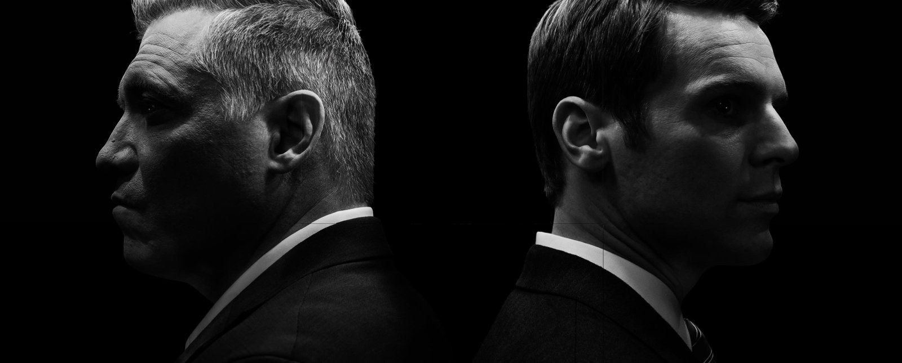
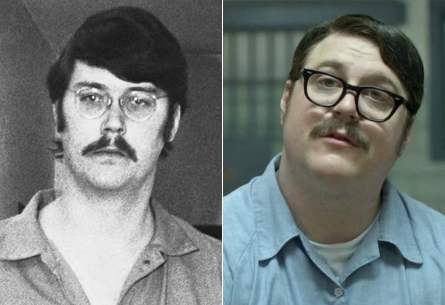
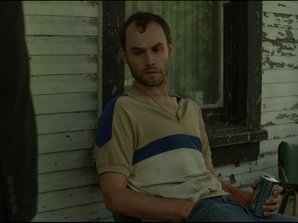

# El crimen serial  como venganza desproporcionada  en la serie Mindhunter de Netflix (Parte II)

En el artículo anterior sobre *Mindhunter* me he centrado en la noción de *abducción* para crear cierto paralelismo entre obras literarias del género policíaco desde el siglo XIX hasta la serie *Mindhunter* de Netflix (2017). He dicho allí que *Mindhunter* es parte de la saga policíaca por la producción de conocimiento a base de hipótesis abductivas. La confección de perfiles psicológicos en la novela policíaca y, en general, en las obras del género, sean literarias o audiovisuales, está en el modelo de investigación que lleva a producir una hipótesis para dar con el culpable; el foco estuvo puesto en la construcción de conocimiento por parte del FBI. Ahora me propongo hacer una valoración semiótica de la serie *Mindhunter* de Netflix (2017). El propósito, ahora, está en la acción del delincuente, en las motivaciones para delinquir y la manera como se genera el significado. Me propongo dar una rápida revisión de la *semiótica de las pasiones* para mostrar la manera en que se encara el asunto del significado. Las ideas principales de esta semiótica está en el libro de  Greimas y Fontanille *Semiótica de las pasiones*  (1994) y en *El giro semiótico* (2000) de Paolo Fabbri. Lo que me propongo ahora en relación con la serie audiovisual de Netflix, *Mindhunter* es un examen de la criminalidad como pasión, como emoción, como narratividad, sobre la base de la información expuesta en el audiovisual. Las pasiones han sido vistas por la creencia popular como algo de mujeres o de niños; es usual creer que las pasiones deben ocultarse, que son algo indigno de manifestar. Para esta semiótica las emociones son fuente de *acción* e interacción humana y en ese principio se da cabida al *cuerpo sintiente* en el modelo semiótico. Es a partir de cierto momento *tenso* respecto al estado de las creencias sociales, de la narratividad social y de las relaciones humanas, en el que el sujeto se consigue  inconforme y con diferencias respecto al poder, experimenta emociones que lo llevan a acciones que, además del crimen mismo, inciden en la narratividad y en su entorno. Las emociones que modulan la conducta humana, en esta teoría, son entendidas como actividad *configuradora* de la narratividad, no nos interesan como motivación psicológica volitiva. En el lenguaje policial se habla de crímenes pasionales, pero para nosotros las pasiones en la criminalidad no connota lo mismo. *Pasión* es un término técnico que muestra una dimensión de acción y de significado, de creación de sensaciones que hace protensiva la acción a delinquir en el caso de los asesinos que nos ocupa. Lo que interesa acá es la narratividad y no los perfiles psicológicos que lleven al esclarecimiento del crimen ya que, al igual que el cuerpo del sujeto, la narración también crea los *simulacros pasionales* con los que entramos en contacto.

"Hoy la dimensión pasional en el análisis semiótico altera radicalmente toda la teoría de la significación" (1). Esta semiótica considera fundamental dar cabida a la dimensión del *cuerpo* humano, allí donde las emociones surcan sus creencias y deseos y las tensan en la medida en la que ese sujeto entra en contradicción con lo establecido. Como "simulacro tensivo" puede entenderse el resultado narrativo luego de que el sujeto se vuelca en darle forma narrativa. Esta semiótica estructural se conformaba con describir los programas de *apropiación* o *desposesión* de objetos de valor de sujetos sintácticos.  Ahora, lo relevante está en una explicación del significado imbricado en las *atracciones* y *repulsiones* que abren el espacio a la construcción de un mundo interior y la decisión del sujeto de enfrentar ese mundo o sumarse pasivamente a lo establecido por el poder. En el caso de que el sujeto decida sumarse pasivamente a lo establecido, se entiende que asume una posición conservadora (cursiva, de mantener el curso narrativo instaurado por el poder); si, por el contrario, el sujeto protensivo decide ir por resolver la tensión, hay opción de que lo cursivo sea alterado. Ese *equilibrio inestable* es lo propio de la narratividad. La semiótica propone cuatro componentes para ese análisis: a) *modal* (querer, saber, poder y deber), b) *temporal*, c) *aspectual* y *estésico*. Este último se corresponde con la introducción de la noción de cuerpo en el análisis. Trata de aquello que *siente* el sujeto semiótico frente a la acción del mundo en su cuerpo (*atracciones o repulsiones*). Pero una explicación detallada del componente *aspectual* es necesaria. En resumen, la semiótica de las pasiones propone un modelo de estudio del significado en el que "las figuras del mundo no pueden *hacer sentido* más que a costa de la sensibilización que les impone la mediación del cuerpo" (2). Agregan los autores Greimas y Fontanille que "Es por medio del cuerpo percibiente que el mundo se transforma en sentido -en lengua-".

# Componente aspectual: ¿ira o venganza en dos casos de Mindhunter?

Lo aspectual se refiere a la duración de las pasiones, es cubierto por un algoritmo narrativo que va desde la *incoación* (principio del *deseo*  y de la discrepancia tensa). Es un aspecto *abriente,* proyectivo en relación con la narratividad instaurada. El aspecto *cursivo* tiene que ver con la administración de la narratividad instaurada. Esta instancia controla el *saber* y el *poder*. Acá se sostiene que se parte del principio de que todo está narrativizado, no hay espacio libre de narratividad social que no haya sido reconocido por las formaciones discursivas de la sociedad y funcionan como lenguaje. Nada hay *ex nihilo*, todo  se sostiene sobre una tradición narrativa que en algún momento ha sido instaurada como poder y que resiste al cambio. Finalmente procede un cierre que *evalúa* los resultados de la narratividad ejecutada. Este algoritmo narrativo tripartito en su conjunto lo conocemos como *componente aspectual* y consiste en un dispositivo que permite revisar los procesos como un cuerpo narrativo que explica las acciones humanas a la luz de sus tensiones pasionales; es decir, la duración de las emociones.  Fabbri (3) muestra de qué manera pasiones como la *ira* es explosiva, inmediata y de corta duración, mientras que la *venganza* es una pasión de larga duración y consiste en compensar un daño infringido por alguien y puede ser duradera como emoción. Los crímenes de ira no son considerados crímenes secuenciales pues generalmente son explosiones instantáneas por algún móvil pasional.

# Incoación y tensión narrativa

En algún momento se *incoa* una tensión contra un poder que siempre *retiene* las iniciativas de quienes se sienten inconformes con los estados imperantes. Si no se producen tensiones nada se incoa. Este principio narrativo para comprender la acción humana es rentable porque nos enfrenta a la condición narrativa de la acción humana: *incoar, retener, evaluar*. En algún momento un sujeto siente un impulso emocional por conjuntarse con lo que la semiótica llama *perfecto* (una especia de *revelación* que le impulsa a salirse de la narratividad instaurada). Intenta aplicar un programa de conjunción o fusión con lo que el sujeto considera *perfecto*, (resarcir el daño infligido por la madre de Kemper parece ser el objetivo emocional que saciará su impulso). Lo *perfecto* no es un juicio de valor sino un deseo emocional que lo lleva a ejecutar la acción; hay un *giro* en el estado emocional del sujeto, eso es lo que se conoce como *perfección*. Ese giro pasa por un estado *sintiente* de ese sujeto y constituye un *evento singular*, una experiencia que hace que proyecte su hacer hacia el futuro de una manera diferente a la acostumbrada. El sujeto sintiente de esa *revelación* es ya un sujeto diferente. Ese sujeto (criminal en nuestro caso policial) encuentra en sus emocionalidades la manera de ejercer su poder: controla a las víctimas y a la sociedad matando (ejecuta un micropoder). Dice Fabbri que la más común de las pasiones, la *venganza*; vengar es una manera de compensar un daño que el criminal siente por lo que le han hecho (madres prostitutas, familiares castrantes, sociedad insensible). Kemper mata a su abuela y a su madre porque, según revela a Holden Ford: "Ambas eran mujeres muy controladoras, agresivas, matriarcales". En el mundo criminalístico se habla de que "el criminal vuelve a la escena del crimen". *Mindhunter* tiende emboscadas a los criminales tratando de hacerles aparecer. Holden Ford pone cámaras, vigila escenarios donde el criminal podría volver para disfrutar de su obra (velorios, cementerios, homenajes públicos, etc.). Eso es lo que se conoce como *estesia* en semiótica. Ese sujeto criminal disfrutó ejerciendo poder, venganza o la emoción que lo llevó a quitar la vida a otro y quiere "volver  a sentir"; el criminal conserva objetos de la víctima para volver a su “perfección” emocional, a su fusión con el objeto de su emoción. Estesia es "querer volver a sentir" ese estado singular, esa experiencia con la cual se fusionó en su momento de *revelación* (que no es exclusiva de criminales, sino que es lo propio del sujeto que ha podido sentir su experiencia con lo perfecto). Lo que digo es que el criminal también siente *estesia* y esa sensación es una de las maneras que tenemos para entender el significado, el crimen como objeto de significado y el crimen como recorrido emocional que desemboca en el crimen mismo. Sentir es lo propio del sujeto y no es exclusivo de sensaciones nobles. La *estesia* es un componente explicativo del recorrido del significado, es uno de sus epicentros.

# Venganza y proporcionalidad

Me parece que los crímenes como los descritos en *Mindhunter* (los de  Kemper, los del Caso González, los de los niños negros de Atlanta y otros) calzan en una valoración pasional como lo entiende la semiótica. Veamos el principio de proporcionalidad en crímenes en serie. La cultura judeocristiana habla de la venganza proporcional: *ojo por ojo y diente por diente* (uno por uno). Pero los crímenes en serie parecen perder la proporcionalidad. Son muchos crímenes en secuencia a partir de unos móviles como un móvil de *venganza* (ya sea hacia el sujeto infractor o *desplazado* hacia otros sujetos que guardar cierta similitud con la victimaria). Hay rasgos comunes entre el crimen del *Caso González* y la madre del asesino: mujeres viejas, solitarias y con un perro como su propia madre (a quien respeta pero odia por los maltratos a los que lo somete). Es desproporcionado matar a muchas colegialas porque la madre de Kemper las asocia con lo valioso para ella y le ha dicho que él (Kemper) no está a la altura de esas universitarias. Cuando niño lo mandó a vivir con su exesposo y luego lo mandaron a vivir con sus abuelos, a quienes asesinó; así que Kemper culpa a su madre de su desdichada vida. Esperaba de ella una relación de protección maternal y encontró un desprecio que lo llena de desdichas. Es esa expectativa frustrada la que Kemper quiere cobrar a su madre: "Mira, mi madre era una mujer honorable y decente, pero cuando se trataba de mí, no sentía más que desprecio, una gran decepción y desdén", dice Kemper en  el capítulo 2 de la temporada 1. Me atrevería a darle a este caso cierto vínculo con un crimen de naturaleza *matricidio-edípico* y, como tal, lo acerca a la tragedia. Una tragedia ocurre cuando los más cercanos miembros de una familia ejercen la violencia extrema entre ellos. Es una tragedia lo que los griegos narraron con la muerte de Agamenón por parte de su esposa Clitemnestra y luego su hijo Orestes venga la muerte de su padre matando a su madre; también el clásico texto de la tragedia en el que  Edipo mata a su padre y su madre-amante (Yocasta). Lo común a este tipo de crímenes trágicos es la violencia extrema donde debe reinar la protección y el apoyo entre sus miembros. Sin embargo, cuesta hacer un traslado directo entre el matricidio y lo trágico. Parece que no califica para tragedia. Quizá porque le falta narrativa y por la serie de crímenes asociados que mantiene pero, en efecto, hay algo de trágico sin deudos, sin una sociedad que resienta por tal matricidio. El matricidio es socialmente repudiable por las valoraciones sublimes que tiene lo maternal en nuestras sociedades. Kemper no solo mata a su madre sino que la decapita y eyacula en su boca. Recordemos que ya había matado a sus abuelos y a un grupo de colegialas. Finalmente, Kemper se entrega a las autoridades porque sabe que no lo atraparán nunca. Son crímenes de venganza planificada, aunque el criminal sea visto como un desequilibrado mental. No calza en el diagnóstico que hace Holden con el profesor Peter Rethman en el capítulo 1 de la temporada uno:

> "Si buscamos un móvil, podemos entender que no los hay. Es un vacío, un agujero negro... Es como si ya no supiéramos que motiva a las personas a matar... En otros tiempos, si había una víctima con cincuenta puñaladas buscabas al amante herido, el exsocio estafado; ahora podría ser un encuentro al azar con el cartero... El crimen casi no tiene sentido".

Los casos que se manejan en la serie tienen siempre un móvil: lo que parece es que la causal es un torbellino complejo y no una  casualidad simple y directa. Ya no es únicamente personalizado, de iracundia o beneficio personal. Ahora se diluyen en estados sociales, en la emocionalidad de la vida social. Es decir, lo que cambia en la criminología es la explicación. La motivación ya no es explicada como la consecuencia directa, lineal y lógica en los sujetos del crimen, sino que son manifestaciones de creencias que no tienen una *razón sencilla*. Si vemos el *Caso de los niños negros de Atlanta* encontramos que el asesino mata para limpiar a su raza (negra) de la mala fama que la sociedad atribuye a los negros y de la cual el asesino es una víctima por ser negro también. En este caso el asesino, con sus propias razones, siente que debe asesinar a víctimas vulnerables, con rasgos de delincuencia, de raza negra. Ellos son, como grupo étnico, los responsables de un estado de discriminación de la sociedad que el asesino quiere cobrar. El asesino se siente perjudicado por los negros y decide eliminarlos poco a poco. Parecería un crimen interracial, pero es una serie de crímenes endorraciales. El asesino responsabiliza a su raza de ese mal que lo afecta por ser negro y tener a cuestas las consecuencias del racismo. El móvil de este caso es, como los anteriores, de base vengativa.

El asesino del *Caso González* no se había atrevido a matar a su madre aún, por aquello que dice Bill, el compañero de trabajo de Holden Ford: "Madre no hay más que una". La *formación discursiva* que la sociedad ha instituido en el caso de la maternidad es sublime y de respeto sagrado. La sociedad condena de manera rigurosa el matricidio, lo considera un crimen abyecto y tiene una legislación extrema para esos casos. La madre de ese asesino decidió su vida al promover el aborto de su novia, lo humilla teniendo relaciones sexuales casi frente a él con su amante y despreciándolo por considerarlo un inútil. Ambos casos (Kemper y el matricidio y el Caso González), tienen como móvil pasional la venganza. Una acción que restituye el desequilibrio causado por alguien con poder para eso y objeto de violencia radical. En algún momento de su vida emocional o de sus creencias, el sujeto se siente transformado por una *revelación* que guía su acción y su emoción y, entonces, decide abalanzarse sobre el que considera responsable de su desgracia. Busca *fundirse* con el objeto de su deseo: la venganza, el cuerpo del otro, en la vida del otro.

En el *Caso González* es una tragedia *desplazada* ya que, en su simulacro, está matando a su madre, no solo a otras mujeres que se le parecen por compartir propiedades como sexo, edad, soledad y perro. En el invertido mundo del criminal serial, este criminal asume el *poder*, lo hace de facto. Es una lucha de poder de facto (asesino) a poder (maternidad):  un poder decide sobre la vida de las víctimas, ejerce sobre ellos su autoridad, juzga, declara, ejecuta a sus víctimas y lo hace desde el anonimato, desde la sombra. Lo que empieza siendo un sujeto con un trauma, un sujeto de venganza contra alguien, termina convirtiéndose en un poder alterno y pone a la policía y a la sociedad a la defensiva.

*Mindhunter* hace especial referencia al *control* que ejerce el victimario sobre la víctima. La somete, decide si vive o no vive más. Esa emoción se llama *poder*. Es la emoción que esos delincuentes experimentan al controlar,  no sólo a la víctima, sino a la sociedad, al poder elegido para imperar. Dice Fabbri que "el poder es una extraordinaria forma de pasión"(4). Foucault demuestra que el poder no concierne sólo a las instituciones creadas para ejercerlo; concierne a toda relación humana. Cualquier relación de más de uno, se instaura sobre la relación de poder:

“En la sociedad hay millares y millares de relaciones de poder y, por consiguiente, de relaciones de fuerza, y por tanto de pequeños enfrentamientos, microluchas... todo un haz de relaciones de poder que lo ligan [al individuo] a sus padres, a su empleador, a su maestro: al que sabe, al que le ha metido en la cabeza tal o cual idea. Me refiero a que las relaciones de poder suscitan necesariamente a cada instante, abren la posibilidad de una resistencia, y porque hay posibilidades de resistencia real, el poder de quien domina trata de mantenerse con mucha más fuerza, con mucha más astucia cuanto más grande es la resistencia.” (5)

### Semiótica y configuración estética

*Mindhunter* está hecha bajo una iluminación tenue, las sombras cubren las escenas prolijamente. No es un error de iluminación sino una decisión estética. En semiótica de las pasiones el significado no concierne exclusivamente a los contenidos semánticos, sino que están repartidos en multitud de elementos sensibles, expresivos, técnicos, actoriales, movimientos de la cámara, etcétera. Todo se combina para crear un efecto de sentido que coadyuve en la construcción del sentido. La iluminación tiene que ver con el crimen, con lo oscuro del saber sobre qué debe conducir al criminal. *Mindhunter* lucha en las sombras contra el crimen porque la serie está iluminada de una manera que produce esos efectos: esclarecer lo oscuro, salir a flote la verdad. El espacio donde tienen las oficinas de Ciencia de la conducta en Quantico (FBI-Virginia) están en el sótano, sin ventanas, sin ventilación. También eso se configura en la idea general de *narratividad* expuesta por Fabbri. Para aclarar esta idea de configuración o narratividad, acudimos a un ejemplo de Fabbri: el conjunto de palabras que dicen  la obra literaria de Homero, *La Odisea*, no es el producto de ellas en sí mismas. Es la disposición de cada una de ellas en el conjunto las que logran generar su sentido, leídas en orden alfabético no dirían lo mismo que la manera en que están en la obra. Dicho de otra manera: la totalidad es más que la suma de las partes. La totalidad del sentido de *Mindhunter* está en la configuración de la totalidad de sus elementos verbales y visuales en su conjunto compuesto. La iluminación forma parte de ese sentido de la búsqueda del esclarecimiento de la verdad. Igualmente el ritmo de la narración, la musicalización. Esto último es notorio en la intro. Es una música Jason Hill, que  coadyuva en la creación del misterio del crimen a través de su propuesta compositiva. La grabadora y las imágenes intercaladas en flashes casi que niegan la evidencia del crimen. Grabar para investigar aquello que se resiste a ser conocido y que solo puede ser conocido cuando lo discursivizamos. El crimen es una ruptura respecto al respeto a la vida, a las leyes, a la convivencia; el crimen en serie es una repetición de esa ruptura. El misterio está un desconocimiento del autor. La música de la intro de *Mindhunter* coadyuva en la creación de ese clima de desconcierto que impera en la serie. Las imágenes de asesinatos mostrados en rápidos flashes y el ruido propio de la manipulación del aparato de grabación coinciden en una sonoridad y hacen una intro que presagia el recorrido total de la obra.

### *Mindhunter* y la crítica que pierde la obra

Elizenda Frisach (6) intenta hacer una crítica de la serie *Mindhunter* bajo un esquema poco comprobable. La escena (temporada 2) donde Holden Ford va a reunirse a título personal con Kemper sale sumamente afectado luego de que Kemper lo abrazara. Es internado en un hospital y sus compañeros de trabajo se preocupan por él. Una escena similar ocurre cuando su jefe Chepard le culpa de la jubilación adelantada de la que fue objeto por parte del FBI. En ambos casos Holden Ford sufre ataques de ansiedad, pero la serie no muestra evidencia de esos ataques de "monstruo" en Holden. La crítica de Frisach hace una interpretación libérrima y construye un argumento a base del aforismo 149 en *Mas allá del bien y del mal* de Nietzsche que dice que al luchar contra monstruos se debe cuidar de no ser un monstruo más. Ese aforismo puede ser cierto, pero tal sentencia es obligada a interpretar el contenido proposicional de la serie de Netflix. Ya que el aforismo goza de valor de verdad,

### *Mindhunter* y la crítica que pierde la obra

Elizenda Frisach (6) intenta hacer una crítica de la serie *Mindhunter* bajo un esquema poco comprobable. La escena (temporada 2) donde Holand Ford va a reunirse a título personal con Kemper. En ese encuentro Holand sale sumamente afectado luego de que Kemper lo abrazara. Es internado en un hospital y sus compañeros de trabajo se preocupan por él. Una escena similar ocurre cuando su jefe Chepard le culpa del la jubilación adelantada de la que fue objeto por parte del FBI, después de que Chepard lo culpara por su “jubilación” adelantada, Holand sufre un episodio de ansiedad. En ambos casos Holden Ford sufre ataques de ansiedad, pero la serie no muestra evidencia de esos ataques de "monstruo" en Holden. La crítica de Frisach hace una interpretación libérrima y construye un argumento a base de un aforismo 149 de *Mas allá del bien y del mal* de Nietzsche que dice que al luchar contra monstruos se debe cuidar de no resultar ser un monstruo más. Ese aforismo puede ser cierto en sí, indepemdientemente de su uso en un caso puntual, pero tal sentencia es obligada a interpretar el contenido proposicional de la serie de Netflix. Ya que el aforismo goza de valor de verdad, se puede trasladar a una interpretación de otro texto de manera forzada. Críticas de este tipo son una delicia y pueden producirse en serie. Se cita una afirmación sólida y hago que el texto a revisar calce a la fuerza y sin muestras de que es correcto: es una opinión sin sustento. El aforismo es la interpretación, cubre con su manto lapidario al texto en examen. Esta opinión es un sofisma, y no aporta nada a la comprensión del discurso policíaco serio y bien hecho del director Flinch. La serie no muestra en ningún momento que la Unidad de la conducta donde trabaja Holden, o el mismo Holden, estén cometiendo atropellos contra inocentes. Todo lo contrario, de manera edificante los integrantes de la Unidad de estudio de la conducta siguen transmitiendo su saber a toda la policía estadounidense a través de cursos y de asesorías. La crítica del significado amerita la construcción de una metodología para apoyarse en ella y derivar conclusiones, no hablar sin fundamento a lo que se nos ocurra traviesamente. Los *monstruos* que vos avizoras, no gozan de buena salud en *Mindhunter*.

En resumen. Esta propuesta consiste en echar una mirada al discurso del crimen sobre la base de la semiótica de las pasiones. Esta semiótica hace una propuesta que reconstruye el recorrido del significado desde el mismo momento en que el cuerpo *sintiente* es tocado por una *revelación* que lo predispone contra un mundo en el que una formación discursiva le hace cambiar y se instaura la tensión que desemboca en el crimen, en el significado que es el resultado de que un delincuente se abraza al crimen como pasión, como narración. El criminal toma el poder para ejercerlo ilegalmente y se burla del poder policíaco. Todo tiene inicio en el momento en el que el criminal siente una pasión y actúa en la sombra.

# Bibliografía:

1.- Fabbri, P. (2000). *El giro semiótico*. Barcelona: Gedisa.

2.- Greimas A. J. y J. Fontanille (1994). *Semiótica de las pasiones De los estados de cosas a los estados de ánimo*.México:UNAP-Siglo XXI Editores.

3.- Fabbri, P. (2000). *El giro semiótico*. Barcelona: Gedisa.

4.- Fabbri, P. (2000). *El giro semiótico*. Barcelona: Gedisa.

5.- Foucault (2012). El poder, una bestia magnífica.Argentina: Siglo XXI

6.- Frisanch, E. [https://1.bp.blogspot.com/-G0G7mXObNRg/Wl3qvLwZlhI/AAAAAAABaDw/OL1W1nYCrzc7lOvUOQAlbVNMY6PLhPDWACLcBGAs/s1600/2017-10-10-mindhunter-006-627_mindhunter_103_unit_04416r3.jpg](https://1.bp.blogspot.com/-G0G7mXObNRg/Wl3qvLwZlhI/AAAAAAABaDw/OL1W1nYCrzc7lOvUOQAlbVNMY6PLhPDWACLcBGAs/s1600/2017-10-10-mindhunter-006-627_mindhunter_103_unit_04416r3.jpg)

