# Langacker 1987 Fundations of Cognitive Grammar

## 56
LANGACKER, Ronald\. \(1987:56\)\.*Fundations of Cognitive Gammar*, V\.1 : *Theoretical Prerequisites, Stanford \(Cal\.\) *Stanford University Press\.

Capítulo 2

Conceptos Fundamentales

 ¿CÓMO SE ORGANIZA EL LENGUAJE? ¿Cuáles son los objetivos de la descripción lingüística? Estas son las preocupaciones centrales del presente capítulo, que comienza analizando la naturaleza de una gramática\. Se afirma, en particular, que una gramática no es generativa y que una distinción rígida entre elementos lingüísticos y no lingüísticos es arbitraria\. Posteriormente, se explica una noción central de la gramática cognitiva: la idea de que la estructura gramatical es inherentemente simbólica\. A modo de conclusión, se examinan la componencialidad y la correspondencia, dos fenómenos básicos y generalizados\.

## 56
LANGACKER, Ronald\. \(1987:56\)\.*Fundations of Cognitive Gammar*, V\.1 : *Theoretical Prerequisites, Stanford \(Cal\.\) *Stanford University Press\.

Capítulo 2

__2\.1   LA NATURALEZA DE UNA GRAMÁTICA__

 __La gramática cognitiva se toma en serio el objetivo de la realidad psicológica en la descripción lingüística__\. Es necesario enfatizar la palabra "objetivo"\. No se sugiere que pueda afirmarse firmemente la realidad psicológica de ningún análisis lingüístico en particular, tal como se concibe actualmente\. La descripción de una lengua es, no obstante, una hipótesis sustancial sobre su representación cognitiva real, y la investigación lingüística es una tarea empírica, cuyas afirmaciones deben contrastarse con los hechos de la estructura cognitiva\.__ Nuestra incapacidad actual para observar estos hechos directamente no los hace, en principio, inaccesibles para siempre__\.

 La __gramática__ de una lengua es una descripción exhaustiva de su estructura\. Existen dos grandes clases de gramáticas\. La primera comprende las gramáticas escritas\. Sujetas como están a las limitaciones de sus autores \(incluidas la mortalidad y la falta de omnisciencia\), las gramáticas de esta categoría son inexplícitas en diversos aspectos y necesariamente selectivas en su cobertura, a pesar de su gran utilidad práctica\. La segunda clase consiste en las gramáticas concebidas por los teóricos del lenguaje\. Estas son exhaustivas, totalmente explícitas y psicológicamente precisas\. A pesar de sus numerosas virtudes, es lamentable que no existan tales gramáticas\. Aun así, resulta útil, a efectos teóricos, considerar cómo sería una gramática de este tipo si fuera posible formularla, y en este sentido me refiero a la gramática cognitiva de un idioma\. La imposibilidad de escribir realmente una gramática de este tipo no es motivo de desesperación, ni es una deficiencia exclusiva del presente marco\.

## 57
LANGACKER, Ronald\. \(1987:57\)\.*Fundations of Cognitive Gammar*, V\.1 : *Theoretical Prerequisites, Stanford \(Cal\.\) *Stanford University Press\.

Capítulo 2

 Los lingüistas también denominan a la representación psicológica de un sistema lingüístico la gramática de una lengua\. El presente modelo identifica esta gramática «interna» como su objeto de descripción, concibiéndola dinámicamente como un conjunto de rutinas cognitivas en constante evolución que se moldean, mantienen y modifican con el uso del lenguaje\. El «conocimiento» que un hablante tiene de su lengua es, por lo tanto, procedimental más que declarativo, y la gramática de una lengua se equipara a ciertas habilidades lingüísticas \(mentales, perceptivas y físicas\), que no constituyen necesariamente una entidad psicológica autónoma o bien delimitada\. Más específicamente, la gramática de una lengua se define como aquellos aspectos de la organización cognitiva en los que reside la comprensión por parte del hablante de las convenciones1 lingüísticas establecidas\. Puede caracterizarse como un inventario estructurado de unidades lingüísticas convencionales\. El propósito de la presente sección es explorar el alcance que se pretende dar a esta definición\.

1\. Excepto en contextos donde el contraste entre hablante y oyente está claramente en cuestión, utilizo hablante como término general para alguien que conoce un idioma, normalmente capaz de actuar en cualquiera de las dos capacidades\.

## 56
LANGACKER, Ronald\. \(1987:56\)\.*Fundations of Cognitive Gammar*, V\.1 : *Theoretical Prerequisites, Stanford \(Cal\.\) *Stanford University Press\.

Capítulo 2

2\.1\.1 Unidades

 Una __unidad__ es una estructura que un hablante domina a la perfección, hasta el punto de poder emplearla de forma prácticamente automática, sin tener que centrar su atención específicamente en sus partes individuales ni en su disposición\. A pesar de su complejidad interna, una unidad constituye para el hablante un conjunto predefinido; al no tener que reflexionar sobre cómo ensamblarla, puede manipularla con facilidad como una entidad unitaria\. Es, en efecto, sencilla, ya que no exige el esfuerzo constructivo necesario para la creación de estructuras novedosas\. Los psicólogos hablarían de un "hábito" o dirían que se ha producido una "automatización"\.

 Los sonidos básicos de una lengua son claramente unidades para hablantes fluidos\. Un hablante nativo de francés, por ejemplo, pronuncia la ü \(la vocal de tu\) con bastante facilidad, sin prestar atención consciente a los gestos articulatorios necesarios ni a su coordinación\. La situación es muy diferente para un hablante de inglés que intenta pronunciar esta vocal por primera vez\. Supongamos que un profesor de francés le dice que pronuncie una vocal como la i, pero con los labios redondeados como si fuera la u\. Siguiendo estas instrucciones, nuestro hablante de inglés puede pronunciar la i más o menos correctamente en el primer intento, pero hacerlo requiere un esfuerzo constructivo por su parte\. Es decir, debe centrar su atención específicamente en la posición correcta de la lengua, en redondear los labios y en integrar estos dos gestos en una articulación coordinada\. Con cierta práctica, por supuesto, la articulación de la i alcanza el estatus de unidad incluso para un hablante de inglés; una vez que un sonido o un segmento alcanza el estatus de unidad y constituye una rutina bien ensayada y completamente familiar, cuya articulación ya no requiere esfuerzo2 constructivo\.

 2 Estos conceptos hacen completamente inútil el debate sobre si los segmentos sonoros deben analizarse como fonemas unitarios o como conjuntos de rasgos fonológicos \(cf\. Householder, 1965; Chomsky y Halle, 1965\)\. La suposición de que el carácter unitario de los fonemas es incompatible con su participación en las relaciones clasificatorias constituye un ejemplo de la falacia de exclusión\.

## 58
LANGACKER, Ronald\. \(1987:58\)\.*Fundations of Cognitive Gammar*, V\.1 : *Theoretical Prerequisites, Stanford \(Cal\.\) *Stanford University Press\.

Capítulo 2

 Las estructuras fonológicas mucho más grandes que los segmentos también alcanzan el estatus de unidad, incluyendo sílabas, palabras, frases familiares e incluso secuencias más largas\. Probablemente podemos asumir que cualquier palabra de uso cotidiano constituye una unidad articulatoria para hablantes típicos\. Además de unidades fonológicas de diversos tamaños, podemos postular unidades semánticas, es decir, conceptos establecidos\. Un concepto novedoso requiere un esfuerzo constructivo, al igual que una estructura fonológica novedosa\. Al aprender qué es un unicornio, por ejemplo, una persona presta atención explícita a su carácter equino, al hecho de que tiene un solo cuerno y a la ubicación de este cuerno en su cabeza\. Una vez que la noción alcanza el estatus de unidad, evoca estas especificaciones como una gestalt familiar, sin necesidad de atenderlas individualmente\. La asociación simbólica entre una estructura o unidad semántica y fonológica también puede alcanzar el estatus de unidad\. El resultado es una __unidad simbólica__, el constructo empleado en la gramática cognitiva para la representación de la estructura léxica y gramatical\. El tipo más simple de unidad simbólica es un morfema, en el que una estructura semántica y una fonológica participan como totalidades inanalizables en una relación simbólica\. Las unidades simbólicas básicas se combinan para formar estructuras simbólicas progresivamente más amplias, que a menudo se dominan como unidades; por lo tanto, la gramática contiene un amplio inventario de expresiones convencionales \(no restringidas a aquellas tradicionalmente reconocidas como elementos léxicos complejos; cf\. 1\.2\.2\)\. Los patrones gramaticales se analizan como unidades simbólicas __esquemáticas__, que difieren de otras estructuras simbólicas no en su tipo, sino únicamente en su grado de especificidad\.

## 58
LANGACKER, Ronald\. \(1987:58\)\.*Fundations of Cognitive Gammar*, V\.1 : *Theoretical Prerequisites, Stanford \(Cal\.\) *Stanford University Press\.

Capítulo 2

 Las unidades simbólicas proporcionan los medios para expresar ideas en forma lingüística\. No se requiere un esfuerzo constructivo sustancial si la idea a expresar coincide \(al menos aproximadamente\) con la estructura semántica de una unidad simbólica convencional; la estructura semántica evoca automáticamente la estructura fonológica, y viceversa, dado que la relación simbólica entre ellas tiene estatus de unidad\. Cuando no se dispone de una unidad apropiada, la tarea de encontrar una expresión novedosa que la satisfaga exige cierto grado de creatividad lingüística o capacidad de resolución de problemas\. Normalmente, el hablante ensambla la expresión deseada a partir de unidades simbólicas más pequeñas; luego debe dirigir su atención específica a cada una de las unidades componentes elegidas y asegurarse de combinarlas correctamente\. Por supuesto, debido a la gran cantidad de expresiones convencionales que controla un hablante, el esfuerzo constructivo real requerido para una oración novedosa se exagera fácilmente\. El habla a menudo está tan intercalada con expresiones convencionales superpuestas de todos los tamaños, incluso oraciones complejas se construyen con mínimo esfuerzo y creatividad\.

## 59
LANGACKER, Ronald\. \(1987:59\)\.*Fundations of Cognitive Gammar*, V\.1 : *Theoretical Prerequisites, Stanford \(Cal\.\) *Stanford University Press\.

Capítulo 2

 Cuando la distinción es pertinente, utilizo corchetes o polígonos \(especialmente cuadrados y rectángulos\) para encerrar estructuras con estatus de unidad; paréntesis o curvas cerradas \(especialmente círculos y elipses\) para estructuras sin unidad\. El sonido i, por ejemplo, se da como \[ü\] en una descripción del francés, donde constituye una unidad para hablantes fluidos; se da como \(ü\) al referirse a la capacidad lingüística de un hablante de inglés que no está familiarizado con el sonido\. A pesar de su complejidad interna, las unidades son efectivamente simples para fines de manipulación y combinación con otras estructuras\. Supongamos que un hablante domina la combinación de \[A\], \[B\] y \[C\] para formar la unidad de orden superior \[\[A\]\-\[B\]\-\[C\]\], así como la combinación de \[D\] y \[E\] para formar la unidad de orden superior \[\[D\]\-\[E\]\]\. Integrar las unidades complejas \(\[\[A\]\-\[B\]\-\[C\]\] y \[\[D\]\-\[E\]\] para obtener la estructura más grande, pero novedosa \(\[\[Al\-\[B\)\-\[C\]l\-|\[D\]\-\[E\]l\) no requiere entonces un mayor esfuerzo constructivo por parte del hablante que integrar las unidades simples \[F\] y \[G\] para formar la estructura novedosa \(\[F\)\-\[G\]\): cada tarea implica la combinación de solo dos unidades, por definición manipulables como conjuntos preensamblados\. Por otro lado, ensamblar la estructura compleja \(\(\[H\)\-\[I\)\-\(\[J\]\-\[K\]\)\) requiere un esfuerzo constructivo considerable, ya que el hablante primero debe ensamblar las estructuras no unitarias \(\[H\]\-\[J\]\) y \(\[J\]\-\[K\]\) a partir de sus componentes, y luego combinar las estructuras compuestas así obtenidas\. Es importante observar que cuando una estructura compleja se fusiona en una unidad, sus subpartes no dejan de existir ni de ser identificables como subestructuras \(el hablante de francés, por ejemplo, todavía redondea los labios y coloca la lengua en posición frontal alta al articular \[ü\]\)\. Sin embargo, sus componentes se vuelven menos prominentes, precisamente porque el hablante ya no tiene que prestarles atención individualmente\.

## 59
LANGACKER, Ronald\. \(1987:59\)\.*Fundations of Cognitive Gammar*, V\.1 : *Theoretical Prerequisites, Stanford \(Cal\.\) *Stanford University Press\.

Capítulo 2

 También es importante reconocer que la automatización es una cuestión de grado\. Al distinguir notacionalmente entre unidades y no unidades, no implico una dicotomía tajante ni homogeneidad entre las estructuras de ninguno de los dos grupos\. Las estructuras lingüísticas se conciben de forma más realista como una escala __continua__ __de arraigo __en la organización cognitiva\. Cada uso de una estructura tiene un impacto positivo en su grado de arraigo, mientras que los períodos prolongados de desuso tienen un impacto negativo\. Con el uso repetido, una estructura novedosa se arraiga progresivamente, hasta el punto de convertirse en una unidad; además, las unidades se arraigan de forma variable según la frecuencia de su aparición \(por ejemplo, «driven» está más arraigado que «thriven»\)\. ¿Existe algún nivel particular de arraigo, con especial relevancia conductual, que pueda servir como punto de corte no arbitrario para definir unidades? No existen fundamentos lingüísticos obvios para creerlo\. Provisionalmente, entonces, supongo una gradación, en la que un mayor afianzamiento implica una mayor centralidad y significación lingüística\. La ausencia de una división nítida entre unidades y no unidades tiene como consecuencia que el alcance de una gramática no esté delimitado con precisión\. Considero esta conclusión aceptable y realista\.

## 60
LANGACKER, Ronald\. \(1987:60\)\.*Fundations of Cognitive Gammar*, V\.1 : *Theoretical Prerequisites, Stanford \(Cal\.\) *Stanford University Press\.

Capítulo 2

2\.1\.2 Unidades lingüísticas 

 Tal como se define, la noción de unidad es tan general que se aplica a cualquier actividad cognitiva o dirigida cognitivamente\. Para la gramática de una lengua, obviamente debemos restringir nuestra atención a las unidades que pueden considerarse de naturaleza __lingüística__\. Sin embargo, __no es del todo sencillo caracterizar la diferencia entre unidades lingüísticas y no lingüísticas__\. Para evitar distinciones arbitrarias, debemos reconocer un núcleo de unidades lingüísticas prototípicas y una gradación que conduce desde este núcleo a estructuras tan distantes de él que no tiene sentido considerarlas lingüísticas\. Esta concepción tiene la consecuencia, una vez más, de que no surge una delimitación nítida entre lo que debe incluirse en la gramática y lo que debe excluirse; el carácter lingüístico de una unidad es a veces una cuestión de grado\. Considero esta conclusión intrínsecamente plausible y muy natural, a pesar de los problemas que plantea para la concepción estándar y apriorística de una lengua como un sistema formal autónomo\.

## 60
LANGACKER, Ronald\. \(1987:60\)\.*Fundations of Cognitive Gammar*, V\.1 : *Theoretical Prerequisites, Stanford \(Cal\.\) *Stanford University Press\.

Capítulo 2

 Las unidades lingüísticas incluyen estructuras semánticas y fonológicas, pero ni la capacidad conceptual ni la de producir y reconocer sonidos tienen un carácter específico o exclusivamente lingüístico\. __Gran parte del pensamiento es claramente no verbal__ \(pensemos en la tarea de armar un rompecabezas\), __y muchos conceptos establecidos carecen de una simbolización lingüística convencional__ \(un ejemplo es la zona por encima del labio superior y por debajo de la nariz, donde se ubica el bigote\)\. Una unidad conceptual se convierte en candidata adecuada para la descripción lingüística solo cuando funciona en una unidad simbólica, ya sea como su estructura semántica completa o como un componente significativo de la misma\. Del mismo modo, reconocemos y producimos muchos sonidos distintos de los del habla humana, y empleamos para fines no lingüísticos muchas de las mismas capacidades fonéticas que se utilizan para hablar \(la sonoridad, el ritmo y el control del tono intervienen al tararear una melodía\)\. Las unidades sonoras entran en el ámbito de la descripción lingüística solo en virtud de simbolizar estructuras semánticas, ya sea individualmente o en combinaciones más amplias\.

LANGACKER, Ronald\. \(1987\)\.*Fundations of Cognitive Gammar*, V\.1 : *Theoretical Prerequisites, Stanford \(Cal\.\) *Stanford University Press\.

Capítulo 2

 __Evidentemente, solo las unidades simbólicas, o partes de ellas, se consideran lingüísticas\.__ Pero si bien esta condición es necesaria, no es suficiente\. Por ejemplo, numerosos gestos se vuelven convencionales en una cultura determinada y transmiten un significado definido, pero __la mayoría de los lingüistas se resistirían a incluir los gestos en la gramática de una lengua__, __a pesar de su carácter simbólico__\. La solución obvia es distinguir entre un símbolo lingüístico y uno no lingüístico, especificando que el primero tiene algún tipo de estructura fonológica como realización simbólica\.

Pero ¿qué es una estructura fonológica? Interpretarla de forma lo suficientemente amplia como para incluir cualquier tipo de sonido implica que incluso el sonido de la campana de la cena es un símbolo lingüístico que debe describirse en la gramática de una lengua\. Para evitar esta anomalía, podemos exigir que los sonidos en cuestión sean producidos por el aparato vocal humano\.

## 61
LANGACKER, Ronald\. \(1987:61\)\.*Fundations of Cognitive Gammar*, V\.1 : *Theoretical Prerequisites, Stanford \(Cal\.\) *Stanford University Press\.

Capítulo 2

 Esto aún deja ruidos significativos, como silbidos de lobo, en la gramática de una lengua, por lo que podemos especificar que la estructura fonológica de un símbolo lingüístico debe ser segmentaria\. Pero incluso aquí nuestros problemas no terminan: ¿qué pasa con los clics que algunas personas usan para dirigir a un caballo o llamar a un gato? 

 Podemos seguir añadiendo restricciones, pero puede que ya hayamos ido demasiado lejos y hayamos excluido de la consideración ciertos fenómenos que generalmente se consideran lingüísticos\. __Los contornos entonativos sin duda entran en el ámbito de la descripción lingüística a pesar de su carácter no segmentario__\. Las lenguas de signos de las personas sordas se consideran no lingüísticas según los criterios anteriores, y lo mismo ocurre con la lengua en su forma escrita3\. También se excluyen de forma bastante arbitraria del dominio del lingüista ciertos fenómenos que interactúan con la estructura lingüística de maneras convencionales \(y muy significativas\), como se ilustra en \(1\):

\(and highly significant\) ways, as illustrated in \(1\):

\(1\)\(a\) *Este es mucho mejor que aquel\.*           \[\(1\)\(a\) *This one is much better than that one\.*\]

    \(b\) *Cuando vio la serpiente, gritó \(¡GRITÓ*\!\)\. \[\(b\) *When she saw the snake, she went \(SCREAM\]\.\]*

3\. Véase Householder \(1971, cap\. 13\) para una defensa de la autonomía, si no la "primacía", de la forma escrita de la lengua en las comunidades alfabetizadas\.

## 56
LANGACKER, Ronald\. \(1987:56\)\.*Fundations of Cognitive Gammar*, V\.1 : *Theoretical Prerequisites, Stanford \(Cal\.\) *Stanford University Press\.

Capítulo 2

Rara vez \(a\) podría emitirse con éxito sin algún tipo de gestos acompañantes que aclaren los referentes pretendidos de los dos nominales\. Se podría argumentar que estos gestos son ajenos a la oración, pero esto sería más difícil de sostener en casos como \(b\), donde una vocalización o gesto directamente imitativo, de cualquier tipo, se incorpora como un constituyente aparente\. Estos datos sugieren que__ la descripción de ciertas estructuras lingüísticas se separa solo artificialmente de una explicación de asuntos "extralingüísticos"\.__4

 Estas dificultades sugieren la inadecuación del modelo estricto de criterio/atributo para delimitar el alcance del análisis lingüístico\. Los problemas desaparecen en gran medida si pasamos al modelo prototipo\. Los símbolos lingüísticos prototípicos se materializan en una secuencia sonora segmentaria producida por el aparato vocal humano, mientras que otros tipos de símbolos y sistemas simbólicos que dudaríamos en llamar no lingüísticos se apartan de este prototipo de diversas maneras\. Por lo tanto, la Lengua de Señas Americana se reconoce como lingüística por naturaleza, pero no prototípica porque se presenta en el modo visual\.

Los contornos de entonación no son prototípicos, tanto por su carácter no segmentario como por la abstracción de los significados que transmiten\. El jabberwocky se desvía de la simbolización lingüística prototípica porque sus palabras de contenido carecen de un valor semántico establecido\.

4\. Véase el trabajo reciente de McNeill \(p\. ej\., 198; McNeill y Levy, 1982\) para las importantes dependencias entre el habla y los gestos, y el de Bolinger \(p\. ej\., 1982a, 1982b\) para la estrecha relación entre la entonación, los gestos y aspectos más centrales de la estructura lingüística\. Partee \(1973\) ha analizado con perspicacia oraciones como \(I\)\(b\)\. Su conclusión de que el material incorporado «no forma parte sintáctica ni semánticamente de la oración que lo contiene» \(p\. 418\) probablemente representa la «solución» óptima en una visión muy compartimentada de la capacidad lingüística\. Sin embargo, trasladar la responsabilidad de un compartimento a otro difícilmente constituye un análisis\.

## 61
LANGACKER, Ronald\. \(1987:61\)\.*Fundations of Cognitive Gammar*, V\.1 : *Theoretical Prerequisites, Stanford \(Cal\.\) *Stanford University Press\.

Capítulo 2

__2\.1\.3__\. __Unidades Lingüísticas Convencionales__

 La gramática de una lengua es una caracterización de la convención lingüística establecida\. La convencionalidad implica que algo es compartido —y, además, que se reconoce como compartido— por un número considerable de personas\. Si invento una palabra nueva y la aprendo a fondo, de modo que para mí constituye una unidad lingüística arraigada, no por ello entra en el léxico inglés\.

Solo cuando una unidad se difunde en la comunidad lingüística se convierte en una candidata seria para su inclusión en la gramática de una lengua\. Huelga decir que la convencionalidad es una cuestión de grado\. Una unidad lingüística puede ser compartida por toda una comunidad lingüística, por un subgrupo sustancial \(por ejemplo, los hablantes de un área dialectal o los miembros de una profesión\) o por un puñado de personas\. Es evidente, además, que no hay dos hablantes que dominen exactamente el mismo conjunto de unidades \(por ejemplo, el mismo conjunto de elementos léxicos y expresiones convencionales\), incluso si sus patrones de habla parecen idénticos\. Es posible que el conjunto de unidades dominadas por todos los miembros de una comunidad lingüística represente una proporción bastante pequeña de las unidades que constituyen la capacidad lingüística de un hablante determinado\. En vista de todo esto, ¿qué debe abarcar exactamente una gramática?

## 61
LANGACKER, Ronald\. \(1987:61\)\.*Fundations of Cognitive Gammar*, V\.1 : *Theoretical Prerequisites, Stanford \(Cal\.\) *Stanford University Press\.

Capítulo 2

 No hay una respuesta sencilla a esta pregunta, ya que el alcance de una descripción gramatical depende de los objetivos de cada uno\. En teoría, una descripción exhaustiva de una lengua en toda su complejidad estructural y social implica una caracterización completa del sistema lingüístico de cada hablante, pero, obviamente, este no es un objetivo realista ni especialmente interesante\. Si la preocupación es el habla de un grupo particular, tomado en su conjunto, la estrategia óptima es concentrarse principalmente en aquellas unidades que se presume que comparten todos o la mayoría de los miembros del grupo; la centralidad de una unidad dada y la importancia de incluirla en la descripción varían, en consecuencia, en función de la proporción de hablantes familiarizados con ella\. Como alternativa, para investigar el lenguaje como aspecto de la organización cognitiva, se puede buscar una explicación razonablemente completa del sistema lingüístico de un único hablante, presumiblemente representativo\.

 Sin embargo, la distribución objetiva de unidades en una comunidad lingüística es solo una faceta de la convencionalidad lingüística: igualmente importante es la concepción que el hablante tiene de su estatus sociolingüístico\. Parte de mi conocimiento del inglés, por ejemplo, es que "ain't" está estigmatizado, que "sir" indica el estatus social relativo del hablante y el destinatario, que "déjà vu" es un préstamo del francés, y que los términos "subyacencia" y "Move Alpha" están ampliamente restringidos a un subgrupo particular\.

## 63
LANGACKER, Ronald\. \(1987:63\)\.*Fundations of Cognitive Gammar*, V\.1 : *Theoretical Prerequisites, Stanford \(Cal\.\) *Stanford University Press\.

Capítulo 2

En la medida en que los hablantes aprenden el estatus sociolingüístico de las unidades convencionales, este constituye un aspecto de su valor lingüístico y, por lo tanto, es un tema relevante de la descripción lingüística5\. Para caracterizar exhaustivamente el conocimiento convencional de un hablante sobre una lengua, una gramática no solo debe incluir la restricción de unidades individuales a circunstancias particulares \(por ejemplo, a un registro, grupo o entorno social específico\), sino también describir su dominio de diferentes variedades del habla\. Por lo tanto, una gramática integral proporciona una explicación polilectal de la capacidad lingüística \(Bailey, 1973\) y asocia con muchas unidades convencionales \(quizás todas\) una especificación de su valor sociolingüístico\.

5\. Lo relevante aquí es el estatus sociolingüístico que los hablantes atribuyen a una forma, no su distribución real\. Si creo que el pronombre plural "youall" es diagnóstico del habla sureña, esa caracterización —sea factualmente correcta o no— constituye para mí un aspecto del valor lingüístico de la expresión y se incluye adecuadamente en la descripción de mi idiolecto\. Obsérvese que concepciones \(o conceptos erróneos\) como estas suelen estar muy extendidas en una cultura y, por lo tanto, forman parte de la convención lingüística para grandes grupos de hablantes\.

## 63
LANGACKER, Ronald\. \(1987:63\)\.*Fundations of Cognitive Gammar*, V\.1 : *Theoretical Prerequisites, Stanford \(Cal\.\) *Stanford University Press\.

Capítulo 2

 Mis sugerencias en este sentido son solo programáticas, pero la gramática cognitiva está concebida y formulada de tal manera que el estatus sociolingüístico de las unidades lingüísticas se integra fácilmente\. Varias características básicas del modelo se combinan para ofrecer una solución integral\. Una de ellas es su afirmación \(Cap\. 4\) de que las unidades semánticas se caracterizan en relación con los dominios cognitivos, y que cualquier concepto o sistema de conocimiento puede funcionar como un dominio para este propósito\. En consecuencia, se incluyen como posibles __dominios__ la concepción de una relación social, de la situación del habla, de la existencia de diversos dialectos, etc\. En segundo lugar, la semántica lingüística se considera __enciclopédica__ \(4\.2\)\. El significado de una expresión suele implicar especificaciones en muchos dominios cognitivos, algunos de los cuales son mucho más centrales para su valor que otros\. En tercer lugar, el lenguaje suele ser autorreferencial\. El estatus sociolingüístico de una expresión —es decir, su papel en diversos dominios relacionados con el uso del lenguaje— puede, por lo tanto, considerarse un aspecto periférico de su valor semántico\. Finalmente, las unidades se adquieren mediante un proceso de __descontextualización__ \(10\.4\.1\)\. Si una propiedad \(por ejemplo, el estatus social relativo del hablante y el oyente\) es constante en el contexto siempre que se utiliza una expresión, la propiedad puede sobrevivir al proceso de descontextualización y seguir siendo una especificación semántica de la unidad resultante\.

## 63
LANGACKER, Ronald\. \(1987:63\)\.*Fundations of Cognitive Gammar*, V\.1 : *Theoretical Prerequisites, Stanford \(Cal\.\) *Stanford University Press\.

Capítulo 2

2\.1\.4\. Un inventario de unidades lingüísticas convencionales

 Tal como se concibe en el presente marco, la gramática de una lengua es simplemente un inventario de unidades lingüísticas\. Una gramática no es una descripción "generativa" que proporcione una enumeración formal de todas y solo las oraciones bien formadas de una lengua\. Tampoco empleo la metáfora del proceso ni hablo de la gramática como un dispositivo que realiza una serie de operaciones y produce oraciones bien formadas como resultado\. Estas decisiones no son arbitrarias, sino reflejar una concepción específica y sustantiva de lo que constituye la buena formación lingüística y de la relación entre la estructura del lenguaje y el uso del mismo\.

## 63
LANGACKER, Ronald\. \(1987:63\)\.*Fundations of Cognitive Gammar*, V\.1 : *Theoretical Prerequisites, Stanford \(Cal\.\) *Stanford University Press\.

Capítulo 2

__2\.1\.4\.1\. __*Generatividad*__\.__ La metáfora del proceso no es un modo neutral de pensamiento y descripción cuya idoneidad para el lenguaje pueda darse por sentada\. Otros han señalado las deficiencias formales de las descripciones formuladas en términos de proceso \(cf\. McCawley 1968; Stanley 1967\)\. Simplemente añadiré que la metáfora del proceso conduce a dificultades conceptuales que son artefactos de la propia metáfora y desaparecen cuando los mismos fenómenos se consideran de forma diferente6\. Tampoco se puede asumir sin lugar a dudas que la generatividad sea un requisito razonable para las descripciones lingüísticas, ni que la explicitud y el rigor la exijan\. Por ejemplo, si se interpreta que la generatividad significa que la gramática misma debe enumerar completa y explícitamente todas y solo las expresiones bien formadas de una lengua, incluidas sus estructuras semánticas, entonces se descartará necesariamente \(pero incorrectamente\) una concepción enciclopédica de la semántica lingüística, ya que una gramática de alcance restringido no puede ser responsable de enumerar un rango de conocimiento esencialmente abierto\. Además, el requisito de la generatividad implica la exclusión de la gramática \(y, por lo tanto, la omisión de una consideración seria\) tanto del uso como del lenguaje figurado, que son fundamentales para la comprensión de la estructura lingüística\. En lugar de garantizar la explicitud, la generatividad ha tenido el desafortunado efecto de Empobreciendo el dominio natural de la investigación lingüística, lo que conduce a una inexplicidad máxima \(es decir, silencio\) con respecto a cuestiones fundamentales\.

6\. Recordemos nuestra discusión sobre la falacia regla/lista \(1\.1\.6\): la metáfora del proceso hace difícil concebir una forma como la grapadora que sea simultáneamente el producto de una regla derivativa y una unidad fija incluida en el léxico\.

## 63
LANGACKER, Ronald\. \(1987:63\)\.*Fundations of Cognitive Gammar*, V\.1 : *Theoretical Prerequisites, Stanford \(Cal\.\) *Stanford University Press\.

Capítulo 2

 Estos problemas se derivan de la visión errónea de que el lenguaje es un sistema formal autónomo\. La gramática cognitiva, en cambio, afirma que la estructura lingüística solo puede comprenderse y caracterizarse en el contexto de una explicación más amplia del funcionamiento cognitivo\. Esto tiene la consecuencia teórica \(que no me parece antinatural ni inquietante\) de que no se puede lograr una descripción exhaustiva del lenguaje sin una descripción completa de la cognición humana\. Sin embargo, las consecuencias teóricas no son necesariamente limitaciones prácticas\. Reconocer esta dependencia del lenguaje de la cognición no hace que la descripción lingüística sea vaga y misteriosa, ni pospone un análisis lingüístico serio hasta que se comprenda plenamente la cognición\. Los conceptos de la gramática cognitiva hacen posible, incluso en la actualidad, dadas las afirmaciones mínimas y en gran medida incontrovertidas sobre la capacidad cognitiva, llegar a análisis precisos, explícitos y lingüísticamente motivados de estructura gramatical\.

## 63
LANGACKER, Ronald\. \(1987:63\)\.*Fundations of Cognitive Gammar*, V\.1 : *Theoretical Prerequisites, Stanford \(Cal\.\) *Stanford University Press\.

Capítulo 2

 En cierto sentido, la gramática cognitiva contrasta con las teorías generativas al otorgar una menor carga descriptiva a la gramática de una lengua en sí; no considera la gramática como un mecanismo constructivo; es decir, la gramática no es responsable Es posible ensamblar expresiones novedosas a partir de sus componentes y proporcionarlas como "salida", ya sea en el sentido activo sugerido por la metáfora del proceso o en el sentido matemático de la enumeración recursiva\. Esta concepción no constructiva de la gramática se debe a que el conjunto de expresiones novedosas disponibles para el hablante de una lengua no está predeterminado ni bien definido, dada una visión de la estructura lingüística que se adapta tanto al lenguaje figurativo como al uso\. Esta visión no solo es intrínsecamente deseable, sino también necesaria para comprender incluso el rango más limitado de fenómenos que los modelos generativos intentan abordar\.

## 65
LANGACKER, Ronald\. \(1987:65\)\.*Fundations of Cognitive Gammar*, V\.1 : *Theoretical Prerequisites, Stanford \(Cal\.\) *Stanford University Press\.

Capítulo 2

2\.1\.4\.2\. *Convención y uso\. *Crear expresiones novedosas es algo que hacen los hablantes, no las gramáticas\. Es una actividad de resolución de problemas que exige un esfuerzo constructivo y ocurre cuando se aplican las convenciones lingüísticas en circunstancias específicas\. Crear una expresión novedosa no es necesariamente diferente en su carácter fundamental de la actividad de resolución de problemas en general, y el conocimiento que el hablante tiene de las convenciones lingüísticas es solo uno de los muchos recursos que utiliza para encontrar una solución; otros incluyen la memoria, la capacidad de planificar y organizar, la capacidad de comparar dos estructuras y juzgar su grado de similitud, etc\. Debemos examinar esta interfaz entre la convención y el uso con cierto detalle, ya que es la fuente del cambio lingüístico y el crisol de la estructura lingüística\. Consideremos de forma abstracta los diversos factores que intervienen en un caso particular de uso del lenguaje\. Se produce cuando un hablante, al evaluar el contexto total, percibe la necesidad de encontrar expresión lingüística para una conceptualización7\. La necesidad de dicha expresión constituye un problema a resolver, y la situación general impone diversas restricciones sobre lo que se considera una solución aceptable\. No es necesario insistir en estas restricciones, que incluyen factores como los siguientes: el nivel de detalle que el hablante considera relevante; los aspectos de la conceptualización que desea enfatizar; su relación social con el oyente; su evaluación de cuánto sabe ya el oyente sobre el contexto y la noción que se pretende transmitir; cómo se integrará la expresión con el discurso previo y anticipado; el efecto que desea tener en el oyente; su estimación de la capacidad lingüística del oyente; y hasta qué punto está dispuesto a desviarse de la convención lingüística\.

7\. Esta necesidad no siempre es comunicativa, pues también surge en el pensamiento verbal\. En los eventos comunicativos, la tarea de encontrar expresiones lingüísticas apropiadas recae tanto en el hablante como en el oyente: el hablante crea un símbolo lingüístico que da expresión fonológica a la conceptualización que motiva su enunciado, y el oyente crea un símbolo lingüístico que constituye su hipótesis sobre el empleado por el hablante\. Para mayor comodidad expositiva, generalmente analizo el uso desde la perspectiva del hablante, pero se pueden realizar ajustes fácilmente para adaptarlo a pensadores y oyentes\.

## 66
LANGACKER, Ronald\. \(1987:66\)\.*Fundations of Cognitive Gammar*, V\.1 : *Theoretical Prerequisites, Stanford \(Cal\.\) *Stanford University Press\.

Capítulo 2

 La tarea de encontrar la expresión lingüística apropiada para una conceptualización puede denominarse el problema de la __codificación__; su solución es una __estructura objetivo__\. \(El término se utiliza posteriormente en un sentido más inclusivo\)\. El objetivo es, por lo tanto, un __evento de uso__, es decir, una expresión simbólica ensamblada por un hablante en un conjunto particular de circunstancias para un propósito específico: esta relación simbólica se da entre una conceptualización detallada, dependiente del contexto, y algún tipo de estructura fonológica \(en el caso del habla, es la vocalización real\)\. Como tal, la estructura del objetivo no viene dada directamente por la gramática de una lengua\. Sin embargo, la convención lingüística ofrece al hablante una gran cantidad de recursos simbólicos para elegir al construirla\. Las unidades convencionales proporcionan un rango esencialmente ilimitado de potencial simbólico, pero se deja al hablante reconocer este potencial y explotarlo de una manera que responda a todas las diversas limitaciones inherentes a la situación\.

## 65\-66
__LANGACKER, Ronald\. \(1987:65\-66\)\.__*Fundations of Cognitive Gammar*, V\.1 : *Theoretical Prerequisites, Stanford \(Cal\.\) *Stanford University Press\.

Capítulo 2

 Los recursos simbólicos proporcionados por la gramática son de dos tipos básicos: \(I\) unidades simbólicas específicas \(incluyendo morfemas, elementos léxicos polimorfémicos y expresiones convencionales más amplias\); y \(2\) patrones establecidos, representados como unidades simbólicas esquemáticas, para ensamblar estructuras simbólicas complejas a partir de otras más simples\. En la medida en que una estructura meta concuerda con las unidades convencionales de la gramática, se dice que estas unidades sancionan este uso\. Es crucial comprender que la sanción es una cuestión de grado y de criterio del hablante\. Es una medida de la correcta formación de una expresión, es decir, su conformidad con la convención lingüística en todos sus aspectos y dimensiones\. En lugar del término estándar «gramaticalidad» \(que es a la vez limitado y problemático\), me referiré al grado de __convencionalidad__de una expresión\.

2\.1\.4\.3\. *Sanción Plena*\. En el caso más simple, el hablante solo tiene que seleccionar una unidad simbólica del inventario de unidades gramaticales\. Esto ocurre cuando una unidad convencionalmente establecida se considera plenamente adecuada, tal como está, para servir como meta\. Si un hablante de inglés, inmerso en el pensamiento verbal, requiere un término para la categoría general de polígonos de tres lados, la unidad léxica «triángulo» probablemente satisface todas las restricciones impuestas al objetivo proyectado y, por lo tanto, constituye una solución óptima al problema de codificación\. La relación entre la estructura sancionadora y la estructura meta es de identidad, y el hablante resuelve el problema de codificación simplemente percibiendo esta identidad\. El objetivo concuerda plenamente con las convenciones del idioma, ya que es una unidad simbólica de la gramática y, por lo tanto, forma parte de la definición misma de convención lingüística\.

## 65
LANGACKER, Ronald\. \(1987:65\)\.*Fundations of Cognitive Gammar*, V\.1 : *Theoretical Prerequisites, Stanford \(Cal\.\) *Stanford University Press\.

Capítulo 2

 Una unidad simbólica del inventario de unidades gramaticales\. Esto ocurre cuando una unidad convencionalmente establecida se considera plenamente adecuada, tal como está, para servir como meta\. Si un hablante de inglés, inmerso en un proceso de pensamiento verbal, requiere un término para la categoría general de polígonos de tres lados, la unidad léxica «triángulo» probablemente satisface todas las restricciones impuestas al objetivo proyectado y, por lo tanto, constituye una solución óptima al problema de codificación\. La relación entre la estructura sancionadora y la estructura meta es de identidad, y el hablante resuelve el problema de codificación simplemente percibiendo esta identidad\. El objetivo concuerda plenamente con las convenciones del idioma, ya que es una unidad simbólica de la gramática y, por lo tanto, parte de la propia definición de convención lingüística\. Sin embargo, normalmente, el hablante no puede encontrar ninguna unidad simbólica que cumpla con las especificaciones completas y detalladas establecidas para la estructura meta deseada, incluso en lo que se considerarían ejemplos sencillos de uso del lenguaje\. Como otros han señalado \(p\. ej\., Lakoff, 1977\), las expresiones lingüísticas casi invariablemente subespecifican las conceptualizaciones que codifican\. Supongamos, por ejemplo, que utilizo el término triángulo no como el nombre de una clase general, sino como la descripción completa de una figura particular; digamos que señalo un dibujo en un libro de texto de geometría y declamo *Esto es un triángulo*\.

## 67
LANGACKER, Ronald\. \(1987:67\)\.*Fundations of Cognitive Gammar*, V\.1 : *Theoretical Prerequisites, Stanford \(Cal\.\) *Stanford University Press\.

Capítulo 2

 La conceptualización específica que motiva mi vocalización en esta situación es obviamente más detallada y elaborada que el valor semántico convencionalizado de la unidad lingüística\. El triángulo que tengo en mente tiene un tamaño y una forma exactos, está dibujado con líneas de un color y grosor específicos, y se encuentra en un entorno particular, pero nada en las convenciones del inglés permite deducir, a partir de estas, que la entidad que llamo triángulo tenga precisamente estas especificaciones, a diferencia de muchas otras concebibles\. De igual manera, mi vocalización es mucho más específica y elaborada en sus detalles articulatorios y auditivos que la que da la representación fonológica del triángulo en la gramática del inglés\. Es evidente, entonces, que la estructura sancionadora \(la unidad lingüística triángulo\) subespecie sustancialmente la estructura meta \(el evento de uso donde mi vocalización simboliza mi conceptualización\)\.

 Los elementos principales de este ejemplo típico de uso del lenguaje se resumen en la Fig\. 2\.1\. La convención lingüística se materializa en la gramática, que comprende un inventario de unidades convencionales\. Entre estas unidades se encuentra el léxico\.

## 67
LANGACKER, Ronald\. \(1987:67\)\.*Fundations of Cognitive Gammar*, V\.1 : *Theoretical Prerequisites, Stanford \(Cal\.\) *Stanford University Press\.

Capítulo 2

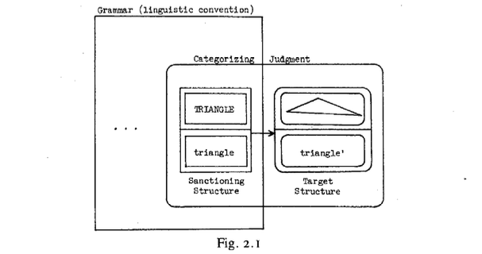

triángulo de elementos, que podemos representar de la siguiente manera: \]\[TRIÁNGULO\]/\[triángulo\]l\.

Consiste en la unidad semántica \(TRIÁNGULO\)/triangulo\]\], la unidad fonológica \[triángulo\] y la relación simbólica establecida entre ambas\. Se deben tener en cuenta varios puntos de notación\. \(I\) Sigo la práctica habitual al usar palabras en mayúscula como abreviaturas de estructuras semánticas y representaciones ortográficas en minúscula para estructuras fonológicas\. \(2\) En la fórmula \[\(TRIÁNGULO\)/\[triángulo\]\], la barra indica una relación simbólica entre las estructuras semántica y fonológica; corresponde a una línea horizontal en el diagrama\. \(3\) En esta misma fórmula, los conjuntos de corchetes internos\. marca \(TRIÁNGULO\] y \[triángulo\] como unidades, y el conjunto exterior especifica el estado de unidad de su asociación simbólica\. La figura 2\.1 utiliza rectángulos para este propósito\.

## 68
LANGACKER, Ronald\. \(1987:68\)\.*Fundations of Cognitive Gammar*, V\.1 : *Theoretical Prerequisites, Stanford \(Cal\.\) *Stanford University Press\.

Capítulo 2

 La estructura objetivo de la Fig\. 2\.1 no es una unidad convencional\. La crea el hablante como un evento de uso específico en un contexto particular y reside en la relación simbólica entre su conceptualización detallada y su vocalización real\. Las estructuras semántica, fonológica y simbólica están delimitadas por curvas cerradas para indicar su carácter de no unidad\. Utilizando paréntesis para este mismo propósito, podemos representar la estructura objetivo mediante fórmulas de la siguiente manera: \(\(TRIÁNGULO'\)/\(triángulo'\)\)\. Observe que cualquier estructura X' es una variante de X; en el presente ejemplo, \(TRIÁNGULO'\) y \(triángulo'\) son más específicas que las unidades correspondientes \[TRIÁNGULO\] y \[triángulo\]\. La fórmula \(TRIÁNGULO'\) se sustituye en la Fig\. 2\.1 por una especificación de forma mnemotécnica\.

 La sanción se reduce a la categorización\. Una unidad convencional define una categoría y sanciona una estructura meta en la medida en que esta es juzgada por un hablante como miembro de la categoría\. La categorización, a su vez, depende de la relación de esquematicidad, que represento con una flecha sólida\. La flecha en la Fig\. 2\.I indica, por lo tanto, que la estructura sancionadora guarda una relación de __esquematicidad__ con la estructura meta; por lo tanto, la meta se sanciona como una extrapolación bien formada de la convención lingüística en virtud de este juicio de categorización\. El juicio de categorización tiene la siguiente representación formulaica: \(ITRIÁNGULO\]/\[triángulo\]l → \(\(TRIÁNGULO'\)/\(triángulo'\)\)\)\.

## 68
LANGACKER, Ronald\. \(1987:68\)\.*Fundations of Cognitive Gammar*, V\.1 : *Theoretical Prerequisites, Stanford \(Cal\.\) *Stanford University Press\.

Capítulo 2

Los paréntesis exteriores marcan su carácter no unitario\.

 La esquematicidad puede equipararse a la relación entre un nodo superordinado y un nodo subordinado en una jerarquía taxonómica; el concepto \[ÁRBOL\], por ejemplo, es esquemático con respecto al concepto \[ROBLE\]: \[\[ÁRBOL\] → \[ROBLE\]\. En tales relaciones, denomino esquema a la estructura superordinada, y elaboración o instanciación del esquema a la estructura subordinada\. La importancia conceptual de esta relación, sugiero, es que una __elaboración__ o __instanciación__ del esquema, totalmente compatible con las especificaciones de su esquema, pero se caracteriza con mayor detalle \(cf\. 3\.3\.3\)\. El esquema \[ÁRBOL\], por ejemplo, define una categoría que se instancia mediante una variedad de conceptos más específicos, todos ellos compatibles con sus especificaciones \(\[ROBLE\], \[ARCE\], \[OLMO\], etc\.\)\. Estas instanciaciones elaboran el esquema de diferentes maneras según diversos parámetros, para producir nociones articuladas con mayor precisión\.

## 69
LANGACKER, Ronald\. \(1987:69\)\.*Fundations of Cognitive Gammar*, V\.1 : *Theoretical Prerequisites, Stanford \(Cal\.\) *Stanford University Press\.

Capítulo 2

__*2\.1\.4\.4\. *__Sanción parcial__*\. *__Al igual que la categorización en general, la sanción es una cuestión de grado y de juicio del hablante\. Los ejemplos anteriores implicaron una esquematicidad completa y, en consecuencia, una sanción completa: el objetivo es compatible con la unidad sancionadora y, por lo tanto, el hablante lo considera una instanciación sin problemas de la categoría que define\. En uno de los ejemplos, las estructuras de sanción y objetivo eran idénticas\. Se puede considerar la identidad como el caso límite de esquematicidad, donde el grado de elaboración del esquema por su instanciación resulta ser cero\. Por lo tanto, cada unidad convencional en la gramática se auto\-sanciona, siendo esquemática para sí misma a la mínima distancia __elaborativa posible__\.

 Pero el uso no siempre se comporta tan bien con respecto a los cánones de la convención establecida\. A menudo existe algún conflicto entre las especificaciones de las estructuras sancionadoras y las estructuras meta, de modo que las primeras pueden interpretarse como esquemáticas para las segundas solo con cierta __tensión__\. En este caso, la relación entre las estructuras sancionadoras y las estructuras meta es de __esquematicidad parcial__, y la relación proporciona solo una __sanción parcial__\. La sanción parcial puede equipararse con desviación o malformación, pero debe enfatizarse que se tolera \(y a menudo se espera\) una cantidad considerable de no convencionalidad como una característica normal del uso del lenguaje\.

## 69
LANGACKER, Ronald\. \(1987:69\)\.*Fundations of Cognitive Gammar*, V\.1 : *Theoretical Prerequisites, Stanford \(Cal\.\) *Stanford University Press\.

Capítulo 2

 Cuando la sanción se basa en la esquematicidad completa, las especificaciones de las estructuras sancionadoras y objetivo son totalmente compatibles, y la relación entre ellas es puramente elaborativa, equivalente a la que existe entre los nodos superordinados y subordinados en una jerarquía taxonómica\. Por otro lado, la categorización basada en la sanción parcial es el tipo descrito en el modelo de prototipo, donde una categoría se define en términos de instancias prototípicas\. En este caso, un hablante juzga la pertenencia a una clase mediante una percepción de similitud que le permite interpretar una estructura como una extensión del prototipo\. No se requiere compatibilidad total: cuanto más se desvía una estructura de las especificaciones del prototipo, menos probable es su asimilación a la categoría, pero no existe un punto de corte específico más allá del cual se descarte un juicio de categorización en términos absolutos8\.

8\.Estos dos tipos de categorización están íntimamente conectados; en el capítulo 10 se ofrece una explicación unificada\.

## 69
LANGACKER, Ronald\. \(1987:69\)\.*Fundations of Cognitive Gammar*, V\.1 : *Theoretical Prerequisites, Stanford \(Cal\.\) *Stanford University Press\.

Capítulo 2

 Consideremos, entonces, un ejemplo de uso basado solo en una sanción parcial\. Supongamos que le presento un trozo de madera cónico; su punta es de mina de lápiz y, obviamente, está destinado a servir como instrumento de escritura\. Supongamos además que usted reacciona exclamando: "¡Mire este lápiz\!"\. Su elección del término lápiz para designar este objeto implica el juicio categorizador representado en la Fig\. 2\.2\.

 La unidad sancionadora es el elemento léxico establecido lápiz, y el objetivo consiste en su uso de la vocalización \(lápiz\) para simbolizar su novedosa conceptualización \(LÁPIZ'\)\. La estructura sancionadora es solo parcialmente esquemática para el objetivo, porque sus especificaciones semánticas entran en cierto conflicto\. En particular, la unidad semántica \[LÁPIZ\] especifica que el objeto que designa es aproximadamente cilíndrico, mientras que la novedosa conceptualización \(LÁPIZ'\) especifica una forma cónica para la entidad correspondiente\. A pesar de esta tensión, las dos estructuras son lo suficientemente similares como para que la estructura objetivo se considere fácilmente como una extensión de la unidad sancionadora\. Este juicio de extensión o esquematicidad parcial se indica mediante una flecha discontinua\.

## 70
LANGACKER, Ronald\. \(1987:70\)\.*Fundations of Cognitive Gammar*, V\.1 : *Theoretical Prerequisites, Stanford \(Cal\.\) *Stanford University Press\.

Capítulo 2

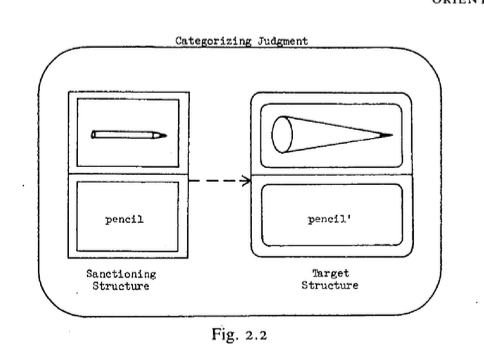

  

 

La categorización \(\[\[LÁPIZ\]/\[lápiz\]\] \-\-→ \(\(LÁPIZ'\)/\(lápiz'\)\)\) constituye una extensión semántica que no es en absoluto atípica del uso del lenguaje y es indicativa de nuestra flexibilidad habitual para resolver el problema de codificación\. Además, este ejemplo difiere solo en grado del uso figurativo del lenguaje\. Supongamos que llamo a alguien avestruz \(por su peculiar figura y su forma curiosa de caminar\)\. La unidad léxica avestruz se utiliza para sancionar un evento de uso novedoso donde la misma secuencia fonológica simboliza la concepción de un tipo particular de persona: \(\[\[AVESTRICH\]/\[avestruz\]\]\-\-→ \(\(PERSONA'\)/\(avestruz'\)\)\)\. La ​​unidad sancionadora representa el elemento léxico en su sentido literal, mientras que la estructura meta corresponde a su nuevo valor figurativo\. El juicio categorizador es mucho más tenue que en el ejemplo anterior, ya que las dos estructuras semánticas son incompatibles en la gran mayoría de sus especificaciones\. Pero es precisamente esta mayor tensión la que hace que la categorización no sea obvia y nos lleva a considerar el uso figurativo\.

## 70
LANGACKER, Ronald\. \(1987:70\)\.*Fundations of Cognitive Gammar*, V\.1 : *Theoretical Prerequisites, Stanford \(Cal\.\) *Stanford University Press\.

Capítulo 2

 Ahora resulta evidente la razón para referirse a la interfaz entre la convención y el uso como la fuente del cambio lingüístico y el crisol de la estructura lingüística: los usos particulares, así como los juicios categorizadores que los sancionan, a menudo adquieren estatus de unidad y cierto grado de convencionalidad; en la medida en que esto ocurre, las estructuras en cuestión caen por definición dentro de los límites de una gramática y cuentan como parte de la caracterización de la convención lingüística\. Si utilizo el término avestruz para designar a cierto tipo de persona no solo una vez, sino en repetidas ocasiones, pronto domino esta expresión figurativa como una unidad fija: \[I\[OSTRICH\]ostrich\]\] → \[\[PERSON'\]/\[ostrich'\]\]\]9\. 

9\. En sentido estricto, cada evento de uso es único\. La extensión de avestruz que alcanza el estado unitario representa una esquematización de los objetivos invocados en diferentes ocasiones\.

## 70
LANGACKER, Ronald\. \(1987:70\)\.*Fundations of Cognitive Gammar*, V\.1 : *Theoretical Prerequisites, Stanford \(Cal\.\) *Stanford University Press\.

Capítulo 2

Además, este uso puede extenderse fácilmente a otros hablantes e incluso volverse convencional para toda la comunidad lingüística \(nótese las extensiones a las personas de términos como cerdo, perro, rata, zorro, tigre y otros animales\)\. La convencionalización de lo que se origina como un uso novedoso constituye, por lo tanto, un cambio en el sistema lingüístico, ya sea que la unidad innovadora simplemente elabore estructuras preexistentes o, al violar ciertas especificaciones, represente una desviación más sustancial de la definición previa de convencionalidad\. He analizado explícitamente solo la especialización semántica y la extensión de morfemas individuales, pero los mecanismos son bastante generales\. Toda la estructura lingüística se reduce a usos convencionalizados, generalizaciones \(esquemas\) que los hablantes extraen de dichos usos y relaciones de categorización que involucran dichos elementos\)\.

## 71
LANGACKER, Ronald\. \(1987:71\)\.*Fundations of Cognitive Gammar*, V\.1 : *Theoretical Prerequisites, Stanford \(Cal\.\) *Stanford University Press\.

Capítulo 2

__*2\.1\.4\.5\. *__*Creatividad Lingüística\.* Se suele establecer una distinción bastante clara entre dos tipos de creatividad: \(1\) la creatividad regida por reglas, que consiste en el cálculo de expresiones novedosas mediante la correcta aplicación de reglas gramaticales; y \(2\) la creatividad en un sentido más general del término, que se manifiesta en fenómenos como el lenguaje figurativo, la adaptación de elementos léxicos a nuevas situaciones y la violación deliberada de reglas gramaticales\. La primera se considera un tema propio de la descripción lingüística, mientras que la segunda generalmente se deja para ser tratada en una teoría del rendimiento o en una explicación de la capacidad cognitiva general\.

 La gramática cognitiva considera esta distinción ni tan clara ni particularmente útil\. Por un lado, el contraste entre sanción total y parcial, aunque útil y probablemente significativo a efectos teóricos, resulta difícil de mantener en la práctica\. A menudo, la relación entre una sanción y una estructura objetivo implica tanto elaboración como extensión\. Además, si las estructuras son incompatibles en ciertas características depende precisamente de cómo se interprete la estructura sancionadora\. Consideremos la adaptación de "tubo" para significar "metro"\. Claramente, se requiere elaboración, ya que un metro tiene propiedades muy especiales que van más allá de las de los tubos en general\. Pero el grado de conflicto con el significado básico depende de una cuestión de flexibilidad conceptual sustancial, a saber, la relevancia relativa de ciertas especificaciones en particular: ¿cuán prominentes son las especificaciones de discreción y manipulabilidad en el sentido básico de "tubo"? La dificultad para decidir no es realmente molesta, ya que nada en el presente marco requiere una distinción nítida entre esquematicidad total y parcial\. Supongamos que consideramos la convencionalidad como una medida de cuán drásticamente debe transformarse la estructura sancionadora para que coincida con el objetivo\. Desde esta perspectiva, la elaboración es simplemente un tipo especial \(aunque quizás privilegiado\) de transformación: un ajuste en el nivel de especificidad con el que se caracteriza una estructura\.

## 72
LANGACKER, Ronald\. \(1987:72\)\.*Fundations of Cognitive Gammar*, V\.1 : *Theoretical Prerequisites, Stanford \(Cal\.\) *Stanford University Press\.

Capítulo 2

 La decisión de no considerar la gramática como un recurso constructivo erosiona aún más la distinción entre los dos tipos de creatividad\. Aplicar reglas gramaticales para calcular expresiones novedosas es algo que los hablantes \(no Las gramáticas\) responden a un problema de codificación, y los conceptos de la gramática cognitiva revelan que tiene la misma naturaleza básica que la adaptación de elementos léxicos a nuevos usos literales y figurativos\. Tomemos solo un ejemplo\. He observado a un niño probar un trozo de pastel y quejarse de que no le gustaba porque tenía demasiado sabor a albaricoque\. La forma «albaricoque» era una expresión polimorfémica novedosa creada en respuesta a las exigencias del uso, de acuerdo con un patrón derivacional del inglés razonablemente productivo\. Como cualquier «regla» morfológica o sintáctica, este patrón se representa en la gramática como una unidad simbólica esquemática; encarna la generalización que un hablante ha extraído de un conjunto de instancias previamente encontradas, y coexiste en la gramática con aquellas de sus instancias que tienen estatus de unidad \(por ejemplo, salado, picante, con nueces, con menta\)\. Dado que por el momento no nos preocupa demasiado la estructura interna de estas unidades polimorfémicas, el esquema subsumidor puede abreviarse de la siguiente manera: \[\[N/\.\.\.J\-\[Y/yll; \[N/\.\.\.\] debe interpretarse aquí como una raíz nominal caracterizada esquemáticamente, y \[Y/y\] es el sufijo derivativo\.

La raíz nominal esquemática no tiene una forma fonológica particular \(de ahí los tres puntos\), y se especifica semánticamente solo como algo comestible\. El sufijo tiene tanto una forma específica como un significado específico \(aunque este último es bastante abstracto\)\. Las instancias del esquema pueden darse en una notación comparable, por ejemplo, \[\[SALT/salt\]\-\[Y/y\]\]\.10

10\. os corchetes internos suelen suprimirse con fines abreviativos\. Por ejemplo, \[SALT/salt\] abrevia \[\[SALT\]/\[salt\], donde las estructuras semánticas y fonológicas se muestran individualmente como unidades\.

## 72
LANGACKER, Ronald\. \(1987:72\)\.*Fundations of Cognitive Gammar*, V\.1 : *Theoretical Prerequisites, Stanford \(Cal\.\) *Stanford University Press\.

Capítulo 2

 La observación crucial es que las relaciones de esquematicidad se mantienen no solo entre estructuras simbólicas simples, sino también entre estructuras complejas\. Un ejemplo de estructuras simples es la relación esquemática entre \[N/\.\.\.\] y \[SALT/salt\], es decir, \[\[N/\.\.\.\]→\[SALT/salt\]\]; se presume que este juicio de categorización tiene carácter de unidad\. Pero si \[N/\.\.\.\] es esquemático para \[SALT/salt\], se deduce que \[\[N/\.\.\]\-\[Y/yll es esquemático para \[\[SALT/salt\]\-\[Y/yll, ya que se ensamblan en paralelo a partir de sus elementos componentes, y cada elemento de uno participa en una relación de esquematicidad o identidad con el elemento correspondiente del otro\. Por lo tanto, podemos postular la unidad compleja \[\[\[N/\.\.\.1\-\[Y/yl\]→ \(\[SALT/sait\)\-\[Y /y\]ll, que representa la categorización establecida de salado como miembro de la clase definida por el patrón derivacional en cuestión\.

## 73
LANGACKER, Ronald\. \(1987:73\)\.*Fundations of Cognitive Gammar*, V\.1 : *Theoretical Prerequisites, Stanford \(Cal\.\) *Stanford University Press\.

Capítulo 2

 Con la nueva expresión albaricoque, la situación es bastante análoga, salvo que la forma compuesta y el juicio categorial carecen de estatus de unidad cuando la palabra se acuña por primera vez\. Los morfemas \[ALBARIC/albaricoque\] e \[Y/y\] son ​​unidades, pero la expresión compuesta no lo es: \(\[ALBARIC/albaricoque\]\-\(Y/y\]\)\. Generado por las exigencias del uso, este símbolo puede considerarse una estructura objetivo\. Su sanción por el esquema \[\[N/\.\.\.I\-\[Y/yll\] en el juicio categorial \(\[\[N/\.\.\.J\-\[Y/yl|→ \(\[ALBARIC/albaricoque\]\-\[Y/y\]\)\) equivale al reconocimiento la idea de que albaricoque es una extrapolación bien formada de un patrón11 morfológico establecido\. El potencial de esta forma novedosa es obvio, dado el esquema \[\[N/\.\.\.\]\-\[Y/yl\] y la unidad clasificatoria \[\[N/\.\.\.\]→ \[APRICOT/apricot\]\], pero en realidad, observar y explotar este potencial de una manera que responda a los objetivos comunicativos inmediatos equivale a una actividad de resolución de problemas por parte del hablante\.

11\.Cuando el esquema que define un patrón gramatical es solo parcialmente esquemático para el objetivo, la tensión resultante constituye lo que generalmente se denomina "agramaticalidad"\. Por ejemplo, \(\[Y/y\]\-\[APRICOT/apricot\]\) recibe solo una aprobación parcial del esquema \[\[N/\.\.\.\]\-\[Y/y\]\] porque el orden lineal de sus componentes entra en conflicto con el especificado por el esquema\.

## 73
LANGACKER, Ronald\. \(1987:73\)\.*Fundations of Cognitive Gammar*, V\.1 : *Theoretical Prerequisites, Stanford \(Cal\.\) *Stanford University Press\.

Capítulo 2

 El ejemplo es simple, pero el enfoque se generaliza a casos de cualquier grado de complejidad deseado\. La gramática cognitiva adapta la proyección de reglas gramaticales a expresiones novedosas mediante los mismos recursos básicos necesarios para gestionar el uso especializado y la extensión figurativa de los elementos léxicos\. Por lo tanto, el marco ofrece una explicación unificada de la productividad gramatical, la extensión léxica, el uso y el lenguaje figurativo\. Esta unificación no sería alcanzable si el requisito de generatividad se impusiera a un Gramática\. Una gramática generativa que se adapte al lenguaje figurativo y su uso tendría que enumerar el conjunto completo de estructuras meta que potencialmente reciben aprobación total o parcial de las convenciones de una lengua\. Sin embargo, este conjunto no puede derivarse algorítmicamente de una lista de reglas establecidas y elementos léxicos; el conjunto no está bien definido, ya que depende del rango total de la experiencia humana concebible\. La creatividad lingüística se examina mejor no dentro de los límites de una gramática restringida y autocontenida, sino en el contexto general del conocimiento, el juicio y la capacidad de resolución de problemas humanos\.

## 73
LANGACKER, Ronald\. \(1987:73\)\.*Fundations of Cognitive Gammar*, V\.1 : *Theoretical Prerequisites, Stanford \(Cal\.\) *Stanford University Press\.

Capítulo 2

2\.1\.5\. Inventario Estructurado de Unidades Lingüísticas Convencionales

 El término __inventario__pretende transmitir la naturaleza no constructiva de una gramática; no debe interpretarse como que las unidades de una gramática son entidades discretas e inconexas, como una fila de cajas en un estante\. El inventario debe considerarse, en cambio, __estructurado__, en el sentido de que algunas unidades funcionan como componentes de otras\. Por ejemplo, las unidades fonológicas \[d\], \[ol y \[g\] funcionan como componentes de la unidad fonológica de orden superior \[\[d\]\-\[a\]\-\[gl\]\.

Esta, a su vez, se combina con la unidad semántica \[DOG\] para formar la unidad simbólica \[\[DOG\]/\[\[d\)\-\[l\-\[glll\], a la que podemos añadir el morfema plural para obtener una unidad simbólica de orden superior, y así sucesivamente\. Debe quedar claro que la misma unidad normalmente sirve como componente de numerosas estructuras de orden superior \(consideremos, por ejemplo, todas las unidades fonológicas y léxicas que contienen \[d\]\)\. La gramática de una lengua es, por lo tanto, un vasto inventario de unidades estructuradas en jerarquías

que se superponen e intersecan a gran escala\.

 Se reconocen tres tipos básicos de relaciones entre los componentes de una estructura compleja\. El primero es la simbolización, donde se establece una correspondencia entre una estructura semántica y una estructura fonológica\. La simbolización se indica mediante una barra oblicua o una línea que separa ambos componentes, lo que representa el límite entre el espacio semántico y el fonológico, como en \[\[DOG\]/\[dogll\.

## 74
LANGACKER, Ronald\. \(1987:74\)\.*Fundations of Cognitive Gammar*, V\.1 : *Theoretical Prerequisites, Stanford \(Cal\.\) *Stanford University Press\.

Capítulo 2

 El segundo tipo de relación entre componentes es la categorización, que analizo en términos de esquematicidad\. Como se indicó anteriormente, la esquematicidad completa se indica con una flecha continua; una flecha discontinua se utiliza para la esquematicidad parcial \(extensión\) y también para la __categorización__ en general\. Los elementos que participan en una relación de categorización pueden ser de cualquier tipo: semántico, fonológico o simbólico\. La figura 2\.3 muestra mis juicios para un conjunto de elementos semánticos\.

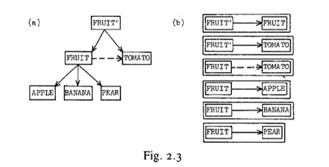

## 74
LANGACKER, Ronald\. \(1987:74\)\.*Fundations of Cognitive Gammar*, V\.1 : *Theoretical Prerequisites, Stanford \(Cal\.\) *Stanford University Press\.

Capítulo 2

 Unidades\. \[MANZANA\], \[PLÁTANO\] y \[PERA\] son ​​instancias no problemáticas de la categoría definida por el esquema \[FRUTA\]\. Sin embargo, \[TOMATE\] se asimila a esta categoría solo por extensión; he aprendido que un tomate es "técnicamente" una fruta, pero sus propiedades entran en conflicto con mi comprensión informal de la noción \(principalmente en lo que respecta a la dulzura\)\. \[FRUTA\] es una concepción más abstracta \(un esquema de orden superior\) que tiene tanto \[FRUTA\] como \[TOMATE\] como elaboraciones\. Si esta unidad existe, representa lo que los tomates tienen en común con las frutas prototípicas\. 12

12\. Estas categorizaciones son, en cierta medida, específicas de una cultura dada, e incluso de un hablante determinado\. No están determinadas únicamente por factores objetivos, ni son totalmente predecibles a partir de las propiedades de dos estructuras\. Las relaciones de categorización no se especifican automáticamente para cada par de unidades potencialmente sujetas a comparación; cada categorización resulta de actos específicos de juicio \(en algún nivel de procesamiento cognitivo\)\. Los juicios particulares que una persona emite dependen de una serie de factores, como la imaginación, la precisión intelectual, el acceso a la opinión de expertos y los accidentes de la experiencia personal\.

## 74
LANGACKER, Ronald\. \(1987:74\)\.*Fundations of Cognitive Gammar*, V\.1 : *Theoretical Prerequisites, Stanford \(Cal\.\) *Stanford University Press\.

Capítulo 2

 Me refiero a este conjunto de unidades de categorización como una __red esquemática__\. Las redes esquemáticas se representan convenientemente en diagramas como la Fig\. 2\.3\(a\), que a menudo se asemejan a las jerarquías taxonómicas estándar\. Sin embargo, no existen restricciones intrínsecas en la configuración de estas redes, y diagramas como la Fig\. 2\.3\(a\) pueden considerarse como abreviaturas resumidas para conjuntos de relaciones de categorización individuales, como se muestra en la Fig\. 2\.3\(b\)\. Categorizaciones como estas definen un __plano esquemático__ de relaciones, que son fundamentales para la organización lingüística\. Las estructuras en este plano cumplen tres funciones cruciales, que a menudo se consideran distintas, pero que reciben una explicación unificada en la gramática cognitiva: \(1\) categorización; \(2\) la captura de generalizaciones \(expresadas por esquemas\); y \(3\) la aprobación de estructuras novedosas \(la categorización de no unidades\)\.

## 75
LANGACKER, Ronald\. \(1987:75\)\.*Fundations of Cognitive Gammar*, V\.1 : *Theoretical Prerequisites, Stanford \(Cal\.\) *Stanford University Press\.

Capítulo 2

 Ortogonal al plano esquemático de relaciones se encuentra el __plano sintagmático__, donde dos o más estructuras de un dominio determinado \(semántico, fonológico o simbólico\) se combinan para formar una __estructura compuesta__ de mayor tamaño\. Por ejemplo, las unidades simbólicas \[\[DOG\]/\[dogll y \[\[PL\]/\[z\]\] \(el morfema plural\) se unen sintagmáticamente en el plural perros, es decir, \[\[DOG\]/\[dogll\-\[\[PL\]/\[z\]\]\]\. La base de la combinación sintagmática es la __integración__, el tercer tipo de relación entre los componentes de una estructura compleja\. La integración se marca mediante un guion o línea que conecta los componentes\. Las estructuras en el plano sintagmático pueden alcanzar cualquier tamaño deseado mediante la integración sucesiva de componentes para formar estructuras compuestas cada vez más grandes\. Así, encontramos jerarquías componenciales, donde la estructura compuesta en un nivel de organización funciona como un componente en el nivel inmediatamente superior\. La figura 2\.4 ilustra dos notaciones equivalentes para una función componencial jeráarquica

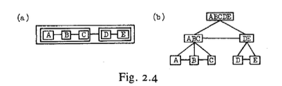

## 75
LANGACKER, Ronald\. \(1987:75\)\.*Fundations of Cognitive Gammar*, V\.1 : *Theoretical Prerequisites, Stanford \(Cal\.\) *Stanford University Press\.

Capítulo 2

 En este ejemplo abstracto, \[ABC\] y \(DE\] son ​​estructuras compuestas en el primer nivel \(inferior\) de organización, mientras que en el segundo nivel sirven como componentes integrados para formar la estructura compuesta de orden superior \[ABCDE\]\. La figura 2\.4\(a\) es una representación __compacta__ de la jerarquía; obsérvese que el contenido de las estructuras compuestas se da solo implícitamente, en función de sus componentes y las líneas de integración que los conectan\. Por el contrario, la representación __expandida__ de la figura 2\.4\(b\) muestra cada estructura compuesta por separado de sus componentes\.

 Cabe destacar que la combinación sintagmática implica más que la simple adición de componentes\. Una estructura compuesta es un sistema integrado formado mediante la coordinación de sus componentes de una manera específica, a menudo elaborada\.

De hecho, a menudo tiene propiedades que van más allá de lo que cabría esperar de sus componentes por sí solos\. Dos breves observaciones deberían aclarar por qué esto es así\. En primer lugar, las estructuras compuestas se originan como objetivos en eventos de uso específicos\. Como tales, a menudo se caracterizan en relación con contextos particulares con propiedades no predecibles a partir de las especificaciones de sus componentes, tal como se manifiestan en otros entornos\. Un punto relacionado es que puede ser necesario ajustar ciertos detalles de un componente cuando se integra con otro para formar un compuesto; a esto lo llamo __acomodación__\. Por ejemplo, el significado de correr, aplicado a los humanos, debe ajustarse en ciertos aspectos al extenderse a animales de cuatro patas como caballos, perros y gatos \(ya que el movimiento corporal observado al correr a dos patas no es idéntico al de correr a cuatro patas\); en un sentido técnico, esta extensión crea una nueva __variante semántica__ del elemento léxico\. La acomodación es una de las principales fuerzas que impulsan el crecimiento de las redes esquemáticas\.

## 76
LANGACKER, Ronald\. \(1987:76\)\.*Fundations of Cognitive Gammar*, V\.1 : *Theoretical Prerequisites, Stanford \(Cal\.\) *Stanford University Press\.

Capítulo 2

__2\.2\. LA NATURALEZA DE LA ESTRUCTURA GRAMATICAL__

Se afirma que la estructura gramatical tiene un carácter simbólico: consiste en la simbolización convencional de la estructura semántica y forma un continuo con el léxico\. Pero ¿qué significa, precisamente, decir que la gramática es simbólica? Una discusión general sobre la noción de simbolización lingüística en la gramática cognitiva prefaciará nuestro análisis de las construcciones gramaticales como entidades simbólicas\.

2\.2\.1\. *Espacio semántico y fonológico*

 La gramática cognitiva postula únicamente tres tipos básicos de estructuras: __semántica__, __fonológica__ y __simbólica__\. Las estructuras simbólicas, obviamente, no se distinguen de las demás, sino que las combinan\. Una estructura simbólica es __bipolar__ y consta de un __polo semántico__, un __polo fonológico__ y la asociación entre ellos\.\.

 Supondré que se puede postular válidamente el espacio __semántico y el espacio__ __fonológico__ como dos amplios aspectos de la organización cognitiva humana\. Podemos pensar en el espacio semántico como el campo multifacético de potencial conceptual dentro del cual se despliegan el pensamiento y la conceptualización; una estructura semántica puede entonces caracterizarse como una ubicación o una configuración en el espacio semántico\. Mapear los diversos dominios del espacio semántico y sus interrelaciones, al menos en términos rudimentarios, es claramente un prerrequisito para cualquier tipo de análisis semántico definitivo\. El capítulo 4 ofrece algunas sugerencias programáticas en este sentido\.

## 76
LANGACKER, Ronald\. \(1987:76\)\.*Fundations of Cognitive Gammar*, V\.1 : *Theoretical Prerequisites, Stanford \(Cal\.\) *Stanford University Press\.

Capítulo 2

 El espacio fonológico, de manera similar, es nuestro rango de potencial fónico, es decir, nuestra capacidad para manejar sonidos, y con los sonidos del habla como un caso especial\. Los lingüistas están acostumbrados a pensar en el potencial fónico en términos espaciales\. Por ejemplo, un diagrama vocálico que muestra los parámetros agudo\-grave y anterior\-posterior representa un intento de mapear un dominio del espacio fonológico; caracteriza un rango de potencial articulatorio, y una articulación vocálica puede definirse \(al menos en parte\) como una ubicación dentro de este rango\. Un espectrograma del habla, que traza la distribución de energía a lo largo de los parámetros de tiempo y frecuencia, es una representación gráfica de los sonidos desde el punto de vista acústico; un sonido

puede definirse acústicamente como una configuración \(por ejemplo, una estructura de formantes particular\) en este dominio concebido espacialmente\. 

## 77
LANGACKER, Ronald\. \(1987:77\)\.*Fundations of Cognitive Gammar*, V\.1 : *Theoretical Prerequisites, Stanford \(Cal\.\) *Stanford University Press\.

Capítulo 2

 Aunque el espacio semántico es mucho más complejo y difícil de dilucidar, no veo motivos para dudar de que, en principio, pueda abordarse de forma similar\. Puede que las nociones de __espacio semántico__ y fonológico aún no sean plenamente sustanciales, pero tampoco son inherentemente misteriosas; será más provechoso trabajar para explicar estas nociones que rechazarlas de plano\.

Dada la existencia del espacio semántico y fonológico, podemos proceder a definir un espacio simbólico bipolar, obtenido mediante la coordinación de ambos\. Una estructura simbólica puede entonces caracterizarse como una configuración en el espacio simbólico\. Para ser más específicos, una estructura simbólica consiste en una estructura semántica en un polo, una estructura fonológica en el otro polo y una correspondencia que las vincula\. He indicado las correspondencias con líneas punteadas en la Fig\. 2\.5, que resume varios de los conceptos presentados hasta ahora\. Es importante distinguir entre simbolización \(sym\) y codificación \(cod\), aunque ambas dependen de __correspondencias__ \(al igual que la combinación sintagmática\)\. La __simbolización__ es la relación entre una estructura en el espacio semántico y otra en el espacio fonológico, ya sea que esta relación constituya una unidad en la gramática de una lengua o se cree en el momento como un evento de uso específico\. La codificación, por otro lado, se produce a través de la frontera entre la convención y el uso\. Se trata de encontrar una estructura objetivo apropiada que se ajuste a una unidad sancionadora dentro de un rango de tolerancia esperado\. Cabe destacar que se debe lograr un ajuste aceptable en ambos polos en un caso típico de uso: La conceptualización debe categorizarse plausiblemente por la unidad semántica a la que corresponde, y de igual manera, la vocalización, por la unidad fonológica correspondiente \(que debe simbolizar la unidad semántica\)\. 

## 77
LANGACKER, Ronald\. \(1987:77\)\.*Fundations of Cognitive Gammar*, V\.1 : *Theoretical Prerequisites, Stanford \(Cal\.\) *Stanford University Press\.

Capítulo 2

La relación de codificación general entre la unidad simbólica sancionadora y el objetivo se deriva, por lo tanto, de las relaciones de codificación individuales en los polos13 semántico y fonológico\. 

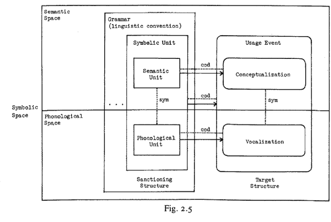

13\. La relación de codificación es neutral respecto a la distinción entre hablante y oyente: ambos interlocutores deben encontrar un objetivo bipolar adecuado, ya sea que se tome como punto de partida la conceptualización o la vocalización\. Sería simplista atribuir una direccionalidad estricta a los roles de hablar y oír \(p\. ej\., el oyente suele tener una hipótesis sólida sobre la conceptualización incluso antes de emitir la vocalización\)\.

## 78
LANGACKER, Ronald\. \(1987:78\)\.*Fundations of Cognitive Gammar*, V\.1 : *Theoretical Prerequisites, Stanford \(Cal\.\) *Stanford University Press\.

Capítulo 2

 En este punto, es necesario aclarar algunos puntos sobre la naturaleza de la estructura fonológica\. Se centran en la proposición, aparentemente contradictoria, pero en última instancia bastante obvia, de que los sonidos \(al menos para muchos propósitos lingüísticos\) son en realidad conceptos\. Podemos comenzar señalando que los eventos de uso a menudo son puramente conceptuales, sin manifestación física evidente\. Esto sucede siempre que el lenguaje se utiliza para el pensamiento verbal silencioso: las conceptualizaciones se codifican lingüísticamente y se asocian con estructuras fonéticas, pero aunque mentalmente "oímos" una secuencia de vocalizaciones, no se emiten sonidos físicos\. Incluso cuando las vocalizaciones se realizan físicamente, la señal acústica per se no es el objetivo principal del análisis lingüístico\. Dado que el lenguaje es una entidad cognitiva, la señal del habla debe considerarse no solo en términos físicos, sino también psicofísicos; la representación cognitiva de las expresiones lingüísticas se deriva más directamente de las impresiones auditivas y solo indirectamente de las ondas sonoras que dan lugar a estas impresiones\. 

## 78
LANGACKER, Ronald\. \(1987:78\)\.*Fundations of Cognitive Gammar*, V\.1 : *Theoretical Prerequisites, Stanford \(Cal\.\) *Stanford University Press\.

Capítulo 2

 Nuestro conocimiento de los sonidos del habla es claramente multifacético\. Dado que los sonidos son entidades perceptivas, una faceta de su representación cognitiva consiste en impresiones auditivas o rutinas perceptivas\. También conocemos los sonidos desde un punto de vista articulatorio; por lo tanto, las rutinas motoras dirigidas cognitivamente constituyen una segunda dimensión de su representación mental\. Otras dimensiones, que parecen ser de menor importancia, incluyen las sensaciones cinestésicas que acompañan a un evento articulatorio, así como la retroalimentación auditiva que un hablante recibe de sus propias emisiones \(esto contrasta tanto en calidad como en modo de transmisión con las impresiones auditivas de fuentes externas\)\. Una descripción lingüística completa de las unidades fonológicas debe dar cabida a todas estas dimensiones y, por lo tanto, requiere una serie de especificaciones paralelas \(pero coordinadas\)\. En este sentido, los sonidos son como otros conceptos, que normalmente implican especificaciones coordinadas en diversos dominios del espacio semántico \(véase el capítulo 4\)\. 

 Incluso las facetas articulatorias de los sonidos del habla se consideran propiamente conceptuales, en el sentido amplio en que entiendo este término\. Consideremos el segmento \[i\]\. Desde el punto de vista perceptual, los hablantes pueden manejar este sonido de dos maneras: pueden oírlo realmente como un evento perceptual impulsado por un estímulo, o simplemente pueden imaginar que lo escuchan, es decir, pueden activar una imagen de ello \(como en el pensamiento verbal silencioso\)\.

## 79
LANGACKER, Ronald\. \(1987:79\)\.*Fundations of Cognitive Gammar*, V\.1 : *Theoretical Prerequisites, Stanford \(Cal\.\) *Stanford University Press\.

Capítulo 2

 Además, la imagen auditiva se considera plausiblemente primaria, en el sentido de que se utiliza para categorizar la entrada acústica como una instancia de este sonido en particular\. Se pueden hacer observaciones exactamente análogas sobre la representación articulatoria de \[il\]\. Un hablante puede implementar la rutina articulatoria y producir el sonido, o simplemente puede imaginar implementarla, es decir, puede ejecutar mentalmente la rutina motora sin que esta actividad mental se traduzca en gestos musculares\. Una vez más, la representación cognitiva es primaria, en el sentido de que dirige la secuencia motora, pero también puede ocurrir de forma autónoma\. 14

 Si los sonidos son entidades conceptuales, nuestra caracterización previa del espacio simbólico se simplificó excesivamente al tratar el espacio semántico y el fonológico como campos disjuntos de potencial cognitivo; el espacio fonológico debería considerarse, en cambio, como una subregión del espacio semántico\. Diagramas al estilo de las figuras\. Por lo tanto, las secciones 2\.5 y 2\.6\(a\) se presentan con mayor precisión en el formato de la figura 2\.6\(b\)\. Es decir, un símbolo lingüístico se define por una correspondencia entre dos estructuras en el espacio semántico \(en sentido amplio\), donde una de las dos ocupa la subregión fonológica en particular\. 15

14\. Obsérvese que un hablante que defiende temporalmente, sin embargo, los sonidos de su lengua y es capaz de hablar en silencio\. De igual manera, un hablante que está temporalmente paralizado, de modo que no ocurre nada a nivel muscular cuando percibe las órdenes neuronales para producir un sonido del habla, aún puede decirse que posee las rutinas motoras necesarias\. Véase la sección 3\.2 para una discusión más detallada sobre la imaginería y el procesamiento autónomo\.

15, El contexto debe aclarar si el término «espacio semántico» se utiliza en sentido estricto \(como la región complementaria del espacio fonológico\) o en sentido amplio \(para incluir el espacio fonológico\)\. Nótese que la figura 2\.6 y algunos diagramas posteriores se simplifican al omitir el recuadro que rodea la unidad simbólica en su conjunto\.

## 79
LANGACKER, Ronald\. \(1987:79\)\.*Fundations of Cognitive Gammar*, V\.1 : *Theoretical Prerequisites, Stanford \(Cal\.\) *Stanford University Press\.

Capítulo 2

 Ubicar el espacio fonológico dentro del espacio semántico es más que una simple precisión terminológica, ya que resuelve ciertos problemas conceptuales reales o potenciales\. Un problema es caracterizar el significado de las expresiones onomatopéyicas\. Si un símbolo lingüístico implica una correspondencia entre una estructura fonológica y otra estructura en el espacio semántico, podemos esperar encontrar, como caso especial, símbolos que consisten en una correspondencia entre dos estructuras fonológicas\. Por lo tanto, una palabra como clang no presenta problemas como unidad simbólica\. El polo semántico de cada unidad simbólica es una conceptualización situada en uno o más dominios del espacio semántico, por lo que no hay nada extraño en afirmar que el significado de clang es la concepción \(o imagen auditiva\) de un tipo particular de sonido, como se muestra en la figura 2\.6\(c\)\. De hecho, se requerirían disposiciones especiales para excluir este tipo de unidad simbólica\.

 Pero podemos ir aún más lejos, porque nada en la definición de un símbolo lingüístico —una correspondencia entre dos estructuras en el espacio semántico, una de ellas fonológica— descarta inherentemente la posibilidad de que las dos estructuras puedan ser idénticas, es decir, que una estructura fonológica pueda simbolizarse a sí misma, como se muestra en la figura 2\.6\(d\)\.

## 80
LANGACKER, Ronald\. \(1987:80\)\.*Fundations of Cognitive Gammar*, V\.1 : *Theoretical Prerequisites, Stanford \(Cal\.\) *Stanford University Press\.

Capítulo 2

 Dado el marco actual, la autosimbolización es un caso límite esperado en el espectro de relaciones simbólicas concebibles, y sugeriría que proporciona al menos una solución parcial a un problema previamente señalado \(2\.1\.2\)\. Se plantea en oraciones como \(2\), donde \[RUIDO\] representa cualquier sonido que el hablante pueda crear, lingüístico o de otro tipo:

\(2\) *The boy went \[NOISE\] *El niño hizo \[RUIDO\]\.

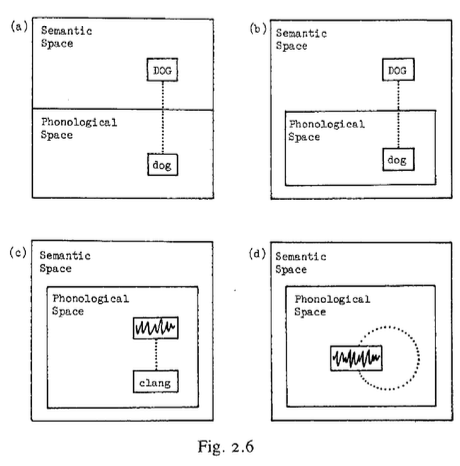

## 80
LANGACKER, Ronald\. \(1987:80\)\.*Fundations of Cognitive Gammar*, V\.1 : *Theoretical Prerequisites, Stanford \(Cal\.\) *Stanford University Press\.

Capítulo 2

 ¿Cuál es el valor semántico del constituyente \[RUIDO\] y de la oración en su conjunto? ¿Tiene \[RUIDO\] algún significado? Si a \[RUIDO\] no se le atribuye un significado, ¿cómo podemos explicar la distinción semántica de dos oraciones que incorporan ruidos diferentes?

 Oraciones como estas tienen propiedades especiales, pero el presente modelo las maneja directamente\. Los significados son entidades conceptuales, por lo que la conceptualización de un sonido puede considerarse un significado\. En oraciones como \(2\), \[RUIDO\] es un constituyente significativo y autosimbolizante; además, dos oraciones de este tipo difieren semánticamente si incorporan ruidos diferentes\.

 La autosimbolización contrasta con la onomatopeya \(compárense \(c\) y \(d\) en la Fig\. 2\.6\), pero no son drásticamente distintas \(de hecho, existe una gradación entre ellas\)\. En una expresión onomatopéyica como clang, el significante y el significado son similares pero no idénticos, y el significante se forma a partir de sonidos del habla empleados convencionalmente en el idioma\. Por otro lado, el propósito de oraciones como la \(2\) es permitir la imitación directa del significado; por lo tanto, el significante se simboliza a sí mismo y no se limita a los sonidos que se usan regularmente en la lengua\. Dado que el constituyente \[RUIDO\] es totalmente imitativo y no se limita a secuencias fonológicas establecidas convencionalmente, estas oraciones no son expresiones lingüísticas prototípicas\. Sin embargo, están sancionadas por la gramática del inglés, que ha desarrollado una construcción \(con "go"\) específicamente diseñada para acomodarlas16\.

16\. La construcción también permite un gesto en lugar de un ruido, o una combinación de ruido y gesto\.

Por lo tanto, debemos generalizar la noción de símbolo para incluir casos en los que el significante pertenece a la región visual, en lugar de la auditiva, del espacio semántico\. Esto es necesario, en cualquier caso, para el manejo de la escritura y la lengua de señas\.

## 81
LANGACKER, Ronald\. \(1987:81\)\.*Fundations of Cognitive Gammar*, V\.1 : *Theoretical Prerequisites, Stanford \(Cal\.\) *Stanford University Press\.

Capítulo 2

2\.2\.2 __* *__*Gemática como Symbolización*

__* *__Un símbolo lingüístico es bipolar, definido por una estructura semántica que corresponde a una estructura fonológica\. La mayoría de los lingüistas probablemente aceptarían esta caracterización para la gran mayoría de los elementos léxicos, que en general tienen tanto una forma como un significado obvio\. Pero la gramática es otra cuestión\. La postura de que la gramática es inherentemente simbólica es bastante heterodoxa en el pensamiento lingüístico contemporáneo, tanto que es necesario profundizar en su significado\. Consideremos tres tipos de entidades en este contexto: morfemas gramaticales, clases gramaticales y construcciones gramaticales\. Se afirma que todos se representan en la gramática como unidades simbólicas\. En este punto, me limitaré a los llamados morfemas gramaticales\.

 Su condición de unidades simbólicas depende de si son significativas, y ya he sugerido que casi invariablemente lo son\. La única manera de demostrar esto es analizando una clase sustancial y representativa de ejemplos, incluyendo casos generalmente aceptados como carentes de contenido semántico, y demostrando que surge una explicación coherente y reveladora de los fenómenos lingüísticos solo en caso de que se les atribuyan significados específicos\. Este es uno de los objetivos del presente trabajo y de la investigación cognitivo\-gramatical en general \(p\. ej\., Casad y Langacker, 1985; Langacker, 1981\-1982a; Lindner, 1981, 1982\)\. Varios morfemas gramaticales se analizan con bastante detalle en un capítulo posterior\.

## 81
LANGACKER, Ronald\. \(1987:81\)\.*Fundations of Cognitive Gammar*, V\.1 : *Theoretical Prerequisites, Stanford \(Cal\.\) *Stanford University Press\.

Capítulo 2

 Clases gramaticales básicas se definen mediante unidades simbólicas esquemáticas\. La clase de los sustantivos, por ejemplo, se define mediante un esquema que podemos representar como \[\(COSA\]/\.\.\.J\], donde \[COSA\] es una unidad semántica esquemática \(cf\. Cap\. 5\) y \[\.\.\.\] una unidad fonológica esquemática\. La categorización de una forma específica como sustantivo viene dada por una unidad clasificatoria del tipo previamente discutido, por ejemplo, \[\[\[COSA/I\.\.\.\]|→ \[\[ÁRBOL\)/\[árbol\]ll;

obsérvese que la relación esquemática entre las dos unidades simbólicas depende en general de las relaciones esquemáticas en cada polo: \[\[COSA\] → \[ÁRBOL\]\] en el polo semántico, y \[l\.\.\.\] ​​→ \[árbol\]\]\. en el polo fonológico\. Aunque varias clases básicas se caracterizan de esta manera con referencia a sus propiedades semánticas intrínsecas \(cf\. Parte II\), también debemos considerar las clases gramaticales identificadas según su distribución \(p\. ej\., la clase de raíces verbales que se nominalizan de una manera particular\)\. Esto requiere un enfoque ligeramente diferente \(aunque relacionado\), presentado en el capítulo II\. Por ahora, simplemente señalo que solo las unidades simbólicas figuran en la descripción\.

La gramática implica la combinación sintagmática de morfemas y expresiones más extensas para formar estructuras simbólicas progresivamente más elaboradas\. Estas estructuras se denominan construcciones gramaticales\. Por lo tanto, las construcciones son simbólicamente complejas, en el sentido de que contienen dos o más estructuras simbólicas como componentes\. No existe una distinción fundamental entre las construcciones morfológicas y sintácticas, que son completamente paralelas en todos los aspectos inmediatamente relevantes\.

## 82
LANGACKER, Ronald\. \(1987:82\)\.*Fundations of Cognitive Gammar*, V\.1 : *Theoretical Prerequisites, Stanford \(Cal\.\) *Stanford University Press\.

Capítulo 2

 Cuando la formación de construcciones gramaticales es regular en un grado sustancial, esta regularidad se expresa en la gramática mediante una unidad simbólica esquemática\. Esta unidad esquemática es en sí misma simbólicamente compleja, al igual que sus instancias; es decir, es una representación esquemática del patrón de integración observado en la formación de expresiones particulares\. El sustantivo pins, por ejemplo, es una expresión simbólicamente compleja formada mediante la integración de las dos unidades simbólicas pin y \-s: \[\[\[PIN\]/\[pin\]\]\-\[\[PL\]\[z\]l\]\. Esta expresión ejemplifica un patrón de formación de sustantivos plurales encarnado en la unidad esquemática \[\[THING\]\[…\.\]I\-\[\[PLJ/\[z\]\]17, donde la integración entre los dos componentes es exactamente análoga a la de los componentes de pins \(y de otros sustantivos plurales\)\. Por lo tanto, el esquema captura cualquier generalización posible sobre la naturaleza de la combinación sintagmática que define la construcción gramatical\.

17\. Simplificar en varios aspectos, en particular al ignorar la distinción entre sustantivos contables y sustantivos de masa\. Cabe destacar que «cosa» es un término técnico, no limitado a objetos físicos\.

## 82
LANGACKER, Ronald\. \(1987:82\)\.*Fundations of Cognitive Gammar*, V\.1 : *Theoretical Prerequisites, Stanford \(Cal\.\) *Stanford University Press\.

Capítulo 2

 Debemos profundizar en el complejo conjunto de relaciones que caracterizan una forma simbólicamente compleja, ya sea esquemática o específica\.

 Las representaciones formulaicas como \[|\[PIN\]/\[pin\]\]\-\[\[PL\]\[z\]\]\]17 son ​​convenientes, pero muy abreviadas, ya que muestran directamente solo algunas de las estructuras y relaciones requeridas en una explicación explícita y completamente articulada de la combinación sintagmática\.

Cuatro de las estructuras que aparecen en este ejemplo son las unidades semánticas \[PIN\] y \[PL\], y las unidades fonológicas \[pin\] y \[z\]\. Estos elementos se combinan de diversas maneras para formar unidades de orden superior en el espacio semántico, fonológico y simbólico\. Los más obvios son los morfemas componentes \[\[PIN\]/\[pin\]\] y ||PL/z\]l\. Pins resulta de la combinación sintagmática de estas unidades simbólicas simples\. ¿Qué implica la integración de dos estructuras simbólicas? Examinemos la relación integradora en cada polo\.

17\.Simplificar en varios aspectos, en particular al ignorar la distinción entre sustantivos contables y sustantivos de masa\. Cabe destacar que "cosa" es un término técnico, no limitado a objetos físicos\.

## 83
LANGACKER, Ronald\. \(1987:83\)\.*Fundations of Cognitive Gammar*, V\.1 : *Theoretical Prerequisites, Stanford \(Cal\.\) *Stanford University Press\.

Capítulo 2

 En primer lugar, un análisis completo de los pines debe incluir una descripción de cómo se integran los componentes fonológicos \[pin\] y \[z\] para obtener la estructura compuesta \[pin\-z\]; especifica, a grandes rasgos, que \[z\] se une como la consonante más externa del grupo, funcionando como coda de la sílaba cuyo núcleo es \[i\]\. En segundo lugar, un análisis completo debe describir de forma similar cómo se integran los componentes semánticos \[PIN\] y \[PL\] para obtener la estructura compuesta \[PIN\-PL\]; \[PL\] designa una masa que consiste en un número indefinido de réplicas \(en tipo\) de una entidad discreta; la entidad designada por \[PIN\] corresponde a cada una de las implicadas por \[PL\], por lo que la estructura compuesta designa una masa que consiste en un número indefinido de entidades discretas, cada una con las especificaciones de \[PIN\]\.

 Hasta ahora hemos aislado no menos de ocho unidades que figuran en una expresión simple como pins\. Estas son las unidades semánticas simples \(PIN\] y \[PL\]; la unidad semántica compuesta \[PIN\-PL\]; las unidades fonológicas simples lpin y \[z\]; la unidad fonológica compuesta \[pin\-z\]; y las unidades simbólicas simples \[\[PIN\]/\[pin\]\] y \[\[PL\]\[z\]\]\. Podría parecer que ocho deberían ser suficientes, pero en realidad no lo son\. Se puede demostrar su insuficiencia observando que una caracterización de pins que consista únicamente en estas ocho unidades no impediría un análisis manifiestamente erróneo para oraciones como \(3\), en la que hay dos sustantivos plurales:

\(3\) *Los chicos perdieron mis pins\.\[The boys lost my pins\]*

## 84
LANGACKER, Ronald\. \(1987:84\)\.*Fundations of Cognitive Gammar*, V\.1 : *Theoretical Prerequisites, Stanford \(Cal\.\) *Stanford University Press\.

*Capítulo 2*

 En el análisis erróneo, esbozado en la Fig\. 2\.7, el sufijo \-s de "boy" se considera que simboliza la pluralidad de "pin", y el sufijo \-s de "pin" simboliza la pluralidad de "boy"\. Nótese que las ocho unidades citadas anteriormente para "pins" están representadas en el diagrama\. Nada de lo dicho hasta ahora sobre "pins" es incoherente con el análisis\.

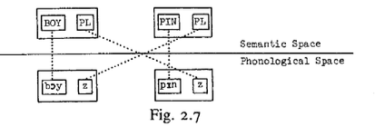

 Lo que falta, obviamente, es una especificación de que la estructura semántica compuesta \[PIN\-PL\], en su conjunto, está simbolizada por la unidad fonológica integrada \[pin\-z\] específicamente, en lugar de la mera aparición de \(pin\] y \[z\] en algún lugar de la misma oración\. Esto equivale a decir que la integración de \(pin\] y \[z\] tiene importancia simbólica: que \[z\] aparezca como sufijo en \[pin\] simboliza el hecho de que la noción de pluralidad transmitida por \(z\) pertenece a \(PIN\] en particular y no a alguna otra entidad discreta\. Dicho de otro modo, la integración semántica entre \[PIN\] y \[PL\] está simbolizada por la integración de sus respectivas manifestaciones fonológicas\.

## 83
LANGACKER, Ronald\. \(1987:83\)\.*Fundations of Cognitive Gammar*, V\.1 : *Theoretical Prerequisites, Stanford \(Cal\.\) *Stanford University Press\.

Capítulo 2

 Nos hemos encontrado así con un nuevo tipo de relación simbólica, ligeramente más abstracta que las consideradas anteriormente: en lugar de darse entre una estructura semántica y una fonológica, se da entre dos __relacione__s, una que asocia dos estructuras semánticas y la otra dos estructuras fonológicas\.

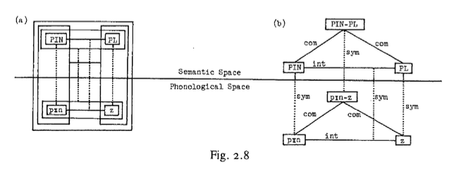

Las estructuras antic y las otras dos estructuras fonológicas\.

 La figura 2\.8 resume las diversas estructuras y relaciones que consideramos necesarias para una explicación completa y explícita de la estructura interna de los alfileres\.

## 82
LANGACKER, Ronald\. \(1987:82\)\.*Fundations of Cognitive Gammar*, V\.1 : *Theoretical Prerequisites, Stanford \(Cal\.\) *Stanford University Press\.

Capítulo 2

 El diagrama \(a\) es una representación compacta \(cf\. figura 2\.4\)\. La integración está marcada por líneas horizontales de enlace: la integración global de las unidades simbólicas \[\[PIN\]/\[pin\]\] y \[\[PL\]/\[z\]\] implica una relación integradora en cada polo, es decir, I\[PINI\-\(PL\]\] y \[\[pr\]\-\[z\]\]\. Las relaciones simbólicas están marcadas por líneas de correspondencia punteadas\. Obsérvese que la correspondencia simbólica entre la estructura semántica compuesta \[PIN\-PL\] y la estructura fonológica compuesta \[pin\-z\] se deriva de tres relaciones simbólicas más básicas: las internas a \[\[PIN\]/\[pin\]\] y |\[PL\]/\[z\]\], y la que existe entre las relaciones integradoras en los dos polos\. El diagrama \(b\) muestra las mismas estructuras y relaciones en formato de diagrama expandido\. Se han omitido algunos recuadros para mayor claridad, y se han etiquetado las líneas para identificar las relaciones de simbolización \(sym\), integración \(int\) y composición\. \(com\)\. Las representaciones en la Fig\. 2\.8 son complejas, pero solo porque todos los elementos esenciales se hacen completamente explícitos \(generalmente se ocultan bajo la alfombra o se integran en otros componentes de la gramática\)\. Cada cuadro y línea de la figura tiene un propósito específico e indica una de las estructuras o relaciones que están innegablemente presentes en esta construcción\. El sentido en que las construcciones gramaticales son entidades simbólicas debería estar ahora bastante claro\. Hemos visto que la relación de integración entre dos morfemas \(o expresiones más extensas\) se puede resolver en relaciones de integración separadas entre sus polos semántico y fonológico; la combinación sintagmática es, por lo tanto, bipolar\.

## 84
LANGACKER, Ronald\. \(1987:84\)\.*Fundations of Cognitive Gammar*, V\.1 : *Theoretical Prerequisites, Stanford \(Cal\.\) *Stanford University Press\.

Capítulo 2

Pero también es simbólica, ya que la integración de componentes en el polo semántico corresponde a, y está simbolizada por, la integración de componentes en el polo fonológico\. Esto es cierto para las construcciones gramaticales en general\. Consideremos ahora la relación entre una estructura simbólica compuesta particular, como alfileres, y el esquema que instancia\. La estructura interna del esquema es exactamente paralela a la de sus instanciaciones y especifica cómo se integran los morfemas que lo componen en los dos polos\. El esquema que describe este patrón de formación de sustantivos plurales es, por lo tanto, idéntico al de la Fig\. 2\.8, excepto que el esquema de sustantivo contable reemplaza al morfema alfiler como primer componente\. El esquema para la construcción se representa de forma compacta a la izquierda de la Fig\. 2\.9\. Recordemos que un esquema coexiste en la gramática con aquellas de sus instanciaciones que tienen estatus de unidad, lo cual es una suposición razonable en el caso de alfileres\. La relación elaborativa entre alfileres y el esquema de categorización es en sí misma una unidad, como muestra la Fig\. 2\.9\.

## 85
LANGACKER, Ronald\. \(1987:85\)\.*Fundations of Cognitive Gammar*, V\.1 : *Theoretical Prerequisites, Stanford \(Cal\.\) *Stanford University Press\.

Capítulo 2

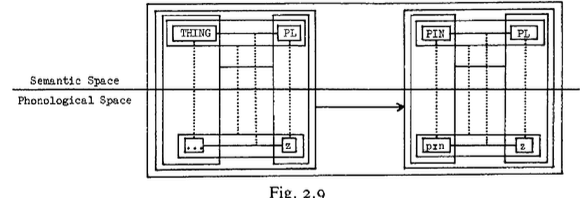

 Todo lo dicho anteriormente sobre los alfileres, una construcción morfológica, es igualmente válido \(con los ajustes pertinentes\) para una construcción sintáctica\. Consideremos la frase sintáctica «chico alto»\. Los componentes simbólicos \[\[TALL\]/\[tol\]\] y \[\[BOY\]/\[boy\]\] deben integrarse tanto en el polo semántico como en el fonológico\. Semánticamente, \[TALL\] designa la relación entre una cosa y la región que está más allá de la norma en una escala determinada, mientras que \[BOY\] designa un tipo de persona\. Se integran mediante dos correspondencias: \(1\) entre el objeto al que se refiere \[TALL\] y la persona designada por \(BOY\], y \(2\) entre la norma en la escala a la que se refiere \[TALL\] y la norma de la categoría en la especificación de la altura de \[BOY\]\. Los dos componentes se integran fonológicamente al agruparse como palabras contiguas en una frase dispuesta en un orden lineal específico\. De nuevo, lo más crucial es que la integración semántica guarda una relación simbólica con la integración fonológica: la contigüidad y el orden lineal de las estructuras fonológicas \[tol\] y \[boy\] simbolizan el hecho de que la especificación de la altura de \[TALL\] pertenece a \[BOY\] en particular, y no a otra entidad\. El caso de tall boy difiere del de pins en sus particularidades \(p\. ej\., la integración fonológica se da a nivel de frase en lugar de a nivel de palabra\), pero es bastante paralelo en su carácter general\.

## 85
LANGACKER, Ronald\. \(1987:85\)\.*Fundations of Cognitive Gammar*, V\.1 : *Theoretical Prerequisites, Stanford \(Cal\.\) *Stanford University Press\.

Capítulo 2

 Desde esta perspectiva, resulta simplemente incoherente hablar de la sintaxis como "autónoma" de la semántica\. Si se suprime el polo semántico, las relaciones simbólicas dejan de existir, y lo que queda es solo una estructura fonológica indiferenciada\. En tal circunstancia, no hay base para siquiera reconocer morfemas \(o unidades léxicas más extensas\), y mucho menos para asignarlos a clases gramaticales\.

2\.3\. Componencialidad y Correspondencia

 La componencialidad y la correspondencia son nociones que ya han ocupado un lugar destacado en nuestro análisis\. Estas nociones son bastante generales y no se limitan en absoluto a los fenómenos lingüísticos\. Sin embargo, son fundamentales para la estructura lingüística y su aplicabilidad en este ámbito es ubicua\.

2\.3\.1\. *Componencialidad*

 La idea de componencialidad es aparentemente sencilla: las estructuras complejas se construyen a partir de otras más simples \(o las tienen como componentes\)\. Sin embargo, la aplicación lingüística de esta noción requiere varias aclaraciones\. Algunas se relacionan con su interpretación cognitiva\. Otras se refieren a la distinción entre unidades conceptuales o fonológicas «naturales» y aquellas establecidas sobre la base de relaciones simbólicas\.

## 86
LANGACKER, Ronald\. \(1987:86\)\.*Fundations of Cognitive Gammar*, V\.1 : *Theoretical Prerequisites, Stanford \(Cal\.\) *Stanford University Press\.

Capítulo 2

2\.3\.1\.1\. Su base cognitiva\. La gramática de una lengua se concibe como un conjunto de afirmaciones sobre las estructuras cognitivas que constituyen un sistema lingüístico, afirmaciones que, en principio, podrían demostrarse correctas o incorrectas dada suficiente evidencia independiente sobre la cognición humana\. La noción de componencialidad debe entenderse en este contexto\. Ciertas concepciones de componencialidad y lo que implica deben ser rechazadas, aunque parezcan bastante naturales a priori, porque hay razones para pensar que los hablantes manejan las cosas de otra manera\.

El concepto \[CÍRCULO\] ofrece un ejemplo sencillo\. Cualquiera que haya estudiado geometría está familiarizado con su definición como el conjunto de puntos en un plano que se encuentran a una distancia específica de un punto de referencia\. El hecho de que esta definición se refiera a una "distancia específica" y a un "punto de referencia" podría interpretarse como una sugerencia de que \[CÍRCULO\] tiene \[RADIO\] y \[CENTRO\] como componentes semánticos, es decir, que \[RADIO\] y \[CENTRO\] se encuentran entre las rutinas cognitivas coordinadas para formar la rutina de orden superior cuya ejecución constituye la conceptualización de un círculo\. Pero a pesar de la elegancia matemática de esta caracterización, es dudoso que refleje la comprensión ingenua o primaria de \[CÍRCULO\] por parte de una persona\.

## 82
LANGACKER, Ronald\. \(1987:82\)\.*Fundations of Cognitive Gammar*, V\.1 : *Theoretical Prerequisites, Stanford \(Cal\.\) *Stanford University Press\.

Capítulo 2

 Muchas personas \(por ejemplo, niños pequeños\) adquieren \[CÍRCULO\] como un concepto destacado y profundamente arraigado sin haber sido expuestas nunca a la definición matemática ni centrar su atención específicamente en la longitud de los segmentos de línea desde el centro hasta la circunferencia\. \[CÍRCULO\] probablemente se aprende primero como una forma gestalt: es la curva cerrada más simple o mínima, sin asimetrías dimensionales ni desviaciones de una trayectoria suave a medida que se traza a lo largo de su perímetro\. \[RADIO\] se aprende y se caracteriza entonces con respecto a \[CÍRCULO\] \(y también \[CENTRO\], al menos en su aplicación a los círculos\); por lo tanto, \[CÍRCULO\] es un componente de \[RADIO\] y no a la inversa\.18

18\.En resumen, la definición matemática puede ser irrelevante para la forma en que el concepto \(CÍRCULO\) es aprendido y representado por quienes son geométricamente ingenuos\. Sin embargo, una vez que una persona ha sido expuesta a esta caracterización, su comprensión enciclopédica de la noción se enriquece\.

## 87
LANGACKER, Ronald\. \(1987:87\)\.*Fundations of Cognitive Gammar*, V\.1 : *Theoretical Prerequisites, Stanford \(Cal\.\) *Stanford University Press\.

Capítulo 2

 La idea de componencialidad sugiere que las estructuras podrían descomponerse sucesivamente en subcomponentes cada vez más pequeños hasta que ya no sea posible una mayor descomposición, dando lugar a un conjunto de "primitivos"\. ¿Se puede postular, por ejemplo, un conjunto de primitivos semánticos al estilo de la semántica generativa? La gramática cognitiva es esencialmente neutral en esta cuestión\. No se afirma específicamente que las unidades más pequeñas de significado lingüístico sean necesariamente primitivas\. A pesar de la simplicidad efectiva de una unidad \(en el sentido de no requerir ningún esfuerzo constructivo\), se concibe explícitamente como un sistema integrado, posiblemente muy complejo internamente\. Las unidades semánticas se definen en relación con las estructuras de conocimiento, que pueden ser extremadamente complejas, incluso para unidades mínimas para la mayoría de los propósitos lingüísticos \(por ejemplo, en uno de sus sentidos, balk presupone un amplio conocimiento del béisbol, pero es una unidad mínima desde el punto de vista de las relaciones simbólicas\)\. El análisis de las estructuras de conocimiento puede llevarse a cabo con la delicadeza que requieran las consideraciones lingüísticas, pero las unidades fundamentales descubiertas de esta manera no necesitan ser específicamente lingüísticas, ni es necesario asumir que finalmente se reducen a una lista específica de primitivos\. 

## 87
LANGACKER, Ronald\. \(1987:87\)\.*Fundations of Cognitive Gammar*, V\.1 : *Theoretical Prerequisites, Stanford \(Cal\.\) *Stanford University Press\.

Capítulo 2

 La naturaleza sistémica de las estructuras lingüísticas de orden superior es un punto de cierta importancia\. El hecho de que los componentes puedan reconocerse dentro de una estructura compleja no implica que estos componentes agoten su caracterización: esta puede tener propiedades superiores a las de sus componentes, que a su vez pueden manifestarse en ella solo de forma imperfecta \(cf\. Cap\. I2\)\. Diversas consideraciones dictan un enfoque __no reductivo__ de la estructura lingüística, lo que significa que una estructura compleja debe tratarse como una entidad separada por derecho propio, independientemente de su componencialidad\. Volviendo a un ejemplo anterior, ciertamente queremos reconocer la *grapa y el \-e*r como componentes de la grapadora, pero esta unidad léxica compleja tiene propiedades semánticas más específicas que las predecibles a partir de estos componentes por sí sola\. *Stapler*, especificado con todo detalle, coexiste, por lo tanto, en la gramática del inglés con sus componentes staple y \-er, así como con el esquema para el patrón derivativo V \+ \-er\. Stapler está sancionado y categorizado por este esquema, y ​​motivado por sus componentes, pero, no obstante, es una unidad distinta no deducible algorítmicamente de estas otras estructuras\.

 En última instancia, la componencialidad que nos interesa se refiere al orden en que las rutinas cognitivas se coordinan para formar rutinas progresivamente más elaboradas\. La idea de componencialidad sugiere que las estructuras podrían descomponerse sucesivamente en subcomponentes cada vez más pequeños hasta que ya no sea posible una mayor descomposición, dando lugar a un conjunto de "primitivos"\. ¿Se puede postular, por ejemplo, un conjunto de primitivos semánticos al estilo de la semántica generativa?

## 87
LANGACKER, Ronald\. \(1987:87\)\.*Fundations of Cognitive Gammar*, V\.1 : *Theoretical Prerequisites, Stanford \(Cal\.\) *Stanford University Press\.

Capítulo 2

 La gramática cognitiva es esencialmente neutral en esta cuestión\. No se afirma específicamente que las unidades más pequeñas de significado lingüístico sean necesariamente primitivas\. A pesar de la simplicidad efectiva de una unidad \(en el sentido de no requerir ningún esfuerzo constructivo\), se concibe explícitamente como un sistema integrado, posiblemente muy complejo internamente\. Las unidades semánticas se definen en relación con las estructuras de conocimiento, que pueden ser extremadamente complejas, incluso para unidades mínimas para la mayoría de los propósitos lingüísticos \(por ejemplo, en uno de sus sentidos, balk presupone un amplio conocimiento del béisbol, pero es una unidad mínima desde el punto de vista de las relaciones simbólicas\)\. El análisis de las estructuras de conocimiento puede llevarse a cabo con la delicadeza que requieran las consideraciones lingüísticas, pero las unidades fundamentales descubiertas de esta manera no necesitan ser específicamente lingüísticas, ni es necesario asumir que finalmente se reducen a una lista específica de primitivos\. 

## 87
LANGACKER, Ronald\. \(1987:87\)\.*Fundations of Cognitive Gammar*, V\.1 : *Theoretical Prerequisites, Stanford \(Cal\.\) *Stanford University Press\.

Capítulo 2

 La naturaleza sistémica de las estructuras lingüísticas de orden superior es un punto de cierta importancia\. El hecho de que los componentes puedan reconocerse dentro de una estructura compleja no implica que estos componentes agoten su caracterización: esta puede tener propiedades superiores a las de sus componentes, que a su vez pueden manifestarse en ella solo de forma imperfecta \(cf\. Cap\. I2\)\. Diversas consideraciones dictan un enfoque no reductivo de la estructura lingüística, lo que significa que una estructura compleja debe tratarse como una entidad separada por derecho propio, independientemente de su componencialidad\. Volviendo a un ejemplo anterior, ciertamente queremos reconocer la grapa y el \-er como componentes de la grapadora, pero esta unidad léxica compleja tiene propiedades semánticas más específicas que las predecibles a partir de estos componentes por sí sola\. Stapler, especificado con todo detalle, coexiste, por lo tanto, en la gramática del inglés con sus componentes staple y \-er, así como con el esquema para el patrón derivativo V \+ \-er\. Stapler está sancionado y categorizado por este esquema, y ​​motivado por sus componentes, pero no obstante es una unidad distinta no deducible algorítmicamente de estas otras estructuras\.

## 88
LANGACKER, Ronald\. \(1987:88\)\.*Fundations of Cognitive Gammar*, V\.1 : *Theoretical Prerequisites, Stanford \(Cal\.\) *Stanford University Press\.

Capítulo 2

 En última instancia, la componencialidad que nos ocupa se refiere al orden en que se coordinan las rutinas cognitivas para formar rutinas progresivamente más elaboradas\. Este tipo de componencialidad no debe confundirse con las relaciones parte\-todo en una entidad concebida; la primera se refiere a la estructura de una conceptualización, y la segunda a la estructura de lo conceptualizado, lo cual es un asunto muy diferente\. Este contraste puede ilustrarse con la forma en que conceptualizamos el cuerpo humano\. Sabemos que típicamente hay cinco dedos en una mano, una mano en un brazo y dos brazos en un cuerpo\. Con respecto a la entidad concebida \(el objeto de conceptualización\), existe, en consecuencia, una relación de parte/todo entre dedo y mano, entre mano y brazo, y entre brazo y cuerpo\. Sin embargo, de ello no se sigue que el concepto \[DEDO\] sea un componente del concepto \[MANO\], que \[MANO\] sea un componente de \[BRAZO\], ni que \[BRAZO\] sea un componente de \[CUERPO\]\. Parece bastante dudoso, en un caso como este, que el concepto de un todo derive de los conceptos de sus partes; en cambio, una especificación crucial de \[BRAZO\] es su posición relativa a la configuración general del cuerpo, y de manera similar para los otros pares de conceptos\. Sugiero, entonces, que \[CUERPO\] es un componente conceptual de \[BRAZO\], \[BRAZO\] un componente conceptual de \[MANO\], y \[MANO\] de \[DEDO\]: en cada caso, la primera conceptualización proporciona un marco de referencia con respecto al cual se ubica e identifica la segunda\.19

19\. El conocimiento explícito de una relación parte\-todo se considera entonces una estructura conceptual de orden superior\. Por ejemplo, tanto \[CUERPO\] como \[BRAZO\] funcionan como componentes de la noción más compleja \(CUERPO\-TIENE\-BRAZO\) \(o |BRAZO\-PARTE\-DEL\-CUERPO\]\)\.

## 88
LANGACKER, Ronald\. \(1987:88\)\.*Fundations of Cognitive Gammar*, V\.1 : *Theoretical Prerequisites, Stanford \(Cal\.\) *Stanford University Press\.

Capítulo 2

2\.3\.1\.2\. Co*mponencialidad unipolar vs\. bipolar*\. La gramática es la combinación sucesiva de estructuras simbólicas para formar expresiones simbólicas cada vez más elaboradas\. Los componentes de una construcción gramatical son, por lo tanto, simbólicos, con un polo semántico y un polo fonológico\. Es esencial comprender que las estructuras más directamente relevantes para la gramática derivan su estatus como componentes semánticos o fonológicos del hecho mismo de que participan en relaciones simbólicas\. Los componentes establecidos sobre la base de consideraciones bipolares a menudo no coinciden con los componentes "naturales" definidos únicamente por consideraciones semánticas o fonológicas\. Tanto la __componencialidad unipolar__ como la __bipolar__deben tenerse en cuenta en una descripción lingüística completa\.

La distinción entre los dos tipos de componencialidad se ilustra más fácilmente en el ámbito fonológico\. Dejando de lado las consideraciones simbólicas, observamos una jerarquía natural y unipolar de estructuras fonológicas, donde los segmentos funcionan como componentes de sílabas, las sílabas como componentes de palabras, las palabras como componentes de frases mínimas, y así sucesivamente\. Si nos centramos en la organización de secuencias silábicas en palabras, por ejemplo, vemos que la palabra "tables" tiene dos componentes \(unipolares\): \[\[teyl\-\[blz\]\]\. \(Nótese que \[\!\] representa un \[1\] que funciona como núcleo silábico\)\.

## 89
LANGACKER, Ronald\. \(1987:89\)\.*Fundations of Cognitive Gammar*, V\.1 : *Theoretical Prerequisites, Stanford \(Cal\.\) *Stanford University Press\.

Capítulo 2

 Esta organización componencial es, por supuesto, bastante diferente de la requerida para fines gramaticales, a saber, \[\[teyb\!\]\-\(z\]\]\. Es evidente que los componentes \[teyb\]\] y \[z\] se establecen sobre bases simbólicas, no puramente fonológicas; es decir, reconocemos \(teyb,| y \[z\) como constituyentes precisamente porque simbolizan los respectivos conceptos \[TABLE\] y \[PL\]\. Por lo tanto, la descripción de una construcción morfológica debe especificar cómo sus componentes fonológicos, definidos en términos bipolares, se integran con respecto a la jerarquía fonológica unipolar\. En el caso del morfema plural, se especifica que \[z\] se añade como la última consonante en la coda de la sílaba final de la raíz nominal\. 

 La discrepancia entre la componencialidad unipolar y bipolar es igualmente importante en el ámbito semántico, aunque quizás más sutil\. Una buena manera de abordarla es examinar el contraste entre un par de expresiones como guisantes y maíz \(cf\. Langacker 1982a\)\. Si consideramos en términos puramente conceptuales las nociones que transmiten, dejando de lado cómo se simbolizan, encontramos que son bastante análogas: cada una implica la concepción de un pequeño objeto discreto \(de tamaño comparable en ambos casos\) replicado para formar una masa\. Podemos sugerir plausiblemente que, en cada caso, la noción de masa replicada es un concepto de orden superior que tiene como componentes \(unipolares\) el concepto de replicación y el concepto de un tipo particular de objeto discreto\. A pesar de este paralelismo conceptual, las convenciones simbólicas del inglés tratan estas nociones de manera diferente\.

## 89
LANGACKER, Ronald\. \(1987:89\)\.*Fundations of Cognitive Gammar*, V\.1 : *Theoretical Prerequisites, Stanford \(Cal\.\) *Stanford University Press\.

Capítulo 2

 Contrastan en su nivel de __lexicalización inicial__, es decir, el lugar en la jerarquía conceptual que ocupa el polo semántico del morfema raíz\. Peas realiza su lexicalización inicial a nivel del objeto discreto individual: \(\[PEA\]/\[peal\]\. Solo en virtud de la combinación sintagmática con \[PL\] obtenemos la estructura compuesta \[\[PEA\]\-\[PL\]\] que designa la masa replicada, por lo que en este caso la componencialidad bipolar refleja lo que hemos asumido como la constitución unipolar\. Corn, sin embargo, realiza su lexicalización inicial a nivel de la masa: \[\[CORN\]/\[corn\]\]\.

El componente semántico mínimo definido por una relación simbólica coincide con el todo; la expresión es __inanalizabl__e, las nociones de replicación y de un tipo particular de objeto discreto permanecen __subléxicas__ en lugar de simbolizarse individualmente\.20 La simbolización explícita realza naturalmente la relevancia de un componente conceptual, por lo que las nociones de replicación y de objetos discretos individuales son más relevantes en Peas que en Corn\. Este contraste en La circunscripción semántica bipolar tiene consecuencias gramaticales, por ejemplo, en la concordancia verbal \(peas are vs\. corn is\) y la selección de cuantificadores \(many __semillas \(pea\) __vs\. much corn\)\.

20\.Para designar a un miembro individual de la masa, recurrimos a expresiones perifrásticas como grano de maíz\. Esta expresión es compleja en términos de unidades semánticas bipolares \(requiere la integración de \(GRANDE\), \(DE\] y \[MAÍZ\]\), pero la estructura semántica compuesta es análoga a \[GUISANTE\]\. Por lo tanto, el número de unidades semánticas bipolares en una expresión no necesariamente refleja su complejidad conceptual no lingüística; una noción compleja puede expresarse sucintamente, o una noción simple puede presentarse de forma laboriosa y engorrosa\.

## 89
LANGACKER, Ronald\. \(1987:89\)\.*Fundations of Cognitive Gammar*, V\.1 : *Theoretical Prerequisites, Stanford \(Cal\.\) *Stanford University Press\.

Capítulo 2

Una descripción lingüística exhaustiva abarca necesariamente estructuras unipolares: jerarquías fonológicas y conceptuales de complejidad, cada una definida en sus propios términos\. Sin embargo, las unidades básicas de la gramática son bipolares, como lo delinean las consideraciones simbólicas\. Es la discrepancia entre la componencialidad unipolar y bipolar lo que hace que la gramática sea tan variable y le da la apariencia superficial de ser autónoma de la semántica\. La complejidad gramatical de una expresión y las particularidades de su composición dependen de los recursos simbólicos que proporciona una lengua \(en particular, su conjunto de componentes semánticos bipolares\)\. En consecuencia, ambos factores son variables, incluso para la expresión de una conceptualización específica \(unipolar\)\.

## 90
LANGACKER, Ronald\. \(1987:90\)\.*Fundations of Cognitive Gammar*, V\.1 : *Theoretical Prerequisites, Stanford \(Cal\.\) *Stanford University Press\.

Capítulo 2

2\.3\.2 *Correspondencia*

 Esencial para los procesos cognitivos es nuestra capacidad de establecer correspondencias entre entidades concebidas\. Estas entidades pueden ser muy distintas o pertenecer a dominios diferentes, como lo ejemplifican las correspondencias que establece el anfitrión de una cena entre asientos e invitados\. Pero también podemos establecer correspondencias entre dos representaciones o ocurrencias de la misma entidad, como lo hacemos al leer un mapa de carreteras o al reconocer a una persona como "la misma" al verla en diferentes ocasiones\. Ya sean puramente mentales o tengan alguna implementación física, las correspondencias son cruciales para comparar entidades y determinar su identidad o grado de similitud\. Al armar un rompecabezas, por ejemplo, establezco correspondencias provisionales entre piezas particulares y espacios vacíos, y luego verifico la identidad de forma \(y otras especificaciones\) de las correspondientes\. Puedo efectuar esta comparación físicamente, moviendo la pieza y colocándola en el espacio vacío, pero a menudo puedo juzgar el ajuste solo mediante inspección visual\. Cuando hago esto último, realizo, no obstante, un acto mental de transporte y superposición, decidiendo la cuestión basándome en la configuración imaginada resultante\.

## 90
LANGACKER, Ronald\. \(1987:90\)\.*Fundations of Cognitive Gammar*, V\.1 : *Theoretical Prerequisites, Stanford \(Cal\.\) *Stanford University Press\.

Capítulo 2

 La comparación de dos estructuras complejas requiere más que una simple correspondencia global entre ellas\. La correspondencia global debe descomponerse en correspondencias locales entre subpartes específicas de las estructuras, y luego evaluar el grado de similitud de estas correspondencias locales\. En el ejemplo del rompecabezas, cada botón, depresión, esquina y lado de la pieza debe ser compatible con la subparte correspondiente del espacio vacío\. Claramente, tenemos la capacidad de probar conjuntos alternativos de correspondencias entre las subpartes de dos estructuras \(por ejemplo, orientaciones alternativas de una pieza de rompecabezas en relación con un espacio vacío\) para encontrar el conjunto que maximice su compatibilidad\. La precisión con la que analizamos las estructuras complejas en subpartes \(la "delicadeza" de nuestro análisis\) depende de objetivos específicos\. Las correspondencias globales son suficientes para algunos propósitos, pero otros casos exigen correspondencias locales entre subpartes de tamaño variable\. En casos extremos, dos estructuras pueden estar asociadas mediante un número indefinido de correspondencias locales que conectan puntos individuales\. Estas observaciones generales resultan relevantes para comprender el funcionamiento de las correspondencias en la gramática\. Son significativas en los tres tipos de relaciones entre los componentes de una estructura compleja: simbolización, ción y combinación sintagmática\. Examinemos estos, uno por uno, su dependencia de las correspondencias\.

## 91
LANGACKER, Ronald\. \(1987:91\)\.*Fundations of Cognitive Gammar*, V\.1 : *Theoretical Prerequisites, Stanford \(Cal\.\) *Stanford University Press\.

Capítulo 2

2\.3\.2\.1\. *Relaciones simbólicas*\. La simbolización se aborda aquí solo a modo de resumen \(cf\. 2\.2\)\. Un símbolo lingüístico implica una correspondencia entre dos estructuras en el espacio semántico \(en sentido amplio\), una de ellas en el subdominio fonológico\. Cuando los dos polos de una estructura simbólica ocupan regiones muy diferentes del espacio semántico, su comparación de similitud o identidad es muy limitada; esta inconmensurabilidad subyace a la arbitrariedad básica de los signos lingüísticos simples\. Sin embargo, cuando el polo semántico de un símbolo lingüístico se sitúa en el espacio fonológico, la comparación de las estructuras correspondientes es factible, y reconocemos la expresión como onomatopéyica cuando las estructuras muestran un grado apreciable de similitud\.

Además, como caso límite, una estructura fonológica puede establecerse en correspondencia consigo misma y, por lo tanto, ser autosimbolizante, como en oraciones como \(2\):

El niño hizo \[RUIDO\]\. *Teh boy went \[NOISE\]*

## 82
LANGACKER, Ronald\. \(1987:82\)\.*Fundations of Cognitive Gammar*, V\.1 : *Theoretical Prerequisites, Stanford \(Cal\.\) *Stanford University Press\.

Capítulo 2

 En una construcción gramatical, la correspondencia global entre las estructuras semánticas y fonológicas se puede resolver en una serie de correspondencias más específicas\. En la unidad léxica pins, por ejemplo, podemos observar relaciones simbólicas locales entre \(1\) \[PIN\] y \[pin\]; \(2\) \[PL\] y \[z\); \(3\) las estructuras compuestas \[PIN\-PL\] y \[pin\-z\); y \(4\) la integración de \[PIN\] y \[PL\] en el polo semántico, y de \[pin\] y \[z\] en el polo fonológico \(véase la Fig\. 2\.8\)\.

LANGACKER, Ronald\. \(1987\)\.*Fundations of Cognitive Gammar*, V\.1 : *Theoretical Prerequisites, Stanford \(Cal\.\) *Stanford University Press\.

Capítulo 2

2\.3\.2\.2\. *Relaciones de categorización*\. En una relación de esquematicidad completa, las estructuras participantes son totalmente compatibles en sus especificaciones; por lo tanto, deben ocupar la misma región general del espacio semántico\. El esquema y su instanciación representan la misma entidad con distintos niveles de especificidad: el esquema es una representación de grano grueso que muestra solo rasgos organizativos generales, mientras que su instanciación delinea la entidad con precisión y detalle\.

Una relación esquemática refleja un juicio de categorización basado en la comparación\. La comparación general entre un esquema y su instanciación resume un número indefinido de comparaciones locales entre subestructuras correspondientes\. Considere la unidad de categorización \[\[SERPIENTE\] → \[SERPIENTE DE CASCABEL\]\]\. Centrándonos en las especificaciones de forma, observamos que \[SERPIENTE DE CASCABEL\] es más específica que \[SERPIENTE\] en ciertos aspectos: \[SERPIENTE DE CASCABEL\] caracteriza la cabeza con mayor precisión \(como aproximadamente triangular\) y especifica un apéndice particular en la región de la cola \(\[SERPIENTE\] debe ser neutral ante tal posibilidad\)\. La relación elaborativa general se deriva, por lo tanto, de elaboraciones locales\. Sin embargo, cabe señalar que la distancia de elaboración puede variar de un par de corresponsales al siguiente: \[SERPIENTE DE CASCABEL\] no es sustancialmente más precisa que \[SERPIENTE\] en su especificación de la forma del cuerpo \(excluyendo cabeza y cola\)\.

## 92
LANGACKER, Ronald\. \(1987:92\)\.*Fundations of Cognitive Gammar*, V\.1 : *Theoretical Prerequisites, Stanford \(Cal\.\) *Stanford University Press\.

Capítulo 2

 Las mismas observaciones básicas se aplican a las instancias de construcciones gramaticales\. Recordemos que la unidad simbólica compleja «pins» instancia el esquema que describe un patrón de formación de sustantivos plurales: \[\[THING/\.\.\.H\[PL/z\]|→ \[PIN/pin\]\-\[PL/z\]\]\] \(cf\. Fig\. 2\.9\)\. Claramente, esta relación esquemática global se reduce a relaciones locales entre subpartes correspondientes\. El lugar de elaboración no nula es la raíz nominal, donde «pin» es mucho más específico que su correspondiente en el esquema: \[\[THING/\.\.\.\]→ \[PIN/pin\]\]; esta relación de categorización puede a su vez resolverse en relaciones elaborativas en cada polo, es decir, \[THING\]→ \[PIN\]\] y \[\[\.\.\.\] → \[prn\]\]\. Además, \[PL/z\) ocurre tanto en el esquema como en la instanciación, y su integración bipolar con la raíz es paralela en ambas estructuras\. Para cada correspondencia local, existe, pues, una relación de esquematicidad completa, que incluye instancias de identidad \(elaboración cero\)\.

El juicio global constituye un resumen de estas relaciones locales\.

## 92
LANGACKER, Ronald\. \(1987:92\)\.*Fundations of Cognitive Gammar*, V\.1 : *Theoretical Prerequisites, Stanford \(Cal\.\) *Stanford University Press\.

Capítulo 2

 La esquematicidad completa y parcial se consideran aspectos de un fenómeno unificado\. Ambas reflejan juicios de categorización basados ​​en la comparación de una estructura sancionadora y un objetivo, y en ambos casos una categorización global resume las comparaciones locales de las subpartes correspondientes\. La diferencia radica en si las estructuras sancionadora y objetivo son totalmente compatibles; la esquematicidad parcial implica cierto conflicto en las especificaciones\. Experiencialmente, existe un contraste cualitativo\. La operación mental de pasar de un esquema a su instanciación es análoga a enfocar una imagen con mayor nitidez: emergen los detalles y la incertidumbre se limita a un rango más estrecho\. Cuando la esquematicidad es parcial, la operación mental paralela equivale a la transformación de una estructura en otra cuyo carácter puede ser drásticamente diferente\. En vista de esta diferencia cualitativa, se podría cuestionar la pertinencia de analizar la extensión como un tipo de categorización\. Podría argumentarse que el lenguaje figurado, que considero extensión, implica la interacción entre un sentido literal y uno figurado, y por lo tanto es intrínsecamente más complejo que la categorización, que parece no implicar nada parecido\. 

## 93
LANGACKER, Ronald\. \(1987:93\)\.*Fundations of Cognitive Gammar*, V\.1 : *Theoretical Prerequisites, Stanford \(Cal\.\) *Stanford University Press\.

Capítulo 2

 Pero lejos de ser problemática, esta observación respalda el análisis, pues es precisamente lo que se espera de la caracterización de la esquematicidad total y parcial\. Dado que la esquematicidad parcial implica especificaciones contradictorias, las estructuras sancionadoras y objetivo no pueden fusionarse en una conceptualización única y consistente; en un juicio de categorización de la forma \[\[SS\] \- → \[TS\]\], la discrepancia entre SS y TS las mantiene al menos parcialmente distintas\. El resultado es una conceptualización bipartita que incluye lo que reconocemos como sentido literal \(SE\) y sentido figurado \(SE\)\. Por otro lado, nada impide que las estructuras sancionadoras y objetivo se fusionen en una conceptualización unificada cuando existe plena coherencia entre sus especificaciones\. En la relación esquemática \[\[SS\]→\[TS\]l, SS es absorbido por 

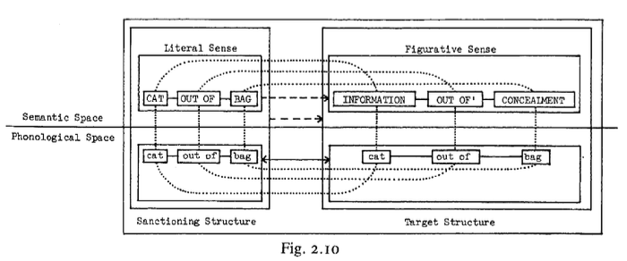

TS, ya que todas las especificaciones del primero están implícitas en el segundo, lo que simplemente las reduce a un mayor nivel de precisión \(cf\. 3•3\-3\)\. Me referiré a esta tendencia de una instanciación a absorber su esquema \(es decir, la equivalencia efectiva de \[\[A\]→ \[B\]\] y \[B\]\) como el __principio de transparencia esquemática\.__

## 93
LANGACKER, Ronald\. \(1987:93\)\.*Fundations of Cognitive Gammar*, V\.1 : *Theoretical Prerequisites, Stanford \(Cal\.\) *Stanford University Press\.

Capítulo 2

 Con estos antecedentes, podemos ofrecer una descripción preliminar de los numerosos factores que intervienen en una expresión idiomática típica\. Tomemos la expresión idiomática "the c a t \. out of the bag" \(presente tanto en "let the cat out of the bag" como en "the cat is out of the bag"\)\. Podemos simplificar ignorando aspectos como los artículos definidos, la analizabilidad de los morfemas componentes de "out of" y "into" y la posible discontinuidad de la expresión en el polo fonológico\. Los componentes y relaciones esenciales dentro de esta expresión idiomática se describen en la Fig\. 2\.10\.

Dado que esta expresión idiomática es un elemento léxico bien arraigado, toda la estructura de categorización tiene estatus de unidad, al igual que todos sus componentes\. La estructura sancionadora, a la izquierda, representa la expresión con su valor semántico literal \(relativo a un felino escapado de un saco\)\. Se compone de la combinación sintagmática de tres unidades simbólicas: gato, fuera de y bolsa, cada una definida por una correspondencia entre una estructura semántica y una fonológica\. Esta estructura sancionadora presenta una relación general de esquematización parcial con el objetivo, representando la expresión interpretada en su sentido figurado\. La estructura del objetivo también es sintagmáticamente compleja, compuesta por componentes simbólicos; en otras palabras, el modismo es hasta cierto punto analizable: a gato se le atribuye un significado aproximadamente equivalente a «información», fuera de tomado en uno de sus sentidos normales, y bolsa transmite una noción similar a «ocultación»\. 21

21\. Nada en el presente modelo requiere que gato y bolsa tengan estos valores fuera del contexto del modismo\.

## 94
LANGACKER, Ronald\. \(1987:94\)\.*Fundations of Cognitive Gammar*, V\.1 : *Theoretical Prerequisites, Stanford \(Cal\.\) *Stanford University Press\.

Capítulo 2

La relación general de esquematicidad parcial entre SS y TS se descompone en una relación sancionadora en cada polo\. En el polo fonológico, la relación es de identidad; la he simbolizado con una flecha sólida de dos puntas \(ya que la identidad equivale a la esquematicidad completa bidireccional\)\. Esta relación de identidad se puede resolver además en relaciones de identidad entre los componentes fonológicos individuales de SS y TS, así como en la identidad en su modo de integración\. La incompatibilidad de especificaciones, responsable de que la relación entre SS y TS sea de solo esquematicidad parcial, se localiza en el polo semántico \(la expresión ilustra la extensión semántica\)\. Esta relación global también se puede descomponer en relaciones locales, todas de esquematicidad parcial, entre los componentes semánticos correspondientes\. El grado de discrepancia es bastante variable: el conflicto en las especificaciones entre \[CAT\] e \[INFORMACIÓN\] es evidente: es difícil percibir similitudes; \[BOLSA\], sin embargo, guarda una relación natural y destacada con \[OCULTAMIENTO\]; y la diferencia entre \[FUERA DE\] y \[FUERA DE'\] es menor \(ámbito espacial vs\. abstracto\)\. La integración de unidades semánticas es paralela en SS y TS\.

## 94
LANGACKER, Ronald\. \(1987:94\)\.*Fundations of Cognitive Gammar*, V\.1 : *Theoretical Prerequisites, Stanford \(Cal\.\) *Stanford University Press\.

Capítulo 2

Compare este análisis con la doctrina de que un modismo es semánticamente inanalizable y constituye una secuencia fonológica fija \(cf\. Cap\. I\)\. En general, los modismos no son fonológicamente invariables \(aunque puede haber un orden lineal prototípico\), y la gran mayoría son analizables hasta cierto punto\.

La esencia de un modismo es un conjunto complejo de correspondencias, tanto simbólicas como entre componentes de los sentidos literal y figurativo\. Este complejo conjunto de interconexiones permite la identificación de un modismo a pesar de una considerable variabilidad fonológica \(cf\. 12\.2\.3\)\.

## 94
LANGACKER, Ronald\. \(1987:94\)\.*Fundations of Cognitive Gammar*, V\.1 : *Theoretical Prerequisites, Stanford \(Cal\.\) *Stanford University Press\.

Capítulo 2

2\.3\.2\.3\. *Relaciones sintagmáticas*\. La combinación sintagmática es la integración de dos o más estructuras componentes en el espacio semántico, fonológico o simbólico para formar una estructura compuesta de mayor tamaño en el mismo dominio\. La integración de dos estructuras simbólicas implica su integración tanto en el polo semántico como en el fonológico\. Aquí nos centramos en la integración en el polo semántico \(la integración fonológica es bastante análoga\)\.

La ​​integración depende de las correspondencias\. Para que dos estructuras semánticas se combinen sintagmáticamente, deben tener algún punto de superposición; más precisamente, una subestructura de una se coloca en correspondencia con una subestructura de la otra, y estas dos subestructuras se interpretan como la misma entidad concebida\. Es en virtud de tener una o más de estas entidades en común que dos estructuras componentes pueden integrarse para formar una conceptualización coherente y más elaborada\.

Consideremos la frase «*El gato está fuera de la bolsa*», tomada en su sentido literal\. Para simplificar y evitar problemas tangenciales, volveremos a centrarnos en "cat", "out of" y "bag" 22\. La figura 2\.11 diagrama la integración de sus polos semánticos en dos notaciones equivalentes\. El diagrama \(a\) es una representación compacta: la estructura compuesta se da solo implícitamente, a través de sus componentes y su modo de integración especificado\. En el diagrama \(b\), una representación expandida, la estructura compuesta se representa por separado, sobre los componentes, como un todo integrado\.

22\. La circunscripción también se ignora: out of se combina con bag en el primer nivel de circunscripción, y cat luego se combina con la estructura compuesta así derivada \(cf\. 8\.4\)\.

## 95
LANGACKER, Ronald\. \(1987:95\)\.*Fundations of Cognitive Gammar*, V\.1 : *Theoretical Prerequisites, Stanford \(Cal\.\) *Stanford University Press\.

Capítulo 2

95

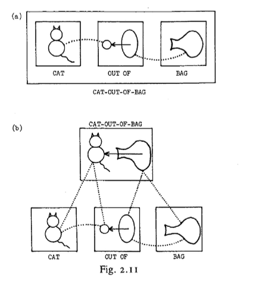

Las unidades semánticas \[CAT\] y \[BAG\] designan tipos particulares de objetos físicos, que, para los fines presentes, se representan adecuadamente mediante esquemas mnemotécnicos que representan sus especificaciones de forma\. \[OUT\-OF\], en cambio, es una predicación relacional\. Describe una configuración espacial que involucra dos objetos; la configuración resulta de que uno de los objetos sigue una trayectoria que va de una relación de "dentro" a una relación de "fuera" con respecto al otro\.

\[OUT\-OF\], por lo tanto, hace referencia inherente a dos objetos como parte de su propia caracterización, pero dentro de esta unidad semántica, estos objetos se especifican solo en términos muy esquemáticos \(uno debe poder funcionar como una especie de contenedor y el otro seguir una trayectoria espacial\)\. He utilizado un círculo y una elipse para representar estos objetos esquemáticamente caracterizados, y una flecha para la trayectoria presupuesta\.

Las líneas punteadas indican las correspondencias que integran las tres unidades semánticas para formar una estructura compuesta coherente\. \[OUT\-OF\] organiza la escena conceptual, estableciendo una relación entre dos objetos caracterizados esquemáticamente\. El objeto especificado con mayor precisión, designado por \[CAT\], corresponde a una de estas entidades esquemáticas, y el designado por \[BAG\] a la otra\. 2\.11\(b\)\.

## 96
LANGACKER, Ronald\. \(1987:96\)\.*Fundations of Cognitive Gammar*, V\.1 : *Theoretical Prerequisites, Stanford \(Cal\.\) *Stanford University Press\.

Capítulo 2

Dado que en cada caso existe una relación de esquematicidad completa entre las subestructuras correspondientes, la superposición de sus especificaciones produce una conceptualización compuesta completamente consistente, que se muestra en la parte superior de la Fig\.

Cuando se utilizan líneas de correspondencia para la combinación sintagmática, podemos denominarlas líneas de integración\. Pueden considerarse instrucciones para ensamblar dos estructuras, en particular, instrucciones para superponer las especificaciones de las entidades23 correspondientes\. 3 Por el contrario, las líneas pueden considerarse un registro de la distorsión que se produce cuando una conceptualización unificada se fragmenta con fines de codificación en componentes superpuestos, de modo que una misma entidad concebida se representa más de una vez\. Además de estas correspondencias horizontales, existen correspondencias verticales que equiparan los elementos de la estructura compuesta con cada una de las estructuras componentes, como se ilustra en la Fig\. 2\.1 I\(b\)\. Las líneas de correspondencia verticales suelen omitirse aquí para simplificar los diagramas, pero son esenciales para la estructura gramatical\.

23\. Cuando estas especificaciones entran en conflicto \(es decir, cuando la relación entre las subestructuras correspondientes es de esquematicidad parcial en lugar de total\), generan una discordia a la que los lingüistas se refieren como una "violación de las restricciones de selección"\.

