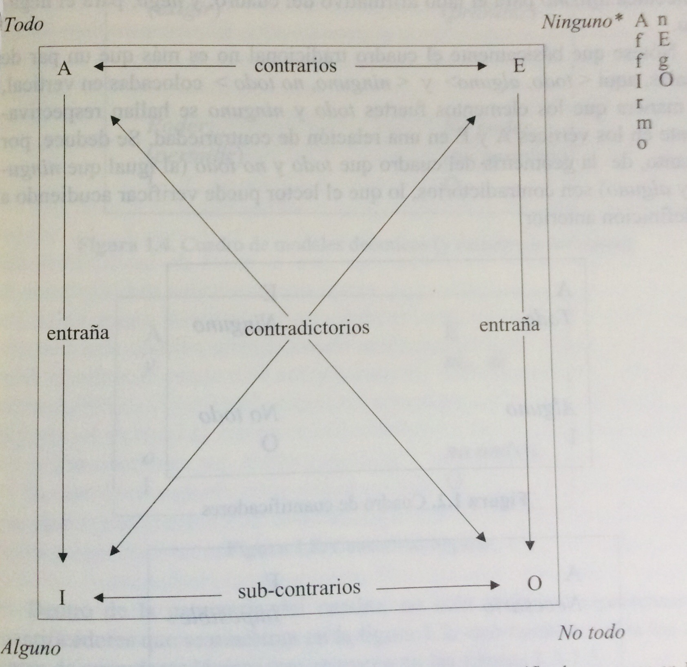

# Levinson 2004 Significados presumibles

## 23\-24
__LEVINSON, S\. C\. __\(2004 \(2000\):__23\-24__\)\.__ __*Significados presumibles\. La teoría de la implicatura conversacional generalizada*\. Madrid: Gredos\.

 __Introducción__

 Esta obra trata del significado, pero de una subsección bastante especial del significado general de los enunciados, de la penumbra pragmática que rodea el significado oracional: trata del significado de los enunciados\-tipo, no del significado de los enunciados\-muestra, que ha sido un punto esencial en los estudios de Pragmática\. Los significados de los enunciados\-tipo competen a las interpretaciones preferidas ―los *significados presumibles* del título del libro― que transportan la estructura de los enunciados, dada la estructura del lenguaje, y no en virtud de los contextos particulares de enunciación\.

*Un enunciado* es tan esquemático como un boceto de Rembrandt\. Dado el modo en que estamos diseñados y las convenciones culturales que caracterizan una lengua concreta y su despliegue apropiado, estamos inexorablemente destinados, por lo menos en la mayoría de los casos, a un entendimiento común\.

## 27\-28
__LEVINSON, S\. C\. __\(2004:__27\-28__\)\.__ __*Significados presumibles\. La teoría de la implicatura\.\.\.*

Los principios fundamentales incluso parecen sugerir que la recuperación de la intención del hablante a partir de lo que ha dicho es, en principio, imposible \(Levinson 1995b\)3 \. Libros como los de Sperber y Wilson \(1986\), Atlas \(1989\), Horn \(1989\) o las presente obra, que intentan explicar *en detalle* algunos de los procesos pragmáticos involucrados, son más o menos *palos de ciego*\. 

3\[Nota a pie de página\]:

El problema es que, mientras el hablante razona desde una intención hasta un medio verbal de alcanzar dicha intención, uno nunca puede invertir el razonamiento de las conclusiones a las premisas que lo produjeron por la simple razón de que siempre existen infinitas candidatas\. Dado que de hecho parece ser que sí realizamos inferencias correctas de este tipo, tiene que haber alguna limitación heurística al problema de espacio\. Pienso que estas heurísticas son de distintos tipos: las investigadas en la teoría de las ICGs, por ejemplo; así como los distintos tipos investigados en el análisis secuencial del discurso; las que dan origen a las ICPs\.

## 28
__LEVINSON, S\. C\. __\(2004:__28__\)\. *Significados presumibles\. La teoría de la implicatura\.\.\.*

 

Lo que he intentado hacer en la presente obra ha sido aislar una pequeña parte de este problema y argumentar que tiene que haber una poderosa heurística que nos proporcione interpretaciones preferidas sin demasiados cálculos\. De asuntos de la intención del hablante, el conocimiento enciclopédico de lo que se habla; o cálculos de los procesos mentales de otros\. Tales interpretaciones preferidas pueden ser invalidadas; y, sin lugar a dudas, complementadas, por cálculos de esta complejidad\. Sin embargo no parece plausible que la fenomenología de la interpretación determinada e instantánea pueda comprenderse únicamente por medio de razonamientos sobre cuestiones tales como __la potencialmente infinita regresión__ a o que el hablante esté pensando que el oyente pensará que el hablante está pensando y así *ad infinitum\.4*

Hasta ahora, los temas relacionados con el pensamiento cognitivo han desempeñado un papel explícito únicamente en una teoría pragmática: en la teoría de la Relevancia de Sperber y Wilson \(1986\), el destinatario infiere tanto como puede mediante el coste de procesamiento, siguiendo una mini\-máxima estrategia\.

4 Existen muchas indicaciones sobre cómo evitar esta regresión; en algunas versiones de la teoría del significado de Grice se evita por medio de una intención reflexiva \(autorreferecnial\) – el hablante busca el reconocimiento de esa intención\. Por ejemplo, Bach \(1987b\)

## 28
__LEVINSON, S\. C\. \(__2004:__28’__\)\. *Significados presumibles\. La teoría de la implicatura *__*\.\.\.*__

 De alguna manera, esto debe guardar alguna correlación general con la intención comunicativa del hablante\. No creo que el marco de Sperber y Wilson pueda ofrecer una explicación de los fenómenos que se discuten en este libro, precisamente porque las inferencias en cuestión son relativamente invariables a los cambios de contexto y a los supuestos básicos, a pesar de ser anulables \(esto es, se eliminan en presencia de suposiciones contrarias\)\. Es esta invariación relativa la que proporciona a estas inferencias su importancia *lingüística*, como proveedoras sistemáticas de los procesos semánticos y de cambio lingüístico, y creo que debemos conservar las valiosas observaciones que han recogido Horn \(1972, 1989\) y otros\.

Las consideraciones explícitas del procesamiento no entran en el marco que ofrecemos aquí, pero sí forman parte de su sustrato; __porque la naturaleza de las inferencias en cuestión como inferencias por defecto puede entenderse mejor, creo, sobre la base del procesamiento cognitivo__\. 

## 28\-29
__LEVINSON, S\. C\. \(2004:28\-29\)\. *Significados presumibles\. La teoría de la implicatura \.\.\.*__

 Partiendo de la *bibliografía* psicolingüística, la prueba es, hasta donde se nos permite llegar, que el oyente considera progresivamente la hipótesis sobre el significado —según va recibiendo las palabras, por así decirlo\. No parece probable que pudiera lograrse esto sin una poderosa heurística, porque habrá momentos iniciales en el procesamiento de proferencias en los que la información proposicional o clausal por inferir, simplemente no esté disponible todavía\. Por esta razón, la teoría de Sperber y Wilson no es psicolongüísticamente plausible, o por lo menos no es plausible en lo que respecta a los momentos iniciales del procesamiento de enunciados\. Por contra, parte de la heurística que se ofrecerá aquí puede seguir un procedimiento palabra a palabra— por ejemplo, un cuantificador escalar como alguno invocará, como mostraré, significados por defecto, incluso antes de que el predicado esté disponible\.

## 29\-30
__LEVINSON, S\. C\. \(2004:29\-30\)\. __*Significados presumibles\. La teoría de la implicatura \.\.\.*

 Permítanme que regrese ahora a la idea central que yace tras la presente obra, y que es sorprendentemente simple\. El hecho básico central, una observación de la teoría de la información, es que la codificación del discurso humano es relativamente lenta: el proceso de articulación fonética propiamente dicho es un cuello de botella en un sistema que, de otra forma, puede funcionar cuatro veces más rápido\. Es fácil observar la presión que esto ejerce en el lenguaje —un ejemplo, la presión para reducir las palabras frecuentes, documentadas hace tiempo \(v\.g\., por Zipf, 1949\)\. Zipf \(y, más recientemente, Horn, 1984, 1989\) vio el patrón resultante como un equilibrio entre dos fuerzas: el deseo de economizar del hablante y la necesidad por parte del oyente de información suficiente\. Esta tensión, bastante real, no es el centro de la presente obra\. En su lugar\. En su lugar, doy por sentada una especie de coincidencia de intereses, tomando la comunicación lingüística como un «juego de coordinación pura» en el sentido teórico de juego de Schelling \(1960\), una imagen que creo que Grice \(1957\) supuso: el hablante intenta encontrar un medio económico de hacer llegar unas ideas concretas al oyente, sabiendo que esto es exactamente lo que espera\. Entonces, la solución que propongo para este cuello de botella codificador es sencillamente ésta: dejamos que el mensaje sea portado no solo por el contenido, sino también por las propiedades metalingüísticas del enunciado \(esto es, por su forma\)\. O bien, encontremos un medio para que un significado lleve a cuestas otro significado\.

## 30
__LEVINSON, S\. C\. __\(2004:__30__\)\.__ __*Significados presumibles\. La teoría de la implicatura \.\.\.*

 ¿Cómo puede lograrse esto último? Solamente utilizando la forma, la estructura y el conjunto de opciones dentro del enunciado, para transmitir la información adicional que hay más allá del significado de sus constituyentes\. En consecuencia, aquí propongo tres simples heurísticas, las cuales servirán para ampliar el contenido enunciado:

1. Si se ha construido el enunciado usando formas simples, breves y no marcadas; está indicándose que no hay nada especial, que la situación descrita tiene todas las propiedades esperadas, estereotípicas\.
2. Si, por el contrario, se ha construido el enunciado usando formas marcadas, prolijas, o poco comunes; lo que señala es que la situación descrita es en sí misma poco común, inesperada, o con propiedades especiales\.
3. Cuando un enunciado contiene una expresión seleccionada entre un grupo de expresiones opuestas, se admite que las expresiones escogidas describen un mundo que por sí mismo contrasta con aquellos mundos rivales que habrían sido descritos por las expresiones opuestas\.

## 30\-31
__LEVINSON, S\. C\. __\(2004:__30\-31__\)\.__ __*Significados presumibles\. La teoría de la implicatura \.\.\.*

Esta descripción es imprecisa, naturalmente\. Sin embargo, a lo largo de las siguientes líneas uno puede imaginarse un tratamiento formal de este desarrollo del significado\. Dejemos que la información metalingüística controle el modelo mediante el cual se interpreta el enunciado; dejemos que escoja, del conjunto de mundos posibles, un subconjunto apropiado que tenga los tipos y propiedades señaladas por las propiedades metalingüísticas del enunciado; dejemos que determine el dominio del discurso; dejemos que restrinja los modelos a uno por el cual se obtengan ciertas propiedades adicionales…El punto esencial aquí es que no se proponen principios especiales, exóticos, hermenéuticos; un examen metalingüístico por parte del destinatario de la forma de un enunciado, que incluye la consideración de las opciones prominentes, será suficiente para ampliar el contenido de las expresiones y liberar la presión del cuello de botella codificador; sabiendo esto, el hablante se halla obligado a ajustarse a la misma heurística\.

## 31
LEVINSON, S\. \(2004 \(2000\): 31\)\. *Significados presumibles\. La teoría de la implicatura *…

* *Las teorías del significado son tan distintas y dispersas que quizá al lector le sirva de ayuda conocer cuál es la posición del autor respecto a unas cuestiones que exceden lo tratado en este libro\. Así que déjenme que les descubra mis cartas:

1\. La distinción entre Semántica y Pragmática es una entre un número de distinciones esenciales en el estudio del significado; tal vez a la larga la distinción se disuelva en un grupo mayor de distinciones, pero no ganamos nada agrupándolas en nuestro intento de comprender la comunicación humana\.

2\. No debe confundirse la Semántica con la «estructura conceptual» ni con el «lenguaje del pensamiento»; la semántica de una lengua es un fenómeno específicamente lingüístico, y su proyección a partir de un «lenguaje del pensamiento», una relación nada evidente entre estructuras anisomorfas \(Levinson 1977\)\.

3\. Los aspectos de contenido semántico \(normalmente sólo cuando se enriquecen con especificaciones pragmáticas\) pueden determinarse por medio de una definición recursiva de verdad, pero es poco probable que tenga un equivalente cognitivo directo\. Considérese la analogía con la visión: podemos especificar objetivamente la relación entre el mundo que vemos y las señales que llegan al córtex visual, y comparar con la experiencia visual subjetiva\. Sin embargo, esta proyección psicofísica no siempre preserva la verdad: hay numerosas condiciones bajo las cuales vemos cosas que no existen, etcétera —el conjunto de ilusiones que los psicólogos estudian como parte central de su trabajo\. De modo similar, la semántica vercondicional, considerada de forma realista— como proyección veritativa directa de estructuras semánticas a partir de estados de cosas \(evitando tener que usar la cabeza, por así decirlo\) →

## 31\-32
LEVINSON, S\. \(2004 \(2000\): 31\-32\)\. *Significados presumibles\. La teoría de la implicatura *…

3’\. es útil como patrón de comportamiento humano\. Los procesos cognitivos deben hacer algo como esto, pero al igual que en el caso de las ilusiones visuales, puede que no lo hagan, y *cómo* lo hacen generalmente no guardará ninguna relación con el mecanismo de la semántica vericondicional\. Por lo tanto, si que podemos tenerlo todo\. Podemos servirnos *de las *revelaciones de pa semántica vericondicional sin tener que aceptar la exigencia del realismo, y sin importarnos si obviamente no puede ajustarse a algún criterio de adecuación como modelo\. Es un poco como comprar un par de zapatos nos queden bien o no, es una cuestión subjetiva\.

4\. No existe algoritmo que, dada la cadena sintáctica en una lengua, ponga en funcionamiento su forma lógica exclusiva o estructura semántica\. El punto de vista de que existe tal algoritmo ha sido el fundamento de mucha teorización lingüística, desde Montague hasta las más recientes posiciones de Chomsky\. Sin embargo, mantener tal perspectiva es a todas luces absurdo\. __Primero__ esta la __enorme cantidad de ambigüedades__ del lenguaje natural \(que requieren al menos una correspondencia uno\-a\-muchos\)\. __Segundo__, las estructuras sintácticas pueden ser realmente indeterminadas en ciertos aspectos… __Tercero__ la resolución __pragmática es crucial ante la interpretación semántica o la asignación de estructura semántica:__ nadie disputa aquí el papel de la deixis, pero hay otros muchos aspectos de la resolución pragmática desde la determinación de la __referencia anafórica__ hasta la asignación del alcance\. 

## 32\-33
__LEVINSON, S__\. \(2004 \(2000\): __32\-33__\)\. *Significados presumibles\. La teoría de la implicatura *…

4’\. La imagen general recogida por Sadock \(19991\) o Jackendoff \(1977\) aquí es cuando menos correcta: __Fonología, Sintaxis y Semántica__ son áreas cada una con sus propias capacidades generativas, y hay equilibrios significativos entre las cadenas estructurales de cada representación, que al final, acaban siendo asociadas unas con otras\. Lo que relaciona unas con otras son reglas de correspondencia o procesos sin un carácter determinante\. Jackendoff sugiere que el modelo de las unidades léxicas no es en principio diferente: son correspondencias entre representaciones fonológicas, sintácticas y semánticas; pero las correspondencias pueden ser parciales y no de tipo uno\-a\-uno \(considérense las expresiones idiomáticas, o la desigualdad entre palabras fonológicas y sintácticas\)\.

5\. En la medida en que podamos llegar directamente desde las estructuras sintácticas y el material léxico a la representación semántica \(que en su mayor parte, mi punto de vista, no podemos\), las representaciones semánticas solo están parcialmente especificadas, *son plantillas* de información parcial demasiado inespecíficas para determinar condiciones de verdad\.

## 33
__LEVINSON, S\.__ \(2004 \(2000\): __33__\)\. *Significados presumibles\. La teoría de la implicatura *…

6\. El papel global que cumple la Pragmática en tal esquema es esencialmente diferente de ese bosquejado en los manuales \(incluyendo el mío de 1983\)\. No existe tal esquema que proyecte estructuras sintácticas sobre estructuras semánticas que por si mismas representan proposiciones con todas las de la ley, y que son el *inpu*t* *de la Pragmática, la cual proporciona inferencias adicionales o restricciones de significado\. Más bien, los procesos pragmáticos cumplen un papel crucial en las reglas de correspondencia que proyectan estructuras sintácticas sobre representaciones semánticas; y, a su vez, proyectan representaciones semánticas sobre pensamientos comunicados o significados de enunciado\.

 El esquema de significado global del significado que surgirá de este libro es así radicalmente diferente del punto inicial del que partió la pragmática griceana\. La distinción entre semántica y pragmática fue interpretada desde la teoría estándar como la distinción entre significado de la oración y significado del enunciado, siendo el *output* de la semántica el *input* de la pragmática… esto no puede ser correcto\. En su lugar, bajo mi punto de vista, deberíamos dejar de pensar en la distinción en cuanto a niveles de representación\. En su lugar, deberíamos pensar en ambas, Semántica y Pragmática, como procesos constituyentes que ofrecen sus propias contribuciones diferenciadas en un único nivel de representación\. __Los procesos se mantienen bien separados, y por ello debe conservarse la distinción entre Semántica y Pragmática__\.

## 35
__LEVINSON, S\. \(__2004 \(2000\): __35\)\. __*Significados presumibles\. La teoría de la implicatura *…

 Capítulo I __Implicatura Conversacional Generalizada\. __

1\.0\. LA ARGUMENTACIÓN 

En este capítulo intento defender la noción de la *implicatura conversacional generalizada* \(ICG\) donde lo que se juega es la naturaleza generalizada de tales inferencias\. __Una implicatura generalizada es, realmente, una inferencia por defecto, aquella que recoge nuestras intuición sobre una interpretación preferida o normal__\. Hoy en día la noción de interpretación preferida no goza de una especial actualidad en la teoría del lenguaje…

En defensa de esta noción, desarrollo una serie de argumentos tanto positivos como negativos\.

Primero, repensando el programa de Grice, vemos que tal idea… era parte central de sus inquietudes… parecen perfectamente válidas hoy día\. Segundo, afirmo que una fuente de la actual resistencia teórica de las ICGs es un esquema global simplista de la comunicación, dentro del cual no cabe una teoría de la interpretación preferida\. Contra él sostengo que hay unos indicios aplastantes sobre la necesidad de una teoría como esta…

## 36
__LEVINSON, S\.__ \(2004 \(2000\): __36__\)\. *Significados presumibles\. La teoría de la implicatura *…

Seguidamente, me encargaré de algunos estudios recientes sobre las implicaturas que no dejan lugar para una noción de implicatura generalizada: la teoría de la Relevancia de Sperber y Wilson \(1986, 1995\) y de las teorías de la implicatura basadas en el concepto de «acomodación» de Lewis \(1979\), que han sido desarrolladas por Hobbs \(1987\) y Thomason \(1990\)\. Según estas teorías, dada la gran abundancia de supuestos básicos, todas las implicaturas son materia de inferencia ocasional \(esto es, válida una única vez\) hacia la interpretación mejor \(como quiera que esta se defina\)\. Semejantes teorías, desde mi punto de vista, simplemente no pueden hacerse cargo de los fenómenos que son clave en una teoría de las ICGs\.

Como argumento final a favor del concepto de ICG, repito las observaciones de Horna ceca de ciertos tipos de ICG bloquean sistemáticamente la lexicalización de ciertos conceptos\. Dado que estas observaciones tienen una inmensa regularidad y una generalidad interlingüística, es realmente bastante inconcebible que cualquier otra cosa que no pertenezca a la especie de las interpretaciones preferidas y generalizadas pudiera ser responsable de ello\.

 

__LEVINSON, S\. \(__2004 \(2000\): __3__7__\)\. __*Significados presumibles\. La teoría de la implicatura *…

EL PROGRAMA DE GRICE

 Gran parte de los argumentos de este libro se desarrolla bajo la aceptación de lo que denominaré el paraguas griceano, un acercamiento general al estudio del significado y la comunicación…Primero, una teoría de la comunicación tiene como objetivo el ámbito completo del *significado no\-natural *\(significado nn\) de Grice \(1957\), donde se integran los efectos comunicativos derivados de un tipo especial de intención reflexiva y compleja\. Grice sugirió que un hablante H quería decirnn algo a través de *x* si y solo si H «pretendiera que la enunciación de x produjera algún efecto sobre una audiencia por medio del reconocimiento de esa intuición» \(1957, pág\. 385\)\.\.Grice también expresó el significado nn de una forma más explícita, como se esquematiza en el ejemplo \(1\)

__LEVINSON, S\. \(__2004 \(2000\): __3__7\-38__\)\. __*Significados presumibles\. La teoría de la implicatura *…

EL PROGRAMA DE GRICE

1. Teoría de Grice del significado emisor:

H *quiere decir* nn p por medio de la emisión de E a O sii H intenta:

1. que O piense p
2. que O reconozca que H pretende \(a\)
3. el reconocimiento por parte de O de que H pretende que \(a\) sea la razón principal para que H crea p

Llamaremos *intensión\-s *\(de «intensión de significar»\) a este tipo particular de intención; una de sus propiedades interesantes es que es una intención que se consigue o satisface simplemente por ser reconocida… *Basta* aquí simplemente con que el significado \(o algo parecido\) traza una barrera exterior en los efectos comunicativos que son responsabilidad de una teoría de la comunicación\.

## 38
__LEVINSON, S\.__ \(2004 \(2000\): __38__\)\. *Significados presumibles\. La teoría de la implicatura *…

 El PROGRAMA DE GRICE

 El segundo aspecto del paraguas griceano que es importante aquí es la afirmación de que el significado no es homogéneo\. En su lugar, dentro del círculo de las intenciones\-s delimitadas, podemos distinguir numerosos géneros y especies de significado diferentes\. El propio Grice sugiere que el pastel semiótico podría cortarse como en \(2\)\.

\(2\) géneros y especies de significado nn 

SIGNIFICADO TOTAL de un enunciado

Lo que SE DICE lo que SE IMPLICA

 CONVENCIONALMENTE  CONVERSACIONALMENTE

 GENERALIZADA PARTICULARIZADA

## 39
__LEVINSON, S\.__ \(2004 \(2000\): __39__\)\. *Significados presumibles\. La teoría de la implicatura *…

  __ EL PROGRAMA DE GRICE__

 Como punto de referencia, permítanme recapitular brevemente las máximas de Grice…

Principio de Cooperación

«Haz que tu contribución a la conversación sea la necesaria en el momento en que se da, de acuerdo con el propósito o dirección aceptado dentro del intercambio conversacional en el cual estás comprometido» \(Grice, 1989: 26\)

Máxima de Calidad

«Trata de hacer que tu contribución sea verdadera», concretamente:

«No digas lo que creas que es falso»

«No digas aquello de lo que no tengas pruebas suficientes» \(Grice, 1989:27\)

Máximas de Relación \( Relevancia\)

CI: «Haz tu contribución tan informativa como se requiera \(para el propósito del intercambio\)»

C2: «No hagas tu contribución más informativa de lo necesario» \(Grice, 1989: 26\)

Máximas de Modo

M1: «Evita la oscuridad de expresión»

M2: «Evita la ambigüedad»

M3: «Sé breve \(evita la prolijidad innecesaria\)»

M4: «Sé ordenado» \(Grice, 1989: 27\)

## 40\-41
__LEVINSON, S\.__ \(2004 \(2000\): __40\-41__\)\. *Significados presumibles\. La teoría de la implicatura *…

 __El Programa de Grice__

Grice define la implicatura conversacional como sigue…

Al decir p, el emisor E implica conversacionalmente q sii:

1. Se supone que E está siguiendo las máximas\.
2. Se requiere la suposición q para mantener \(1\)\.
3. E cree que el receptor se dará cuenta de \(2\)

\(La distinción que hace Grice entre decir e implicar se cumplió a causa de su noción de implicatura convencional…\)

 Como resultado de esta derivación inferencial, las implicaturas conversacionales presentan necesariamente varias propiedades distintivas:

- *Cancelabilidad* \(esto es, anulabilidad\) la propiedad de ser una inferencia anulable por medio de premisas…
- *Inseparabilidad *cualquier expresión con el mismo contenido codificado tenderá a desencadenar las mismas implicaturas \(tiene que hacerse una excepción por principio para las implicaturas de Modo\)\.
- *Calculabilidad* la derivación más o menos transparente de la inferencia a partir de premisas que incluyen la presunción de actividad conversacional racional\.
- *No convencionalidad* la naturaleza no codificada de las inferencias y su dependencia parásita de lo que es codificado\.

## 41
__LEVINSON, S\.__ \(2004 \(2000\): __41__\)\. *Significados presumibles\. La teoría de la implicatura *…

* *__El programa de Grice__

A la lista de Grice podemos añadir:

*•Reforzabilidad —* a menudo es posible añadir explícitamente lo que de todas formas se implícita, con menos sentido de redundancia que si uno repitiera el contenido codificado \(Sadock, 1978; Horn, 1991b\)

*•Universalidad — *con las inferencias se derivan en el fondo de consideraciones fundamentales de racionalidad, confiamos en una fuerte tendencia a la universalidad \(a diferencia de los significados codificados, por supuesto\); las implicaturas conversacionales son motivadas, no arbitrarias\.

__\+ /‑__ para expresar «implica conversacionalmente»

«__O» \+ > ‘p’__ para expresar ‘la enunciación de la oración O \(normalmente, o en el contexto dado\) implicará conversacionalmente que el hablante sabe \(o cree, o considera probable\) la proposición p’\.

__ICG:__ implicatura conversacional generalizada

__ICP:__ implicatura conversacional particularizada\.

## 42
__LEVINSON, S\.__ \(2004 \(2000\): __42__\)\. *Significados presumibles\. La teoría de la implicatura *…

* *__El programa de Grice__

 Grice \(1975: 56y s\) solo proporciona la siguiente caracterización de la diferencia entre implicaturas conversacionales particularizadas y generalizadas \(o ICP vs\. ICG\): al decir p\. Una ICP «no dejaría margen a la idea de que NORMALMENTE se desencadena una implicatura de este tipo al decir esa p»; mientras que en el caso de una ICG «uno puede decir que el uso de ciertas formas de palabras en un enunciado normalmente \(en AUSENCIA de circunstancias especiales\) desencadenaría tal o cual implicatura»\.\.Las siguiente formulación informal recoge, creo, este propósito\.

 \(3\) La distinción entre las ICPs y las ICGs:

1. Una implicatura i del enunciado E *es particularizada* sii E implica i solo en virtud de suposiciones contextuales específicas que no obtendría siempre, ni siquiera normalmente\.
2. Una implicatura i es *generalizada* sii E implica i a menos que haya suposiciones contextuales específicas inusuales que la anulen\. 

La intuición sobre la que se basa la oposición entre las ICPs y las ICGs puede ser mostrada con un simple ejemplo\. Considérese la oración *Algunos de los invitados están marchándose ya * \[*Some of guests are already leaving\], y considérese que podría ser proferida en dos contextos bastante distintos\.*

 

## 42\-43
__LEVINSON, S\.__ \(2004 \(2000\): __42\-43__\)\. *Significados presumibles\. La teoría de la implicatura *…

* *__El programa de Grice__

\(4\) Contexto 1:

 A: «¿Qué hora es?»/ \[«Qhat time es it?»\]

 B: «Algunos de los invitados están marchándose ya»/ 

\[«Some of the guests are already leaving»\]

ICP: ‘Debe ser tarde’ / \[‘It must be late’\]

ICG: ‘No todos los invitados están marchándose ya’

 \[Nota ll of the guests are leavisng’\]

\(5\) Contexto 2:

 A «¿Dónde está Jhon?» / \[«Were in Jhon»\]

 B: «Algunos de los invitados están marchándose ya»

 \[«Some of the guests are already leaving»\]

 ICP: ‘Quizá Jhon se ha marchado ya’

 \[‘Perharps Jhon has already left’

 ICG ‘No todos los invitados están marchándose ya’

 

 *Lógicamente*, en los dos contextos la forma del enunciado «Algunos de los invitados están marchándose ya» desencadena distintas implicaturas »—se usan como una respuesta parcial a preguntas diferentes y, consecuentemente, implica proposiciones distintas\. Estas ICPs pueden atribuirse a la máxima de Relevancia \(o Relación\), interpretada como un principio de asistencia a los objetivos o planes del interlocutor \(Holdcroft 1987, Levinson 1987ª, Thomanson 1990\)\.

## 43\-44
__LEVINSON, S\.__ \(2004 \(2000\): __43\-44__\)\. *Significados presumibles\. La teoría de la implicatura *…

* *__El programa de Grice__

… Sin embargo, en ambos contextos hay también una inferencia compartida —concretamente, que no todos los invitados se encuentran en el proceso de marcharse\. Esta inferencia tiene un valor totalmente general: cualquier enunciado con la forma «Algunos x son G» tendrá la interpretación por defecto « No todos los x son G», siempre que el resto de los elementos sean iguales\. Uno podría sentirse tentado a pensar que esto es parte del significado de *algunos*, pero la compatibilidad semántica entre *algunos*, pero *no todos, x son G* parece descartar esta explicación\. Es este tipo de inferencia, en virtud de su predominio y falta de pertinencia, el que tiene la conexión cercana al análisis lingüístico y a su análisis erróneo, y constituye el punto central de este libro\.

 *El tratamiento* que hace Grice de la distinción entre implicaturas generalizadas y particularizadas no es, desafortunadamente, muy extenso…

## 48
__LEVINSON, S\.__ \(2004 \(2000\): __48__\)\. *Significados presumibles\. La teoría de la implicatura *…

* *__El programa de Grice__

 El interés de Grice al desarrollar estos argumentos era sugerir que, aunque a primera vista puede parecer que estas inferencias son parte del significado convencional de las conectivas, quizá ese no sea el caso\. Por lo tanto es posiblemente mantener un análisis lógico relativamente simple del significado de las conectivas, explicando que la divergencia sistemática en el uso ordinario es debida a implicaturas conversacionales *generalizadas*\. El hecho de que las inferencias *normalmente* acompañan a las conectivas el que provoca la tentación de verlas como parte del contenido codificado, con todos los errores analíticos que surgirán\. Es esta tendencia de interpretación habitual general y por defecto la que hace que no veamos que lo que estamos tratando en esta punto es una simple inferencia pragmática\. De ahí que solo todo el argumento tiene fuerza, si podemos darle sentido a la noción de implicatura conversacional generalizada\. Grice vio que este tipo de análisis tenía una aplicación general para el significado léxico: propuso \(1989: 47\-48\) una modificación de la navaja de Occam para mostrar que «los sentidos no deben multiplicarse más allá de lo necesario», y sugirió en cambio que siempre deberíamos preferir una análisis en el que una palabra «tenga un sentido menos restrictivo, en lugar de uno más restrictivo», donde las interpretaciones más restrictivas pueden conseguirse a partir de «una implicatura superpuesta»\.

NOTA VA: En las UF las interpretaciones son TOTALMENTE RESTRICTIVAS: Institucionalización mediante\.

## 48\-49
__LEVINSON, S\.__ \(2004 \(2000\): __48\-49__\)\. *Significados presumibles\. La teoría de la implicatura *…

* *__El programa de Grice__

 …Dondequiera que nos enfrentemos a una expresión lingüística que es en apariencia sistemáticamente ambigua deberíamos considerar la posibilidad de que el análisis correcto es, de hecho, un sentido unívoco y sistemáticamente amplio, con un conjunto de restricciones pragmáticas generalizadas anulables\. Si las restricciones fueran *ad hoc*, variando de contexto en contexto no habría ninguna tentación de reivindicar una ambigüedad \(múltiple\)\. No obstante, si las restricciones pragmáticas pueden constituir una interpretación preferida —esto es, una tendencia sistemática a leer una expresión de una forma particular—, entonces surge la tentación y es aquí donde la teoría de la ICG tiene más razones para contribuir al análisis lingüístico\.

## 49
__LEVINSON, S\.__ \(2004 \(2000\): __49__\)\. *Significados presumibles\. La teoría de la implicatura *…* *

Tres estratos contra dos en la teoría de la comunicación

 Como ya he mencionado, en los trabajos más recientes existe tanto un abandono como una hostilidad hacia la noción de interpretación preferida o por defecto\. \[Nota 10 a pie de pág\. “Naturalmente, hay excepciones; destacan las de neogriceanos como Bach \(1984, 1995\) en filosofía del lenguaje, o Horn \(1994\) y Huang \(1995\) en Lingüística\]\. El origen de esta resistencia a dicha idea parece encontrarse en algunos supuestos bastante implícitos, considero que inadecuados, sobre la naturaleza de una teoría global de la comunicación\. A la hora de intentar entender el lugar que ocupan las ICGs en una teoría de la comunicación, es esencial hacer explicitas tales suposiciones\.

Creo que Grice tenía mucha razón al pensar en el significado como una noción compuesta; esto es, pensaba acertadamente que el significado completo de un enunciado solo podría obtenerse distinguiendo un gran número de clases diferentes de contenidos —incluso el contenido codificado se dividía en «lo dicho» y «lo implicado convencionalmente» \(y más tarde añadió «lo presupuesto»\); mientras que el contenido inferido era divisible en implicaturas particularizadas y generalizadas, y quizá también en un conjunto heterogéneo de inferencias, y quizá también en un conjunto de otros tipos inferencias\. Pienso que este reconocimiento de la naturaleza heterogénea del significado marcó una avance fundamental en la teoría del significado —sin embargo, otros de temperamento holista \(p\.e\., en la así llamada lingüística cognitiva\) consideran la gran variedad de mecanismos propuestos como un signo de fracaso prematuro\.

## 49\-50
__LEVINSON, S\.__ \(2004 \(2000\): __49\-50__\)\. *Significados presumibles\. La teoría de la implicatura *…* *

Tres estratos contra dos en la teoría de la comunicación

Podemos admitir sin problemas la ventaja de los principios explicativos parcos donde parecen poten*cialmente* suficientes, pero está bastante claro que el significado \(en general concebido como el ámbito completo del significado nn\) no es un campo unitario sino más bien un campo que comprende principios cognitivos, factores del conocimiento, y principios interaccionales, y sin duda mucho más…\.Seguramente desearíamos estar deseando considerar que la inferencia pragmática es el resultado de una serie de principios pragmáticos bastante diferentes\.

 Dentro de la teoría compuesta del significado, la teoría de las ICGs solo desempeña un pequeño papel en una teoría general de la comunicación\. A este respecto la teoría de las ICGs no compite directamente con teorías holistas como la teoría de la Relevancia de Sperber y Wilson, que intenta reducir todo tipo de inferencia pragmática a un mega\-principio —la teoría de las ICGs simplemente no es una teoría general de la competencia pragmática humana\. En su lugar, trata de dar cuenta de un área relativamente pequeña de la inferencia pragmática\.

## 50
__LEVINSON, S\.__ \(2004 \(2000\): __50__\)\. *Significados presumibles\. La teoría de la implicatura *…

__El programa de Grice  __Tres estratos contra dos en la teoría de la comunicación

La importancia teórica de esa área deriva de la naturaleza generalizada y estable, de tales inferencias, que consecuentemente mantienen interacciones mucho más cercanas con el cuerpo estable de las reglas de formación y construcción que forman un sistema gramatical\. El punto que debe enfatizarse es que una teoría de las ICGs ha de complementarse con una teoría de las ICPs, que tendrá por lo menos la misma, y es posible que considerablemente mas, importancia para una teoría general de la comunicación\. Es solo para la teoría *lingüística* para la que las ICGs tienen una importancia incomparable\.

…De acuerdo con la tendencia estándar \(a menudo mas supuesta que justificada\), para una teoría de la comunicación solo existen dos niveles: un nivel del significado de la oración \(que ha de explicarse mediante la teoría gramatical en sentido amplio\) y un nivel del significado del hablante \(que debe explicarse mediante una teoría pragmática, quizá empleando como central la noción de significado nn  de Grice11

11Entiéndase aquí el significado del hablante exclusivamente —esto es, como significado del hablante menos el significante de la oración \(por supuesto, en la teoría de la comunicación de Grice, ambos, «lo que se dice» y «lo que implica», son parte *ceteris paribus* \[‘En condiciones parejas’ \(N\. De los tt\) del significado nn y de este modo se incluyen en el significado del hablante\)\. De forma similar, emplearé ‘significado del enunciado\-tipo’ como una manera de referirme al significado que no es significado convencional ni *únicamente* significado del hablante \(aunque siguiendo el esquema griceano el hablante quiere decirlo\), sino la estructura del enunciado lo sugiere\. 

## 51
__LEVINSON, S\.__ \(2004 \(2000\): __51__\)\. *Significados presumibles\. La teoría de la implicatura *…* *

Tres estratos contra dos en la teoría de la comunicación

…El significado del hablante, o el significado del enunciado\-muestra, será un asunto del momento concreto o de las inferencias válidas una única vez en contextos concretos, realizadas por receptores concretos con todas sus variadas particularidades\. Este punto de vista estándar, aunque parsimonioso, es seguramente inadecuado, y de hecho potencialmente peligroso, porque subestima la regularidad, la recurrencia, y sistematicidad de muchos tipos de inferencias pragmáticas\.

 Lo que omite el punto de vista estándar es un tercer estrato, que podemos llamar el nivel del significado de la aseveración o del significado del enunciado, o como lo denomino…significado del enunciado\-tipo\. Este tercer estrato es un nivel de inferencia pragmática basada *no* en un cálculo directo de las intenciones del hablante, sino más bien en las expectativas generales sobre cómo se usa normalmente el lenguaje\. Estas expectativas dan origen a suposiciones, a inferencias por defecto sobre el contenido y la fuerza; y es en este nivel \(si ha de ser alguno\) donde podemos hablar razonablemente de los actos de habla, presuposiciones, implicaturas conversacionales, condiciones de felicidad, presecuencias conversacionales, organización preferente, etcétera; y de especial interés para nosotros, de las implicaturas conversacionales generalizadas\. Es también en este nivel, naturalmente, donde podemos esperar la sistematicidad de la inferencia que podría estar perfectamente interconectada con la estructura y el significado lingüísticos, hasta el punto de que resultara problemático decidir qué fenómeno debería ser atribuido a la teoría semántica y cuál, a la pragmática \(vid\. las largas discusiones sobre el estatus semántico o pragmático de la fuerza ilocutiva y la presuposición\)\.

## 51\-52
__LEVINSON, S\.__ \(2004 \(2000\): __51\-52__\)\. *Significados presumibles\. La teoría de la implicatura *…* *

Tres estratos contra dos en la teoría de la comunicación

 La hipótesis de este tercer estrato intermedio en una teoría de la comunicación no es nada nueva\. Está claro que Austin \(1962: 100 y ss\.\), por ejemplo, tenía en mente algo por el estilo cuando propuso la distinción triple entre los actos locutivos, ilocutivos y perlocutivos\. El nivel locutivo corresponde al nivel del significado de la oración; el ilocutivo, a nuestro estrato intermedio formado por convenciones o hábitos de uso; y el perlocutorio \(en parte\), al nivel del significado del hablante \(i\.e\., las intenciones del hablante para conseguir que el destinatario crea o haga algo como consecuencia del enunciado emitido\) \. Otros teóricos han tratado de defender enérgicamente la noción de una *convención de uso*, que debe distinguirse de una *convención de lengua*; por ejemplo, tal distinción parece esencial si hemos de conservar la idea de que los actos de habla indirectos son a la vez parcialmente convencionales e inferencialmente motivados \(Searle, 1975; véase también Bach y Harnish, 1979: 192\-202, para *estardarización* como concepto opuesto a la *convencionalización* de un uso no literal\)\. Si no admitimos la existencia de dicho estrato intermedio, ¿cómo vamos a explicar el uso de las formulas rutinarias \(como Buena suerte, ¡Jesús\! \[ante un estornudo\], Hasta luego\)\. Aunque significan lo que literalmente significan, simultáneamente cumplen rituales diarios habituales \(Morgan 1978\)?

## 53
__LEVINSON, S\.__ \(2004 \(2000\): __53__\)\. *Significados presumibles\. La teoría de la implicatura *…* *

Tres estratos contra dos en la teoría de la comunicación

 La teoría de las ICGs no es, por supuesto, una teoría de las expresiones idiomáticas convencionales, clichés, ni fórmulas, sino que es una *teoría generativa de la idiomaticidad* —esto es, un grupo de principios que guía la elección de la expresión adecuada para sugerir una interpretación específica y, como un corolario, es una teoría que da cuenta de las interpretaciones preferidas\. La teoría de las ICGs ofrece un estudio sistemático de por qué, por ejemplo, al decir «Te veo el martes» \[«See you on Tuesday»\] cuando mañana es martes sugeriría que no te veré mañana; o por qué decir «Algunos de mis colegas son competentes» \[«Some of my colleagues are competent»\] sugeriría que no todos ellos lo son, etcétera\. Marcando de un modo de decir las cosas con una interpretación preferida en cada caso\. Por lo tanto, la teoría pertenece al nivel intermedio de una teoría de la comunicación, al estrato del significado del enunciado\(\-tipo\)\. 

## 53\-54
__LEVINSON, S\.__ \(2004 \(2000\): __53\-54__\)\. *Significados presumibles\. La teoría de la implicatura *…* *

Tres estratos contra dos en la teoría de la comunicación\.

 Una pregunta que surge es si las ICGs son lo mismo que otro tipo de inferencias pragmáticas que podrían pertenecer a este novel\. En primer lugar, quizás hay más tipos generales de inferencias que podrían contener en la misma categoría a las ICGs, y que también se sitúan entre las convenciones de la lengua por un lado, y la verdadera inferencia ocasional del significado de la lengua por otro\. Por ejemplo Bach ha propuesto la idea de una inferencia estandarizada que «provoca un cortocircuito en los pasos de las inferencias, tanto las pretendidas por el hablante como las llevadas a cabo por oyente» \(Bach, 1975: 235, 1995\) tales inferencias se llevan a cabo por defecto, sin un cálculo completo\. No obstante, la noción de Bach se apoya en la comprensión por lo precedente \(1995:685\), y las ICGs, al menos como yo las concibo, son generativas, guiadas por una heurística general y no dependientes de la rutinización\. En segundo lugar, hay nociones más específicas que a primera vista uno podría querer igualar con las ICGs, pero no debería\. Una de éstas, la noción de implicatura cortocircuitada \(Brown y Levinson, 1987 \[1978\-\-\-\+: 290, n\-35; Morgan, 1978; Horn y Bayer, 1984\), ha sido desarrollada para tratar un fenómeno muy específico, que también surge de la *rutinización*, por medio de la cual los enunciados adquieren marcadores morfosintácticos de su contenido implicado \(por ejemplo los actos de habla indirectos y las construcciones de ascenso de la negación\.

## 54
__LEVINSON, S\.__ \(2004 \(2000\): __54__\)\. *Significados presumibles\. La teoría de la implicatura *…

Tres estratos contra dos en la teoría de la comunicación\.

Finalmente, varios teóricos han argumentado que no todas las inferencias guiadas por el razonamiento griceano son una implicatura propiamente dicha: pueden ser una explicatura \(Sperber y Wilson, 1986\) o una implicatura \(Bach, 1994\), y quizá se piense que las ICGs pertenecen a una de estas categorías\. Estas se conciben esencialmente como el desarrollo de lo que se ha expresado \(por lo tanto, los enunciados solo poseen una de ellas, pero puede que tengan muchas ICGs\)\.\.\.

 De este modo, encontramos un número de diversos fenómenos que a la vez pertenezcan a este estrato intermedio en una teoría de la comunicación\. Sin embargo, este estrato se encuentra sujeto a ataques constantes por parte de reduccionistas que buscan asimilarlo bien al nivel del significado de la oración, bien al nivel del significado del hablante…Sin embargo, las ICGs no van a reducirse tan fácilmente a ninguna de esas direcciones, porque se hayan a medio camino, influyendo sistemáticamente en la Gramática y la Semántica por una parte; y el significado del hablante, por la otra\.

Por su puesto, existe otro modo de hacer estas distinciones, recurriendo a la oposición tipo/muestra14

 \[Nota a pie de pág\. 14 Siguiendo una idea de John Lyons\]\. 

## 54\-55
__LEVINSON, S\.__ \(2004 \(2000\): __54\-55__\)\. *Significados presumibles\. La teoría de la implicatura *…

* *__Tres estratos contra dos en la teoría de la comunicación\.__

 Por supuesto, existe otro modo de hacer estas distinciones, recurriendo a la oposición tipo/muestra\. En esta teoría comunicativa de dos niveles, por un lado tenemos una teoría del significado de la oración, que es una teoría del significado de las oraciones\-tipo, más que de las oraciones\-muestra15 \[Nota a pie de pág\. Naturalmente, no hay nada sencillo respecto a la noción de significado oracional\. La mayoría de los semantistas formales trabaja con una noción de significado restringido del enunciado, que incluye resolución deíctica y, a menudo, anafórica\.\]; y, por *otro, tenemos* una teoría del significado del hablante o del enunciado, que es una teoría del enunciado\-muestra más que del significado del enunciado\-tipo\. La teoría del significado del enunciado es una teoría del significado del enunciado\-muestra porque los teóricos de esta orientación conciben el significado del hablante en términos de inferencia ocasional que conduce a la mejor interpretación, teniendo en cuenta todas las particularidades del contexto\. Ahora bien, desde el punto de vista del significado con tres niveles, necesitamos una distinción adicional entre significado del enunciado muestra y significado del enunciado\-tipo: el nivel intermedio es el nivel donde deben residir las generalizaciones sobre todas las clases de enunciados \(enunciados\-tipo\)\. De esta forma, la teoría de las ICGs es una clase de teoría sobre el significado del enunciado\-tipo\.

## 55
__LEVINSON, S\.__ \(2004 \(2000\): __55__\)\. *Significados presumibles\. La teoría de la implicatura *…* *

Tres estratos contra dos en la teoría de la comunicación\.

 Los reduccionistas, si están dispuestos a tolerar la idea de una interpretación preferida o, incluso, del significado del enunciado\-tipo, podrían proponer que de hecho el fenómeno se explica en términos de la estructura de contextos\. Si nos enfrentamos, por ejemplo, con la tendencia a leer *John tiene tres hijos \[John has three childrens\]* como «John tiene exactamente tres hijos»; podría ofrecerse una explicación en términos de significado ocasional del hablante, junto con el predominio general de contextos en los cuales la cardinalidad absoluta es relevante \(quizá Kempson, 1986 sostenga este punto de vista\)\. De este modo, podríamos atenernos a la idea de que todas las inferencias se construyen* de novo* sin referencia a una norma por defecto o una interpretación preferida; mediante la hipótesis de que las premisas básicas permanecen lo suficientemente constantes para proporcionar la tendencia observable en las interpretaciones\. Puede que la distinción entre este punto de vista y una teoría de las interpretaciones no sea fácil; especialmente, porque tal tendencia contextual podría ser suficiente por sí misma para engendrar un correlato mental, una norma inferencial por defecto\. La diferencia material consistiría en que en lugar de tener dos tipos de inferencia y un tipo de contexto \(como en la teoría de las ICGs, donde debemos distinguir las ICGs por defecto de las ICPs ocasionales\), tendremos un tipo de inferencia y dos tipos de contexto, el contexto, por defecto y el contexto completamente particular y ocasional \(que vive en una reducción de las ICGs a ICPs\)\.

## 55\-56
__LEVINSON, S\.__ \(2004 \(2000\): __55\-56__\)\. *Significados presumibles\. La teoría de la implicatura  *

Tres estratos contra dos en la teoría de la comunicación\.

 En mi opinión, una teoría de interpretaciones preferidas es a menos tan plausible y mucho más factible; simplificando, no soy optimista respecto a las posibilidades de una teoría de contextos capaz de predecir las tendencias interpretativas de la misma forma directa\. Además, en la teoría que se propone en este libro, es la elección de la forma y contenido del enunciado, de acuerdo con principios perfectamente generales, la que desencadena las inferencias en cuestión\. Tales patrones generales, en los cuales, por ejemplo, las formas marcadas sugieren extensiones marcadas, no pueden salir únicamente de una teoría de las tendencias contextuales\. Una teoría de contextos preferidas tendría que unirse a una teoría de la correlación de la forma del enunciado con tipos de contextos \(pueden encontrarse algunas sugerencias en Zipf, 1949\)\. La presente teoría supone esa difícil correlación, pero va más allá, propone que los hablantes explotan dichas correlaciones con propósitos semióticos\.

## 56
__LEVINSON, S\.__ \(2004 \(2000\):__56__\)\. *Significados presumibles\. La teoría de la implicatura *…* *

Tres estratos contra dos en la teoría de la comunicación\.

 Ahora, es posible que se piense que debido a razones bastante diferentes la noción de significado del enunciado\-tipo nos llevaría forzosamente a una teoría de contextos\-tipo\. El argumento sería que si se analiza un enunciado, como se hace clásicamente, como un par de oración\-contexto, la única forma de extraer un tipo de tal muestra sería generalizando sobre contextos\-tipo\. Sin embargo, puede que de todas formas necesitemos cambiar el análisis clásico de un enunciado\. La necesidad de tal cambio surge muy claramente de recientes investigaciones en semántica; por ejemplo, en TRD y en Semántica Situacional, el significado de la oración ya es una cuestión de relación entre contexto y contenido, de forma que no podemos hacer la distinción entre significado de la oración y significado del enunciado rastreando el contexto\. Necesitamos reconstruir todos estos conceptos\. Puede que una forma de hacerlo sea dividir la noción de contexto en diferentes componentes constitutivos y abstraer cada uno de ellos\. De esta manera, para obtener el contenido semántico de «Estamos aquí \[«We are here\]» es posible extraer los datos de los hábitos y lugares, mientras que para obtener la proposición expresada debemos ejemplificar los hablantes concretos y los lugares de los que hablan; esto solo no será en absoluto suficiente para proporcionarnos un significado del hablante\. Para ello, necesitamos saber quienes son los acompañantes del hablante y cómo ha de delimitarse de forma efectiva el lugar en el que se halla el hablante, etcétera\.

## 56\-57
__LEVINSON, S\.__ \(2004 \(2000\): __56\-57__\)\. *Significados presumibles\. La teoría de la implicatura *…

 

Tres estratos contra dos en la teoría de la comunicación\.

 Si estamos jugando al escondite, entonces el significado del hablante puede ser menos específico intencionalmente\. Otra manera de llevar a cabo las distinciones pertinentes podría ser convirtiendo el significado del hablante en una relación triple entre el hablante, el contexto *y la intención* de la proposición: mientras que el significado del enunciado\-tipo es sol una relación entre el contexto y los tipos de presuposición \(aquello que el contexto circunscribe como posibles significados del hablante\)… Sea como sea, está claro que necesitamos más distinciones que las que proporciona la simple oposición entre oración y enunciado\.; y es muy posible que al hablar del significado de la oración ya estemos generalizando sobre clases de contextos\. Y está bastante claro \(como, por ejemplo, lo ha demostrado la Semántica Situacional\) que generalizar sobre clases de contextos no equivale a tener una teoría de contextos por defecto, preferidos, o estadísticamente normales —eso debería ser un asunto más bien empírico\.

## 57
__LEVINSON, S\.__ \(2004 \(2000\): __57__\)\. *Significados presumibles\. La teoría de la implicatura *…* *

Tres estratos contra dos en la teoría de la comunicación\.

 Volviendo al punto central, parecería indiscutible que cualquier teoría de interpretación de enunciados tendría que admitir la contribución de un nivel en el que las oraciones se emparejan sistemáticamente con interpretaciones preferidas\. Por tanto, supondré que necesitamos la mencionada teoría de la comunicación con sus tres niveles\. Esta suposición no presupone que las distinciones entre el estrato central y los niveles superior e inferior del significado del enunciado estén previstas en modo alguno hasta el más mínimo detalle\. En efecto, tenemos todas las razones para suponer que los asuntos relativos al significado del enunciado se fundirán por un lado con el significado del hablante, y por el otro con el significado de la oración\. Esto se debe, en parte, a que existen muchas evidencias de que el uso de la lengua es la fuente de las formas gramaticalizadas, y que existe un sendero diacrónico del enunciado; y de ahí, a los significados de la oración\.

## 58\-59
__LEVINSON, S\.__ \(2004 \(2000\): __58\-59__\)\. *Significados presumibles\. La teoría de la implicatura *…* *

1\.3 LA ARGUMENTACIÓN DESDE EL DISEÑO: LAS MÁXIMAS COMO HEURÍSTICAS

 La velocidad, aparentemente sin esfuerzo, de la comunicación diaria a través del lenguaje se basa en un mecanismo muy especializado y altamente desarrollado\. Parte de este mecanismo es anatómico, como la estructura y localización de la faringe y la laringe; parte es neurofisiológico, como áreas del cerebro especializadas en el lenguaje y los conductos específicos para el análisis de las señales del habla; y parte pertenecen al campo de la percepción, como el preciso emparejamiento entre la ventana humana de la percepción auditiva y las frecuencias sonoras del habla humana\. Todo esto una larga historia evolutiva y un extremo afinamiento en el proceso de selección hacia un sistema óptimo de comunicación lingüística, caracterizado \(considerando todos los aspectos\) por la velocidad, una exactitud y una automaticidad casi milagrosas\.

 A pesar de estos antecedentes, no obstante, es posible identificar un cuello de botella significativo en la velocidad de la comunicación humana —un defecto de fabricación, por así decirlo, en un sistema que de lo contrario sería perfecto\. El cuello de botella está constituido por la notable lentitud en la velocidad de transmisión del habla humana \(concebida como el ritmo al que pueden codificarse las representaciones fonéticas como señales acústicas discriminables\), con un límite en la escala de siete sílabas ó 18 segmentos por segundo\. Es instructivo \(y en cierto modo engañoso\) comparar la velocidad de transmisión del habla humana con la velocidad de transmisión informática a la que estamos familiarizados, entre aparatos electrónico relativamente simples como ordenadores personales…actualmente, el estándar mínimo es de 2400 bps o superior, y los aparatos conectados directamente pueden comunicarse a 115\.200bps m más\. Si ahora lo comparamos con la velocidad de codificación del habla humana, encontramos que…el máximo nivel de velocidad de transferencia de datos en el habla humana está por debajo de los 100 bps\. Eso es de una lentitud tremenda\.

## 59\-60
__LEVINSON, S\.__ \(2004 \(2000\): __59\-60__\)\. *Significados presumibles\. La teoría de la implicatura *…* *

1\.3 LA ARGUMENTACIÓN DESDE EL DISEÑO: LAS MÁXIMAS COMO HEURÍSTICAS

 Este desequilibrio —entre *las velocidades* de articulación por un lado, y las velocidades de preparación mental para la producción del habla o la velocidad de comprensión del habla por otro lado— lo que señala un único y fundamental cuello de botella en la eficacia de la comunicación humana, ocasionando, sin duda alguna, por la constricción fisiológica sobre los órganos articulatorios\.\.

La asimetría esencial es: la inferencia es barata, la articulación es cara \(de ahí la perspectiva esbozada…—la codificación lingüística debe pensarse menos como contenido definitivo y más como una pista interpretativa\)\.

 *Desde* una perspectiva griceana, la comunicación incluye la recuperación inferencial de las intenciones de los hablantes: lo que constituye esencialmente la comunicación es el reconocimiento por parte del destinatario de la intención del hablante para conseguir que el destinatario piense esto o aquello\. La cuestión es simplemente *cómo* es posible este reconocimiento de las intenciones de los otros\. Los escépticos han dado por sentado que todos los estudios simplemente introducen de contrabando la noción de una señal convencional\.

## 61
__LEVINSON, S\.__ \(2004 \(2000\): __61__\)\. *Significados presumibles\. La teoría de la implicatura *…

 

1\.3 LA ARGUMENTACIÓN DESDE EL DISEÑO: LAS MÁXIMAS COMO HEURÍSTICAS

Los griceanos han presentado varios estudios de los que mayoritariamente hacen uso de una noción de prominencia mutua\. Schelling \(1960: 55\), un especialista en estrategias económicas y políticas, demostró que la prominencia mutua poseía efectos bastante dramáticos sobre la posibilidad de una coordinación tácita o de una acción conjunta en ausencia de comunicación\. Expuso que, por ejemplo, si a dos sujetos se les dice que ganarían un premio si ambos coinciden en escoger o bien cara o bien cruz sin comunicarse, casi 90% coincidirá en elegir cara\. El truco estriba en nuestra habilidad para adivinar por partida doble lo que es probable que piensa la otra parte como elección obvia, que a su vez depende de lo que él piensa que nosotros pensamos que él pensará como la opción destacada —esto es, depende de alguna noción de lo que es mutuamente prominente\. Los griceanos \(Lewis, 1969\), Schiffer, 1972\) se valieron de esta habilidad bastante sorprendente…porque sugiere cómo puede ser posible producir una acción comunicativa que sugiere la intención\-s que yace bajo ella, incluso en ausencia de cualquier señal o convención comunicativa\. Por ejemplo, un emisor puede producir un enunciado o una acción \(como agitar un paraguas\) sabiendo que su comportamiento sugerirá una idea prominente \(como que es posible que llueva\), y que el destinatario buscará precisamente esa sugerencia prominente…De qué manera tácita funciona en realidad la coordinación es ciertamente un misterio, aunque algunos han sugerido que se basa en el hecho de que los humanos estamos dotados de un reflejo mental para procesar la información de modos determinados \(Sperber y Wilson, 1986\)\. 

## 61\-62
__LEVINSON, S\.__ \(2004 \(2000\): __61\-62__\)\. *Significados presumibles\. La teoría de la implicatura *…* *

1\.3 LA ARGUMENTACIÓN DESDE EL DISEÑO: LAS MÁXIMAS COMO HEURÍSTICAS

 Otro problema relacionado que ha recibido menor atención es lo que podríamos llamar el *problema lógico* para reconstruir las intenciones del hablante \(Levinson, 1995b\)\. Admitamos \(siguiendo a Aristóteles\) que razonamos desde metas hasta acciones empleando una lógica de la acción, o un *razonamiento práctico*\. Ahora bien, algunos teóricos han admitido que el reconocimiento de la intención es simplemente una cuestión de hacer funcionar ese razonamiento marcha atrás \(«al revés», como von Wright, 1971: plantea\): observamos el comportamiento e imaginamos la intención que yace bajo tal *conducta por* medio de las mismas reglas con las que transformamos las intenciones en las acciones que las llevan a cabo\. El problema lógico es que esto no puede funcionar, por la simple razón \(para todos los sistemas inferenciales\) de que ninguno puede ir hacia atrás desde una conclusión hasta las premisas de las que se dedujo —__siempre existe un conjunto infinito de premisas de las que podrían llevar a la misma conclusión__…__tiene que haber otras fuerzas que limiten el espacio de búsqueda de grupos de premisas__\. Llamaremos a esa fuerza heurística\. Puede que sean varias dentro de la misma especie: puedo limitar tus intenciones porque eres un dependiente y yo un cliente, o porque acabo de hacer una pregunta, o porque da la casualidad te que conozco tus gustos, o porque t__ácitamente hemos acordado maximizar las oportunidades de comunicación con éxito siguiendo alguna heurística específica__\(por ejemplo, en este canal de radio solo hablaremos del control del tráfico aéreo\)\. Ahora tenemos dos requisitos particulares de diseño para nuestros pirotes comunicadores\. 

\(P*irots*: “Grice adoptó habitualmente una perspectiva de estudio para abordar problemas fundamentales en filosofía\. Imaginaba formas de vida artificiales, a las cuales denominaba pirotes \[*pirots*\] , y se preguntaba cómo tendrían que estar mínimamente dotadas para mostrar el aspecto particular del comportamiento humano en el que él estaba interesado” \(p\. 60\)

## 62\-63
__LEVINSON, S\.__ \(2004 \(2000\): __62\-63__\)\. *Significados presumibles\. La teoría de la implicatura *…* *

1\.3 LA ARGUMENTACIÓN DESDE EL DISEÑO: LAS MÁXIMAS COMO HEURÍSTICAS

En primer lugar debemos encontrar la solución al cuello de botella articulatorio y emplear la riqueza inferencial para evitar esta limitación fisiológica…Lo que nuestros pirotes necesitan sin ninguna duda es un grupo de heurísticas, mutuamente compartidas por emisor y receptor, que pueden servir para multiplicar la información codificada por un factor de, digamos, tres, mediante la legitimación del enriquecimiento a través de la elección de una señal específica\. Estas heurísticas al mismo tiempo deben limitar ese enriquecimiento, de tal modo que, a pesar de todo, pueda recuperarse correctamente el mensaje completo, guiado \(o coordinado\) el par que forman la señal escogida y el mensaje recuperable aumentado…

 Por tanto, para aumentar la informatividad de un mensaje codificado que por si mismo excluye un número *n *de estados de cosas, y por lo tanto para superar el límite de la velocidad de codificación; todo lo que necesitamos son algunas heurísticas que sirvan para descartar algunos otros posibles estados, proporcionando un contenido aumentado *n \+ m*\. Para ilustrar esto gráficamente, imaginemos un simple «mundo de las figuras geométricas» del tipo que familiarizó el programa de Winogrand \(1972\)\.\.Admitamos que en el mundo de las figuras geométricas hay un grupo de cubos, conos y pirámides de diferentes colores\. Ahora podemos idear tres heurísticas simples y demostrar su eficacia:

## 63\-64
__LEVINSON, S\.__ \(2004 \(2000\): __63\-64__\)\. *Significados presumibles\. La teoría de la implicatura *…* *

1\.3 LA ARGUMENTACIÓN DESDE EL DISEÑO: LAS MÁXIMAS COMO HEURÍSTICAS

Heurística I

Lo que no se dice, no está

Como ejemplo, tomemos la aserción de \(11\):

\(11\) «Hay una pirámide azul sobre el cubo rojo»

*Inferencias legitimadas*: ‘No hay un cono sobre el cubo rojo’; ‘No hay una pirámide roja sobre el cubo rojo’

 La heurística legitima las inferencias \(y otras del mismo tipo, dependiendo del número de objetos y de colores que haya en el mundo de las figuras geométricas\)\. Debido a que estas inferencias descartan un número de posibles estados de cosas, multiplican la carga informativa de lo que se ha dicho mediante un factor significativo\. La heurística es muy poco específica, por supuesto\. Se entiende que debe rest4ringirse a un grupo de oposiciones prominentes…Si la heurística no se restringe, entonces, por supuesto todo lo que no ha especificado no sería el caso, y ésa sería una heurística tan poderosa que inhibiría de decir nada \(¡por miedo a tener que enumerar todos los casos\!\)\. Por lo tanto, esta heurística depende crucialmente de las oposiciones prominentes claramente establecidas\. Sin embargo, hechas las restricciones apropiadas, una heurística de este tipo ofrece aumentos formidables en la carga comunicativa\.

## 64\-65
__LEVINSON, S\.__ \(2004 \(2000\): __64\-65__\)\. *Significados presumibles\. La teoría de la implicatura *…* *

1\.3 LA ARGUMENTACIÓN DESDE EL DISEÑO: LAS MÁXIMAS COMO HEURÍSTICAS

Heurística 2

Lo que se describe simplemente, se ejemplifica estereotípicamente\.

 *Volviendo* a nuestro mundo de figuras geométricas, consideremos la aplicación de esta heurística a:

\(12\) «La pirámide azul está sobre el cubo rojo»…

 *Inferencias legitimadas:*

‘La pirámide es estereotípica, sobre un cuadrado, y no, por ejemplo, sobre una base hexagonal’

‘La pirámide se apoya directamente en el cubo \(por ejemplo, no hay ninguna figura entre ambos\)’

‘La pirámide está centrada, o bien sujeta, sobre el cubo \(no está balanceándose en el borde, etc\.\)’

‘La pirámide está en la postura normal, descansando sobre su base, y no puesta en equilibrio, por ejemplo, sobre su vértice’…

 En primer lugar, lo normal es que admitamos que la pirámide en cuestión tiene una base de cuatro lados, aunque la definición de *pirámide* permite cualquier número de lados a partir de tres\. De igual modo, imaginamos que es una figura regular, no inclinándose hacia un lado, ni nada por el estilo\. Si estas condiciones no se dieran, esperaríamos que se nos avisara con una frase como *una pirámide con base poligonal, una pirámide irregular*, etcétera\. La heurística permite estos supuestos\.

## 65\-66
__LEVINSON, S\.__ \(2004 \(2000\): __65\-66__\)\. *Significados presumibles\. La teoría de la implicatura *…* *

1\.3 LA ARGUMENTACIÓN DESDE EL DISEÑO: LAS MÁXIMAS COMO HEURÍSTICAS

 Sin embargo, concentrándonos en la especificación de la relación entre las dos figuras, dada la proposición *sobre \[on\]*\. Como primera aproximación, podemos tomar la explicación de Miller y Johnson\-Laird <81976:386 y s\.\) respecto a la relación SOBRE \(x, y\) que especifica y sujeta a *x *e *y* está «en la zona de interacción» de una superficie de y\. De este modo, la definición sobre permite que algo medie entre x y como cuando decimos «la taza está sobre la mesa», incluso cuando hay un libro bajo la taza\) y, sin duda, permite que *x *e *y* se encuentren en una relación de sujeción momentánea *o precaria*\. Sin embargo, la heurística da lugar a más supuestos restrictivos, especialmente en el caso de \(11\) donde la pirámide esta *directamente* sobre la figura roja, y no balanceándose en el borde de la figura roja, ni se halla en el trance de caer\. En lugar de esto, admitimos, debido a la falta de una advertencia al respecto a lo contrario, que la pirámide está colocada de forma firme, directa y por supuesto centrada sobre la figura\. De modo similar la heurística permite la inferencia de que la pirámide descansa sobre su base, la forma más estable de sujetarse\.

 Esta heurística es extremadamente poderosa —deja al que la interpreta hacer uso de todo tipo de conocimientos básicos sobre un campo para extraer una interpretación abundante a partir de una descripción mínima\.

 Esta heurística, debido a su gran poder, conlleva la necesidad de otra heurística complementaria que faculte al emisor a cancelar los supuestos que de otro modo brotarían de una heurística que especifica «una descripción normal revela una situación normal»\. Si lo que se describe simplemente que se especifica estereotípicamente, entonces lo que se describe es una forma marcada o inusual debería suponer que contrasta con esa ejemplificación estereotípica o normal\. Formulo la heurística como sigue:

## 66
__LEVINSON, S\.__ \(2004 \(2000\): __66__\)\. *Significados presumibles\. La teoría de la implicatura *…* *

1\.3 LA ARGUMENTACIÓN DESDE EL DISEÑO: LAS MÁXIMAS COMO HEURÍSTICAS

Formulo la heurística complementaria como sigue:

Heurística 3

Lo que se dice de un modo inusual, no es normal; o un mensaje marcado indica una situación marcada\.

 

 Consideremos la aplicación de esta heurística a:

\(13\) «La figura cuboide azul está sujeta por el cubo rojo»

*Inferencias legitimadas*: ‘La figura azul no es exactamente un cubo’; ‘La figura azul no está sujeta directa o central o estable por el cubo rojo’

De este modo, dada la tercera heurística, la persona que interprete \(13\) es muy probable que suponga la situación descrita en la que un cubo normal está directamente encima del centro de otro\. Concretamente, es muy probable que la suposición sea que existen razones para evitar el uso de expresiones simples *cubo* y *sobre*; el motivo es que la segunda heurística ocasionaría supuestos que el hablante no desea provocar\.

## 67
__LEVINSON, S\.__ \(2004 \(2000\): __67__\)\. *Significados presumibles\. La teoría de la implicatura *…* *

1\.3 LA ARGUMENTACIÓN DESDE EL DISEÑO: LAS MÁXIMAS COMO HEURÍSTICAS

¿Cómo se desencadenan las sugerencias? Nótese que cualquier cubo es también una figura cuboide \(por ejemplo, un objeto cúbico con lados rectangulares\), pero el uso de la palabra menos familiar sugiere que la figura familiar no es la que el hablante quiere decir\. El procedimiento es general: el uso de la expresión «figura aproximadamente cuadrada» también sugeriría «no un cubo», incluso aunque cubo si duda es \( por lo menos\) aproximadamente cuadrado\. Del mismo modo, las formas de descripción opuestas a la relación SOBRE desencadenan sugerencias que contrastan:

\(14\) a\. La pirámide azul está *sobre* el cubo rojo\.

 b\. La pirámide azul está *sujeta* por el cubo rojo

 El uso de la proposición simple en \(14ª\) sirve, debido a la segunda heurística, para descartar varios estados de cosas marcados \(con apoyo indirecto\), mientras que el uso del circunloquio o paráfrasis parcial en \(14b\) induce a la interpretación complementaria, debido a la tercera heurística —la expresión marcada sugiere la descripción de un estado de cosas marcado\. De este modo, la tercera heurística excluye otra vez ciertas interpretaciones; en este caso, aquellas que habrían surgido si el uso de una expresión no marcada hubiera provocado suposiciones estereotípica\.

## 68
__LEVINSON, S\.__ \(2004 \(2000\): __68__\)\. *Significados presumibles\. La teoría de la implicatura *…* *

1\.3 LA ARGUMENTACIÓN DESDE EL DISEÑO: LAS MÁXIMAS COMO HEURÍSTICAS

Tomadas en su conjunto, el grupo de las tres heurísticas sirve para multiplicar el contenido informativo de cualquier mensaje por un factor de, quizá, veinte, transformando la lenta velocidad de codificación del habla humana en algo que se aproxima a la velocidad percibida de la comunicación humana\. Todo lo que se requiere para que este sistema funcione es un acuerdo tácito entre los interlocutores, según el cual se acepta que estas heurísticas son válidas a menos que se indique lo contrario\. Al mismo tiempo, dado que las heurísticas en efecto reducen el ámbito de las potenciales ampliaciones de las expresiones, restringirán de forma significativa el espacio de búsqueda de las intenciones de los hablantes y de esa manera ayudarán a resolver el problema lógico de la recuperación de la intención\.

La pregunta que puede surgir ahora es: ¿podría algún interlocutor racional e inteligente, enfrentado a un cuello de botella de transmisión, fracasar en el intento de utilizar y sacar provecho de esa simple solución al problema del reducido ancho de banda? Parece muy poco probable\. Y en ese caso, una de las preocupaciones centrales de la teoría pragmática debería ser descubrir y aclarar las heurísticas concretas que realmente se emplean\. Y aunque la fuerza de este argumento no depende de ninguna heurística propuesta en particular, las tres que he esquematizado aquí parecen gozar de un apoyo intuitivo y empírico que me dispongo a mostrar a continuación\.

## 68
__LEVINSON, S\.__ \(2004 \(2000\): __68’__\)\. *Significados presumibles\. La teoría de la implicatura *…

1\.4 UNA TIPOLOGÍA DE LAS ICGs

Existe una relación muy clara entre las tres heurísticas introducidas en la sección anterior y tres de las máximas conversacionales de Grice\. Todo lo que se requiere para ver la conexión es presentar un modelo distinto de las máximas\. En lugar de pensar en ellas como reglas \(o procedimientos prácticos\) o normas de conducta, es útil contemplarla principalmente como *heurísticas inferenciales*, que por lo tanto motivan las normas de conducta\. Como se verá a continuación, el hecho de que algunas de la máximas, y otras no, gocen de un estatuto especial como inductoras de las ICGs deriva más o menos de la naturaleza de su inferencia generalizada…

## 69
__LEVINSON, S\.__ \(2004 \(2000\): __69__\)\. *Significados presumibles\. La teoría de la implicatura *…

1\.4\.1\. LA PRIMERA HEURÍSTICA \(C\)

La primera heurística \(«Lo que no se dice, no está» se halla más o menos claramente relacionada con la primera máxima de Cantidad, CI, de Grice: Haz tu contribución tan informativa como se requiera\. La máxima C1 de Grice es la que normalmente se sostiene que es responsable de las clásicas implicaturas escalares, al igual que las implicaturas clausales de Gazdar \(1979\)\. El concepto esencial que yace bajo las implicaturas escalares y clausales es la noción de un conjunto de oposiciones, de expresiones lingüísticas en contraste prominente, que difieren en informatividad28 \[28 En el caso más simple, la informatividad graduada puede calificarse como entrañamiento unilateral\. Así, en un marco oracional simple cualquiera como *Vinieron —los chicos, Vinieron todos los chicos* entraña *Vinieron algunos de ellos*, siempre y cuando el dominio del discurso contenga al menos un chico\.\]\. Y, como acabo de mostrar, la primera heurística depende esencialmente de una restricción en un conjunto de opciones prominentes\. Por ejemplo, existe un conjunto de contraste escalar <*todo, alguno*\)>, como el que dice que \(15ª\) implica el razonamiento de que el hablante habría escogido la opción más fuerte si estuviera en situación de hacerlo\. De modo similar, para las opciones clausales <\(*ya que p, q\), \(si p, q\)>*, el uso de la condicional más débil se halla en oposición al uso de construcciones que entrañan las oraciones incrustadas \(por ejemplo, *ya que p, q\)\.*

## 70
__LEVINSON, S\.__ \(2004 \(2000\): __70__\)\. *Significados presumibles\. La teoría de la implicatura *

1\.4\.1\. LA PRIMERA HEURÍSTICA

\(15a\) a\. «Vinieron algunos de los chicos»

\+ > \(implica escalarmente\) «No todos los chicos vinieron»

1. «Si hay vida en Marte, se empleará el presupuesto de la NASA»

\+ > \(implica clausalmente\) «Puede que haya o no vida en Marte»

 La implicación escalar, por lo tanto, es solo un caso particular dentro de toda una familia de implicaturas prominentes \(organizadas general, aunque no necesariamente, en informativamente más o menos fuertes\), como se indica a continuación de forma esquematizada:

 *Conjuntos de contraste C*

 La heurística C \(«Lo que no digas, no es el caso» ha de ser restringida; para grupos de opciones, el uso de una de ellas \(especialmente una débil\) implica la inaplicabilidad de otra \(especialmente de una opción más fuerte que de lo contrario sería compatible\)\.

 escalar: <*todo, alguno*>, «alguno» \+> «no todo»

 escalas negativas: <*ninguno, no todo*>, «no todo» \+< «no ninguno, esto es, alguno»

 clausal: <*ya que\-p\-q, si\-p\-q>*, «si p entonces q» \+< «p no es seguro»

 escalas sin entrañamiento: <*lograr, intentar*> «intentar» \+< «no lograr»

 conjuntos sin entrañamiento: \{*amarillo, rojo, azul*,…\} «amarillo» \+< «no rojo, etc\.»

## 70\-71
__LEVINSON, S\.__ \(2004 \(2000\): __70\-71__\)\. *Significados presumibles\. La teoría de la implicatura *…

1\.4\.1\. LA PRIMERA HEURÍSTICA

Dada la heurística \(«para las opciones prominentes relevantes, lo que no se

dice no es el caso»\), tales conjuntos de opciones prominentes proporcionan además la base de los siguientes tipos de inferencia:

\(16\) a\. «Vinieron algunos de los chicos» \[«Some of boys came»\]

\+> «no todos» \+>\[«not all»\]

*b\. «Entraron* tres chicos \[«Tree boys came in»\]

\+>«no cuatro» \+>\[«not four»\]

c\. «Posiblemente hay vida en Marte» \[««Possible, there’s life on Mars»\]

\+>«no de modo seguro» \+>\[««not certainly»

d\. «No todos los chicos vinieron» \[«Not all of boys came»\]

\+>«algunos sí» \+>\[«some did»\]

e\. «Si John viene, iré» \[«If John comes, I’ll go»\]

\+>«quizá venga, quizá no» \+>\[«maybe he will, maybe he won’t»\]

f\. «John intentó alcanzar la cima» \[«John tried to reach the summit»

\+> «no lo logró» \+>\[«he didn’t succeded»\]

g\. «Su vestido era rojo» \[«Her dress was red»\] 

\+> «no rojo y azul» \+>\[«not red and blue»\]

## 71\-72
__LEVINSON, S\.__ \(2004 \(2000\): __71\-72__\)\. *Significados presumibles\. La teoría de la implicatura *…

1\.4\.2\. LA SEGUNDA HEURÍSTICA \(I\)

La segunda heurística \(«Lo que se expresa simplemente, se ejemplifica estereotípicamente»\) puede que esté directamente relacionada con la segunda máxima de Cantidad, C2, de Grice: No hagas tu contribución m*ás * informativa de lo necesario\. La idea subyacente es, por supuesto, que uno no necesita decir lo que no puede darse por sentado\.

A continuación desarrollaré esta heurística de un modo particular, generalizando de alguna forma, con el objetivo de recoger inferencias para obtener una interpretación rica; inferencias que puede que no sean estrictamente estereotípicas\. Explicando por encima, propongo que «las especificaciones mínimas *reciben* interpretaciones máximamente informativas o estereotípicas»\. De este modo, las expresiones breves y simples fomentan, mediante esta heurística, una tendencia a seleccionar la mejor interpretación para la ejemplificación más estereotípica y explicativa\. Esta rúbrica nos permite reunir bajo esta heurística un gran número de tendencias interpretativas conocidas\. Por consiguiente, el uso de expresiones semánticas generales obtenemos la limitación de la generalidad en \(17c\), el reforzamiento de las condicionales al transformarse en bicondicionales en \(17d\) \(esto es, la *perfección condicional*\), y el reforzamiento de las negaciones al pasar de estructuras contradictorias a contrarias en \(17e\), el enriquecimiento de las conjunciones mediante la adquisición de un valor de secuencia temporal y un valor causal como en \(17f\) \(esto es, *reforzamiento de la conjunción\), *el supuesto de que los sujetos conjuntos actúan unidos como en \(17g\) \(esto es *implicaciones conjuntas*\); una preferencia por la correferencia local como en \(17h\) y por el hallazgo de antecedentes locales como en la *inferencia asociativa* \[*bridging inference\] *en \(17i\)

## 72\-73
__LEVINSON, S\.__ \(2004 \(2000\): __72\-73__\)\. *Significados presumibles\. La teoría de la implicatura *…

1\.4\.2\. LA SEGUNDA HEURÍSTICA

*\(17\) *a\. «El libo de John es bueno»

 \+> el que leyó, escribió, tomo prestado, según el caso

 b\. «cuchillo de pan/ «cuchillo de cocina»»/ «cuchillo de acero»

 c\. «un@ secretari@»

 \+> del sexo femenino

 «una carretera»

 \+> asfaltada

1. «Si cortas el césped, te daré $5»

\+> «Sii cortas el césped, entonces te daré $5»

1. «No me gusta el ajo»

\+> contrario «Me disgusta el ajo»

 «No creo p»

 \+> «Creo no p»

1. «John giró la llave y el motor se puso en marcha»

\+> p y después , p causo q, John hizo p para causar q, etc\.

1. «John y Jenny compraron un piano»

\+> \+> juntos

\(cf\. «Los americanos y los rusos lanzaron un satélite en 1962»

1. «John entró y \(él\) se rió

Preferencia por la correferencia local: John =\(él\)

1. «El picnic fue un desastre\. La cerveza estaba caliente»

Asociación \[bridging\]: \+> «la cerveza forma parte del picnic»

## 74
__LEVINSON, S\.__ \(2004 \(2000\): __74__\)\. *Significados presumibles\. La teoría de la implicatura *…

1\.4\.3\. LA TERCERA HEURÍSTICA

La tercera heurística \(«__Lo que se dice de un modo inusual, no es normal__»\) puede relacionarse directamente con la máxima de Modo de Grice \(«Se claro»\), en concreto con la primera submáxima «evita la prolijidad» \(M1 y M3 de Grice\)\. La idea subyacente aquí es que existe una oposición implícita o una relación parásita entre nuestra segunda y tercera heurística: lo que se dice simple, brevemente, de un modo no marcado adquiere la interpretación estereotípica; por el contrario, si se emplea una expresión marcada, se sugiere que debería evitarse la interpretación estereotípica\. De este modo, tenemos interpretaciones complementarias: las expresiones marcadas recogen el complemento de las extensiones estereotípicas que habrían sugerido mediante el uso de las correspondientes formas no marcadas, si se hubieran empleado \(Horn 1984…\)\.

## 74\-75
__LEVINSON, S\.__ \(2004 \(2000\): __74\-75__\)\. *Significados presumibles\. La teoría de la implicatura *…

1\.4\.3\. LA TERCERA HEURÍSTICA \(M\)

 De nuevo, parece haber apoyo intuitivo de sobra con respecto la existencia de tal heurística\. Son ejemplos prototípicos los efectos programáticos de las dos negaciones; así, la afirmación simple de \(18ª\) sugiere que es posible que el vuelo se retrase como sucede a veces, pero la doble negación de\(18b\) sugiere que dicha posibilidad es bastante remota\.

 \(18\) a\. «Es posible que el vuelo se retrase»

 \+> \(mediante 1\) «lo más seguro es la probabilidad estereotípica *n*»

 b\. «No es imposible que el vuelo se retrase»

 \+> \(mediante M\) «bastante menos probable que *n*»\.

 Del mismo modo, el empleo de una operación perifrástica para un simple verbo causativo sugiere alguna desviación en la esperada cadena de eventos:

 \(19\) *a\. «Bill *detuvo el coche»

 \+> \(mediante I\) «de la manera estereotípica con el pedal del freno»

 b\. «Bill hizo que el coche se detuviera»

\+> \(mediante M\) «indirectamente, no mediante la forma habitual, por ejemplo, usando el freno de mano»\.

## 75
__LEVINSON, S\.__ \(2004 \(2000\): __75__\)\. *Significados presumibles\. La teoría de la implicatura *…

1\.4\.3\. LA TERCERA HEURÍSTICA \(M\)

De manera similar sucede con paráfrasis más elaboradas:

\(20\) «Las comisuras de los labios se Sue se elevaron ligeramente»

 M \+> «Sue no sonrió exactamente»

 Y un ejemplo particularmente importante de la oposición entre expresiones no marcadas y marcadas puede ser aquel que se da entre pronombres \(que inducen a supuestos de correferencia local\) y sintagmas nominales con significado léxico \(que oponen resistencia a la correferencia local\) como en 

\(21\) «John entró y el hombre se rió»

\[«John came in and the man laughed»\]

\+> «el hombre denota alguien distinto de lo que denotaría él»

## 75\-76
__LEVINSON, S\.__ \(2004 \(2000\): __75\-76__\)\. *Significados presumibles\. La teoría de la implicatura *…

1\.4\.4\. LAS INTERACCIONES ENTRE LAS IMPLICATURAS

* *Ahora tenemos tres heurísticas, cada una sustentando una familia o un género de implicaturas\. Las implicaturas se generalizarán, esto es, tendrán la categoría de interpretaciones preferidas, porque se entenderá que las heurísticas estarán, en vigor, —esto es lo que les proporciona su eficacia comunicativa\.

 Sin embargo, los diferentes modos de generar las ICGs pueden producir implicatura inconsistentes\. Esto da lugar a un interesante y complejo *problema de proyección*, …*No obstante*, es importante saber que aunque se trata de un problema complejo, no es tan irresoluble como podría dar la sensación; que, por lo que parece, donde se produce inconsistencia entre las ICGs, una serie ordenada de prioridades resuelve sistemáticamente el problema:

 *Nivel de género: C > M> I \(léase > como «anula por inconsistente»\)\.*

* Nivel de especie: \(*por ejemplo\) C clausal > escalar\.

 Tales prioridades ordenadas parecen dar cuenta de interpretaciones preferidas perceptibles donde, en principio, podrían desencadenarse dos o más inferencias inconsistentes…

## 76
__LEVINSON, S\.__ \(2004 \(2000\): __76__\)\. *Significados presumibles\. La teoría de la implicatura *…

1\.4\.4\. LAS INTERACCIONES ENTRE LAS IMPLICATURAS

 ¿Por qué este orden de prioridades? Por el momento no existe una explicación completa; no obstante, aquí tienen, quizá, parte de la respuesta\. En primer lugar, hay una diferencia, por una parte, entre inferencias C y M basada principalmente en las oposiciones lingüísticas, y por la otra, entre éstas dos y las inferencias I, basada fundamentalmente en suposiciones estereotípicas sobre el mundo\. Sería esencial ser capaz de hacer uso de los recursos lingüísticos para indicar que las suposiciones normales, estereotípicas y ricas sobre el mundo no se mantienen constantes; y eso es lo que se logra ordenando C y M delante de I\. Ambas heurísticas, C y M, inducen principalmente un tipo metalingüístico de inferencia; en contraposición a la heurística I\. Difieren, sin embargo, en el tipo de oposición metalingüística en el que se basan, C se basa en grupos de oposiciones con una forma básicamente similar pero con un contenido semántico distinto; mientras que M se basa en grupos de oposiciones que contrastan en su forma, pero no en su contenido semántico inherente\.

## 77
__LEVINSON, S\.__ \(2004 \(2000\): __77__\)\. *Significados presumibles\. La teoría de la implicatura *…

1\.4\.4\. LAS INTERACCIONES ENTRE LAS IMPLICATURAS

Tabla 1\.1 Diagnóstico para los tres tipos de ICG

Correspondencia de terminologías

En este libro C M I

Terminología griceana CI M1 y M3 C2

Terminología de Horn \(1984\) C C R

Terminología Levinson \(1985/7\) C C/M I

Propiedades de cada tipo

Inferencia negativa sí sí no

Base metalingüística sí sí no

Contraste entre 

semánticamente Fuerte/débil sí no N/C33

formas aparentemente sinónimas no sí N/C

Dentro del ámbito de la negación

Metalingüística sí sí no

Inferencia hacia el estereotipo no no sí

Invalidación de la ICG ninguna C C,M

33\. No aplica N/A, No corresponde N/C \(Nota del traductor\)\.

## 78
__LEVINSON, S\.__ \(2004 \(2000\): __78__\)\. *Significados presumibles\. La teoría de la implicatura *…

1\.4\.4\. LAS INTERACCIONES ENTRE LAS IMPLICATURAS

…En primer lugar, cuando hablo de *inferencias negativas *lo que tengo en mente es que las inferencias V y M son *esencialmente*, no casualmente negativas, porque lo que se implica es que el hablante está evitando alguna expresión © más fuerte o alguna expresión \(M\) más simple, y de este modo está indicando que no se encuentra en posición de emplear esas otras expresiones\. Formando supuestos psicológicos más fuertes, de esta forma el receptor puede llegar a pensar que el hablante no sabe si la oración relevante con esas expresiones opcionales sería verdadera; o, incluso, que sabe que si la empleara, expresaría una falsedad\. Por esta razón, ambas implicaturas, C y M, son *metalingüísticas, en sentido* de que solo pueden ser recuperadas por medio de una referencia s otra cosa que podría haberse dicho, pero no se dijo\. En concreto, existe referencia metalingüística a grupos prominentes de opciones lingüísticas, pero de diferentes tipos de casos: en caso de C, grupos ordenados informativamente; en el caso de M, grupos de sinónimos con distintas formas marcadas\. Esta última característica es la que distingue a las implicaturas C de las M\. Sin embargo, el hecho de compartir un carácter metalingüístico posibilita la negación de la implicatura relevante haciendo uso de la negación metalingüística con un énfasis especial, como en *No te comiste* ALGUNAS *galletas, te las comiste TODAS*…

## 78
__LEVINSON, S\.__ \(2004 \(2000\): __78__\)\. *Significados presumibles\. La teoría de la implicatura *…

1\.4\.4\. LAS INTERACCIONES ENTRE LAS IMPLICATURAS

…Todas estas propiedades contrastan con las implicaturas I, que no poseen una base metalingüística, cuando el hablante evita otras expresiones; sino que son inferencias directas de expresiones no marcadas sin opciones contrastantes más fuertes hacia interpretaciones informativamente ricas, y a menudo estereotípicas\. Por último, los tres tipos de inferencia difieren respecto a su fuerza, y como consecuencia interactúan de un modo específico: las inferencias C tienen prioridad sobre las inferencias inconsistentes de los otros tipos, y las inferencias M sobre I\.

## 79
__LEVINSON, S\.__ \(2004 \(2000\): __79__\)\. *Significados presumibles\. La teoría de la implicatura *…

1\.5\. NO MONOTONÍA Y RAZONAMIENTO POR DEFECTO

1\.5\.1 Tipología de los sistemas de razonamiento no\-monótono

 Las ICGs son inferencias que parecen tener lugar en ausencia de información que demuestre lo contrario; pero una información adicional que demuestre lo contrario puede ser más que suficiente para hacer que se evapore\. Así, el modo de inferencias parece poseer dos propiedades importantes: es un modo de razonamiento *por defecto, * y es *anulable\. *En este punto intento organizar estas propiedades en el contexto de varios tipos diferentes de razonamiento no deductivo que se han investigado\. El objetivo subyacente es mostrar que existe un número de tipos de razonamiento propuestos a los que podría asimilarse últimamente la inferencia de las ICGs\.

## 79
__LEVINSON, S\.__ \(2004 \(2000\): __79’__\)\. *Significados presumibles\. La teoría de la implicatura *…

1\.5\. NO MONOTONÍA Y RAZONAMIENTO POR DEFECTO

1\.5\.1 Tipología de los sistemas de razonamiento no\-monótono

 Se dice que el sistema de razonamiento es anulable \(o cuando se ejemplifica en una argumentación, no\-monótono\), si una inferencia o argumento en ese sistema puede anularse mediante la adición de premisas34\. 

\[__Nota 34:__ Kent Bach me señala que algunos filósofos \(por ejemplo, Harman 1986:cap\. 1\) insisten en una distinción entre razonamiento \(en el sentido de prueba en un sistema\); pero aquellos que se interesan por obtener propiedades de razonamiento humano, inevitablemente piensan en el razonamiento como sistema de inferencia, que es la única herramienta que tenemos para modelizar el razonamiento\. Aun así, si uno insiste en esta distinción, la anulabilidad es una propiedad del razonamiento; y la no\-monotonía, una propiedad del sistema argumentativo\. Es más, entonces el ejercicio de esta sección puede que no tenga nada que ver: el razonamiento es una actividad que puede emplear fragmentos de la argumentación, golpes de intuición, fuertes modificaciones de creencias\. El razonamiento es una actividad, no un sistema, y los diferentes modelos de razonamiento no pueden tratarse como sistemas distintos\.\]

Los sistemas deductivos son, por supuesto, monótonos o no anulables\. Parece muy poco probable que las implicaturas se originen como inferencias deductivas \(en oposición a Sperber y Wilson, 1986\), porque las implicaturas son claramente anulables35\.

\[Nota 35: ver siguiente ficha p\. 79\-80\]

## 79\-80
__LEVINSON, S\.__ \(2004 \(2000\): __79\-80__\)\. *Significados presumibles\. La teoría de la implicatura *…

1\.5\. NO MONOTONÍA Y RAZONAMIENTO POR DEFECTO

1\.5\.1 Tipología de los sistemas de razonamiento no\-monótono

__\[Nota 35 a pie de pág\.:__ Estas propiedades de la implicatura son bien conocidas \(véase, por ejemplo, Levinson 1983; cap\. 3\), de manera que aquellos que desean aferrarse a un estudio deductivo deben argumentar, para mantener la monotonía, que la aparente anulabilidad delas implicaturas en realidad no es una cuestión de cancelación mediante la adición de una premisa, sino más bien a través de la sustitución del grupo entero de premisas\. La cancelación de implicaturas sería entonces exactamente como haber tomado el camino equivocado en una bifurcación y, ser sorprendidos por un contexto posterior, retroceder y tomar otro camino\. Sin embargo, no hay pruebas a favor de esto, más bien hay muchas en su contra, incluyendo la ausencia de los fenómenos de vía muerta \[garden\-path phenomena\] \[‘engañar a alguien’\] en la resolución de implicaturas \(compárese, por ejemplo, la cancelación de la implicatura en «John robo algo de dinero, y posiblemente todo» donde no se da el fenómeno de vía muerta; con «John no robo algo de dinero, lo robó TODO», donde si se da\)\. Otro problema respecto al estudio de cambio de premisas es que realmente no existe contradicción alguna en un enunciado como «Los hechos son que John robó algo de dinero; si no, todo\. En realidad, personalmente creo que no lo robó todo», donde se genera una implicatura escalar y a continuación queda suspendida por una implicatura clausal, pero luego se afirma la misma inferencia que se había suspendido\. Los pocos \(como Sperber y Wilson, 1986\) que continúan manteniendo un estudio deductivo \(véase Levinson, 1989\)nunca han realizado un intento profundo de explicar todos estos problemas sobradamente conocidos\.\.

__LEVINSON, S\.__ \(2004 \(2000\):79\- __80__\)\. *Significados presumibles\. La teoría de la implicatura *…

1\.5\. NO MONOTONÍA Y RAZONAMIENTO POR DEFECTO

1\.5\.1 Tipología de los sistemas de razonamiento no\-monótono

Parece muy poco probable que las implicaturas se originen como inferencias deductivas \(en oposición a Sperber y Wilson, 1986\), porque las implicaturas son claramente anulables35 \.

\(22\) *a\. Aserción:* «John comió algunas galletas»

 b\. *Implicatura por defecto*: «John no se comió todas las galletas»

 c\. *Cancelación de b*: «John comió algunas galletas\. 

De hecho se las comió todas»

 En efecto, es bastante posible, como John Laird \(1983\) ha argumentado, que la verdadera deducción desempeñe un papel pequeño en el razonamiento humano informal\.

 Nuestra comprensión del campo de los métodos de inferencia alternativa todavía es demasiado limitada para permitir una tipología apropiada\. No obstante, una distinción tripartita entre *deducción, inducción y *abducción constituye un punto de partida útil…

## 80\-81
__LEVINSON, S\.__ \(2004 \(2000\): __80\-81__\)\. *Significados presumibles\. La teoría de la implicatura *…

1\.5\. NO MONOTONÍA Y RAZONAMIENTO POR DEFECTO

*1\.5\.1 Tipología de los sistemas de razonamiento no\-monótono*

 Una forma rudimentaria, pero eficaz, de aproximarse a estos tres modos de razonamiento es por medio de la comparación de sus silogismos fundamentales \(Pople, 1973\)

*\(23\)* *Deducción*

 A \(x\) \(P\(x\)  Q\(x\)\) \(premisa mayor\)

 P \(a\) \(premisa menor\)

\_\_\_\_\_\_\_\_\_\_\_\_\_\_\_\_\_\_\_\_\_\_\_\_\_ D

 Q \(a\) \(conclusión\)

\(24\) *Inducción*

 P \(a\) \(hecho observado\)

 A \(a\) \(hecho observado\)

\_\_\_\_\_\_\_\_\_\_\_\_\_\_\_\_\_\_\_\_\_\_\_\_\_ I

 A \(x\) P \(x\)  Q \(x\)\) \(ley inducida\)

\(25\) *Abducción*

 A 8x\) P \(x\) Q \(x\)\) \(ley conocida\)

 Q \(a\) \(hecho observado\)

\_\_\_\_\_\_\_\_\_\_\_\_\_\_\_\_\_\_\_\_\_\_\_\_ A 

 P \(a\) \(explicación hipotética\)

## 81
__LEVINSON, S\.__ \(2004 \(2000\): __81__\)\. *Significados presumibles\. La teoría de la implicatura *…

1\.5\. NO MONOTONÍA Y RAZONAMIENTO POR DEFECTO

1\.5\.1 Tipología de los sistemas de razonamiento no\-monótono

 La idea que yace tras esta formulación es, por supuesto, que mientras que la deducción le proporciona a uno conclusiones por medio de la instanciación en una ley general; la inducción le permite a uno concluir en una ley general a partir de múltiples observaciones de hechos únicos; y la abducción consiste en elaborar una hipótesis sobre un hecho que explicaría, en conclusión con una ley general, un hecho observado\. La inducción y la abducción son claramente no\-monótonas; en el primer caso, el descubrimiento de un hecho \(por ejemplo, «Q\(b\) y ~ P \(b\)»\), en desacuerdo con la ley hipotética, es suficiente para anular ésta; en el segundo caso, la conclusión P \(a\) será cancelada si ya sabemos que ~ P \(a\)\.

## 85
__LEVINSON, S\.__ \(2004 \(2000\): __85__\)\. *Significados presumibles\. La teoría de la implicatura *…

1\.5\.2\.  INFERENCIA NO\-MONÓTONA E IMPLICATURA

 Repasando estas formas de inferencia no\-monótona, está claro que cada una de ellas proporciona, desde su diseño, un modo de anulación, que la propiedad esencial para modelar las inferencias como implicaturas\. Sin embargo, la inducción por sí sola no es suficiente para constituirse como la base de una teoría de la implicatura por el hecho de que las implicaturas en general, y las ICG en particular, parecen darse de forma absoluta, no con tal o cual grado de apoyo inductivo; ni, en general, parece que pensemos que un hablante quería decir *p* por medio de *E* con probabilidad *n*\. La abducción es más atractiva porque ofrece una suposición restringida…

 Por otra parte, los sistemas de razonamiento práctico poseen una cierta atracción por el tratamiento de las implicaturas bajo principios primarios; si el significado del hablante es \(como en el estudio clásico de Grice\) una cuestión de tener un plan o una intención complejos, entonces el entendimiento \(u por lo tanto la recuperación de la implicatura\) debe ser parte de una cuestión de reconstrucción del plan…Sin embargo, existe un gran problema que nunca ha sido correctamente abordado a saber, el hecho de que los sistemas de planificación \(como todos los sistemas lógicos\) son asimétricos en el sentido de reconocer el plan no es simplemente construirlo hacia atrás\. \(Levinson 1995b\)\. Del mismo modo que podría llegarse a una conclusión p a partir de un grupo infinito de premisas distintas \(por ejemplo, p y q; o y \(q → p\); o \(p v q\) y ~ q\), un número un indefinido de planes podrían converger en un único enunciado…

## 86
__LEVINSON, S\.__ \(2004 \(2000\): __86__\)\. *Significados presumibles\. La teoría de la implicatura *…

1\.5\.2\.  INFERENCIA NO\-MONÓTONA E IMPLICATURA

 Por último, solo la lógica por defecto posee claramente las dos propiedades que presentan de forma obvia las implicaturas generalizadas \(ICG\): anulabilidad y suposición preferida o por defecto\. Aparentemente, sin embargo, puede dar la sensación de que la lógica por defecto tiene poco que ofrecer a una teoría general de la implicatura, ya que proporcionan un grupo limitado de reglas inferenciales, incapaz de tratar grupos de inferencias abiertas\-cerradas, creativas e indeterminadas que se hallan bajo la teoría de Grice\. No obstante, como una versión de la inferencia de las ICG, solo aquellas implicaturas que parecen tener la propiedad *por defecto*, pueden tener realmente algo que ofrecer…

 Podemos concebir las reglas por defecto, bajo la interpretación, como *reglas extra\-lógicas* de inferencia que quedan emplearse para desarrollar la base de datos \(el grupo de premisas disponibles\)\. Dichas reglas poseen la forma canónica \(donde  y  son oraciones, y M  significa « concuerda con lo que se conoce»\):

 \(29\) α: Mβ

 \_\_\_\_\_\_

    β

que se lee «si α es verdadero, y β concuerda con la base de datos \(lo que se conoce\); entonces se supone β»\. Por ejemplo, podríamos representar nuestra primera suposición por defecto como:

 \(30\) ave \(a\): M \(vuela\(a\)

 \_\_\_\_\_\_\_\_\_\_\_\_\_\_\_\_\_

vuela\(a\)

## 89
__LEVINSON, S\.__ \(2004 \(2000\): __89__\)\. *Significados presumibles\. La teoría de la implicatura *…

1\.5\.3\. INVESTIGANDO LA ANULABILIDAD DE LAS IMPLICATURAS ESCALARES

 El mecanismo que yo llamo el *cubo de Gazdar* proporciona una buena primera aproximación a las condiciones bajo las cuales las ICG se evaporan o cancelan\. Gazdar…propuso que el contenido comunicativo de un enunciado debería considerarse como un *n\-tuplo* ordenado de entrañamientos, implicaturas de varios tipos, presuposiciones, etc\. El proceso de actualizar el territorio común con el contenido comunicativo de un nuevo enunciado puede de este modo tratarse como el aumento ordenado de antecedentes con los entrañamientos, implicaturas y presuposiciones del enunciado\. Este modelo interactivo con incrementos posee varias ventajas\. Por ejemplo, nos permite captar el modo por el cual los enunciados pueden adoptar presuposiciones básicas y la forma por la que la fuerza comunicativa consiste en cambios en el contexto\. De esta manera, una autorización supone una prohibición básica y cambia esa base retirando la prohibición\. La presuposición, la fuerza ilocutiva y la anáfora poseen explicaciones naturales en este tipo de modelo, ampliamente seguido en la actualidad…

 Informal y metafóricamente, podemos pensar en el territorio común como un cubo dentro del cual se hallan todos los hechos mutuamente admitidos, porque son conocimientos comunes o porque han sido afirmados y aceptados\. Entonces, admitimos que la generación de implicaturas se explica por diversos medios…

__LEVINSON, S\.__ \(2004 \(2000\): 89\-__90__\)\. *Significados presumibles\. La teoría de la implicatura *…

1\.5\.3\. INVESTIGANDO LA ANULABILIDAD DE LAS IMPLICATURAS ESCALARES

Entonces, admitimos que la generación de implicaturas se explica *por diversos* medios, podemos captar muchos aspectos de su anulabilidad \(de las ICGs en concreto\) del siguiente modo una aserción nueva lanzará su contenido al cubo \(esto es, al contexto\) en el siguiente orden estricto y *solo si cada incremento concuerda con los contenidos del cubo*:

\(34\) Orden de información incrementada

 a\. Entrañamientos

 b\. ICG C

   i\. Clausal

   ii Escalar

1. ICG M
2. ICG I

Semejante orden capta con exactitud los siguientes tipos de cancelabilidad \(donde \+>\* indica implicatura cancelada o no desencadenada\)\. En primer lugar, hay casos en los que las ICGs se cancelan eficazmente por medio de suposiciones básicas inconsistentes:

\(35\) A: «Un príncipe saudita acaba de comprar Harrods»

 B\. «Algunos príncipes sauditas deben ser muy ricos»

 \+>\* ‘no todos los príncipes sauditas son muy ricos’

## 90\-91
__LEVINSON, S\.__ \(2004 \(2000\): __90\-91__\)\. *Significados presumibles\. La teoría de la implicatura *…

1\.5\.3\. INVESTIGANDO LA ANULABILIDAD DE LAS IMPLICATURAS ESCALARES

 De este modo, la aserción de B desencadenaría por efecto la inferencia de que no todos los príncipes sauditas son ricos; ahora bien, en una situación en la que se acepta que todos los príncipes sauditas son ricos, la inferencia simplemente desaparecería\. Se capta este comportamiento porque uno sólo puede añadir implicaturas al cubo si son consistentes con lo que ya se ha admitido\.

 En segundo lugar, existen casos en los que un enunciado posee un entrañamiento inconsistente respecto a una implicatura, en estas situaciones la implicatura se cancela siempre:

 \(36\)  «Algunos príncipes sauditas, en realidad todos, son muy ricos»

 Entrañamiento: ‘Todos los príncipes sauditas son muy ricos’

 *Implicatura escalar*: ‘No todos los príncipes sauditas son muy ricos’

 

 Este efecto se capta asegurándose de que los entrañamientos se añaden al cubo antes de las implicaturas, de forma que cuando uno se dispone a añadir una implicatura contradictoria, el requisito de la consistencia lo impide\.

En tercer lugar, hay casos en los que hay implicaturas inconsistentes:

 \(37\)  «Algunos príncipes sauditas, si no todos, son ricos»

 Implicatura escalar: ‘No todos los príncipes sauditas son ricos’

Implicatura clausal: \(debido a la condicional\):’Posiblemente todos los príncipes sauditas son ricos’

 

## 91\-92
__LEVINSON, S\.__ \(2004 \(2000\): __91\-92__\)\. *Significados presumibles\. La teoría de la implicatura *…

1\.5\.3\. INVESTIGANDO LA ANULABILIDAD DE LAS IMPLICATURAS ESCALARES

 Aquí, se menciona explícitamente en el antecedente una implicatura del consecuente de una condicional, bajo tales circunstancias…la implicatura a menudo se filtra o se suspende\. El modelo de incremento contextual explica este hecho desde el punto de vista de la prioridad de los distintos tipos de implicatura: una ICG clausal de incertidumbre epistémica, que se desencadena a partir de condicionales, posee mayor prioridad que una implicatura escalar del consecuente\. Debido a que las implicaturas clausales se arrojan al cubo antes que las escalares, cuando vamos a añadir la inferencia escalar, encontramos que la regla de consistencia nos lo impide, prediciendo correctamente la suspensión de la implicatura escalar\.

 De este modo, el sencillo recurso de un incremento ordenado junto con una comprobación de la consistencia basta para explicar muchos aspectos de la anulabilidad de las implicaturas\. Y tal filtro de coherencia está en consonancia con la posibilidad de formalizar la generación de implicaturas con las reglas por defecto…Sin embargo, hay dificultades\. La menos de ellas, tal vez, es que las implicaturas pueden cancelarse a distancia más o menos arbitraria como en:

\(38\) «Algunos príncipes sauditas son muy ricos…De hecho, hay indudables evidencias 

         de que todos son multimillonarios»

*Implicatura de* la primera oración: ‘No todos los príncipes sauditas son muy ricos’

Entrañamiento de la segunda oración: ‘Todos los príncipes sauditas son ricos \(multimillonarios\)’

## 93\-94
__LEVINSON, S\.__ \(2004 \(2000\): __93\-94__\)\. *Significados presumibles\. La teoría de la implicatura *…

1\.5\.3\. INVESTIGANDO LA ANULABILIDAD DE LAS IMPLICATURAS ESCALARES

 

…Parece entonces que las implicaturas asociadas a la Relevancia, o las inferencias sobre los objetivos del hablante, pueden limitar la cantidad de inferencias que se garantiza\. Así, incluso donde estas otras inferencias son completamente consistentes con todo lo que se conoce, no se desencadenan\. *Estos* ejemplos bastan para mostrar que la consistencia con un territorio común incrementable no es la única restricción para añadir implicaturas por defecto a lo que se da por sentado\. Tal hecho puede arrojar alguna duda sobre si la lógica por defecto es formalismo apropiado para formalizar las ICGs, o podría mostrar que simplemente es necesario delimitarlas por medio de una máxima de Relevancia

\(40\) A «Cuesta diez dólares entrar y no he traído ni un céntimo»

 B «No te preocupes, yo tengo diez dólares»

Implicatura escalar predicha \(pero evaporada\): ‘No tengo más de diez dólares’ 

p\.93

 No obstante, debido a que el reconocimiento de un objetivo cancela las inferencias, y debido a que los sistemas de reconocimiento práctico están enfocados a captar precisamente este tipo ese tipo de anulación, tal vez estos ejemplos son indicaciones de lo que realmente está involucrado en la generación de implicaturas son los de tipo de inferencia no\-monótona de generación y reconocimiento del plan\.

## 94
__LEVINSON, S\.__ \(2004 \(2000\): __94__\)\. *Significados presumibles\. La teoría de la implicatura *…

1\.5\.3\. INVESTIGANDO LA ANULABILIDAD DE LAS IMPLICATURAS ESCALARES

Después de todo, la generación y reconocimiento del plan son los que deben estar involucrados, si el significado en general tiene el carácter de significadonn de Grice\. Sin embargo, es obvio que se requiere un mayor acercamiento a la *naturaleza exacta de las condiciones bajo las cuales se abandonan las inferencias*\. Porque estos son los hechos que probablemente deciden sobre los diferentes modelos potenciales del razonamiento anulable\.

 Dos últimas reflexiones\. En primer lugar, puede que uno se pregunte si las intuiciones que yacen tras los intentos de crear una lógica por defecto en realidad no son intuiciones directas sobre cómo razonamos los humanos, sino que más bien son principalmente sobre inferencias comunicativas —intuiciones, en realidad, sobre las propias inferencias pragmáticas por defecto en las que estamos interesados\. De hecho, las ICGs parecerían ser las inferencias por defecto prototípicas; la intuición básica no es, alguien puede argumentar, que al pensar en las aves uno admite, *ceteris paribus*, que vuelan\. Más bien es que, si alguien dice «Espanté a las aves» …habría inducido a error a su audiencias si no pretendiera sugerir \(mediante la inferencia I hacia el estereotipo\) que las aves huyeron volando\. Esta sugerencia se debe por supuesto en parte a cómo es el mundo \(la mayoría de las especies de aves vuela\); pero eso únicamente garantiza una inferencia con mayor grado de probabilidad\. 

## 94
__LEVINSON, S\.__ \(2004 \(2000\): __94’__\)\. *Significados presumibles\. La teoría de la implicatura *…

1\.5\.3\. INVESTIGANDO LA ANULABILIDAD DE LAS IMPLICATURAS ESCALARES

__La naturaleza por defecto de la inferencia, hacia la garantía de que las aves huyen volando, yace en la suposición de que *¡de ser de otra forma se nos habría dicho\!*__ Esto es, dada una suposición sobre cómo __usamos los estereotipos__ __para incrementar la carga comunicativa de los enunciados__ \(recuérdese la heurística I: ‘lo que es estereotípico puede suponerse’\), el efecto será convertir las probabilidades bayesianas o los supuestos arriesgados en certezas de las suposiciones comunicativas\.

## 95
__LEVINSON, S\.__ \(2004 \(2000\): __95__\)\. *Significados presumibles\. La teoría de la implicatura *…

1\.5\.3\. INVESTIGANDO LA ANULABILIDAD DE LAS IMPLICATURAS ESCALARES

 Existe algún apoyo empírico respecto al efecto más bien extraordinario que la aceptación mutua de una heurística común puede tener sobre las probabilidades de una acción coordinada…Si pensamos en la comunicación como un problema de coordinación del mismo tipo \(el hablante encuentra la señal que el receptor interpretará exactamente como el hablante pretendía\), una heurística semejante a la que he estado describiendo desempeñaría idéntica función —limitar las soluciones al problema de coordinación\. De modo que una probabilidad de que el hablante quisiera decirnn tal o cual puede convertirse, a menos que se den tremendos desacuerdos, prácticamente en una certeza\. Y podría decirse que esto es exactamente lo que la lógica por defecto formaliza: suposiciones sobre la interpretación basadas en el hecho de que el interpreta puede adoptar una heurística concreta \(por ejemplo, la inferencia hacia el estereotipo\) y, por lo tanto, una interpretación particular \(por ejemplo, restringir la extensión de aves a ¡aves voladoras’\), partiendo de la base de que el hablante habrá codificado el mensaje suponiendo el funcionamiento de la misma heurística\. O para decirlo de otra forma: cuando yo *pienso* «el perro salió tras las aves», recuerdo los detalles del evento \(si la codorniz salió corriendo o volando\); cuando digo es únicamente cuando las suposiciones por defecto entran en acción \(sobre el desequilibrio entre pensamiento y habla, véase Levinson 1997\)43 \[Nota pie pág\. 43: Tal vez esto es lo que McCarthy \(1980, 1986: 147\) tenía en mente cuando escribió sobre su teoría del razonamiento no\-monótono empleando la circunscripción: «En las adivinanzas, la circunscripción parece ser una regla de inferencia, mientras que en la vida real es una regla de conjetura» \(mediante «adivinanza» quería decir aquí problema planteado lingüísticamente\)\.\]

## 96
__LEVINSON, S\.__ \(2004 \(2000\): __96__\)\. *Significados presumibles\. La teoría de la implicatura *…

1\.5\.3\. INVESTIGANDO LA ANULABILIDAD DE LAS IMPLICATURAS ESCALARES

 Y esto nos conduce a la segunda y última reflexión: __quizás este enfoque de la inferencia pragmática basada en heurísticas estables sea todo lo que necesitamos para proporcionar un estudio de esta especie de inferencia anulable__\. Podría alegarse que no hay necesidad de una lógica no\-monótona para tratar las ICGs, dado que estas son simplemente ejemplos de heurísticas comunicativas y de hecho son las inferencias por defecto prototípicas\. Exactamente igual que Johnson –Laird \(1983\) defiende que no necesitamos la deducción formal para tratar las propiedades deductivas del razonamiento humano, apoyándose en su caso en el razonamiento basado en los modelos mentales; de la misma manera, tal vez no necesitemos modelos formales de argumento no\-monótono para captar los procesos de la interpretación por defecto\. __Algunos filósofos piensan que gran parte del esfuerzo empleado en la lógica anulable o en sistemas inferenciales es en vano__, ya que es producto de una confusión entre razonamiento e inferencia basada en una regla —el razonamiento siempre es objeto de revisión, pero la deducción es, como mínimo, rigurosamente acumulativa \(véase Harman 1986\)\. Si se ha cometido este error de categorización, es porque el contexto de fuertes supuestos comunicativos —las inferencias por defecto vienen a tener la certeza normativa que asociamos a los sistemas inferenciales basados en reglas 44\.

## 96
__LEVINSON, S\.__ \(2004 \(2000\): __96’__\)\. *Significados presumibles\. La teoría de la implicatura *…

1\.5\.3\. INVESTIGANDO LA ANULABILIDAD DE LAS IMPLICATURAS ESCALARES

__Nota a pie de pág\. Nº 44:__ \[Por ejemplo, Bach \(1984\) ha sugerido que el razonamiento por defecto en general \(por ejemplo sobre el mundo físico\) podría basarse en reglas generales bastante sencillas —por ejemplo, ‘si parece que p, infiere p, a menos que a uno se le ocurra una razón que diga lo contrario’\. Aquí, el peso de mantener el razonamiento razonable recae sobre algunos procedimientos especiales, todavía por esclarecer, de detección de contraejemplos \(pág\. 45\)\. Sin embargo, donde la coordinación táctica y la suposición mutua de heurísticas se hallan vigentes, el razonamiento razonable sufre una transformación: ‘si el hablante parece querer decir p \(sabe que aceptamos eso mutuamente\), quiere decir p, a no ser que señale lo contrario’\. La responsabilidad se ha transferido al hablante\. Me parece que muy pocos tipos de falacia en el razonamiento humano pueden atribuirse a la confusión entre situaciones no comunicativas y situaciones comunicativas \(Levinson, 1985b\)\.\]

## 96\-97
__LEVINSON, S\.__ \(2004 \(2000\): __96\-97__\)\. *Significados presumibles\. La teoría de la implicatura *…

1\.5\.3\. INVESTIGANDO LA ANULABILIDAD DE LAS IMPLICATURAS ESCALARES

 Hemos mencionado la tendencia actual de reducir el significado del enunciado al significado del hablante, o en otras palabras, el significado del enunciado\-tipo al significado\-muestra45\. Así, queda una teoría de la comunicación, por estas razones, únicamente con el nivel del significado de la oración por una parte y el significado del hablante por la otra; que deja sin cubrir nociones como convenciones de uso, uso idiomático, significado parcialmente convencionalizado, interpretación preferida, etcétera\. Para los teóricos que opinan así…la teoría de las ICGs es una especie de error de categorización que trata, de manera bastante inapropiada, los principios pragmáticos de la inferencia como «reglas tipo\-código»,que sólo son capaces de explicar «ejemplos de implicatura totalmente atípicos» \(Sperber y Wilson , 1986:37\)46 El argumento principal en contra de tal reduccionismo respecto a las ICGs es sencillamente que no hay manera de mantener las muchas generalizaciones simples, pero fuertes, que se sostienen en el nivel de los enunciados\-tipo\. 

Nota 45: \[Algunos autores \(por ejemplo, Searle 1979\) ponen en duda el valor de una noción de significado del enunciado\-muestra, basándose en que un enunciado\-muestra posee el mismo contenido semántico que su tipo, y su trascendencia como muestra se capta mejor desde el punto de vista de las nociones psicológicas \(esto es, desde el punto de vista del significado del hablante\)\.\]\.

\[Nota pie de pág\. 46: Las ICGs no son atípicas en absoluto…, y como he argumentado, fueron objeto primordial de las investigaciones de Grice…debería enfatizarse que la teoría de las ICGs nunca estuvo enfocada a reemplazar la necesidad de una teoría de las ICPs…Se ha generado un gran malentendido por no haber visto la necesidad del tercer nivel de la teoría de l comunicación —a saber, una teoría del significado del enunciado\-tipo—, y por no haber entendido las muy limitadas ambiciones de la teoría de las ICGs\.\]

## 98
__LEVINSON, S\.__ \(2004 \(2000\): __98__\)\. *Significados presumibles\. La teoría de la implicatura *\.\.\.

1\.6\.1\. LA RELEVANCIA DE SPREBER Y WILSON

 El más destacable de los puntos de vista reduccionista es la teoría de la Relevancia de Sperber y Wilson…baste con decir que sostiene que la implicatura es un efecto secundario, por así decirlo, de un automatismo mental, una tendencia a extraer las máximas inferencias con el mínimo esfuerzo psíquico\. En la derivación de implicaturas no hay envueltas máximas, ni heurísticas, ni ningún tipo especial de razonamiento\. De modo que, bajo este punto de vista, se dejan fuera los fenómenos relativos a las ICGs, que no parecen adecuarse a una máxima de relevancia…la R\-SP es una medida proporcional que equilibra la riqueza informativa \(tal vez corresponde aproximadamente con mi principio de I de la C2 de Grice\) con un esfuerzo de procesamiento \(captado, y esto es discutible, algunos aspectos de mi M\)…

 LA R\-SW, como un estudio de la implicatura en general, parece poseer abrumadoras desventajas; pero como un estudio de las ICGs en particular, se enfrenta incluso a peores problemas\. A continuación planteo dos de ellos como ejemplo\.

## 99
__LEVINSON, S\.__ \(2004 \(2000\): __99__\)\. *Significados presumibles\. La teoría de la implicatura *…

1\.6\.1\.  LA RELEVANCIA DE SPREBER Y WILSON

1\.6\.1\.1 La R\-SW emplea la deducción, pero las ICGs \(y las ICPs\) son no\- monótonas\.

 Un problema, prominente en el contexto del último apartado, es que de acuerdo con la R\-SW toda inferencia involucrada en la derivación de implicaturas es deductiva; por consiguiente, las inferencias deben ser monótonas\. Sin embargo, mostrando que poseen un carácter no\-monótono, Sperber y Wilson no han afrontado este problema a fondo; pero imagino que afirmarían que la no\-monotonía es ilusoria, de acuerdo con estos puntos:

1. donde se generan implicaturas, las premisas deductivas forman parte del contexto;
2. donde las implicaturas aparecen implícitamente «canceladas», faltan las premisas necesarias, por lo que no se desencadena ninguna inferencia;
3. donde las implicaturas están explícitamente «canceladas», se da una modificación implícita de las premisas entimemáticas \(no expresadas\)\.

Este último punto parece especialmente insoluble para la teoría que está examinándose\. Considérense los siguientes ejemplos:

\(41\) a\. John tiene dos niños, si no, más

 b\. John tiene dos niños y tal vez más

 c\. John tiene dos niños y, de hecho, ahora que lo pienso, tal vez más 

d\. John tiene dos niños; tuvo otros dos con su primera mujer pero ya son     mayores

e\. John tiene dos niños\. La verdad es que Sue dice que tiene tres, pero yo nunca he visto al tercero, así que dudo que exista

DLE

entimema\. \(1 de 2\)

\(Del lat\. enthymēma, y este del gr\. ἐνθύμημα\)\.

1\. m\. Fil\. Silogismo abreviado que, por sobrentenderse una de las premisas, solo consta de dos proposiciones, que se llaman antecedente y consiguiente; p\. ej\., el sol alumbra, luego es de día\.

Real Academia Española

__MARCHESE A\. Y J\. FORRADELLAS__\.\(1997\) *Diccionario de retórica, crítica y terminología literaria*\. Barcelona\. Ariel

Es una forma de razonamiento silogístico\-retórico en el que no aparece expresa una de las *rationes* o premisas\. También se llama entimema a un silogismo o razonamiento que se basa en semejanza o signos, es decir, en el que las premisas no presentan hechos reales, sino hechos posibles o ejemplos; así se ha podido oponer el género entimemático \(el ensayo, el panfleto, el manifiesto, etc\.\) al género narrativo\.

__MORTARA C\., BICE__\. \(1988\)\. *Manual de retórica*\. Madrid: Cátedra

Si la argumentación es la parte central del discurso persuasivo, las pruebas racionales \(o argumentos probatorios\) son el *cluou* de las pruebas que se aducen en la argumentación y, por tanto, el objeto por excelencia de la *inventio\. * Constan de entimemas\. Los epiqueremas \(*epicheréimasta*\) y los argumentos apodícticos \(*apodéixis*\) pueden considerarse análogos a los entimemas\.

ENTIMEMA \(2 de 2\)

__MORTARA C\., BICE__\. \(1988\)\. *Manual de retórica*\. Madrid: Cátedra

El __entimema__, según lo definió Aristóteles, es un silogismo cuyas premisas son ‘verosímiles’ \(y no necesariamente ‘verdaderas’\)\. La adecuación al auditorio, que busca la atracción y huye del tedio, sugirió la conveniencia de abreviar el razonamiento silogístico mediante la omisión de una de las premisas; de ahí la definición del entimema como silogismo elíptico\. La premisa puede omitirse por obvia \(aparentemente pleonástica\):

También tú puedes equivocarte, pues eres un ser humano\.

No es pertinente hacer explícita la premisa mayor \(«Todos los seres humanos pueden equivocarse»\) implícita en las características que el común consenso atribuye a los seres humanos\. Pero, con frecuencia, se omite una premisa de cuya evidencia no se está absolutamente seguro\. Como ejemplo del entimema encontramos en Reboul \(1986\) el eslogan francés de 1939:

*Nous vaincrons parce que nous sommes les plus forts \(*«venceremos porque somos los más fuertes»\)

Al sobreentender la premisa mayor \[contiene a menudo una sentencia oculta en la argumentación\] \(«los más fuertes siempre vencen»\) se evita suscitar posibles dudas —con el peligro de invalidar la conclusión— y se deja en la sombra una afirmación poco coherente con los ideales democráticos de los que Francia siempre se había enorgullecido\. La premisa mayor no puede aspirar más que a la verosimilitud, porque no era hecho probado que los aliados fueran los más fuertes\.

Idéntico planteamiento tiene la propaganda comercial del tipo:

Es el mejor porque sus ingredientes tienen tales y tales efectos\.

## 100
__LEVINSON, S\.__ \(2004 \(2000\): __100__\)\. *Significados presumibles\. La teoría de la implicatura *…

1\.6\.1\.  LA RELEVANCIA DE SPREBER Y WILSON

1\.6\.1\.1 La R\-SW emplea la deducción, pero las ICGs \(y las ICPs\) son monótonas\.

 Por intuición, en estos casos, el hablante deja claro que John tiene dos niños, sugiriendo de este modo que no tiene más; después, la información adicional suspende o cancela esa sugerencia\. Si prescindimos de la sugerencia, la información adicional no tendría razón de ser —precisamente se añade para suspender o cancelar la sugerencia\. Por lo tanto, la implicatura «como mucho dos» debe haberse desencadenado y, por esta razón, debe haberse deducido del contexto \(empleado, por ejemplo, alguna premisa del tipo ‘se puede esperar del hablante que sepa el número cardinal exacto de niños que tiene John’\)\. Ahora bien, , si se deduce, solo puede «cancelarse» mediante la eliminación de una premisa y la elaboración de una nueva deducción basada en nuevas premisas \(por ejemplo, un contexto que carece de premisas, ‘puede esperarse que el hablante sepa el número cardinal exacto de niños que tiene John’\)\. De este modo, el hablante ha producido un enunciado que depara deducciones inconsistentes —una contradicción que se halla en el nivel del significado; del que se seguirá cualquier tipo de proposición bajo el sol\. Dado que las secuencias canceladoras pueden surgir a distancias arbitrarias de las que desencadenaron la implicatura original \(como ejemplo en 41 e\), esta explicación supondría hallarnos constantemente forzados a encontrar sentido a los hablantes autocontradictorios\.

## 100\-101
__LEVINSON, S\.__ \(2004 \(2000\): __100\-101__\)\. *Significados presumibles\. La teoría de la implicatura *…

1\.6\.1\.  LA RELEVANCIA DE SPREBER Y WILSON

1\.6\.1\.1 La R\-SW emplea la deducción, pero las ICGs \(y las ICPs\) son monótonas\.

 Es más, la teoría de la Relevancia no explicará la importante \(y hace tiempo conocida\) asimetría entre el comportamiento no\-monótono de las implicaturas \(que permiten cancelación\) y la naturaleza monótona de los entrañamientos \(que no permiten cancelación\)50:

 \(42\) a\. John tiene dos niños y, de hecho, un total de tres

 b\. John tiene dos niños y, de hecho, un total de uno

*\(43\) a\. *John tiene dos niños\. La verdad es que Sue dice que tiene tres, pero si es así, nunca he visto el tercero\.

b\. ¿?John tiene dos niños\. La verdad es que Sue dice que solo tiene uno, y yo nunca he visto el segundo

 Aunque todas las implicaturas \(discutibles por definición\) muestran tales propiedades no\-monótonas, las ICGs plantean un problema particular a cualquier intento deductivista, porque pueden desencadenarse tan fácilmente como una interpretación preferida, la cual solo puede cancelarse o anularse posteriormente y a alguna distancia sin que el hablante tenga ninguna sensación de contradecirse\.

Nota a pie de pág\.50: Esto se mantiene excepto cuando se lee la contradicción como una autocorrección del modo que tal vez es posible en \(42b\) 

## 101
__LEVINSON, S\.__ \(2004 \(2000\): __101__\)\. *Significados presumibles\. La teoría de la implicatura *…

1\.6\.1\.  LA RELEVANCIA DE SPREBER Y WILSON

1\.6\.1\.2 La R\-SW, si proporciona alguna predicción nítida, probablemente es equivocada\.

 El segundo problema al que se enfrenta un enfoque R\-SW de las ICGs es su incapacidad para realizar predicciones empíricas, al menos del tipo adecuado\. En otra parte \(Levinson 1987c, 1989\) he indicado que la R\-SW es incapaz de realizar predicciones nítidas; en parte, porque la teoría no está claramente articulada; y en parte, porque el factor del esfuerzo cognitivo, un ingrediente esencial en la medición proporcional de la Relevancia, no es susceptible de cuantificarse empíricamente \(o al menos no se mide así\)\. De manera que si la teoría puede servir de algo, es necesario tener esbozado y preparado algún concepto de bajo coste inferencial tal y como sería justamente el tipo de inferencia favorecida por R\-SW\. Los ejemplos empleados por Sperber y Wilson \(1986\)me llevaron a pensar que el esquema de \(44\) constituiría precisamente el tipo de ejemplo apropiado\.

 \(44\) A: «Si p, entonces q»

 B: «p»

 Implicatura: q

## 102
__LEVINSON, S\.__ \(2004 \(2000\): __102__\)\. *Significados presumibles\. La teoría de la implicatura *…

1\.6\.1\.  LA RELEVANCIA DE SPREBER Y WILSON

1\.6\.1\.2 La R\-SW, si proporciona alguna predicción nítida, probablemente es equivocada\.

\(45\) A: «Si el espía pudo conseguir más de dos pasaportes, entonces todavía puede escapar»

 B: «Consiguió dos pasaportes»

 La R\-SW debería favorecer una lectura del enunciado de B que ponga a disposición la deducción de bajo coste del consecuente del enunciado de A\. B ha dicho algo que concuerda con el antecedente del enunciado de A; y de hecho, tomando el contenido semántico de la palabra *dos* como ‘por lo menos dos, y sin excluir más’, B ha dicho algo casi equivalente\. Así, debería considerarse que se ha satisfecho el antecedente de A \(habiendo realizado cualquier inferencia menor requerida\), y debería deducirse el consecuente como:

 \(46\) *Interpretación predicha por la R\-SW* \(según mi parecer\)

A: ‘Si el espía pudo conseguir más e dos pasaportes, todavía puede escapar’

 B: ‘Consiguó por lo menos dos pasaportes, y puede que más’

*Implicación deductiva \(*otro nombre de la implicatura\-R\):

 ‘Todavía puede escapar’

## 102\-103
__LEVINSON, S\.__ \(2004 \(2000\): __102\-103__\)\. *Significados presumibles\. La teoría de la implicatura *…

1\.6\.1\.  LA RELEVANCIA DE SPREBER Y WILSON

1\.6\.1\.2 La R\-SW, si proporciona alguna predicción nítida, probablemente es equivocada\.

* *Ahora compárese la explicación de acuerdo con la teoría de las ICGs, en la cual los enunciados\-tipo bastan para engendrar interpretaciones preferidas\. Hay dos inferencias que guardan relación con ellas, la inferencia I, debida al uso de la condicional en el enunciado A, hacia la interpretación bicondicional \(esto es, hacia la perfección condicional\); y naturalmente, la inferencia V escalar de dos hacia ‘como mucho dos’ en el enunciado de B\. Esto proporciona las siguientes interpretaciones y una implicación deductiva diferente de las premisas reforzadas por implicatura \(en la teoría de las ICGs, las implicaturas son únicamente eso, implicaturas deductivas, no implicaturas\):

 *\(47\)* *Implicaciones predichas por ICGs*

A: ‘El espía todavía puede escapar si y solo si ha podido conseguir más de dos pasaportes’

 B: ‘Consiguió sólo dos pasaportes’

Implicación deductiva: ‘No se da el caso de que el espía todavía pueda escapar’

La R\-SW no favorecería tal interpretación, porque para obtener el mismo rendimiento \(una implicación deductiva\), hemos tenido que añadir dos inferencias innecesarias \(las ICGs\)\.

## 103
__LEVINSON, S\.__ \(2004 \(2000\): __103__\)\. *Significados presumibles\. La teoría de la implicatura *…

1\.6\.1\.  LA RELEVANCIA DE SPREBER Y WILSON

1\.6\.1\.2 La R\-SW, si proporciona alguna predicción nítida, probablemente es equivocada\.

 Por intuición, me parece que la teoría de las ICGs realiza la predicción adecuada —esto es, que en el intercambio conversacional tendemos a leer que se sugiere que el espía no escapará\. Sin embargo, la R\-SW \(según mi interpretación\) predice la lectura contraria, que el espía todavía puede escapar\. Por eso, he llegado a la conclusión \(Levinson, 1987c\) de que la teoría de las ICGs realiza las predicciones exactamente donde la E\-SW lleva a cabo las equivocadas; y, en términos más generales, que una teoría de interpretaciones preferidas nunca puede ser reemplazada por una teoría de inferencias ocasionales\.

 No obstante, en su respuesta, Sperber y Wilson 81987: 748\) sostienen que su teoría no realiza tales predicciones y más concretamente que «no predice que la interpretación más importante que pueda concebirse sea la correcta»\. Más bien, en este caso, todo dependerá de los detalles de los supuestos contextuales y en concreto de si los interlocutores consideran que B es una autoridad en el conocimiento del número cardinal de pasaportes que tiene el espía\. Así, sin más detalles, los autores reivindican que la R\-SW simplemente no realiza ningún tipo de predicciones\. No obstante, esta respuesta difícilmente parecería que ayuda a la teoría a liberarse de ejemplos de ejemplos de este tipo, sin suposiciones básicas mutuamente admitidas de las que la R\-SW requiere\. Se da, intuitivamente, una clase preferencia por la lectura que predice la teoría de las ICGs, y esta es una preferencia que se esperaría en ausencia de ninguna otra especificación sobe el contexto\.

## 104
__LEVINSON, S\.__ \(2004 \(2000\): __104__\)\. *Significados presumibles\. La teoría de la implicatura *…

1\.6\.1\.  LA RELEVANCIA DE SPREBER Y WILSON

1\.6\.1\.2 La R\-SW, si proporciona alguna predicción nítida, probablemente es equivocada\.

 …Sin tener en cuenta el éxito o el fracaso delas versiones actuales de la teoría de las ICGs, estos ejemplos, bastante complejos, solo sirven para reforzar un punto muy simple, y de hecho casi evidente: las expresiones\-tipo sí tienden a contar con interpretaciones preferidas \(o más concretamente, en sus prolongaciones, hay restricciones por defecto\), interpretaciones que tienden a desencadenarse en ausencia de información contraria\.

## 104
__LEVINSON, S\.__ \(2004 \(2000\): __104__\)\. *Significados presumibles\. La teoría de la implicatura *…

1\.6\.2\. LA IMPLICATURA COMO ACOMODACIÓN

 Existe otra clase de intentos de reducir la implicatura en su totalidad \(incluyendo las ICGs\) a cuestiones de inferencia ocasional\. Estas teorías poseen en común el empleo del concepto de *acomodación* de Lewis \(1979\)…Vamos a considerar dos teorías bastante diferentes \(Thomason, 1987; Hobbs, 1987\), que afirman que puede que todo lo que necesitamos para una teoría de la implicatura sea el concepto de acomodación asociado a un sistema de inferencia no\-monótono\. Thomson \(1987\) sugiere que necesitamos la acomodación más un sistema inferencial de reconocimiento el plan,; mientras Hobbs \(1987\) propone que necesitamos la acomodación más un sistema de abducción \(una concatenación inversa ponderada, que se basa en un uso limitado de la falacia lógica de dar por verdadero el consecuente\)\. 

__LEVINSON, S\.__ \(2004 \(2000\): __104__\-__105__\)\. *Significados presumibles\. La teoría de la implicatura *…

1\.6\.2\. LA IMPLICATURA COMO ACOMODACIÓN

La idea básica que yace tras la acomodación es que existen condiciones de felicidad *razonablemente* bien definidas o restricciones de uso en el empleo de expresiones concretas —por ejemplo, se emplea felizmente la X \(podría afirmarse\) sólo donde el territorio común proporciona una X excepcionalmente prominente\. Sobre este fundamente del empleo esperado, un interlocutor cooperativo puede entonces *acomodar* sus usos desviados\. Supongamos que digo «Mi coche se averió\. El diesel se congeló»…en un contexto en el cual no se ha introducido previamente en el discurso ningún uso de la palabra «diesel»; bien, no será necesaria mucha imaginación para elaborar el supuesto de que el coche del hablante funciona con diesel, y de que el significado concreto aquí de la palabra «diesel» es el del combustible que se halla en el depósito de ese coche\.

Por lo tanto, existen dos ingredientes esenciales en el mecanismo que hemos propuesto por medio del cual un enunciado *E* implica una proposición *p*:

1\.\- E debe contener un activador \[*trigger*\] A, alguna expresión cuyas condiciones de felicidad requieren que una proposición de la clase P debe ser un elemento del territorio común si se quiere emplear A felizmente;

2\.  Si se emite *E* y en el contexto no se supone una proposición de la clase *P*, el receptor debería *acomodar* A infiriendo p de manera que p  P

 Por lo tanto, la diferencia entre el estudio de Hobbs y el de Thomson…es cuestión del modo de inferencia prevista \(abducción o razonamiento práctico\)\.

## 106
__LEVINSON, S\.__ \(2004 \(2000\): __106__\)\. *Significados presumibles\. La teoría de la implicatura *…

1\.6\.2\. LA IMPLICATURA COMO ACOMODACIÓN

 Aunque no admitamos que el estudio sea conveniente ni siquiera en estos casos; de todas maneras, podemos mostrar con facilidad que ofrecen pocas esperanzas para la reducción de las ICGs\. La razón principal es que las ICGs no son inferencias que tengan que realizarse para mantener alguna condición de felicidad en concreto; las expresiones que desencadenan ICGs no *requieren* ninguna inferencia —de lo contrario no sería posible la cancelación\. Más bien, las ICGs son inferencias que, desde el punto de vista de la teoría de la acomodación, son esencialmente *gratuitas*\. Otra forma de decirlo es que la teoría de la acomodación es una explicación de cómo la costumbre de quebrantar las reglas se reintroduce en la línea de las expectativas\. Por ejemplo, yo empleo un activador presuposicional donde en realidad no se da tal presuposición; mi interlocutor acomoda el uso aceptando la suposición\. Sin embargo, en el caso de emplear una ICG que introduzca una expresión como la expresión escalar *alguno* , no se ha quebrantado ninguna regla; y aun así se realiza gratuitamente la inferencia ‘no todo’\. Y la propia naturaleza de la anulabilidad de las ICGs —a saber, cancelación frente a supuestos inconsistentes o infundados —hace imposible que una ICG que induce a una expresión pueda forzar una suposición en el territorio común\.

## 106\-107
__LEVINSON, S\.__ \(2004 \(2000\): __106\-107__\)\. *Significados presumibles\. La teoría de la implicatura *…

1\.6\.2\. LA IMPLICATURA COMO ACOMODACIÓN

 Para exponer esto más claramente, compárese las clases de casos favorables a la acomodación como \(48ª\), con ICGs clásicas como las implicaturas escalares de \(48b\)

 \(48\) a\. «Sue entró en la habitación\. La lámpara de araña era majestuosa»

 \+> ‘En la habitación había una lámpara de araña’

 

 b\. «Sue tiene dos hijos»

 C\+> ‘Sue tiene como mucho dos hijos’

 

1. *¿«Sue* entró en la habitación\. La lámpara de araña era majestuosa\. Estaba en el armario»
2. «Sue tiene dos hijos\. Tiene un tercero de su ex\-marido»

 Obsérvese también la facilidad con la que puede cancelarse la implicatura escalar de \(48d\), comparada con la inferencia asociativa \[bridging inference\] de \(48c\)\. El problema en \(48c\) es sencillamente que debemos encontrar otra manera \(que no sea la inferencia asociativa \[bridging inference\]\) de satisfacer la condición de felicidad de unicidad que requiere el artículo definido de la *lámpara de araña*\. Es la naturaleza gratuita de la inferencia escalar, comparada con la naturaleza forzosa de la condición de felicidad, lo que hace que la cancelación sea tan sencilla en el caso de esta tipo de inferencia\. Por lo tanto, la explicación de la acomodación fracasa rotundamente al generalizar respecto a las ICGs\.

 

## 107\-108
__LEVINSON, S\.__ \(2004 \(2000\): __107\-108__\)\. *Significados presumibles\. La teoría de la implicatura *…

1\.6\.2\. LA IMPLICATURA COMO ACOMODACIÓN

 Lo miremos por donde lo miremos, la acomodación ni siquiera constituiría una explicación suficiente para los casos presuposicionales\-tipo —seguimos necesitando la teoría de las ICGS\. Esto puede observarse muy bien al considerar más hechos sobre referencia definida e indefinida\. compárese las oraciones de \(49\):

 \(49\) a\. «Jerry Rich entró\- \(él\) caminó hacia la ventana»

 b\. «Jerry Rich entró\. El hombre caminó hacia la ventana»

 Ambas expresiones *él* y el *hombre* constituyen expresiones referenciales definidas sujetas a una condición de unicidad\. En un sistema de inferencia abductivo como el de Hobbs, intentarían unificarse los referentes discursivos asociados ambas expresiones al antecedente *Jerry Rich*, satisfaciendo de esta forma las condiciones de definitud\. De hecho, sería predecible que tanto el pronombre como el artículo definido se interpretaran de la misma manera\. Por esto, naturalmente, va en contra de la intuición: el pronombre propicia dicha asociación con *Jerry Rich*, pero el *hombre* se resiste a ella\. La teoría de las ICGs proporciona una explicación concisa a este extremo: los pronombres *son expresiones* mínimas que invitan a interpretaciones máximas por medio del principio I, ya nombrado anteriormente; mientras que el empleo de una expresión definida y marcada, donde podría haberse empleado un pronombre, sugiere por medio del principio M, que el hablante no pretendía tal correferencia local\.

## 109
__LEVINSON, S\.__ \(2004 \(2000\): __109__\)\. *Significados presumibles\. La teoría de la implicatura *…

1\.6\.2\. LA IMPLICATURA COMO ACOMODACIÓN

 En resumen, pues, sea cual sea el acierto de la teoría de la acomodación en el campo presuposicional, no podrá superar a la teoría de las ICGs, en contra de lo que Thomson y Hobbs han sugerido por separado\. Por una parte, la teoría de la acomodación simplemente no puede extenderse a las inferencias gratuitas, que son el objetivo de la teoría de las ICGs; y por otra, sin la teoría de las ICGs, la acomodación realiza predicciones erróneas, en algunos casos forzando la unión de referentes discursivos \(donde las implicaturas M aconsejan lo contrario\) y en otros no pudiendo unirlos \(por ejemplo, donde una inferencia C deriva del empleo de un artículo indefinido explica el uso de este como una expresión correferencial\)\.

Como conclusión de este examen sobre la R\-SW y la teoría de la Acomodación, podemos observar lo inadecuado de tales enfoques reduccionistas frente a las claras evidencias a favor de un nivel de significado del enunciado\-tipo\. Esto problemas no pueden solucionarse retocando ligeramente las teorías reduccionistas; sencillamente, porque estas teorías conciernen al significado del hablante, o inferencia ocasional, y por ello, en principio son incapaces de captar aspectos del significado asociado al uso general y normal de las expresiones\.

## 109\-110
__LEVINSON, S\.__ \(2004 \(2000\): __109\-110__\)\. *Significados presumibles\. La teoría de la implicatura *…

1\.7 IMPLICATURA GENERALIZADA Y PATRONES ESTABLES DE LEXICALIZACIÓN

 Aunque de pasar a considerar en profundidad e ilustrar la cantidad de feneralizaciones que pueden realizarse a una teoría de las interpretaciones preferidas como esta, podemos ofrecer un último argumento a favor de una teoría de la implicatura generalizada\. Dicho argumento se refiere a una de las *mencionadas* generalizaciones que goza de un gran apoyo empírico y que de cualquier otro modo resulta inexplicable… Está basado en \(Horn \(1979\)\.

 Recordemos que hemos descrito las implicaturas X como implicaturas que conciernen a alternativas entre expresiones que contrastan, ordenadas normalmente en escalas de fuerza semántica,, como el prototipo de escala <*todo, alguno*>, donde el empleo de alguno, que es semánticamente más débil, *cateris paribus*, implicará\-C la imposibilidad de aplicar la expresión más fuerte *todo*\. Recordemos también que cada escala afirmativa del tipo <F, D, > tendrá su correspondiente escala negativa del tipo < ~ D, F>, de manera que \(en un marco oracional adecuado\) ~ F implicará\-C ~ ~ D \(esto es, D\)\. Por lo tanto, ejemplificando, dada una escala afirmativa < todo, alguno>, tenemos la escala negativa <No todos los chicos vinieron> implicará ‘no\-ninguno de ellos vino’ \(esto es, ‘algunos vinieron’\)\.

## 110\-111
__LEVINSON, S\.__ \(2004 \(2000\): __110\-111__\)\. *Significados presumibles\. La teoría de la implicatura *…

1\.7 IMPLICATURA GENERALIZADA Y PATRONES ESTABLES DE LEXICALIZACIÓN

 La relación entre escalas afirmativas y negativas es importante por varias razones\. En primer lugar, la mayoría de investigadores no ha entendido esta relación…Así, Gazdar \(1979\), Hirscheberg \(1985: 73\), y Kadmon \(1987\) alegan que las negaciones bloquean la proyección de las implicaturas; en lugar de ver que la negación, en el caso de las escalas, simplemente invierte la escala, de forma que las escalas negativas provocan implicaturas que resultan ser diferentes de las implicaturas provocadas por las escalas afirmativas\. No obstante, esta no es la única razón; la segunda razón es que la relación entre escalas afirmativas y negativas es importante porque lleva a comprender la naturaleza de los operadores lógicos, y más concretamente el tradicional *cuadrado lógico \[square opposition\]*\.

 El prototipo del cuadrado lógico, aquel recurso que Boecio ideó, gracias a Aristóteles, para atormentar a monjes y estudiantes durante dos milenios,…

 Me permito recordar al lector las siguientes definiciones:

P y q con __contrarias__ si p y q no pueden ser a la vez verdaderas,

 Pero ambas pueden ser falsas \(«John está contento/triste»\)

P y q son __contradictorias__ si p y q no pueden ser ambas verdaderas *y tampoco* pueden ser ambas falsas —esto es, la negación de una implicatura la afirmación de la otra, por lo tanto no hay nada intermedio: \(por ejemplo, «El número de estudiantes es impar/par»\)\.

## 111
__LEVINSON, S\.__ \(2004 \(2000\): __111__\)\. *Significados presumibles\. La teoría de la implicatura *…

1\.7 IMPLICATURA GENERALIZADA Y PATRONES ESTABLES DE LEXICALIZACIÓN

## 119
__LEVINSON, S\.__ \(2004 \(2000\): __119__\)\. *Significados presumibles\. La teoría de la implicatura *…*1\.7 IMPLICATURA GENERALIZADA Y PATRONES ESTABLES DE LEXICALIZACIÓN*

1\.8\. CONCLUSIONES

…mi objetivo principal ha sido tratar de defender la noción de implicatura conversacional generalizada\. he argumentado contra la corriente predominante que afirma que una teoría de la comunicación debería permitir únicamente el nivel de significado del hablante \(o en significado del enunciado\-muestra\)\. en contra de esto, he defendido un tercer nivel o estrato, el nivel de significado enunciado\-tipo que se interpone entre el nivel del significado del hablante y el nivel del significado de la expresión\. Este nivel capta las sugerencias que general o normalmente desencadena, por defecto, el uso de una expresión de cierta clase\. Admitimos que no resulta fácil explicar el concepto de una interpretación preferida o por defecto, y que carece de los pilares teóricos que quizá tengamos para otros conceptos en la teoría del significado; sin embargo rechazamos que no haya ninguna duda sobre la falta de necesidad de una noción de este tipo en una teoría de la comunicación\.59

__Nota__ __59:__ La necesidad de una teoría de interpretaciones preferidas en la teoría de la comunicación quizá sea precisamente un reflejo de la exigencia de una nuevo tipo de objetivo teórico en las ciencias de la comunicación en general —a saber, la máxima, de modo preferente de conducta\. Bourdieu \(1977\) ha defendido elocuentemente este tipo de constructo \(su «*habitus*»\), bien diferenciado de la noción de norma o regla \(con su estricta complementariedad entre permitido/prohibido o gramatical/agramatical\); y, sin embargo, capaz de general regularidades en la conducta\. Son los *modos preferidos* de hacer pan, cocinar puerros, hablar de una cena, u organizar una boda, ceder una propiedad, ganarse la vida, etc\., los que constituyen una cultura tanto como las normas que se convierten en leyes, principal foco de atención de las investigaciones antropológicas\. Debo reconocer, a mi pesar, que John Haviland me enseñó esto hace casi una década antes de que yo pudiera encontrarle ningún sentido\.

## 120
__LEVINSON, S\.__ \(2004 \(2000\): __120__\)\. *Significados presumibles\. La teoría de la implicatura *…

*1\.7 IMPLICATURA GENERALIZADA Y PATRONES ESTABLES DE LEXICALIZACIÓN*

Las razones por las cuales considero necesario un nivel de significado del enunciado\-tipo en general, y una teoría de las ICGs en particular, son las siguientes \(recapitulo\):

1. Existe toda clase de fenómenos diversos, como la fuerza ilocutiva \(directa e indirecta\), las rutinas conversacionales, las presuposiciones, as condiciones de felicidad, etc\., que por sí mismas justificarían el establecimiento de dicho nivel\.
2. La teoría de la implicatura, tal como la desarrolló Grice originalmente \(por ejemplo, aplicando esta teoría a las conectivas del lenguaje natural\) supone dicho nivel\.
3. Existe un argumento desde el diseño que manifiesta que un grupo estable de heurísticas que proporciona implicaturas generalizadas sería un instrumento de comunicación demasiado poderoso y efectivo como para negarlo\.
4. Se da una gama de modelos formales de razonamiento por defecto no\-monótono, que proporciona alguna esperanza para la formalización de esta área\. Tales modelos, cualquiera que sea su importancia para la teoría de las ICGs, muestran que es perfectamente posible formular teorías de interpretación preferida relativamente precisas; por lo tanto, no hay nada que impida el desarrollo de teorías claramente articuladas del significado del enunciado\-tipo\.
5. He argumentado que cuando se aplican las teorías existentes de la implicatura ocasional a los principales fenómenos dela teoría de las ICGs, o realizan predicciones erróneas o no realizan ninguna predicción nítida, justo en los casos en los que pueden obtenerse predicciones muy claras\. Por el contrario, la teoría de las ICGs parece realizar las generalizaciones necesarias de un modo sencillo\.

## 120
__LEVINSON, S\.__ \(2004 \(2000\): __120’__\)\. *Significados presumibles\. La teoría de la implicatura *…

1\.7 IMPLICATURA GENERALIZADA Y PATRONES ESTABLES DE LEXICALIZACIÓN

- 
	1. \(2 de 2\) Conclusiones

1. Por último, he expuesto que si no existieran las ICGs o interpretaciones preferidas por defecto, resultaría imposible explicar la fuerza y la generalidad de las inferencias pragmáticas asociadas a los operadores lógicos del lenguaje natural\. En concreto, no hallaríamos ninguna explicación sobre la segura tendencia interlingüística a impedir la lexicalización del vértice O del tradicional cuadrado lógico\.

## 122
__LEVINSON, S\.__ \(2004 \(2000\): __122__\)\. *Significados presumibles\. La teoría de la implicatura *… 

CAPÍTULO 2 LOS FENÓMENOS INTRODUCCIÓN

 En el capítulo 1 defendí que el concepto griceano de implicatura conversacional generalizada \(ICG\) es una noción explicativa esencial\. Esto equivale a afirmar que existe una especie concreta de mecanismo pragmático que proporciona inferencias que son a la vez típicamente anulables y por defecto\. Al menos , algunas propiedades de dichas inferencias pueden captarse dentro de una serie de sistemas de razonamiento no\-monótono por defecto actualmente disponibles\. No obstante, estas inferencias, que se generan bajo la aceptación mutua de una coordinación tácita a través de unas heurísticas concretas, poseen la intensidad de suposiciones fuertes\. Pertenecen a una amplia tercera categoría o estrato del significado, a medio camino entre el significado de la oración y el significado del hablante \(o el significado del enunciado\-muestra\); pertenecen concretamente al significado del enunciado\-tipo, en el cual las diferentes formas lingüísticas obtienen lecturas idiomáticas preferidas\.\.

 El objetivo en este segundo capítulo es exponer las clases de fenómenos que mueven a la teoría de las ICGs\. 

__LEVINSON, S\.__ \(2004 \(2000\): __123__\-__124__\)\. *Significados presumibles\. La teoría de la implicatura *…

 Los lectores se darán cuenta de que los tres principios provienen en parte de la simplificación de las cuatro máximas \(con un total de nueve sub\-máximas\)\. La máxima de calidad \(«trata de hacer que tu contribución *sea verdadera*\)» sólo desempeña un papel secundario en la generación de ICGs\. \(Se ha dado una tendencia a admitir que la máxima de Calidad genera implicaturas de creencia o compromiso, a pesar de las advertencias de Grice en contra\)1 \[Nota a pie de pág\.1 …En el esquema de Grice, la Calidad desempeña un papel importante en la generación de ICPs como la ironía y el sarcasmo\]\.

La máxima de Relación o Relevancia \(la cual Grice, 1989:26\-27, planteó simplemente como «Se relevante» dentro del Principio de Cooperación, «haz que tu contribución a la conversación sea la necesaria en el momento en que se da, mediante el propósito o dirección aceptados dentro del intercambio conversacional en el cual te hallas comprometido»\) sólo es pertinente para los objetivos conversacionales inmediatos constantemente variables: genera ICPs, no ICGs\. De manera que nos quedamos con dos importantes sub\-principios de Cantidad, representados aquí como principio C contra principio I; y cuatro sub\-principios de Modo, dos de las cuales se hallan englobados en mi principio \(tengo mis dudas acerca de la posibilidad de incluir el sub\-principio que Grice etiquetó como «Se ordenado» \(quizá algo similar al principio de iconicidad de Haiman, 1985a\)\.

## 125
__LEVINSON, S\.__ \(2004 \(2000\): __125__\)\. *Significados presumibles\. La teoría de la implicatura *… 2\.2\. EL PRINCIPIO C

2\.2\.1\. LAS INFERENCIAS C

 En el capítulo 1 introduje el principio C como una heurística basada en la primera máxima de Cantidad de Grice, y esquematicé la forma que provoca inferencias a partir del uso de una expresión hacia el supuesto de que el hablante no quería emplear ninguna otra expresión opuesta y, por o general, informativamente más fuerte\. Por consiguiente, las implicaturas de este principio poseen dos características esenciales: son metalingüísticas \(y paradigmáticas\), en el sentido de que lo que se implica hace referencia obligada a lo que podría haberse dicho, pero no se dijo \(esto es, a un conjunto de oposiciones lingüísticas en relación paradigmática\); y son proposiciones negativas, lo que se implica constituye una suposición de que tal o cual no es el caso\.

1. 
## 127
__LEVINSON, S\.__ \(2004 \(2000\): __127__\)\. *Significados presumibles\. La teoría de la implicatura *… 2\.2\. EL PRINCIPIO C

 2\.2\.1\. LAS INFERENCIAS C

1. \(1\) *Principio C3 *

Máxima del hablante: No proporciones una aseveración que sea informativamente más débil de lo que tu conocimiento del mundo te permite, a menos que el empleo de una aseveración informativamente más fuerte contravenga el principio I\. Es decir, dentro del paradigma, selecciona la opción informativamente más fuerte que concuerde con los hechos\.

Corolario del receptor: acepta que el hablante ha realidado la aseveración más fuerte de acuerdo con lo que sabe, y por lo tanto que: 

a\. Si el hablante ha afirmado A\(D\) —donde A es un marco oracional y D es una expresión informativamente más débil que F, y las expresiones en contraste >F,F< forman una escala de Horn \(en el principio con A\(F\) entraña A\(D\)—, entonces uno puede inferir que el hablante sabe que la aseveración más fuerte A\(F\) \(sustituyendo D por F\) sería falsa \(o S ~ \(A\(F\)\); según anota Gazdar \(1979\), léase como ‘el hablante sabe que no es el caso que \(A\(F\)’\)\.

b\. Si el hablante ha afirmado A\(D\), y A\(D\) no entraña una oración incrustada Q, que una aseveración A\(F\) entraña; y \{F,D\}forman un conjunto de contraste; entonces uno puede inferir que el hablante no sabe si se da Q o no \(esto es, ~ S \(Q\)—o, lo que es lo mismo, \{P\(Q\),P ~ \(Q\)\}—, léase como ‘es epistémicamente posible que Q y epistémicamente posible que no Q’\)\.

## 243\-244
__LEVINSON, S\.__ \(2004 \(2000\): __243\-244__\)\. *Significados presumibles\. La teoría de la implicatura *…

2\.5\.1 EL PROBLEMA DE LA PROYECCIÓN

 Las implicaturas conversacionales son, por definición, inferencias cancelables e inestables\. Las implicaturas generadas son, obviamente, tan cancelables en el contexto de aserciones de contrarios, como en el contexto de supuestos que las descartan:

 \(97\) «Si vienes, te perdonará, y de hecho te perdonara de todas formas \(vengas o no\)»

*Implicatura I potencial de perfección condicional: ‘*Si no vienes, no te perdonará’ \(o I \+\+ > ‘si y solo si vienes, te perdonará’\)

*Entrañamiento del segundo elemento que une la conjunción y de la oración completa: «*y de hecho te perdonará de todas formas \(vengas o no\)*»*

 ¿Pero qué sucede si, debido a múltiples principios, obtenemos múltiples inferencias contradictorias o implicaturas potenciales inconsistentes?88 Hemos visto que las inferencias C y las inferencias I parecen funcionar en direcciones opuestas; las implicaturas I son inferencias fuertes, estimuladas por estructuras mínimas, hacia la interpretación estereotípica que probablemente se pretendía o hacia una interpretación más específica; las implicaturas C son inferencias restrictivas que se desencadenan a partir del uso de una expresión concreta hacia la inaplicabilidad de otra más fuerte que no se ha enunciado\.

Nota 88: Gazdar proporcionó una meticulosa distinción entre las implicaturas reales y las potenciales —esto es, inferencias que pueden desencadenarse, pero que se descartan como candidatas a una parte de lo que el hablante quería decir\. Yo he sido menos exacto terminológicamente, pero sin prejuicio alguno confío en que: una inferencia presumible poseería la categoría de una implicatura generalizada si no hay motivos para descartarla\.

## 255
__LEVINSON, S\.__ \(2004 \(2000\): __255__\)\. *Significados presumibles\. La teoría de la implicatura *…

2\.5\.1 EL PROBLEMA DE LA PROYECCIÓN

En el modelo de Gazdar, la noción de enunciado sigue el concepto de Bar\-Hillel \(1954\) de un emparejamiento oración\-contexto, pero en realidad está claro que unas oraciones a otras pueden cancelarse implicaturas como en «Md comí algunas galletas\. En realidad, lo siento muchísimo, estaban tan buenas que me las comí todas»…propongo que debe distinguirse entre implicaturas y otros supuestos semejantes que pueden cancelarse posteriormente desde una distancia teóricamente arbitraria\. En tercer lugar, en el caso de los tropos \(por ejemplo, ironías y metáforas\) lo que se entraña algunas veces puede cancelarse mediante lo que implica \(por ejemplo, «Chomsky nunca es insondable», dicho irónicamente, podría implicar ¿siempre es insondable’ En cuarto lugar, probablemente hay diferencias de interpretación que dependen del orden de incrementación de oraciones, en teorías como TDR, los antecedentes de las condicionales contribuyen al contexto antes que el consecuente…

## 289
__LEVINSON, S\.__ \(2004 \(2000\): __289__\)\. *Significados presumibles\. La teoría de la implicatura *…

3\.2\.7 ALGUNAS CONCLUSIONES PROVISIONALES: RESPUESTA AL CIRCULO DE GRICE

Según la explicación de Grice, la implicatura depende de la desambiguación, la resolución de indéxicos, la fijación de la referencia y, no digamos ya, del desempaquetamiento de la elipsis y de la limitación de la generalidad\. Sin embargo, cada uno de estos procesos, que constituyen prerrequisitos para determinar la proposición expresada, puede a su vez depender crucialmente de procesos que parecen imposible de distinguir de las implicaturas\. Por tanto, lo que dice parece tanto determinar como estar determinado por la implicatura\. Llamemos a este fenómeno *circulo de Grice\.*

Grice account makes implicature dependen ton a prior determination of ‘the said\.’ The said in turn depends on disambiguation, indexical resolution, reference fixing, not to mención ellipsis unpacking and generalitynnarrowing\. But each of these procecesses that look undistinguishable from implicatures\. Thus, what is said seems both to deermine and to be derermined by implicature\. Le tus call this *Grice’s circle\. *

*\( *Levinson 2000: 186\)\.

## 330\-331
__LEVINSON, S\.__ \(2004 \(2000\): __330\-331__\)\. *Significados presumibles\. La teoría de la implicatura *…

3\.3\.4\. CONCLUSIONES RESPECTO A LAS CONSTRUCCIONES INTRUSAS

 He definido que hay una serie de construcciones intrusas, donde las condiciones de verdad de la expresión en su totalidad dependen de las implicaturas de algunas de sus partes constituyentes\. Quizá el caso se da más claramente al algunas de estas construcciones que en otras\. Siempre quedarán dudas sobre si un mejor análisis semántico de la construcción pertinente no podría acomodar las aparentes intrusiones pragmáticas de algún modo\.\. Es más, la información no está del todo clara; algunos de los ejemplos comparativos pueden parecer solo un poco aceptables a causa de la repetición poco natural de la expresión provocadora de la implicatura\. \(Paráfrasis que suenen más naturales levantarían demasiadas dudas respecto a la sinonimia de la paráfrasis; pero si cambiamos el argumento a casos en los que A entraña B en enunciados del tipo «A es mejor que»…Otros ejemplos, especialmente basados en las intrusiones de Manera, pueden parecer usos metalingüísticos o citativos que deberían recibir un trato excepcional\. No obstante, a pesar de estas dificultades, los casos más claros —como las instrucciones de las implicaturas C e I en las condicionales— parecen casos demoledores en la intrusión de factores pragmáticos en el contenido vericondicional…

Supongamos que el hablante ha dicho «Tener que estudiar y hacer un examen *es mejor* que hacer un examen y tener que estudiar»\. Lo que ha dicho tiene la estructura ‘A es mejor que A, lo cual es necesariamente falso, una contradicción\. Ahora bien, proferir una contradicción no solo supone desobedecer la máxima de Calidad, sino también la primera máxima de Cantidad \(‘Proporciona la información suficiente’\)\. Por lo tanto…para que el enunciado posea algún contenido informativo debe equivaler a ‘A es mejor que B’, donde B es diferente de A\. 

## 331\-332
__LEVINSON, S\.__ \(2004 \(2000\): __331\-332__\)\. *Significados presumibles\. La teoría de la implicatura *…

3\.3\.4\. CONCLUSIONES RESPECTO A LAS CONSTRUCCIONES INTRUSAS

 En resumen, para cada caso que proponemos como un caso de intrusión semántica en una construcción compleja, el teórico tradicional \(nuestro teórico Obstinado\) siempre puede replicar que lo que se dice literalmente es contradictorio, falso o tan vacío que constituirá una desobediencia de las máximas de Cantidad y Calidad\. La infelicidad de lo que se dice es lo suficientemente patente que inducirá una implicatura para mantener la suposición subyacente de cooperación…

 No obstante, en contra de este argumento deberíamos apreciar que no todos nosotros casos proveen contradicciones literales que resultan ser activadores potenciales de una contradicción de una interpretación desobediente\. Aunque el caso…\(35ª\) proporciona una falsedad; \(35b\), con este análisis, dadas las reglas del futbol, ofrece simplemente una falsedad contingente \(pero aun así tenemos razones para decir que constituye una flagrante violación de la máxima de Calidad\)\.

- \(35\)  __a\.__ «Tener que estudiar y hacer un examen es mejor que hacer un examen y

tener que estudiar»

*Hipótesis antiintromisión:* esto es claramente falso, y constituye una desobediencia a la máxima de Calidad\.

  __b__\. «Si cada equipo marca tres goles, será un empate»

*Hipótesis de intromisión* esto constituye una desobediencia muy discutible\.

__c__\. «Si cuesta veinte dólares, tengo suficiente dinero para entrar»

*Contenido:* *’*Si cuesta veinte dólares o más, tengo suficiente dinero para entrar’

__d\. __«En el antiguo juego sagrado de pelota tolteca, si cada equipo marcaba tres goles, era un empate» \[*In the ancient Toltec sacred hall game, if each side got three goals, the game was a draw\]*

__LEVINSON, S\.__ \(2004 \(2000\): __332\-333__\. *Significados presumibles\. La teoría de la implicatura *…

3\.3\.4\. CONCLUSIONES RESPECTO A LAS CONSTRUCCIONES INTRUSAS

 Sin embargo, \(35c\) resulta más difícil: no hay razón concreta para pensar que la oración es falsa, ni siquiera con el análisis literal \(esto es, sin que la implicatura refuerce el antecedente\); el hablante puede tener mil dólares en el bolsillo\. No obstante, pueda objetarse que la condicional resultará falsa al realizar algunas verificaciones sobre el antecedente \(por ejemplo, si no cuesta 20 dólares, sino mil dólares más\), y esto es suficiente para que *el enunciado* resulte falso en general y por lo tanto capaz de desencadenar una interpretación desobediente\. Esto parece muy discutible\. No obstante, suponiendo que lo admitimos, consideremos \(35d\)\. No tenemos ni idea de las reglas del antiguo juego de pelota tolteca; podemos considerar la idea de que el objetivo era impedir que el otro equipo marcara tres goles…Sin embargo, así no hemos leemos la aserción: el hablante de \(35d\) seguramente está comprometido con la afirmación de que cada equipo marca exactamente tres goles, se produce un empate\. Aun así, esta interpretación un puede basarse en una desobediencia de la máxima de Calidad, porque no se ha expresado ninguna falsedad conocida\. Por tanto nos enfrentamos a serios problemas para analizar estos casos de intrusión desde el punto de vista de la desobediencia\. Por otra parte, un análisis desde el punto de vista de la intrusión de las ICGs por defecto predice que la lectura reforzada mediante implicaturas debería hallarse disponible, incluso cuando no es requerida ni coaccionada, para obtener una interpretación cooperativa\.

## 333\-334
__LEVINSON, S\.__ \(2004 \(2000\): __333\-334__\)\. *Significados presumibles\. La teoría de la implicatura *…

3\.3\.4\. CONCLUSIONES RESPECTO A LAS CONSTRUCCIONES INTRUSAS

En contraposición, el análisis de la desobediencia sugiere que las interpretaciones reforzadas por implicaturas solo deberían desencadenarse para rescatar a un enunciado de lo absurdo, lo falso, o cualquier otra infelicidad no cooperativa\. Me parece que la explicación basada en las ICGs es correcta en casos como \(35d\) y la explicación basada en la desobediencia realiza predicciones incorrectas\.

 Sin embargo, quizá la principal objeción al análisis en términos de desobediencia es que simplemente no es acorde con nuestras intuiciones\. Los casos de comparativas y condicionales sencillamente no suscitan intuiciones de explotación del modo que lo hacen, por ejemplo, ironías o metáforas; no se detecta la violación inferencial\. Para refrescar las intuiciones, considérese lo que reivindicamos: las comparativas como \(36a\) deben tratarse como desobediencias manifiestas de Calidad, del mismo modo que los son las contradicciones palmarias de \(36b\)\. De manera similar, las condicionales como \(36c\) deben tratarse como claras falsedades contingentes, al mismo nivel que la interpretación irónica de \(36d\) \[«Si quieres una educación teóricamente neutral en Lingüística deberías ir al MIT»\]\. \.Sin embargo, intuitivamente no se da tal paralelismo\. Aunque tengamos pocas intuiciones respecto a la mayoría de los procesos lingüísticos, los mecanismos envueltos en el procesamiento de las desobediencias parecen capaces de volverse conscientes —sirva el testimonio la gran cantidad de estudios sobre los tropos en la antigüedad\. Por lo tanto digamos que intuitivamente \(36b\) y \(36d\) requieren un doble procesamiento; pero \(36a\) y \(36c\), no\.

\(36a\): \[«Emborracharse y conducir a casa es mucho peor que conducir a casa y emborracharse»\], \(36c\): \[«Si cada equipo marca tres goles es empate»\], \(36C\): \[«Clinton es el presidente y a la vez no lo es»\]

## 361
__LEVINSON, S\.__ \(2004 \(2000\): __361__\)\. *Significados presumibles\. La teoría de la implicatura *…* *

3\.4\.4\. PRAGMÁTICA PRESEMANTICA FRENTE A SEMÁNTICA POSPRAGMATICA

- 
	- 
		- 
			1. Violación de intuiciones

El esquema del Teórico Obstinado realiza las predicciones equivocadas respecto a las intuiciones de verdad o falsedad \(como en todos los ejemplos de construcciones intrusas\); nos indica que debemos descartar estas intuiciones como verdaderas intuiciones del valor de verdad de la proposición expresada en el nivel del significado del hablante, no en el nivel del significado de la oración\.

## 366\-367
__LEVINSON, S\.__ \(2004 \(2000\): __366\-367__\)\. *Significados presumibles\. La teoría de la implicatura *…

3\.5\. ALGUNAS IMPLICACIONES 

3\.5\.2\. Pragmática presemántica restringida

 Un modo de comprobar la hipótesis de que las explicaturas son de un tipo en esencia diferente de las implicaturas es ver si esas implicaturas que parecen en gran medida possemánticas —esto es, los tropos y las desobediencias que parecen que presuponen el establecimiento previo de un significado literal— pueden inmiscuirse en la interpretación semántica o desempeñar un papel en la resolución de la referencia\. Desgraciadamente para la hipótesis en cuestión, parecen poseer esa habilidad\. Centrémonos en la habilidad de dichos tropos para determinar la referencia \(porque de esa habilidad se deducirá que los tropos se inmiscuirán en nuestras construcciones intrusas\)\.

\(51\) *Transferencias particularizadas metonimias:*

a\. «John se llevó el libro a Filosofía»

*Contexto \(1\)*: en una librería, Filosofía podría referirse a una sección de las estanterías;

*Contexto \(2\):* en una universidad, Filosofía podría referirse a un departamento\.

 b\. «Pearl Harbour recuerda Pearl Harbour» \(titular de periódico\)

\(52\)*Referencia irónica:*

 a\. «Si necesitas un coche, puedes tomar prestado mi Porsche» 

 \(refiriéndose al Volkswagen del hablante\)

b\. «Tenía que elegir entre estudiar Lingüística o economía doméstica; y pobre de mí, fui y elegí la opción fácil»

## 367
__LEVINSON, S\.__ \(2004 \(2000\): __367__\)\. *Significados presumibles\. La teoría de la implicatura *…

3\.5\. ALGUNAS IMPLICACIONES 

3\.5\.2\. Pragmática presemántica restringida

 \(53\) * Referencia metafórica:*

a\. «Ven a conocer a nuestro vecino Greenberg» \[*Resident*\. Como pariente sin serlo en España\]

c\. «Pásame el vinagre de cosecha» \(dicho respecto al vino malo\)

 

 \(54\) *Referencia por indirecta:*

 a\. «Necesito ir al ya sabes donde»

 b\. «Sentí mucho la desaparición e Fred»

 El mismo tipo de referencia mediante tropo puede incrustarse luego en una construcción de intrusión, como en el ya familiar ejemplo «Si quieres una enseñanza teóricamente neutral en Lingüística, deberías ir al MIT»…

## 368
__LEVINSON, S\.__ \(2004 \(2000\): __368__\)\. *Significados presumibles\. La teoría de la implicatura *…

3\.5\. ALGUNAS IMPLICACIONES 

3\.5\.2\. Pragmática presemántica restringida

Nótese que las ironías, de acuerdo con la teoría de la Relevancia de Sperber y Wilson, son implicaturas que se interpretan como «ecos» de lo que alguien podría haber dicho: está perfectamente claro que no son explicaturas\. Aun así, pueden desempeñar un papel en el establecimiento de la proposición expresada por el antecedente de una condicional, frente a la cual debería calcularse el consecuente\.

 Puede que también sea acertada la idea de que algunas implicaturas resultan esenciales para determinar el contenido proposicional de un enunciado, mientras que otras constituyen adornos adicionales o explotaciones\. Sin embargo, de esto no se deduce que las inferencias pragmáticas de diferentes clases naturales desempeñen necesariamente estos dos papeles\. Como hemos visto, las pruebas no apuntan directamente en esa dirección\. No obstante, hay que ser prudentes\. Podría ser por ejemplo, que existieran distintos tipos de intrusión: como aquellos asociados a nuestras ICGs y quizá las transferencias metonímicas de más arriba, pueden ser realmente presemánticos \(en el sentido de que pueden calcularse sin tener acceso al contenido proposicional completo del enunciado\), mientras que otros \(como los casos de referencia irónica\) pueden requerir un doble procesamiento —se devuelven para que sean procesados pragmáticamente después de calcular el «significado literal»…

## 368
__LEVINSON, S\.__ \(2004 \(2000\): __368’__\)\. *Significados presumibles\. La teoría de la implicatura *…

3\.5\. ALGUNAS IMPLICACIONES 

3\.5\.2\. Pragmática presemántica restringida

 Sea como sea, el procesamiento doble frente al simple parece ser una dimensión perpendicular a la distinción explicatura/implicatura: puede que nos hallemos obligados a computar la ironía dos veces, para obtener una proposición \(una explicatura\) lo suficientemente relevante para el tipo de procesamiento que plantea la teoría de la Relevancia\.

## 368\-369
__LEVINSON, S\.__ \(2004 \(2000\): __368\-369__\)\. *Significados presumibles\. La teoría de la implicatura *…

3\.5\. ALGUNAS IMPLICACIONES 

3\.5\.2\. Pragmática presemántica restringida

 Por lo tanto, nuestra postura al respecto… es que las ICGs constituyen un género de inferencia pragmática especialmente capaz de, y tendente a, inmiscuirse en las representaciones semánticas; pero que lo hagan o no, dependerá al menos en parte de la posición de las expresiones que inducen ICGs en las construcciones\. En suma, en ocasiones concretas, las ICGs pueden ser o no explicaturas: ellas sobrepasan la distinción entre explicaturas e implicaturas de la teoría de la Relevancia, al igual que otros tipos de inferencia pragmática\.

## 369
__LEVINSON, S\.__ \(2004 \(2000\): __369__\)\. *Significados presumibles\. La teoría de la implicatura *…

3\.5\. ALGUNAS IMPLICACIONES 

3\.5\.1\.3 *El repliegue semántico: semántica como sintaxis*

 La estrategia que emplea el repliegue semántico consiste en ceder por completo las cuestiones de interpretación \(lo que normalmente se llama interpretación semántica\) a la pragmática \(o cualquier otro recurso general de razonamiento\), a la vez que asigna a la Semántica únicamente el trabajo de computar una FL o representación semántica a partir del *input* sintáctico y de contenido léxico\. Como ya hemos mencionado, puede que una serie de teóricos que sostienen muy diversas ideas sobre la naturaleza de las representaciones semánticas, se sientan tentados por esta postura\. Por ejemplo, no solo nos referimos a los teóricos de la Relevancia \(Sperber y Wilson, 1995:257\-258\) sino también a aquellos que sostienen que la semántica lingüística, en la teoría chomskiana, se agota en el nivel de la FL, un nivel que está compuesto por «aquellos aspectos de la estructura semántica que se expresan sintácticamente» \(May, 1987: 306\)\. Incluso aquellos conceptualistas como Katz, que concibe la Semántica fundamentalmente como cálculos sobre una sintaxis extremadamente rica del «marcadorés» \[*markarese*\] o similar, puede que se sientan inclinados a transferir a la Pragmática los asuntos de interpretación de estas representaciones\.

## 369
__LEVINSON, S\.__ \(2004 \(2000\): __369’__\)\. *Significados presumibles\. La teoría de la implicatura *…

3\.5\. ALGUNAS IMPLICACIONES 

3\.5\.2\. 3 El repliegue semántico: Semántica como sintaxis

 Con una estrategia como esta, al ceder a la pragmática todos los aspectos de la interpretación del enunciado, nos liberamos de la intrusión semántica\. En mi opinión, pocos teóricos negarían que un nivel de contenido semántico como este, tan abstracto e inespecífico, deba desempeñar un papel importante en la teoría semántica…La cuestión es si esto es todo lo que hay respecto a la semántica lingüística\. Por lo tanto, es importante poder apreciar que lo que nos queda es un nivel de representación sumamente empobrecido\.

## 373
__LEVINSON, S\.__ \(2004 \(2000\): __373__\)\. *Significados presumibles\. La teoría de la implicatura *…

3\.5\.1\.5 «Pragmática»

 Como ya apuntamos, puede que alguien se tome la intrusión pragmática como una prueba contra la posibilidad de la existencia de una frontera entre la Semántica y la Pragmática, y como una muestra a favor de lo que he denominado *Pragmática*, un horrible cóctel de Semántica y pragmática que gozaba de popularidad en los tiempos de la Semántica Generativa \(Lakoff, 1972\), y que sigue constituyendo una creencia generalizada entre michos lingüistas cognitivos que no ven la utilidad de la distinción entre Semántica y Pragmática \(Langacker, 1987:154; Jackendoff, 1983: 105, 1992:32\)… Este punto de vista deja algunos cabos sin atar, concretamente la distinción decisiva entre el entrañamiento semántico y la inferencia pragmática cancelable, la cual forma parte de la información fundamental\.

 Podemos eludir la Pragmática, si somos capaces de encontrar un modo de explicar la intrusión pragmática en las condiciones de verdad, a la vez que mantener la modularidad de una Pragmática \(construida sobre los cimientos no\-monótonos\)… al mantener la modularidad y al añadir exactamente cómo interactúan la Semántica y la Pragmática, podemos predecir exactamente cómo, cuándo y por qué se dan instrucciones pragmáticas; y especialmente si podemos mostrar que las construcciones intrusas poseen las propiedades que poseen debido únicamente a una interacción por principio entre dos componentes distintos\. 

## 37
__LEVINSON, S\.__ \(2004 \(2000\): __37__\)\. *Significados presumibles\. La teoría de la implicatura *…

