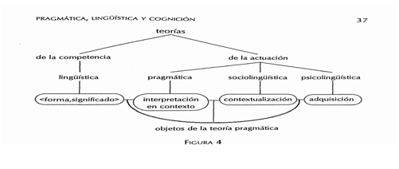
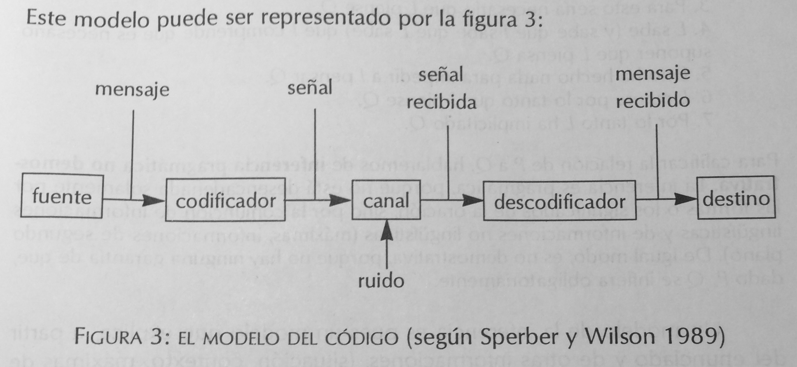
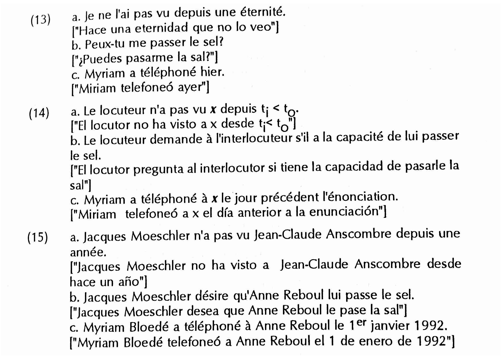

# Moeschler y Reboul 2000 Diccionario enciclopedico

__MOESCHLER J\., y A\. REBOUL__ \(1994\-1999:1__10\-11__\) *Diccionario enciclopédico de pragmática\. *Madrid: Arrecife \(Versión de María Luisa Donaire Fernández y Marta Tordesillas Colado\)\.

Prólogo

¿Qué es, pues, un problema pragmático?…

De una manera sucinta, diremos que un problema es pragmático si no concierne, estrictamente hablando, a la estructura del lenguaje, sino al empleo que se hace de éste\. Que hay una relación, una contaminación entre estructura y empleo del lenguaje es un hecho *que ha sido* atestiguado desde hace unos veinte años\. Pero no se trata de restringir el conjunto de la pragmática a este tipo de fenómenos\. Esta es la razón por la cual no hablaremos aquí específicamente de pragmática lingüística, ya que el ámbito de la pragmática, aunque concierne fundamentalmente al uso del lenguaje, hace intervenir igualmente problemas no estrictamente lingüísticos, como los problemas de la inferencia, el uso aproximado, las metáforas, de la comprensión en contexto, de las leyes discursivas, etc\.

## 11
__MOESCHLER J\., y A\. REBOUL__ \(1994\-1999__:11__\) *Diccionario enciclopédico de pragmática\. *

…la pragmática se desarrolló principalmente en la tradición intelectual anglosajona\. La excepción notoria, en el ámbito francófono, está representada por los trabajos de Oswald Ducrot, que se clasifican cómodamente bajo la etiqueta de *pragmática* integrada, significando con esto que la pragmática se desarrolló principalmente en los Estados Unidos y en Inglaterra, fue inicialmente en virtud de la importancia de las corrientes analíticas en filosofía, pero también de las opciones radicales adoptadas por la teoría lingüística desde hace unos treinta años bajo la influencia de Chomsky\. Los problemas mayores de la pragmática, como el de los actos de habla o el de las *implicaturas *\(o implicitaciones\), que suscitaron un interés sin medida común en lingüística\. ¿Por qué? Nuestra respuesta es que el interés que los lingüistas han mostrado por los aspectos pragmáticos del lenguaje se debe principalmente a una reacción frente a las tesis radicales de Chomsky, en particular a la tesis de la autonomía de la sintaxis

## 11\-12
__MOESCHLER J\., y A\. REBOUL__ \(1994\-1999:__11\-12__\) *Diccionario enciclopédico de pragmática\. *

 Esta reacción, muy fuerte y anti\-chomskiana, condujo a la formulación de una teoría con base semántica, la semántica *generativa*, que incorporaba, al mismo nivel de la gramática, una de las hipótesis más importantes de la pragmática\. Esta hipótesis, comúnmente llamada *hipótesis realizativa*, introducía en la estructura profunda de la oración una indicación sobre su valor de acción, a saber sobre su fuerza *ilocucionaria*\. La lingüística se encontró, pues, al principio de los años 70, con la pragmática, y las conmociones que esto provocó en la formación de las teorías lingüísticas fueron tales que el mundo americano de dividió radicalmente\. Por un lado, la gramática generativista … Por otro lado, la semántica generativa dio lugar progresivamente a una teoría funcional de los hechos de la lengua, y después a desarrollos de orientación *cognitivista*, como Langacker o Lakoff\.

## 12
__MOESCHLER J\., y A\. REBOUL__ \(1994\-1999:__12__\) *Diccionario enciclopédico de pragmática\.*

… la lingüística, cuyo ámbito reservado es la fonología, la sintaxis y la semántica, ya no está en competencia con la pragmática: está se ocupa de todos los aspectos no convencionales del uso del lenguaje\.

Introducción

## 17
__MOESCHLER J\., y A\. REBOUL__ \(1994\-1999:__17__\) *Diccionario enciclopédico de pragmática\. *

 __PRAGMÁTICA, LINGÜÍSTICA Y COGNICIÓN__

 De una forma completamente general, se definirá la __pragmática__ como el estudio del uso del lenguaje, en oposición al estudio del sistema lingüístico, que concierne más propiamente a la __lingüística__\. Si se habla del uso del lenguaje , es que este uso no es neutro, ni en sus efectos sobre el proceso de comunicación, ni en sus efectos sobre el propio sistema lingüístico\. Es banal, en efecto, señalar que cierto número de palabras \(los deícticos de tiempo, de lugar y de persona como ahora, aquí, yo, por ejemplo\) sólo pueden interpretarse en el contexto de su enunciación\. Es algo menos banal recordar que, en el intercambio verbal, comunicamos mucho más de lo que nuestras palabras significan\. Es todavía menos banal decir, por último, que el uso de las formas lingüísticas produce, a cambio, una inscripción del uso en el sistema mismo: el sentido de enunciado consiste en un comentario sobre sus condiciones de uso, a saber su enunciación…

__MOESCHLER J\., y A\. REBOUL__ \(1994\-1999__17\-18__\) *Diccionario enciclopédico de pragmática\. *

El punto de partida de la pragmática se puede situar en los trabajos de los filósofos del lenguaje, y más concretamente en dos series de conferencias dadas en la Universidad de Harvard \(las *William James Lectures\) *pronunciadas en 1955 por John Austin y en 1967 por Paul Grice\. En estas series de conferencias, dedicadas a la filosofía, Austin introduce la noción que será central para la pragmática, la noción de *acto de lenguaje*, definiendo con esto la idea según la cual el lenguaje en la comunicación no tiene principalmente *una función* descriptiva, sino una función accional: utilizando el lenguaje, no describimos el mundo, sino que realizamos actos de habla\.

## 18
__MOESCHLER J\., y A\. REBOUL__ \(1994\-1999__:18__\) *Diccionario enciclopédico de pragmática\. *

 Pero, paralelamente, las conferencias de Grice fueron también determinantes, ya que Grice mostró que el lenguaje natural no era, como lo creían en su época los lógicos y filósofos analíticos, imperfecto, sino que las relaciones lógicas puestas en práctica por los enunciados en la comunicación \(en particular las relaciones de implicación y de inferencia\) estaban regidas por principios o reglas que tenían su fundamento en una concepción racional de la comunicación\. Desde entonces se hacía posible explicar cómo se comunica más de lo que significa con un enunciado…Grice defiende la tesis según la cual los contenidos comunicados indirectamente en la comunicación \(lo que él llamó *las implicaturas\) *se corresponden con los aspectos no vericondicionales de los enunciados\. En otros términos, lo que es implicado no se desprende únicamente del contenido informativo del enunciado del que se podrá decir que es, según los mundos o las circunstancias, verdadero o falso\.

## 18
__MOESCHLER J\., y A\. REBOUL__ \(1994\-1999:__18__\) *Diccionario enciclopédico de pragmática\. *

En concreto, el descubrimiento de las dimensiones pragmáticas del lenguaje permitió plantear las siguientes preguntas: ¿es la pragmática del lenguaje un componente de la lingüística?, ¿qué relación mantiene la pragmática con otras disciplinas, como la filosofía, la psicología, la sociología, la inteligencia artificial?

## 20
__MOESCHLER J\., y A\. REBOUL__ \(1994\-1999:__20__\) *Diccionario enciclopédico de pragmática\. *

1\.1\.1\. Enunciación

El descubrimiento del papel de la actividad enunciativa en la estructura lingüística es sin duda el más importante de la pragmática\. El argumento procede en dos tiempos:

\(i\) Ciertos enunciados no tienen como función designar un objeto del mundo: no tienen función referencial, sino una función auto\-referencial \(refieren a ellos mismos\)

\(ii\) La función auto\-referencial no es un hecho de la situación o del contexto, sino que está indicada, por una convención de la lengua, en la estructura del enunciado\.

__\(1\)  Enunciados realizativos__

Te prometo que vendré/ Te ordeno que salgas/ Te deseo un buen viaje

__\(2\)  Conectores__

Pedro se ha casado, pero es un secreto/ Dime el resultado de la quiniela hípica, puesto que lo sabes todo/ ¿Estas libre esta tarde? Porque hay una buena película en el cine\.

__\(3\)  Adverbios de enunciación__

Francamente ¿dónde estabas ayer tarde?/ Sinceramente, yo renunciaría/ Ay\! No puedo hacer nada por usted\.

## 22
__MOESCHLER J\., y A\. REBOUL__ \(1994\-1999:__22__\) *Diccionario enciclopédico de pragmática\. *

 Una de las tareas de la pragmática es explicar cómo un oyente puede llegar a entender una enunciación de manera no literal y por qué el locutor ha elegido una forma de expresión no literal en lugar de una forma de expresión literal\. En otros términos, la pragmática tiene como tarea describir, con ayuda de los principios no lingüísticos, los procesos de inferencia necesarios para acceder al sentido comunicado por el enunciado\.

__MOESCHLER J\., y A\. REBOUL__ \(1994\-1999__23__\) *Diccionario enciclopédico de pragmática\. *

Oración versus enunciado, significado versus sentido

Puede introducirse aquí una distinción fundamental utilizada en pragmática\. Es la oposición entre la oración y el enunciado\. Por definición, la oración es el objeto de la lingüística: está caracterizada principalmente por su *estructura sintáctica* y por su *significado*, calculado sobre la base del significado de las palabras que la componen\. En esta acepción, la oración es una entidad abstracta, producto de una teoría\. Pero en la comunicación, los locutores no intercambian oraciones: intercambian enunciados\. Un enunciado corresponde en efecto a una oración completada por las informaciones que se extraen de la situación en la que está enunciada\. Un enunciado es, pues, el producto de la enunciación de una oración\. Si la oración es el objeto de la lingüística, el enunciado es el objeto de la pragmática…

## 23
__MOESCHLER J\., y A\. REBOUL__ \(1994\-1999:__23__\) *Diccionario enciclopédico de pragmática\. *

Oración versus enunciado, significado versus sentido

Por definición, la oración es el objeto de la lingüística: está caracterizado principalmente por su estructura sintáctica y por su significado, calculado sobre la base del significado de las palabras que la componen\. En esta acepción, la oración es una entidad abstracta, el producto de una teoría\. Pero en la comunicación, los locutores no intercambian oraciones: intercambian enunciados…Un enunciado es, pues, el producto de la enunciación de una oración\. Si la oración en el objeto de la lingüística, el enunciado es el objeto de la pragmática\.

## 23
__MOESCHLER J\., y A\. REBOUL__ \(1994\-1999:__23’__\) *Diccionario enciclopédico de pragmática\. *

 Hay que señalar que el enunciado, definido como la enunciación de una oración, puede ser interpretado de dos formas diferentes: ya sea como *ocurrencia*, ya sea como *tipo*\. El *enunciado\-ocurrencia* \(el token en la terminología anglosajona\), es el resultado particular de una ocurrencia particular de una oración\. El *enunciado\-tipo*, es, en cambio, el conjunto de las características comunes asociadas a las diferentes ocurrencias de la misma oración\. Por poner un ejemplo trivial, la oración *il pleut \[“llueve”\] *puede dar lugar a un gran número de ocurrencias variando en cuanto a los locutores, a los momentos, a los lugares, y a otros aspectos \(intenciones, creencias, etc\.\) de la situación de enunciación\. Por otro lado, todos esos enunciados\-ocurrencia tienen un punto en común: consisten en la enunciación de la misma oración\. El enunciado\-tipo, es pues, lo que tienen en común el conjunto de los enunciados\-ocurrencia de la misma oración\.

NB: se observará que, para que la pragmática pueda atribuirse un objeto, es necesario hacer la distinción entre *enunciado\-tipo* y *enunciado\-ocurrencia\. *Si no, el pragmatista se vería limitado al análisis de los enunciados\-ocurrencia particulares, cuya descripción, aunque compleja, difícilmente sería completa\.

MOESCHLER J\., y A\. REBOUL \(1994\-1999:23’’\) *Diccionario enciclopédico de pragmática\. *

 Si a la oración se le asocia un *significado*, al enunciado se le asocia no un significado, sino un sentido \(cfr\. Ducrot 1980 a, 1984, capítulo 8\)\. Hay que entender aquí el significado de la oración como el producto de indicaciones lingüísticas que la componen \(las *instrucciones *en la terminología de Ducrot, cfr § 1\.1\.3\); se calcula por el componente lingüístico…En cambio, el sentido del enunciado, es el significado de la oración más las indicaciones contextuales o situacionales calculables a partir del componente retórico EL recurso a las leyes discursivas es fundamentalmente competencia del componente retórico, cuyo producto corresponde al sentido del enunciado\.

## 24
__MOESCHLER J\., y A\. REBOUL__ \(1994\-1999:__24__\) *Diccionario enciclopédico de pragmática\. *

1\.1\.3 __Introducción__

Una de las originalidades de los análisis pragmáticos ha sido concebir el significado de las oraciones como el producto de instrucciones vinculadas a palabras de la lengua\. El concepto de *instrucción*, a partir de los trabajos de O\. Ducrot … ha sido utilizado sobre todo para lo que Ducrot llamó las «palabras del discurso», y particularmente los *conectores*, es decir, las conjunciones, locuciones, adverbios sin significado referencial, cuya función parece variar según su entorno lingüístico\. Frente a los enunciados en \(10\), podemos preguntarnos, en efecto, cuál es la parte común del significado vinculado a *mais*:

\(10\) __a__\. Le temps n’est pas, mas mauvais\. \[“El tiempo no es bueno sino malo\!\]

 __b__\. Le temps n’est pas beau, masi j’ai envie de prendre l’air \[“El tiempo no es bueno, pero me apetece tomar el aire”\]

 __c__\. Le temps n’est pas beau, mais le pluie va arroser les champs \[“El tiempo no es bueno, pero la lluvia va a regar el campo”\]

 __d__\. Le temps n’est pas beau –Mais un rayon de soleil éclaire le salón\. \[“El tiempo no es bueno\. Pero un rayo de sol ilumina el salón”\]

 Mais venez donc diner ce soir\. \[“Pero venga, venid a cenar esta noche”\]

Estos ejemplos, una misma palabra produce efectos de sentido diferentes\. Una de las aportaciones principales de la pragmática ha sido considerar estos efectos como resultado de empleos de una misma unidad léxica, y no como el resultado de empleos de unidades léxicas diferentes\.

## 24\-25
__MOESCHLER J\., y A\. REBOUL__ \(1994\-1999:__24\-25__\) *Diccionario enciclopédico de pragmática\. *

P\. 23 \(3\)

 La intuición que está en el origen del análisis de los conectores es que su significado corresponde a una instrucción sobre la manera de interpretar la conexión entre proposiciones\. El «análisis instruccional» aspira a dar un esquema general del funcionamiento de la «palabra instruccional», esquema formulado mediante variables\. Por ejemplo, para una secuencia P *masi* Q \[“P pero Q”\], el esquema instruccional puede adoptar la siguiente forma: «de P, extraiga la conclusión R, de Q, extraiga no\-R pero Q extraiga no\-R» Así el ejemplo \(11\) recibirá el análisis instruccional \(12\):

\(11\) Il fat beau, masi suis fatigué\. \[“Hace bueno, pero estoy cansado”\]

*\(12\)* __a__\. de P \(il fait beau  \[“Hace bueno”\]\) extraiga la conclusión R

 \(allons nous promener »\]\)

__ b__\. de Q \(je suis fatigué\) \[“estoy cansado”\], extraiga la conclusión no\-R

 \(n’allons pas nous promener \[“no vayamos a pasear”\]\)

__c__\. de P mais Q \[“P masis Q\], extraiga la conclusión no R

## 25
__MOESCHLER J\., y A\. REBOUL__ \(1994\-1999:__25__\) *Diccionario enciclopédico de pragmática\. *

__1\.2\- SINTAXIS, SEMÁNTICA Y PRAGMÁTICA__

 Los hechos examinados muestran que el objeto de la pragmática no es independiente de la lingüística\. En los años setenta, se tenía tendencia a definir la pragmática como «el cubo de basura de la lingüística»\. Esta expresión significa que la pragmática tenía por tarea resolver todos los problemas no tratados por la lingüística \(entendida como la fonología, la sintaxis y la semántica\) … Afortunadamente definiciones más positivas vieron la luz, definiciones que asignan a la pragmática la función de tratar desde un punto de vista no lingüístico ciertos problemas \(sintácticos y semánticos\) considerados como procedentes de la  teoría lingüísticos\. En esta concepción, la pragmática ya no es un cubo de basura, sino un medio de simplificar la lingüística\.

## 25
__MOESCHLER J\., y A\. REBOUL__ \(1994\-1999:__25’__\) *Diccionario enciclopédico de pragmática\. *

 Uno de los principios metodológicos utilizados es lo que Grice \(1978\) llamó «principio de la navaja de Occam modificado» según el cual no es bueno acumular los significados vinculados a un morfema\. Si una palabra o una expresión tiene varios sentidos en uso, es consecuencia no de la organización del sistema léxico, sino de un principio pragmático aplicado al enunciado\. Tomemos dos ejemplos para ilustrar este punto:

\(13\) a\. Le drapeau est blanc \[“La bandera es blanca”\]

 b\. Le drapeau est blanc et bleu \[“La bandera es blanca y azul”\]

\(14\) a\. Jean est tumbé dans le précipice et s’est cassé la jambe\. \[Juan se ha caído al precipicio y se ha roto la pierna”\]

 b\. Jean s’est cassé la jambe et tombé dans le précipice\. \[“Juan se ha roto la pierna y se ha caído al precipicio”\]

## 25\-26
__MOESCHLER J\., y A\. REBOUL__ \(1994\-1999:__25\-26__\) *Diccionario enciclopédico de pragmática\. *

La idea es que sería demasiado costoso para la lingüística describir el adjetivo *blanc* \[“blanco”\] en \(13\) como teniendo dos significados, que se pueden parafrasear respectivamente por «completamente blanco»  y «parcialmente blanco», si de la bandera decimos *blanca*, se deduce que sólo es blanca, *pero* si decimos que es blanca y azul, no será sólo blanca sólo en parte\.

## 26
__MOESCHLER J\., y A\. REBOUL__ \(1994\-1999:__26__\) *Diccionario enciclopédico de pragmática\. *

 ¿Cómo explicar este fenómeno? En el caso de *blanca*, se ha sugerido dar un solo significado a *blanca*, independientemente de la oposición completamente/parcialmente, y explicar los sentidos de blanca asociados a \(13\) y a \(13 b\) por el recurso de una regla pragmática, la máxima de cantidad\. Esta regla requiere dar tanta información como sea preciso \(Grice, 1975\)\. Si el locutor es cooperativo y enuncia \(13 a\), el oyente podrá sacar la conclusión de que la bandera es completamente blanca, en virtud de la regla de cantidad\. De igual forma, si el locutor es cooperativo y enuncia \(13 b\), el interlocutor entenderá por un lado que la bandera es de otro color además de blanca, en virtud de la regla de calidad que requiere enunciar sólo lo que se cree verdadero, y que la blancura no tiene otro color más que el blanco y el azul \(en virtud de la regla de cantidad\)\.

 El mismo razonamiento vale para *et \[“Y”\] *: el efecto temporal y causal no es el propio a *et* \(limitado a sus propiedades lógicas\), sino que se corresponde al efecto de una regla conversacional \(la máxima de orden\): si se da una serie de proposiciones P, Q, R en este orden, entonces el interlocutor está salvo indicación contraria, autorizado a entender que P, Q, R están temporalmente, incluso casualmente, ordenadas\.

## 26\-27
__MOESCHLER J\., y A\. REBOUL__ \(1994\-1999:__26\-27__\) *Diccionario enciclopédico de pragmática\. *

La diferencia entre la sintaxis y la semántica por un lado, y la pragmática por otro es, pues, una oposición entre sistema \(de la lengua\) y uso de este sistema\. De forma general, se puede representar el lugar de la pragmática respecto de la lingüística mediante la figura 2 

## 27
__MOESCHLER J\., y A\. REBOUL__ \(1994\-1999:__27__\) *Diccionario enciclopédico de pragmática\. *

1\-2\-2\- Codificación, instrucción e inferencia

La organización del sistema lingüístico compete a lo que se llama en general el *código lingüístico*\. Hemos visto que la pragmática no tiene por objeto el código lingüístico, sino su uso\. Dicho esto,  vamos a ver que las relaciones entre código y uso son más complejas de lo que la separación entre lingüística y pragmática deja entender\. En efecto, los hechos pragmáticos examinados hasta aquí ilustran dos conjuntos de nociones: la oposición codificación/inferencia y la oposición instrucción/inferencia\.

Codificación e inferencia

Ciertas informaciones están codificadas lingüísticamente, otras se derivan por inferencia pragmática__\. __

Comparemos a este efecto dos  maneras de pedir la sal en la mesa:

\(15\) a\. La soupe manque de sel \[“Le falta sal a la sopa”\]

 b\. Peux\-tu me passer le sal? \[“¿Me puedes  pasar la sal?”\]

## 28
__MOESCHLER J\., y A\. REBOUL__ \(1994\-1999:__28__\) *Diccionario enciclopédico de pragmática\. *

El valor de petición de \(15 a\) no está codificado lingüísticamente\. El enunciado no significa lingüísticamente «passe\-moi le sal» \[“pásame la sal”\], ni siquiera «tu as encore oublié de saler la soupe» \[“has olvidado otra vez echar sal a la sopa”\]: significa literalmente lo que dice, a saber que la sopa no tiene suficiente sal\. Para entender que el enunciado \(15 a\) significa “pásame la sal”, el oyente tiene que efectuar una inferencia, de tipo «el locutor me ha dicho P para significar Q»\.

 ¿Qué ocurre en \(15 b\)? Literalmente , el locutor no pide la sal: hace una pregunta\. Pero la forma utilizada \(*pouvoir\)* \[“poder”\] codifica el valor de petición, puesto que sinónimos \(*être capable de\)* \[“ser capaz de”\] solo recibe el valor de pregunta\.

\(15\) c\. *Es\-tu capable de ne passer le salt?* \[“¿Eres  capaz de pasarme la sal?”\]

Être capable de \[“ser capaz de”\] es sinónimo de *povoir* \[“poder”\], pero no codifica el valor de petición\. En \(15b\), hay pues codificación e inferencia, ya que la petición se expresa vía una pregunta\.

## 28
__MOESCHLER J\., y A\. REBOUL__ \(1994\-1999:__28’__\) *Diccionario enciclopédico de pragmática\. *

P\. 28 __Instrucción e inferencia__

Los aspectos pragmáticos de la interpretación no son, pues, todos idénticos\. Unos son inferenciales, otros están vinculados a la lengua, es decir, codificados lingüísticamente\.  Pero existe una categoría particular de información pragmática codificada lingüísticamente que recubre el concepto de instrucción: la __información procedimental__\. La información procedimental tiene dos  características: no es vericondicional \(no afecta al valor de verdad de la oración\) y concierne a la manera en la que la información debe ser tratada para ser interpretada\. 

\(i\) Aspectos no vericondicionales: el ejemplo de et \[“y”\] temporal es un buen ejemplo de los aspectos no vericondicionales del enunciado\. Otro ejemplo, más espectacular, lo ofrece la negación \(cfr\. Horn 1985\)\. En los empleos de la negación metalingüística, que conciernen a la asertabilidad de una proposición, la negación no afecta al valor de verdad de la proposición, como en \(16\):

\(16\) Anne n’a pas trois enfants, elle en a quatre \[“Ana no tiene tres hijos, tiene cuatro”\]

## 28
__MOESCHLER J\., y A\. REBOUL__ \(1994\-1999:__28’’__\) *Diccionario enciclopédico de pragmática\. *

En \(16\), no se niega vericondicionalmente que Ana tiene tres hijos, porque tener cuatro hijos implica lógicamente tener tres\. Aquí se dirá que la negación no afecta a los aspectos vericondicionales del enunciado, sino a sus aspectos no vericondicionales, y particularmente a su *implicatura conversacional* \(17\)

## 28\-29
__MOESCHLER J\. y A\.  REBOUL, A\. A\. \(1999:28\-29\)\. __*Diccionario enciclopédico de pragmática*__\. __ __Instrucción e inferencia__

\(17\) Anne a trois et seulement trois enfants \[“Ana tiene tres y sólo tres hijos”\]\.

*En efecto*, si digo a mi interlocutor que Ana tiene tres hijos, dejo implícito que no tiene más y que no tiene menos, y esto en virtud de la regla de cantidad, que autoriza a concluir que he dado la información más fuerte\.

\(ii\) Aspectos procedimentales: el concepto de procedimiento se puede ejemplificar con los conectores\. Una de las características de los conectores es dar un conjunto de instrucciones sobre la manera de interpretar un enunciado\. En efecto, esas palabras no están asociadas a ningún concepto particular\. Así, no se podría ver bien qué concepto representa si en los ejemplos \(18\):

\(18\) a\. Si j’avais su, je ne sarais pas venu \[“Si lo hubiese sabido, no habría venido”\]

 b\. Si tu rentres après dix heures, tu seras puni\. \[“Si tú vuelves después de las diez, serás castigado”\]

 c\. Si Paris est la capitale de la France, Lyon est la capital de la Gaules\. \[“Si París es la capital de Francia, Lyon es la capital de la Galia”\]\.

 d\. Si tu as soif, il y a de la bière dans le frigo\.   \[“Si tienes sed, hay cerveza en el frigorífico”\]

MOESCHLER J\., y A\. REBOUL \(1994\-1999:29\) *Diccionario enciclopédico de pragmática\. *

 __Instrucción e inferencia__

En \(18a\), *si* es llamado *contrafáctico* y no tiene el sentido del *si* de condición suficiente \(si implicativo\) en el que si P entonces Q verdad si y sólo si P es falso o Q es verdadero\. En \(18b\), *si* tiene el valor inverso del si lógico: \(18b\) comunica si no\-P, entonces no\-Q, a saber si tu rentres avant dix heures, alors tu ne seras pas puni \[“si vuelves antes de las diez, entonces no serás castigado”\]; en efecto, si no\-P, entonces  Q \(si tu rentres avant dix heures, alors tu seras puni \[“si vuelves antes de las diez, entonces serás castigado”\], aunque lógicamente verdadero, es pragmáticamente falso\. En \(18c\), se habla de si concesivo, parafraseable por aunque o incluso si,; si por último \(18d\) remite al uso «performativo»: au cas aù tu aurais soif, je t’informe/te signale qui’il y a de la bière le frigo \[“en caso de que tengas sed, te informo/te señalo que hay cerveza en el frigorífico”\]\. Ningún concepto puede ser, pues, asociado a si\. Dicho esto, todo individuo que  hable francés es capaz de entender los enunciados \(18\): dispone, pues, de informaciones distintas a la información conceptual\. Calificamos esta información como procedimental \(cfr\. Wilson y Sperber 1990\)\.

## 29\-30
__MOESCHLER J\., y A\. REBOUL__ \(1994\-1999:__29\-30__\) *Diccionario enciclopédico de pragmática\. *

P\. 29\-30 __Instrucción e inferencia__

La consecuencia de estos hechos es que la relación entre sistema lingüístico y uso es más compleja de lo que indica la figura 2\. Se puede representar a partir de aquí la relación entre código lingüístico y uso de la siguiente manera:

*Llegamos *así a la conclusión de que la pragmática se ocupa  de los aspectos inferenciales y lingüísticos de la codificación conceptual y procedimental\. La separación entre código y uso es, pues, parcial, al igual que la que existe entre inferencia e instrucción y la pragmática se ocupa de todos los aspectos relevantes para la interpretación completa de los enunciados en contexto, estén vinculados o no al código lingüístico\.

MOESCHLER J\., y A\. REBOUL \(1994\-1999:30\-31\) *Diccionario enciclopédico de pragmática\. *

P\. 30\-31 __LAS APUESTAS DE LA PRAGMÁTICA__

\(i\) ¿La pragmática concierne al estudio de la competencia o de la actuación?

\(ii\) ¿La pragmática es un componente de la lingüística o es, al contrario, independiente de la lingüística?

\(iii\) ¿La pragmática es o no independiente de la teoría de la cognición?

2\.1\. __Competencia y actuación__

Esta distinción es crucial, puesto que ha permitido a la lingüística moderna definir su objeto: un sistema complejo de reglas \(fonológicas, sintácticas, semánticas\) interiorizadas por el sujeto hablante\.

La distinción entre *competencia y actuación* retoma a grandes rasgos la oposición saussureana entre *lengua y habla*\. Sin embargo,  la diferencia esencial entre competencia y actuación por un lado y lengua y habla por otro se debe al hecho de que el habla es definida por Saussure como un acto individual y la lengua como un «tesoro» colectivo, mientras que la competencia para Chomsky no es lo propio de una comunidad, sino a un sujeto hablante \(cfr\. Ducrot y Todorov, 1872\)\.

## 31
__MOESCHLER J\., y A\. REBOUL__ \(1994\-1999:__31__\) *Diccionario enciclopédico de pragmática\. *

La pregunta que se formuló la teoría lingüística, cuando el estudio del sistema se completó con el estudio del uso, es relativa a la naturaleza de los hechos pragmáticos: ¿corresponden éstos al estudio de la competencia o al estudio de la actuación? Se han dado dos tipos de respuestas a esta pregunta\.

## 31
__MOESCHLER J\., y A\. REBOUL__ \(1994\-1999:__31’__\) *Diccionario enciclopédico de pragmática\. *

Competencia y Actuación

 __\(i\) __En la tradición inaugurada por Grice \(1975\), la pragmática se concibe como una teoría de la actuación…: la oposición lingüística/pragmática corresponde a la oposición competencia/actuación\. En efecto, los principios o reglas pragmáticas no pertenecen al ámbito de la competencia lingüística \(a saber de un conocimiento del sujeto hablante sobre el funcionamiento de su lengua\), sino al de una teoría de la actuación \(a saber de un conjunto de conocimientos y de capacidades para utilizar la lengua en situación\)\.

NB: El concepto de *actuación* recibe aquí un sentido diferente al de la tradición generativista\. Para Chomsky, la actuación define el conjunto de las «producciones lingüísticas»\. La pragmática, en su orientación griceana, es un estudio de la comprensión, y no dela producción lingüística\.

__\(ii\) __ En la tradición francófona inaugurada por Benveniste y continuada por Ducrot …* la pragmátic*a no se inscribe en el estudio de la actuación, sino de la competencia: los aspectos pragmáticos están codificados en la lengua y la lengua contiene instrucciones sobre sus posibles usos\. Es la teoría de la __pragmática integrada__\.

## 32
__MOESCHLER J\., y A\. REBOUL__ \(1994\-1999:__32__\) *Diccionario enciclopédico de pragmática\. *

PRAGMÁTICA INTEGRADA Y PRAGMÁTICA RADICAL

2\.2\.1 Pragmática integrada

El término pragmática integrada \(a la semántica\) se popularizó en el marco de los análisis pragmático hechos en torno a J\.\-C\. Anscombre y O Ducrot y se aplica esencialmente a su teoría de la argumentación\. Los trabajos que se inscriben en la __teoría de la argumentación__ apuntan a defender las dos tesis siguientes\.

\(i\) La primera tesis de la pragmática integrada consiste en defender una concepción __ascritivista__ del lenguaje, según la cual los enunciados no comunican estados de hechos \(su función de representación\) sino acciones, i\.e\. actos del lenguaje \(como ordenar, prometer, desear, asertar, argumentar\)\. Las tesis ascriptivistas se oponen en esto a las tesis descriptivistas de las teorías radicales\.

## 32\-33
__MOESCHLER J\., y A\. REBOUL__ \(1994\-1999:__32\-33__\) *Diccionario enciclopédico de pragmática\. *

\(ii\) La segunda tesis de la pragmática integrada es la tesis de la __sui\-referencia __\(o __autoreferencia__\) del sentido, que se puede resumir en la fórmula: «el sentido de un enunciado es una imagen de su enunciación» \(cfr\. Ducrot 1980a\)\. Esta fórmula se interpreta de la siguiente manera: comprender un enunciado, es comprender las razones de su enunciación\. Describir el sentido de un enunciado es, pues, descubrir el tipo de acto que se supone que realiza el enunciado\. Esta tesis se funda sobre “hechos pragmáticos” que se caracterizan por la inscripción convencional de la descripción de la enunciación en el sentido del enunciado…

 *Esta tesis* no se aleja mucho de la __hipótesis realizativa__ asociada a la corriente de la semántica generativa\. *La semántica generativa*, representada sobre todo por lingüistas como Ross \(197º\), Lakoff \(1972\), McCawley \(1981\), Sadock 1974\), se desarrolló principalmente a fines de los años 60 y principios de los 70 con el fin de integrar la semántica y la sintaxis…La idea es que \(i\) las estructuras sintácticas profundas son estructuras semánticas de tipo predicado\-argumento y que \(ii toda oración está dominada en estructura profunda por un predicado relativizado abstracto, que es responsable de la fuerza ilocucionaria  del enunciado\. Así, una oración como \(19\) tendrá por estructura profunda \(simplificada\) \(20\)

\(19\) “Los tipos de interés se disparan”  Les taux d’intêret grimpent\.

\(20\) “Afirmo que los tipos de interés se disparan”   J’affirme que les taux d’interet grimpent\.

## 33
__MOESCHLER J\., y A\. REBOUL__ \(1994\-1999:__33__\) *Diccionario enciclopédico de pragmática\. *

2\.2\.2 __Pragmática radical__

A la concepción integrada de la pragmática, se puede oponer una concepción radical: la pragmática no es parte integrante de la semántica, está separada de ella\. El argumento es el siguiente: la interpretación de los enunciados hace intervenir aspectos a la vez vericondicionales y aspectos no vericondicionales\.

Aspectos vericondicionales

Pertenecen al ámbito de la semántica \(vericondicional\) y son tratados en el marco de la semántica formal, que utiliza lógicas como el cálculo de predicados o la lógica intencional …

 Entre los aspectos vericondicionales clásicos, se encuentra el problema del alcance de los cuantificadores \(“cada, todos, un, el” etc\.\) Así la oración \(21\) es semánticamente ambigua, ya que recibe dos lecturas lógicas \(22\), que describen condiciones de verdad diferentes:

\(21\) “Cada hombre ama a una mujer”  Chaque homme aime une femme\.

\(22\) “Ɐx \(homme \(x\) →Ǝy \(femme \(y\) aimer \(x,y\)\)\) 

 «Pour tout x, si x est un homme, alors il existe un y tel que y est une femme et x aime y\.»

 \["∀x \(hombre \(x\) →Ǝy \(mujer \(y\) Ùamar \(x,y\)\)\)”\]

## 34
__MOESCHLER J\., y A\. REBOUL__ \(1994\-1999:__34__\) *Diccionario enciclopédico de pragmática\.\.\.*

“__Para todo x, si x es un hombre, entonces existe un y tal que es una mujer y x ama a y”__

 b\. Ǝy   ∀x \(femme \(y\) ˄homme \(x\) ʌ aimer \(x,y\)\)

«Il existe un tel que pour tout x, y est une femme et x est un homme et x aime y\.»

\[“ $y "x \(mujer \(y\)˄hombre \(x\) ˄amar \(x,y\)\)\]

«Existe un y tal que para todo x, y es una mujer y es un hombre y x ama a y»

NB: los símbolos lógicos en \(22\) tienen los siguientes significados:

"x = «para todo x» \(cuantificador universal\)

$x =  «existe un x» \(cuantificador existencial\)

® = «si… entonces» \(conector lógico de implicación material, o de relación condicional\)

Ù =  «y» \(conector lógico de conjunción\)\.

## 34
__MOESCHLER J\., y A\. REBOUL__ \(1994\-1999:__34’__\) *Diccionario enciclopédico de pragmática\. *

 __ASPECTOS NO VERICOONDICIONALES__

Los aspectos no vericondicionales del enunciado corresponden al conjunto de las implicaturas inferibles ya sea a partir de reglas conversacionales \(se habla de implicatura conversacional\), y a sea a partir del sentido de las palabras \(se hablará de implicaturas convencionales\) \(cfr\. Grice 1975, Gazdar 1979, Levinson 1983\)\.

 La diferencia entre vericondicionalidad y no vericondicionalidad se puede ilustrar con los ejemplos \(23\) \(cfr\. Horn 1985\):

\(23\) a\. Jean est parvenu à resoudre le problème\. \[“Juan ha conseguido resolver el problema”\]\.

 b\. Jean n’est pas parvenu à résoudre le problème\. \[“Juan no ha conseguido resolver el problema”\]\.

 c\. Le problème étai difficile à  résoudre\. \[“El problema era difícil de resolver”\]\.

 d\. jean a résolu le problème\. \[“ Juan ha resuelto el problema”\]\.

\(23 a\) y \(23 b\) implicitan conversacionalmente \(23 c\): \(23 c\) es pues un aspecto no vericondicional de la proposición \(está implicitado a la vez por en enunciado positivo y por su correspondiente negativo\); en cambio \(23 a\) implica \(23 d\), y \(23 b\) no impica \(23 d\): \(23 d\) es pues un aspecto vericondicional de la proposición\.

__*MOESCHLER J\., y A\. REBOUL*__* \(1994\-1999:*__*34’’*__*\) Diccionario enciclopédico de pragmática\. *

 La concepción radical de la pragmática plantea pues la hipótesis de que la pragmática describe los aspectos no vericondicionales del sentido\. De ahí la definición de la pragmática dada por Gazdar \(1979\): la pragmática = el sentido — Las condiciones de verdad\. La finalidad de esta definición es la siguiente: \(i\) conservar una semántica vericondicional asociada a la sintaxis de las lenguas naturales; \(ii\) simplificar la descripción lingüística, limitando lo más posible la extensión del ámbito de la semántica a los aspectos vericondicionales del enunciado…

__*MOESCHLER J\., y A\. REBOUL*__* \(1994\-1999:*__*35*__*\) Diccionario enciclopédico de pragmática\. *

 __2\.3\. PRAGMÁTICA: ¿LINGÜÍSTICA, SOCIOLINGÜÍSTICA O PSICOLINGÜÍSTICA?__

La tercera apuesta de la pragmática tiene que ver con su ámbito de pertenencia: ¿la pragmática es un componente de la lingüística, de la sociolingüística o de la psicolingüística? Hemos visto qué opciones se presentaban a la pragmática respecto de la lingüística: la pragmática integrada forma parte de la lingüística, la pragmática radical está fuera de la lingüística\. Pero la cuestión es más compleja\. Es posible, en efecto, orientar la pragmática en dos direcciones divergentes, que no se inscriben en la lingüística\.

__*MOESCHLER J\., y A\. REBOUL*__* \(1994\-1999:*__*35’*__*\) Diccionario enciclopédico de pragmática\. *

2\.3\.1\. La orientación sociolingüística

Una primera orientación consiste en __rechazar la limitación de la competencia sólo al ámbito lingüístico__\. En la tradición de la etnografía de la comunicación \(cfr\. Gumperz y Hymes 1972, Gumperz 1989\), para la que el enunciado no puede ser separado del marco social y cultural en el que se ha proferido, la competencia lingüística se amplía a la competencia comunicativa: un conjunto de saberes, culturales e interaccionales, y una capacidad para actuar de forma apropiada en contextos o situaciones específica\. En ese marco, la pragmática se inscribiría en la sociolingüística: el estudio de la contextualización del lenguaje \(Gumperz 1989\), de la variación sociolingüística \(Lavob, 1976, 1978\), de los ritos de la interacción \(Goffman 1973, 1974, 1987\) prima sobre el estudio del sistema\. En resumen, en el estudio del lenguaje el acento se pone en sus f__unciones__ y no en sus __estructuras\. __

__*MOESCHLER J\., y A\. REBOUL \(1994\-1999:36\) Diccionario enciclopédico de pragmática\. *__

 __2\.3\. PRAGMÁTICA: ¿LINGÜÍSTICA, SOCIOLINGÜÍSTICA O PSICOLINGÜÍSTICA?__

2\.3\.2\. __La orientación psicolingüística__

A esta primera corriente, centrada sobre hechos de actuación, se puede oponer una segunda, que da igualmente prioridad a los hechos de actuación: es la corriente psicolingüística, centrada ya sea en los procesos de adquisición \(cfr\. Bates 1976\), ya sea en los procesos de tratamiento de la información \(cfr\. Miller y Johnson\-Liard 1976, Johnson\-Liard 1983, Levelt 1989\)

 El __estudio psicolingüístico__ plantea el problema de la relación entre lenguaje \(y más concretamente usos de lenguaje\) y cognición\. Un gran número de trabajos sobre temas específicamente lingüísticos \(como la anáfora pronominal\) intentan verificar las hipótesis \(lingüísticas o psicolingüísticas\) sobre la naturaleza de los procesos utilizados por los sujetos hablantes para, por ejemplo, resolver una anáfora pronominal\. En el centro de tales discusiones se encuentra, en especial, el debate codificado e inferencia \(cfr\. Charolles 1990\) , y Charolles y Sprenger\-Charolles 1989\)\.

__*MOESCHLER J\., y A\. REBOUL*__* \(1994\-1999:*__*36*__*\) Diccionario enciclopédico de pragmática\. *

 En resumen, a la pragmática, integrada o no lingüística, le conciernen muy de cerca cuestiones abordadas por disciplinas próximas a la lingüística\. Como la sociolingüística y la psicolingüística, pero procedentes de tradiciones científicas y metodológicamente diferentes\.

 Así, el tratamiento de los datos es muy diferente\. Por ejemplo, el enfoque sociolingüístico tiene muy a menudo una orientación cuantitativa \(cft\. Trabajos de Lavob\), las reglas que se extraen son preferenciales *versus* absolutas y describen tendencias \(son por ello probabilistas\)\. En psicolingüística la metodología es próxima a la de una ciencia experimental: se somete un cierto número de temas a tests, que tienen como función poner a prueba hipótesis formuladas independientemente\. En cambio, en lingüística, los datos son generalmente el producto de la creación del lingüista \(o, con más frecuencia, corpora auténticos\) y se describen en el interior de un marco teórico autónomo y completo\.

 

__*MOESCHLER J\., y A\. REBOUL*__* \(1994\-1999:*__*36*__*\) Diccionario enciclopédico de pragmática\. *

P\. 37  __2\.4\. SÍNTESIS__

… En el marco de las teorías lingüísticas de tradición chomskiana, la pragmática, como teoría de la actuación, está separada de la lingüística: su papel es describir por un lado los mecanismos no lingüísticos vinculados a la interpretación de los enunciados en contexto y, por otro, en cuanto ámbito teórico específico, la relación entre objeto de la lingüística \(la relación forma\-significado\) y los hechos de actuación\.

__*MOESCHLER J\., y A\. REBOUL*__* \(1994\-1999:*__*37*__*\) Diccionario enciclopédico de pragmática\.\.\.*

P\. 37\-38 __2\.4\. SÍNTESIS__

 Por otro lado, la integración de algunos hechos en la teoría lingüística permite distinguir dos tipos de aspectos pragmáticos: los que están asociados a la estructura lingüística y los que están asociados al contexto extralingüístico\. Este reparto de los aspectos pragmáticos atribuye funciones diferentes a los conceptos de *competencia y actuación* Cfr\. Figura 5\)

 

## 38
__MOESCHLER J\., y A\. REBOUL__ \(1994\-1999:__38__\) *Diccionario enciclopédico de pragmática\.\.\. *

La pragmática no lingüística, basada en principios, se define aquí como una teoría de la competencia, ya que sólo concierne a los hechos de interpretación\. Las hipótesis sobre los procesos de tratamientos de los enunciados no son específicas de usos particulares, sino que conciernen a conocimientos particulares sobre esos usos \(cfr\. MOESCHLER 1990 a para una teoría de la competencia\)\.

__3\. TIPOS DE TEORÍAS PRAGMÁTICAS__

… todavía no hemos examinado la arquitectura general de las teorías en las que se integra \[la pragmática\]\. Discutiremos tres tipos de teorías: \(i\) las teorías lineales, \(ii\) las teorías en Y; \(iii\) las teorías cognitivistas\.

__*MOESCHLER J\., y A\. REBOUL*__* \(1994\-1999:*__*38’*__*\) Diccionario enciclopédico de pragmática\.\.\. * 

3\.1 TEORÍAS LINEALES

Estas teorías provienen de la tradición neo\-positivista o logicista del análisis del lenguaje \(Peirce 1931, Morris 1938, Carnap 1942\) y consideran todo sistema de signos, es decir toda semiótica, como formado por los siguientes componentes: una sintaxis, cuyo objeto es el estudio de las relaciones entre signos; una semántica, que se ocupa de las relaciones entre signos y *designata* \(referentes\); y una pragmática, cuyo objeto de estudio es la relación entre los signos y sus interpretantes \(cfr\. Levinson 1983, Sayward 1974, Jacob 1980 y Rastier 1991 …\)\. Estas distinciones son el origen de las definiciones clásicas de sintaxis, de la semántica y de la pragmática…

\(i\) La __sintaxis__ tiene por objeto las relaciones o modos de combinaciones entre unidades de la lengua\. Tiene como función la producción de reglas de buena formación sintáctica\. Una sintaxis se compone de un axioma y esquemas de reglas\. En las gramáticas sintagmáticas clásicas, el axioma es la oración \(s\) y los esquemas de regla de reescritura \(o reglas sintagmáticas\) introducen categorías sintagmáticas como el sintagma nominal \(SN\), el sintagma verbal \(SV\), categorías léxicas como el nombre \(N\), el verbo \(V\) y el adjetivo \(A\) y categorías no léxicas como el determinante \(Det\), lo que muestran las reglas sintagmáticas siguientes: S® SN  SV, SN ®  Det \(A\)  N, SV ® V \(SN\) \(los paréntesis indican los constituyentes opcionales\)\.

__*MOESCHLER J\., y A\. REBOUL*__* \(1994\-1999:*__*38*__*\) Diccionario enciclopédico de pragmática…*

* *

__*MOESCHLER J\., y A\. REBOUL*__* \(1994\-1999:*__*38\-39*__*\) Diccionario enciclopédico de pragmática\.\.\. *

P\. 38\-39

\(ii\) La __semántica__ tiene por objeto la relación entre palabras, sintagmas u oraciones y los objetos del mundo\. Se pueden distinguir \(cfr\. Lyons 1977 y 1980\) tres tipos de entidades semánticas en función de sus propiedades referenciales: las entidades de primer orden \(términos\), que designan objetos del mundo; las entidades de segundo orden \(predicados\), que refieren a estados, acontecimientos, acciones verificadas por tal o cual entidad de primer orden; las entidades de tercer orden \(proposiciones\), cuyos ámbitos es el conjunto de los valores de verdad \(Verdadero, Falso\)\.

\(iii\) La __pragmática__ se ocupa de las relaciones entre los signos y sus usuarios\. De ahí la restricción, en la corriente logicista, de la pragmática a los fenómenos de la *indicialidad* \(referencia a las coordenadas personales, espaciales y temporales variables en función de la enunciación\)\.

*Estas *definiciones han dado un lugar y un orden de tratamiento a estos ámbitos: el tratamiento sintáctico precede al tratamiento semántico, el cual precede al tratamiento pragmático\. En otros términos, la salida de la sintaxis constituye la entrada de la pragmática\. En cuanto a la salida de la pragmática, ésta describe el valor de acción del enunciado\.

__*MOESCHLER J\., y A\. REBOUL*__* \(1994\-1999:*__*38\-39*__*\) Diccionario enciclopédico de pragmática\.\.\. *

 Se puede calificar este tipo de teoría como *lineal *\(el orden de tratamiento es fundamental\) y de *modular*, ya que cada uno de los ámbitos es autónomo e independiente\. La figura 6 representa el esquela tipo de esta clase de modelo:

Enunciado E ↓ __sintaxis__ descripción↓  sintáctica de E↓ __semántica__  ↓ contenido informativo de E ↓ __pragmática ↓__ valor de acción de E

La descripción sintáctica de E es el result ado de un tratamiento sintáctico \(por ejemplo bajo la forma de estructura arborecente de constituyentes\); el contenido informativo es definido por las condiciones de verdad asignadas a la proposición expresada por E; por último, el valor de acción de E consiste en asignar a E una fuerza *ilocucionaria*: a cada enunciado le corresponde la realización de uno y sólo un acto de lenguaje\. Las condiciones que determinan la asignación de un valor de acción a E son definidas como  otras tantas condiciones de apropiedad \(se dirá que un acto de lenguaje es __apropiado en un contexto\)\.__

__*MOESCHLER J\., y A\. REBOUL \(1994\-1999:40\) Diccionario enciclopédico de pragmática\.\.\. *__

P\. 40 3\.2 __TEORÍAS EN Y__

Las teorías lineales \(cfr\. Van Dijk 1977\) han sido criticadas por los partidarios de la pragmática integrada \(cfr\. Anscombre y Ducrot 1983\)\. En el marco de la pragmática integrada, no  hay un tratamiento lineal del enunciado, sino una conjunción de informaciones lingüísticas \(pertenecientes al componente lingüístico\) y de informaciones extra\-lingüísticas \(pertenecientes al componente retórico\) El componente lingüístico es el lugar de aplicación de las instrucciones vinculadas a los morfemas y a otras unidades léxicas; la unidad tratada es el objeto teórico de la oración, cuyo tratamiento lingüístico proporciona el significado\. La conjunción del significado de la oración y de las informaciones extra\-lingüísticas produce el sentido del enunciado, que es, pues, la salida del componente retórico\. Se puede representar este tipo de teoría por un esquema en Y \(de ahí el término «teoría en Y», tomado de Berrendonner 1981\): 

__*MOESCHLER J\., y A\. REBOUL*__* \(1994\-1999:*__*40*__*\) Diccionario enciclopédico de pragmática\.\.\. *

__*MOESCHLER J\., y A\. REBOUL*__* \(1994\-1999:*__*40\-41*__*\) Diccionario enciclopédico de pragmática\.\.\. *

En el marco de las teorías en Y, ya no hay orden lineal entre la sintaxis, semántica y pragmática \(la pragmática —o retórica— está integrada en la semántica\)\. No obstante, subsiste un orden: las «circunstancias de elocución» \(o contexto de enunciación\) solo intervienen después de que se ha atribuido un significado a la oración, siendo el significado la salida del componente lingüístico\.

 *Hay pues* dos etapas en la interpretación de los enunciados\. La primera etapa es estrictamente lingüística, ya que no se requiere ningún conocimiento extra\-lingüístico\. Esta etapa es el resultado de lo que hemos llamado *instrucciones*\. El significado sólo puede ser formulado bajo la forma de variables \(«extraiga una conclusión no\-R de P pero Q tal que no\-R es extraída de Q y R de P», «interprete casi P como teniendo la misma orientación argumentativa que P» etc\.\); estas variables únicamente estarían __saturadas__ a la salida del tratamiento retórico \(pragmático\)\. Se ve pues en qué consiste la autonomía lingüística del análisis pragmático: si existe una contradicción entre la salida del componente lingüístico y la salida del componente retórico, es que una __ley discursiva__ ha sido utilizada para modificar el significado\.

__*MOESCHLER J\., y A\. REBOUL*__* \(1994\-1999:*__*41*__*\) Diccionario enciclopédico de pragmática\.\.\. *

Por ejemplo, un locutor que enuncia \(24\) cuando lleva mucho dinero consigo no podrá ser acusado de mentir:

\(24\) J’ai un peu dárgent sr moi\.   \[“Llevo un poco de dinero”\]

En efecto, una ley discursiva \(le ley litotes, cfr\. Ducrot 1972\) explica la posibilidad de pasar de la expresión de una cantidad pequeña a la afirmación de una gran cantidad\.

 NB: La distinción entre salida del componente lingüístico y salida del componente retórico no es asimilable a la distinción *sentido literal* \(o sentido de la oración\) y *sentido derivado* \(o sentido de la enunciación\)\. La diferencia se sitúa, en términos de oposición variables/constantes\.

__*MOESCHLER J\., y A\. REBOUL*__* \(1994\-1999:*__*41*__*\) Diccionario enciclopédico de pragmática\.\.\. *

P\. 41 __TEORÍAS COGNITIVAS__

El tercer tipo de la teoría pragmática corresponde a las tendencias cognitivas de la pragmática y se opone a las teorías lineales y a las teorías en Y\. La teoría cognitivista es una versión de la pragmática radical; ésta ha dado lugar a dos vías paralelas: una vía formalista \(representada por los trabajos de Gazdar y que corresponden a una teoría lineal\) y una vía cognoscitiva, de tipo modular, representada por los trabajos de Sperber y Wilson \(1986ª\) y \(1989\)\.

 La hipótesis modular está vinculada a la teoría de la cognición de Fodor \(1986\), que distingue dos tipos de sistemas de tratamiento de la información: los sistemas  periféricos \(*input systems\)*, especializados y modulares, y el sistema central del pensamiento, no especializado y no modular, marco de las inferencias\. La hipótesis de Sperber y Wilson es que el sistema central es el lugar del tratamiento pragmático: las operaciones del tratamiento pragmático no son pues ni especializadas, ni dependientes de la naturaleza del sistema periférico que alimenta el sistema central\.

## 41
__MOESCHLER J\., y A\. REBOUL__ \(1994\-1999:__41’__\) *Diccionario enciclopédico de pragmática\.\.\. *

 El punto importante es aquí la divergencia entre la gramática \(teoría sintáctica\) y la pragmática\. Los dos ámbitos competen a la investigación cognitiva \(la teoría gramatical está vinculada por un lado con la gramática universal y por otro a las teorías del aprendizaje, mientras que la pragmática trata de procesos inferenciales y de constitución del contexto\) y tienen el lenguaje por objeto\. …

__*MOESCHLER J\., y A\. REBOUL*__* \(1994\-1999:*__*42*__*\) Diccionario enciclopédico de pragmática\.\.\. *

P\. 42 __TEORÍAS COGNITIVAS__

Se ve pues una primera diferencia con los otros dos tipos de teorías: la teoría modular es cognitivista, y la pragmática no es del ámbito de la lingüística \(ésta se limita a la fonología, a la sintaxis y a la semántica\)\. Pero sobreviene otras diferencias\. Se deben principalmente a la relación entre sistema periférico y sistema central\. La teoría modular de Sperber y Wilson plantea la hipótesis de que la salida del sistema de tratamiento lingüístico está representada por una forma lógica que corresponde a una interpretación parcial e incompleta del enunciado\. Una interpretación está completa cuando la pragmática ha atribuido un referente a las variables, ha asignado una fuerza ilocucionaria al enunciado, ha anulado la ambigüedad del enunciado, ha enriquecido la forma lógica ya sea al nivel de sus implicaciones, ya sea al nivel de su explicitación\. El proceso de tratamiento pragmático es pes último y se aplica a la salida del sistema lingüístico\. Pero la interacción entre sistema periférico y sistema central es  más compleja que en las teorías lineales\.  La figura 3 mostraba que algunas informaciones, codificadas lingüísticamente, desencadenan procesos pragmáticos \(procedimientos\)\. En resumen, la versión cognitivista constituye una solución intermedia entre los dos primero tipos de teorías:

__*MOESCHLER J\., y A\. REBOUL*__* \(1994\-1999:*__*42*__*\) Diccionario enciclopédico de pragmática\.\.\. *

P\. 42 __TEORÍAS COGNITIVAS \(Fig\. 8\)__

__*MOESCHLER J\., y A\. REBOUL*__* \(1994\-1999:*__*54*__*\) Diccionario enciclopédico de pragmática\.\.\. *

__TEORÍA DE LOS ACTOS DE HABLA __[__\[1\]__](#Xc217c44f9d6f9d647df03178eb8b64fb8f54252)__\*__

2\. __LA TEORÍA CLÁSICA__

Con Austin nace verdaderamente el interés por los actos del lenguaje en la época contemporánea\. A partir de su *descubrimiento* del fenómeno y del estudio hecho después por Searle también nace la pragmática tal como la conocemos actualmente …

2\.1 \. La versión austiniana de la teoría de los actos del lenguaje

Se pueden distinguir dos etapas en la teoría de los actos de habla tal y como fue desarrollada por Austin: la primera que es relativa a la distinción entre las afirmaciones que realizan un acto y las que describen la realidad; en la segunda, las afirmaciones que describen la realidad se conviertes en un caso \(muy\) particular de las afirmaciones que realizan un acto\. Sin embargo, estas dos etapas no están realmente diferenciadas en el tiempo y, en el conjunto de este párrafo, vamos a examinar el gran texto fundacional que Austin dedicó a este fenómeno, es decir *William James Lectures*, presentadas en Harvard en 1995, publicadas bajo el título *How to do Things with Words* en 1962\.

__*MOESCHLER J\., y A\. REBOUL*__* \(1994\-1999:*__*54*__*\) Diccionario enciclopédico de pragmática\.\.\. *

2\.1\.1\. Relativos y constatativos

La finalidad fundamental de Austin, en las *William James Lectures*, es mostrar la contradicción que se esconde tras la convicción, ampliamente extendida en el medio filosófico anglosajón de la época, de que las afirmaciones en particular, y en el lenguaje en general, tienen como función describir un estado de hechos y, por tanto, son verdadera o falsas\. El hecho de que numerosos enunciados, incluso afirmativos, no puedan legítimamente ser considerados como verdaderos o falsos condujo, desde esta óptica, a considerarlos como seudo\-afirmaciones\. El postulado del carácter fundamentalmente descriptivo del lenguaje, que Austin llama la *ilusión «descriptiva», *se vuelve a poner en cuestión a partir de una distinción entre las afirmaciones que son efectivamente descripciones y que Austin llama *constatativas*, y las afirmaciones que no son descripciones\. Austin dedica sus primeros trabajos a aislar y a describir esta segunda clase de afirmaciones\.

__*MOESCHLER J\., y A\. REBOUL*__* \(1994\-1999:*__*54\-55*__*\) Diccionario enciclopédico de pragmática\.\.\. *

P\. 54\-55

Estudia \[Austin\] enunciados de forma afirmativa que comportan un verbo en primera persona del singular de indicativo, en voz activa, y que tienen la siguiente característica:

\(i\) No describen nada y no son, por lo tanto, ni verdaderos ni falsos\.

\(ii\) * Corresponden* a la ejecución de una acción\.

Propone llamar a estos enunciados *realizativos*

Tomemos algunos ejemplos de Austin:

\(22\) Oui, je le veux\.  \[“Si quiero”\] \(Respondiendo a la pregunta «Voulez vous prendre cette femme/cet homme pour épouse/époux? durant la céremonie du mariage» \[“¿Quiere a esta mujer/este hombre por esposa/o”\] durante la ceremonia de la boda\.\)

## 55
__MOESCHLER J\., y A\. REBOUL__ \(1994\-1999:__55__\) *Diccionario enciclopédico de pragmática\.\.\. *

\(23\) Je baptise ce bateau le *Queen Elizabeth\.   \[“Bautizo a este barco Queen Elizaberth”\]*

*\(24\) * Je te parie cinq francs qu’il va pleuvoir\.   \[“Te apuesto cinco francos a que va a llover”\]

Sin embargo, para que la acción que corresponde a un enunciado realizativo sea efectivamente realizada, no basta con que se pronuncie la oración: es necesario también que __las circunstancias de esta enunciación sean apropiadas\.__

__*MOESCHLER J\., y A\. REBOUL \(1994\-1999:55’\) *__*Diccionario enciclopédico de pragmática\.\.\. *

2\.1\.2\. Éxito y fracaso de los realizativos

Esto no significa que un realizativo pronunciado en circunstancias inapropiadas es __falso__, sino más bien que el acto es nulo o hueco \(void\), que el enunciado es infortunado y que el acto ha fracasado\.

 Tomemos el ejemplo, tan querido por Austin como por Reinach, de la promesa: si un locutor enuncia \(25\) sin tener intención de venir, no se puede decir por ello que \(25\) es falso, ni que el locutor no ha prometido\.

\(25\) Je te promets que je viendrai\. \[“Te prometo que vendré”\]

Se dirá más bien que el enunciado es infortunado o que el acto ha fracasado\. Se puede, ciertamente, hablar de «__falsa __promesa» en ese caso, pero el término falsa no tiene aquí su sentido lógico\-filosófico habitual\.

Nota p\. 43\-44 “Austin tiene como fin cuestionar la idea según la cual los enunciados en general son descriptivos y sirven para describir el mundo, es decir, son verdaderos o falsos, Reinach pretende desarrollar el análisis husserliano de los actos mentales y del uso de los signos\. Esta diferencia fundamental tiene consecuencias importantes sobre la manera de abordar el fenómeno de los actos sociales\. 

__*MOESCHLER J\., y A\. REBOUL*__* \(1994\-1999:*__*44*__*\) Diccionario enciclopédico de pragmática\.\.\. *

¿*Qué es un *acto social? Sencillamente, es un acto que tiene como característica ser realizado por el lenguaje y que se ejecuta por el simple hecho de decir algo\. La palabra misma, en este caso, crea obligaciones y derechos que, Reinach insiste en este punto, no se confunden con derechos o deberes __morales__\.  \[“te prometo que vendré mañana”\]

… la explicación que da Reinach de lo que es un acto social supera con mucho esta simple constatación\. En efecto, su estudio se basa, por un lado, en un análisis de la naturaleza misma de estos derechos y obligaciones y, por otro lado, en las particularidades de la experiencia vinculada a los actos sociales\. … No son ni actos físicos ni actos psíquicos \[los actos sociales\], i\.e\. no se confunden con una simple experiencia… El contenido de las obligaciones es, ya sea enteramente, ya sea parcialmente, un acto\. En efecto, una obligación puede tener como objeto el acto mismo, o consecuencias del acto\. Por otro lado, se distinguirá la obligación de hacer algo para alguien de la obligación de hacer algo… Por último, los derechos y las obligaciones tienen causas y estas causas son los actos sociales\. 

 __*MOESCHLER J\., y A\. REBOUL*__* \(1994\-1999:*__*55\-56*__*\) Diccionario enciclopédico de pragmática\.\.\.*

2\.1\.2\. Éxito y fracaso de los realizativos

Austin elabora la lista de las condiciones necesarias para el éxito de un realizativo y las comenta\.

 __A\.1\. __ __Tiene que existir cierto procedimiento, reconocido por convención, dotado por convención de determinado efecto, y que comprenda el enunciado de determinadas palabras por determinadas circunstancias__\.

Los enunciados que Austin ha tenido en cuenta hasta entonces son realizativos *explícitos*\. Sin embargo, hay también realizativos *implícitos* que presentan ambigüedades que no se encuentran en los realizativos explícitos\.

 *Tomemos* de nuevo el caso de la promesa y comparemos \(25\), realizativo explícito, y \(26\), realizativo implícito:

\(25\) Je te promets que je viendrai\. \[“Te prometo que vendré”\]

\(26\) Je viendrai \[“Vendré”\]

__*MOESCHLER J\., y A\. REBOUL*__* \(1994\-1999:*__*56*__*\) Diccionario enciclopédico de pragmática\.\.\.*

Mientras que no hay ninguna duda de que \(25\) es una promesa, \(26\) puede ser una promesa, una predicción, una amenaza, etc\.  En el caso de los realizativos implícitos, no hay fracaso o realización incompleta del acto, sino ambigüedad del enunciado\.

 __A\.2\. __ __Es necesario que, en cada caso, las personas y las circunstancias particulares sean las apropiadas para que se pueda invocar el procedimiento en cuestión__\.

Hay un gran número de casos de violación de esta regla, por ejemplo el caso de \(22\) pronunciado por el hermano de la novia \[ … los declaro marido y mujer, etc\.\], o de una orden dada por alguien que no tiene ese poder \(un soldado a un comandante, por ejemplo\), etc\.

 

__*MOESCHLER J\., y A\. REBOUL*__* \(1994\-1999:*__*56*__*\) Diccionario enciclopédico de pragmática\.\.*

B\.1\. El procedimiento tiene que ser ejecutado por todos los participantes correctamente\.

Esto corresponde fundamentalmente al uso de la fórmula incorrecta\. Tal y como señala Austin, los ejemplos se encontrarían principalmente en los realizativos legales\.

B\.2\. El procedimiento debe ser ejecutado íntegramente por todos los participantes\.

En este caso, una fórmula realizativa no basta por sí misma ara ejecutar el acto\. Puede ser necesario otro realizativo en respuesta al primero o paralelo al primero\.

 Se pensará aquí en el acuerdo que es necesario para que una apuesta se efectúe realmente o en el hecho de que cada uno de los esposos tiene que decir «sí, quiero» en el momento apropiado para que el matrimonio tenga lugar\.

__Ґ1__\. Cuando el procedimiento supone en aquellos casos que recurren a él ciertos sentimientos, pensamientos o intenciones, cuando debe provocar a continuación un determinado comportamiento por parte de uno u otro de los participantes, es necesario que la persona que toma parte en el procedimiento \(y con ello lo invoca\) tenga, de hecho, esos pensamientos, sentimientos o intenciones, y que los participantes tengan la intención de adoptar el comportamiento implicado\.

__*MOESCHLER J\., y A\. REBOUL*__* \(1994\-1999:*__*56\-57*__*\) Diccionario enciclopédico de pragmática\.\.\. *

Austin da ejemplos de faltas a esta condición en lo que concierne a los sentimientos, los pensamientos o las intenciones Se pueden dar los siguientes ejemplos:

*Para los* sentimientos

\(27\) Je vous exprime mes condolénces\. \[“Le acompaño en el sentimiento”\]

\(Pronunciado en un caso en el que el locutor no se solidariza en modo alguno con la pena de su interlocutor\)\.

Para los pensamientos

\(28\) Je vous conseille de ne pas venir\. \[“Le aconsejo que no venga”\]

\(Pronunciado por un locutor que no cree que esa sea la mejor manera de actuar para su interlocutor\)\.

Para las intenciones

\(29\) Je promets que je viendrai\. \[“Prometo que vendré”\]

\(pronunciado por un locutor que no tiene ninguna intención de desplazarse\)\.

__*MOESCHLER J\., y A\. REBOUL*__* \(1994\-1999:*__*56\-57*__*\) Diccionario enciclopédico de pragmática\.\.\.*

Ӷ\.\.2\. Los participantes deben adoptar el comportamiento implicado por el procedimiento en la continuación de los acontecimientos\.

La violación de cada una de estas reglas corresponde a un tipo particular de fracaso realizativo y se pueden así proponer, siguiendo a Austin, el siguiente cuadro que califica los infortunios según las condiciones a cuya violación corresponden\.

__*MOESCHLER J\., y A\. REBOUL*__* \(1994\-1999:*__*58*__*\) Diccionario enciclopédico de pragmática\.\.\.*

2\.1\.3 Éxito versus verdad, realizativos versus constatativos

Austin, en esta etapa, se encuentra en el punto en que ha puesto en cuestión la ilusión «descriptiva», introduciendo, en el interior de la clases de las afirmaciones, una distinción entre las afirmaciones que describen realmente y que son susceptibles de ser verdaderas o falsas, llamadas __constatativas __y las afirmaciones que no describen sino mediante las cuales se realizan actos y que son susceptibles de ser afortunados o infortunadas, llamadas __realizativas\.__ Los enunciados constatativos son verdaderos si existe un estado de cosas que los verifica, falsos en el caso contrario; los enunciados realizativos son afortunados si cumplen ciertas condiciones, infortunados en el caso contrario\.

__*MOESCHLER J\., y A\. REBOUL*__* \(1994\-1999:*__*58\-59*__*\) Diccionario enciclopédico de pragmática\.\.\.*

 Llegado a este punto, sin embargo, Austin constata que decir, desde esta óptica, que un enunciado realizativo es afortunado si se cumplen ciertas condiciones, equivale a decir que un enunciado realizativo es afortunado si ciertas afirmaciones son verdaderas, las afirmaciones que, precisamente, describen o se refieren a estas condiciones\. ¿Hay que abandonar, entonces, la distinción realizativo/constatativo? Austin se niega a esto y defiende la distinción con un argumento fuerte\. Según él, si se puede decir que algunas afirmaciones tienen que ser verdaderas para que un realizativo sea afortunado, esto no significa que un realizativo se reduzca a un constatativo\. En efecto, incluso si se admite que hay un aspecto descriptivo en un realizativo explícito, la descripción en cuestión no es verificada por un estado de cosas independientemente de ellas: es el éxito del aspecto realizativo de la afirmación el que hace verdadero su aspecto descriptivo\.

*Comparemos* los dos siguientes enunciados:

 \(30\) Je cours, \[“Corro”\]

 \(31\) Je m'excuse, \[“Me excuso”\]

¿Qué relación hay entre el enunciado *Je cours* \[“Corro”\] y el hecho de correr, entre el enunciado *Je m'excuse* \[“Me disculpo”\] y el hecho de disculparse? En el caso de \(30\), el hecho de que yo me disculpe depende directamente de mi enunciación de \(31\)\.

__*MOESCHLER J\., y A\. REBOUL*__* \(1994\-1999:*__*59*__*\) Diccionario enciclopédico de pragmática\.\.\.*

La distinción constatativo/realizativo se reduce pues, en última instancia, a la distinción entre decir y hacer\.

 Hay que señalar sin embargo que la verdad de determinado número de afirmacioines está íntimamente vinculada al éxito del realizativo\.

\(i\) La afirmación según la cual es verdadero que el locutor hace algo y más concretamente que el locutor hace el acto de …

\(ii\) La afirmación según la cual es verdadero que ciertas condiciones se cumplen\.

\(iii\) La afirmación según la cual es verdadero que el locutor se compromete a realizar una acción ulterior

 

__*MOESCHLER J\., y A\. REBOUL*__* \(1994\-1999:*__*59'*__*\) Diccionario enciclopédico de pragmática\.\.\.*

Pero la relación de implicación que existe entre una afirmación determinada y una o varias afirmación\(es\) no es uniforme\. Puede adoptar tres aspectos, que se distinguirán principalmente en el nivel de las relaciones que mantienen las negaciones de las afirmaciones en cuestión\.

\(i\) Una afirmación puede __conllevar__ una o varia\(s\) afirmación\(es\)\.

\(32\) Tous les hommes rougiddrnte \[“Todos los hombres se sonrojan”\]

\(33\) Certains hommes rougissent \[“Ciertos hombres se sonrojan”\]

En efecto, no se puede decir, como apunta Austin: Tous les hommes rougisemente, mais pas n'importe lesquels \[“Todos los hombres se sonrojan, pero no cualesquiera”\]\. *Si una afirmación* a conlleva a una afirmación b, entonces la negación de b conlleva a la negación de a\.

__*MOESCHLER J\., y A\. REBOUL*__* \(1994\-1999:*__*60\-61*__*\) Diccionario enciclopédico de pragmática\.\.\.*

\(ii\) Una afirmación puede __dar a entender__ una o varias afirmación\(es\)

\(34\) da a entender \(35\):

\(34\) Le chat est sur le paillasson \[“El gato esta encima del felpudo”\]

\(35\) Je crois que le chat est sur le paillasson \[“Creo que el gato está encima del felpudo”\]

Aquí, en cambio, si una afirmación a da entender una afirmación b, la negación de b no da a entender la negación de a:

\(35'\), que es la negación de \(35\), no da a entender \(34'\), que es la negación de \(34\):

\(34'\) Le chat nèst pas sur le paillasson \[“El gato no está encima del felpudo”\]

\(35'\) Je en crois pas que le chat soit sur le paillasson \[“No creo que el gato esté encima del felpudo”\]

… La relación es sencilla: la aserción de una proposición da a entender la creencia en la verdad de esta proposición\.

__*MOESCHLER J\., y A\. REBOUL*__* \(1994\-1999:*__*60\-61’*__*\) Diccionario enciclopédico de pragmática\.\.\.*

\(iii\) Una afirmación puede __presuponer__ una o varias afirmación\(es\)\.

\(36\) presupone \(37\):

\(36\) Les enfants de Jean sont chauves \[“Los hijos de Juan son calvos”\]

\(37\) Jean a des enfants \[“Juan tiene hijos”\]

En cambio, \(37'\), que es la negación de \(37\), no presupone \(36'\), que es la negación de \(36\):

\(36'\) Les enfants de Jean en sont pas chauves \[“Los hijos de Juan no son calvos”\]

\(37'\) Jean n'a pas d'enfant's \[“Juan no tiene hijos”\]

Cuando la afirmación presupuesta es falsa, Austin considera que hay fracaso de la afirmación de partida: ésta es nula, no bienvenida y no verdadera o falsa\.

 Si nos remitimos a las afirmaciones cuya verdad está vinculada al éxito del realizativo, se observará que la relación entre el realizativo y la verdad de las afirmaciones que se refieren a las condiciones de su éxito será, según se trate de las condiciones A\.1 y A\.2\., o de la condición Γ\.1, respectivamente, la presuposición y el dar a entender\. En cambio, se podrá decir que la relación entre el éxito del realizativo y la condición Γ\.2 corresponde a la implicación propiamente dicha, en la que una proposición conlleva otra\. 

__*MOESCHLER J\., y A\. REBOUL*__* \(1994\-1999:*__*61*__*\) Diccionario enciclopédico de pragmática… \*\*\*\*\*\**

 Nos encontramos, pues, ante el hecho de que __las consideraciones sobre la verdad o la falsedad pueden alcanzar a los realizativos__, Pero hay más: __ consideraciones sobre la fortuna y el infortunio pueden alcanzar a las afirmaciones consideradas hasta aquí como constatativas\. __

\(38\) Il va faire beau\. \[“Va a hacer bueno”\]

\(39\) J’affirme qu’il va faire beau\. \[“Afirmo que va a hacer bueno”\]

Austin se encuentra así confrontando el problema de distinguir realizativos y constatativos, es decir, de proponer un test \(eventualmente gramatical\), en la medida en que la distinción, basada como está en la oposición entre verdad/falsedad y éxito/fracaso, se debilita por el fracaso de esta oposición\.

 Empieza por examinar la hipótesis según la cual un realizativo estaría siempre __en primera persona del presente de indicativo, voz activa__, para observar que algunos realizativos tienen características bien diferentes\.

 __*MOESCHLER J\., y A\. REBOUL*__* \(1994\-1999:*__*73*__*\) Diccionario enciclopédico de pragmática…*

 __LA TAXONOMIA SEARLIANA DE ACTOS DE LOS ACTOS ILOCUCIONARIOS__

En un artículo aparecido unos años después de *Los actos del lenguaje, «A classification of ilocutionary acts» \[“Una clasificación de los actos ilocucionarios\]* \(Searle 1977, 1979 …\), Searle aborda los actos ilocucionarios desde el ángulo de la clasificación\. Empieza por recordar las cinco categorías de base establecidas por Austin: *los judicativos, los ejercitativos, los compromisivos, los comparativos, los expositivos*\. En su artículo se propone como tarea examinar y modificar, si fuera necesario, esta clasificación de Austin en algunos de sus aspectos\.

 Searle parte e una distinción entre __verbos ilocucionarios __y __actos ilocucionarios__: esta distinción se basa en la distinción entre el aspecto ilocucionario del lenguaje que trasciende las diferencias entre lenguas particulares y los verbos ilocucionarios que pertenecen a lenguas particulares\.

__*MOESCHLER J\., y A\. REBOUL*__* \(1994\-1999:7*__*4*__*\) Diccionario enciclopédico de pragmática\.\.\.*

2\.3\.1\. __Los criterios de una taxonomía de los actos ilocucionarios__

Searle da una lista de los criterios que propone para el establecimiento de una taxonomía de los actos ilocucionarios\.

\(1\) La __finalidad del acto__: la *finalidad del acto finalidad ilocucionaria* corresponde las condiciones esenciales del análisis searliano de los actos del lenguaje\. Constituye una parte de su *fuerza ilocucionaria*\.

\(2\) La __dirección de la relación de ajuste entre las palabras y el mundo__: concierne al contenido proposicional del acto y es una parte o una consecuencia de su finalidad ilocucionaria\. En una aserción, las palabras tienen que «ajustarse» al mundo; en una promesa, en cambio, el mundo, a través de los actos del locutor, debe «ajustarse» a las palabras\.

__*MOESCHLER J\., y A\. REBOUL*__* \(1994\-1999:7*__*4’*__*\) Diccionario enciclopédico de pragmática\.\.\.*

\(3\) Los __estados psicológicos expresados__: cuando un locutor realiza un acto ilocucionario, indica *ipso facto* una actitud en relación con el contenido proposicional del acto\. El estado psicológico, como se observará, corresponde a la condición de sinceridad del análisis de los actos de habla\.

\(4\) La __fuerza con la que la finalidad ilocucionaria es presentada__: depende a menudo del mayor o menor grado de explicación del acto, o, si el acto es explicativo, del verbo realizativo empleado\.

Comparemos, por orden de fuerza creciente, los ejemplos \(59\), \(60\) y \(61\)

 

\(59\) Nous pourrions aller au cinema \[“Podríamos ir al cine”\]

\(60\) Je suggèrre que nous allons au cinéma \[“Sugiero que vayamos al cine”\]

\(61\) Je veux que nous allions au cinéma \[“Quiero que vayamos al cine”\]

__*MOESCHLER J\., y A\. REBOUL*__* \(1994\-1999:*__*74’’*__*\) Diccionario enciclopédico de pragmática\.\.\.*

TAXONOMÍA SEARLIANA DE LOS ACTOS ILOCUCIONARIOS

\(5\) La __posición respectiva del locutor y del interlocutor y su influencia sobre la fuerza ilocucionaria del enunciado:__ esto corresponde a una de las condiciones preparatorias del análisis de los actos de habla\.

\(6\) Las __relaciones del enunciado con los intereses del locutor y del interlocutor: __esto corresponde a otra condición preparatoria\.

\(7\) Las __relaciones con respecto del discurso__: esto concierne principalmente a los expositivos de la clasificación austiniana, es decir, los verbos tipo *répondre, conclure, objeter \[“responder, concluir, objetar*”\], etc\. Se les puede añadir conectores como *cependant, par ailleurs *\[“sin embargo, por otro lado”\], etc\.

__*MOESCHLER J\., y A\. REBOUL*__* \(1994\-1999:*__*75*__*\) Diccionario enciclopédico de pragmática…*

\(8\) Las __diferencias en el contenido proposicional que son determinadas por mecanismos vinculados a la fuerzas ilocucionaria: __ pensemos en la diferencia entre la relación, que concierne a estados de cosas pasadas o presentes, pero no futuros, y la predicción, que concierne a estados de cosas futuras\.

\(9\) Las __diferencias entre los actos que sólo pueden ser realizados por actos de habla y los que también se pueden realizar de otra manera__: se puede decir, enunciar un diagnóstico, etc\., sin decir que se hace, mientras que no se puede presentar juramento sin decir que se hace\.

\(10\) Las __diferencias entre actos que requieren instituciones extralingüísticas para su realización y los que no las requieren: __pensemos en la excomunión, la declaración de guerra, etc\.

\(11\) Las __diferencias entre los actos cuyo verbo correspondiente tiene un uso realizativo y aquellos cuyo verbo no tiene tal uso__: pensemos en los verbos como *verter o menacer* \[“presumir” o “amenazar”\]\.

\(12\) El __estilo de la realización del acto__: se puede pensar en las diferencias entre *annocer *\[“anunciar”\] y *confier *\[“confiar”\]\.

__*MOESCHLER J\., y A\. REBOUL*__* \(1994\-1999:*__*75\-76*__*\) Diccionario enciclopédico de pragmática\.\.\.*

2\.3\.2 __La alternativa searliana a la clasificación austiniana__

Searle hace algunas críticas a la clasificación austiniana de los actos ilocucionarios\. La primera es que no es una clasificación de actos ilocucionarios sino una clasificación de verbos, algunos de los cuales ni siquiera son ilocucionarios\. Por otro lado, la taxonomía austiniana no se apoya en ningún principio claro ni tan siquiera en un conjunto de principios y esto tiene como consecuencia el encabalgamiento entre categorías, por último, contiene verbos muy diferentes algunos de los cuales no satisfacen las definiciones dadas por Austin\. Searle propone pues su propia clasificación, basada sólo en cuatro criterios indicados precedentemente y permitiendo una descripción de la estructura sintáctica profunda de los enunciados correspondientes\. Da la siguiente lista:

\(i\) los __representativos: __el locutor se compromete con la verdad de la proposición expresada \(es la finalidad ilocucionaria\); las palabras se ajustan al mundo; el estado psicológico es la creencia: el grado de compromiso depende del verbo utilizado; el test de un representativo es la respuesta a la pregunta ¿*Se puede decir literalmente del enunciado que es verdadero o falso*? Su estructura sintáctica profunda es Yo verbo ilocucionario que \+ S; Se observará que este análisis corresponde a la hipótesis realizativa propuesta por Ross \(1970\)

__*MOESCHLER J\., y A\. REBOUL*__* \(1994\-1999:*__*76*__*\) Diccionario enciclopédico de pragmática\.\.\. \*\*\*\*\**

\(ii\) los __directivos: __la finalidad ilocucionaria de los directivos es que el locutor pretende hacer que el interlocutor haga algo; la dirección de ajuste va del mundo a las palabras; la actitud correspondiente a la condición de sinceridad es el deseo; el contenido proposicional es que el interlocutor tiene que hacer lago; la estructura sintáctica profunda es Yo te verbo ilocucionario que tu VP \(en futuro\);

\(iii\) los __compromisionarios__: la finalidad ilocucionaria de los compromisionarios es obligar al locutor a realizar cierto\(s\) acto\(s\); la dirección de ajuste va del mundo a la palabra; la condición de sinceridad concierne a la intención; el contenido proposicional es que el locutor hará algo; la estructura sintáctica profunda es Yo \(te\) verbo ilocucionario que yo VP \(en futuro\);

\(iv\) los __expresivos: __la finalidad ilocucionaria de los expresivos es expresar el estado psicológico, especificado por la condición de sinceridad, en relación con el estado de cosas especificado en el contenido proposicional; en los expresivos, no hay dirección de ajuste y la verdad de la proposición expresada se presupone; la estructura profunda es Yo te verbo ilocucionario de yo/tú VP;

__*MOESCHLER J\., y A\. REBOUL*__* \(1994\-1999:*__*76’*__*\) Diccionario enciclopédico de pragmática\.\.\.\*\*\*\*\**

\(v\) los __declarativos__: tienen como característica provocar la verdad de su contenido proposicional; son los que representan al comienzo de la teoría de los actos de habla la clase de los realizativos; implican una institución extralingüística así como estatus respectivos muy específicos para el locutor y el interlocutor; la dirección de ajuste es doble, va tanto del sentido palabras\-mundo como en el sentido mundo\-palabras; la estructura sintáctica profunda es Yo verbo ilocucionario NP1 \+ NP2\.

En resumen, los verbos ilocucionarios no son siempre marcadores de finalidad ilocucionaria sino que marcan otras características del acto ilocucionario\. __Según Searle, la conclusión más importante, al término de esta clasificación, es que no hay, como querrían Wittgenstein y sus sucesores, un número infinito de juegos del lenguaje, sino una ausencia de claridad en lo que se refiere a los criterios utilizados para delimitar los juegos del lenguaje\.__

__*MOESCHLER J\., y A\. REBOUL*__* \(1994\-1999:*__*77*__*\) Diccionario enciclopédico de pragmática\.\.\.*

__3__\. __LA TEORÍA DE LOS ACTOS DE HABLA Y LA TEORÍA DE LA RELEVANCIA__

Actualmente, la teoría de los actos de habla se aborda de dos maneras radicalmente diferentes: hay, por una parte, investigadores que intentan formalizar el ámbito de una lógica «ilocucionaria»los resultados a los que llegaron Austin, y sobre todo Searle, en el nivel de las condiciones de felicidad de los actos ilocucionarios, así como los críticos que subyacen a su clasificación…; por otra parte, hay trabajos recientes que dirigen una mirada más crítica a la teoría clásica de los actos de habla: en concreto Sperber y Wilson \(1986 y 1989\) en un capítulo que dedican a los actos de habla en su obra sobre la teoría de la relevancia…Expondremos, como conclusión a este capítulo, el punto de vista de la relevancia sobre los actos de habla\.

__ __Sperber y Wilson critican tres puntos de vista de la teoría clásica de los actos de lenguaje:

\(i\) su carácter anti\-vericondicionalista;

\(ii\) el presupuesto según el cual la taxonomía de los actos de lenguaje tienen un papel que desempeñar en la interpretación de los enunciados;

\(iii\) el aspecto convencionalista de la teoría clásica d ellos actos de lenguaje\.

__*MOESCHLER J\., y A\. REBOUL*__* \(1994\-1999:*__*77\-78*__*\) Diccionario enciclopédico de pragmática\.\.\.*

3\.1 LA TEORÍA CLÁSICA: VÍNCULO ENTRE LA ANTI\-VERICONDICIIONALIDAD, LA IMPORTANCIA TAXONÓMICA Y EL CONVENCIONALISMO\.

__3\.1\.1__\. __El carácter anti\-vericondicionalista de la teoría de los actos de habla\.__

Recordemos que para Austin , y después para Searle, una de las finalidades de la teoría de los actos de habla es poner en tela de juicio «la ilusión descriptiva», es decir, el postulado según el cual todas las afirmaciones *son utilizadas* para describir estados e cosas en el mundo y son por ello susceptibles de ser verdaderas o falsas\. El primer movimiento de Austin había sido aislar, en el interior de afirmaciones, una clase de enunciados llamados realizativos que tienen forma afirmativa pero que, lejos de servir para describir estados de cosas, realizan un acto cualquiera y que, por ello, no tienen valor de verdad o falsedad, sino de éxito o fracaso\. Después, en un segundo momento, Austin señala que hay verdad o falsedad en los realizativos y éxito o fracaso en los constatativos\. Dicho de otra manera, la frontera entre los constatativos, afirmaciones aparentemente descriptivas, y los realizativos, afirmaciones que sirven para realizar una acción, tiene que ser flexible, y esta flexibilidad, para Austin, consiste en considerar que los constatativos sirven también para realizar actos que él llamará desde entonces ilocucionarios\.

__*MOESCHLER J\., y A\. REBOUL*__* \(1994\-1999:*__*78*__*\) Diccionario enciclopédico de pragmática\.\.\.*

 Searle, por su parte, supone toda frontera y considera que un enunciado, desde el momento en que expresa una oración gramatical completa, corresponde *ipso facto* a la realización de un acto ilocucionario\. Desde ese momento, lo que prima en la interpretación de un enunciado, ya no es la verdad o falsedad de la proposición que expresa, sino el acto ilocucionario que realiza\. Se puede además expresar la misma proposición en enunciados diferentes y realizando actos ilocucionarios diferentes\.

__*MOESCHLER J\., y A\. REBOUL*__* \(1994\-1999:*__*78*__*\) Diccionario enciclopédico de pragmática\.\.\.*

3\.1\.2\. __La taxonomía de los actos ilocucionarios__

Desde el momento en que todo enunciado que corresponde a una oración gramatical completa realiza un acto ilocucionario, es crucial que el interlocutor, en su interpretación del enunciado, sea capaz de determinar de qué acto ilocucionario se trata y cuales son las consecuencias de esta acto para sus propias acciones futuras o para lo que él puede esperar del locutor\. Así a la necesidad teórica que puede haber de describir completamente el fenómeno de los actos ilocucionarios estableciendo la clasificación a partir de un cierto número de criterios precisos, se añade la necesidad de dar cuenta de la manera en la que opera esta interpretación\. Se observará que es el locutor quien tiene la intensión de realizar tal o cual acto ilocucionario y que, por esto, un enunciado que corresponde a un acto ilocucionario dado tiene que expresar esta intención del locutor: la recuperación de esta intención por el interlocutor es incluso una de las condiciones del éxito del acto\.

__*MOESCHLER J\., y A\. REBOUL*__* \(1994\-1999:*__*78\-79*__*\) Diccionario enciclopédico de pragmática\.\.\.*

 __3\.1\.3\. El convencionalismo de la teoría de los actos de habla__

Si los enunciados, en tanto realizan un acto de lenguaje comunican *ipso facto* la intención del locutor de realizar este acto, y si el éxito del acto depende del reconocimiento de esta intención por el interlocutor, el mecanismo por el que se hace este reconocimiento tiene que ser relativamente *sencillo*\. Para Searle, así como para Austin, la manera en que se hace este reconocimiento para tanto por la forma sintáctica de la oración como por las palabras que la componen y determinadas formas sintácticas asociadas a determinadas palabras corresponden a tal o cual acto ilocucionario\. Es el carácter convencional de la teoría de los actos de habla\. Bien es cierto que Searle ni Austin pretenden que toda realización de un acto ilocucionario pueda hacerse exclusivamente mediante el recurso de una forma fija, pero para Austin, y más tarde para Searle, quien enunció el principio, siempre hay un enunciado explícito que habría podido ser utilizado en vez de y en lugar del enunciado ambiguo efectivamente producido para realizar el acto ilocucionario considerado\.

 __*MOESCHLER J\., y A\. REBOUL*__* \(1994\-1999:*__*79*__*\) Diccionario enciclopédico de pragmática\.\.\.\*\*\*\**

3\.1\.4\. El papel central de la teoría de los actos ilocucionarios

__Se ve así el papel central de la clasificación de los actos de habla: su importancia se desprende de la idea según la cual todo enunciado que expresa una oración gramatical completa realiza  *ipso facto* un acto ilocucionario\. __Condiciona a su vez en cierta medida la hipótesis convencionalista de Searle y Austin\. En efecto sólo tiene sentido clasificar los actos ilocucionarios si se puede hacer corresponder a los diferentes actos así organizados los enunciados, y es sobre la base de su forma lingüística como asociamos los enunciados a tal o cual acto ilocucionario perteneciente a tal o cual clase\.

__*MOESCHLER J\., y A\. REBOUL*__* \(1994\-1999:*__*79*__*\) Diccionario enciclopédico de pragmática\.\.\.*

  __3\.2\. CRÍTICA DE LA CLASIFICACIÓN DE LOS ACTOS ILOCUCIONARIOS__

No es la clasificación en sí misma lo que Sperber y Wilson ponen en cuestión, no más, por otra parte, que su necesidad teórica en el seno de la teoría de los actos de habla, sino la hipótesis según la cual interpretar un enunciado es determinar el acto ilocucionario realizado\. Según ellos, esta hipótesis nunca ha sido justificada de forma independiente y, aunque cierto actos de habla deben ser efectivamente identificados para ser realizados, no es, ni con mucho, el caso de todos los actos de habla\.

Sperber y Wilson ponen el ejemplo de la predicación:

 \(62\) Il fera plus chaud demain\. \[“”Mañana hará más calor”\]

 \(63\) Le locuteur prédit qu’il fera plus chaud demain\. \[“El locutor predice que mañana hará más calor”\]

__*MOESCHLER J\., y A\. REBOUL*__* \(1994\-1999:*__*79\-63*__*\) Diccionario enciclopédico de pragmática\.\.\.*

En la teoría clásica de los actos de habla, se diría que, para que el interlocutor haya entendido el enunciado \(62\) tiene que haber entendido algo así como \(63\)\. Según Sperber y Wilson, sin embargo, no es el caso: lo que es importante, según ellos, en la interpretación de \(62\) no es que el interlocutor haya realizado \(63\), que haya entendido que el locutor tenía la intención de hacer una predicción, sino simplemente, que *haya entendido* que el enunciado comunica algo a propósito de un acontecimiento futuro\. Esto, como se observará, no significa que el interlocutor no entienda nunca \(63\), sino más bien que entender \(63\) no es indispensable para la comprensión de \(62\)\.

__*MOESCHLER J\., y A\. REBOUL*__* \(1994\-1999:*__*80*__*\) Diccionario enciclopédico de pragmática\.\.*

*Así h*abría pues, dos conjuntos de actos de habla: los que deben ser identificados a la vez por el locutor y el interlocutor para ser realizados y los que son realizados sin que tal identificación sea necesario\.

\(i\) En el primer grupo, en el de los actos que se podría llamar institucionales o institucionalizados, se encuentra actos como el bautismo, la declaración de guerra, la apuesta, pero también actos mucho más cotidianos como la promesa\.

\(ii\) En el segundo grupo, el de los actos no institucionales, se encuentran actos como acertar, sugerir, negar, advertir, etc\.

El primer grupo de actos, el de los actos institucionales, no compete a la lingüística, no más por otro lado, que a la pragmática, sino sin duda al estudio de las instituciones\. Los actos necesitan muy a menudo circunstancias institucionales bien determinadas \(estatuto, pertinencia a tal o cual cuerpo, etc\.\) para realizarlos con éxito\. El segundo grupo, en cambio, compete a la lingüística o a la pragmática, pero no exige en absoluto la clasificación de los actos ilocucionarios, puesto que la identificación no es indispensable para la realización de los actos que lo constituyen\.

__*MOESCHLER J\., y A\. REBOUL*__* \(1994\-1999:*__*80\-81*__*\) Diccionario enciclopédico de pragmática\.\.\.*

3\.3\. LOS ACTOS DE HABLA EN LA TEORÍA DE LA RELEVANCIA

Existe sin embargo un tercer grupo de actos de habla que tienen un interés muy especial en pragmática: este grupo corresponde a los tres actos de *dire* *de* \[“pedir que”\], de *dire que* demander si *\[“preguntar si”\]*\. 

Consideremos los ejemplos \(64\), \(65\) y \(66\):

\(64\) Tu as ferme la porte \[“Has cerrado la puerta”\]

\(65\) Ferme la porte \[“Cierre la puerta”\]

\(66\) Est\-ce que tu fermé la porte? \[“¿Has cerrado la puerta?”\]

Si \(64\) es un acto de *dire que*, \(65\) es un acto de *dire de* \[“decir que“\], y \(66\) un acto de *demander si* \[“preguntar si”\]

__*MOESCHLER J\., y A\. REBOUL*__* \(1994\-1999:*__*81*__*\) Diccionario enciclopédico de pragmática\.\.\.*

Sperber y Wilson … observan que, mientras que los actos institucionales cambian según las culturas y las lenguas \(algunos actos no existen en algunas culturas\), los actos de *dire de* \[“pedir que”\], *dire que \[“decir que”\] y *demander si *\[“preguntar si”\] son universales\. …*Desde esta óptica, al acto de *dire que \[“decir que”\] *sería una generalización de la clase de los asertivos *Dire de* \[“pedir que”\] una generalización de los directivos y *demander si \[“preguntar si*”\] una interrogativa de los directivos*\.  *… un vistazo sobre algunos ejemplos permite ver que las diversas condiciones indicadas por Searle para las clases de actos ilocucionarios en su teoría no son siempre respetados\.

__*MOESCHLER J\., y A\. REBOUL*__* \(1994\-1999:*__*80\-81*__*\) Diccionario enciclopédico de pragmática\.\.\.*

P\. 80\-81 __3\.3\. LOS ACTOS DE HABLA EN LA TEORÍA DE LA RELEVANCIA__

Consideremos los siguientes ejemplos, tomados más o menos directamente de Sperber y Wilson:

\(67\) Vas\-y, fais teches sur la moquette\! \[“¡Venga, macha la moqueta\!”

\(68\) Quel monstre oserait faire du mal à un enfant inocent? 

\[“”Qué monstruo se atrevería a hacer daño a un niño inocente”\]

\(69\) Tu  partiras demain\. \[“Te irás mañana”\]

\(70\) Ce libre est magnifique\. “Este libro es magnífico”

__*MOESCHLER J\., y A\. REBOUL*__* \(1994\-1999:*__*81*__*\) Diccionario enciclopédico de pragmática\.\.\.*

\(67\) es un enunciado irónico y podemos dudar de que sea efectivamente un acto de *dire de* \[“pedir que”\]\. \(68\) es una pregunta retórica y, por ello, no es verdaderamente un acto de *demander si *\[“preguntar si”\]\. \(69\) es más un acto de *dire de* \[“pedir que”\] que un acto de *deire que* \[“decir que”\] y \(70\) podría ser una exclamación o una afirmación\.

Así que hay que abandonar una correspondencia término a término entre la forma sintáctica y el acto realizado con la tipología tradicional de los actos de lenguaje con sus condiciones de sinceridad en particular\.

__*MOESCHLER J\., y A\. REBOUL*__* \(1994\-1999:*__*82*__*\) Diccionario enciclopédico de pragmática\.\.\. *

3\.3\. LOS ACTOS DE HABLA EN LA TEORÍA DE LA RELEVANCIA

Más que una correspondencia término a término entre forma sintáctica y tipo de acto, Sperber y Wilson señalan que hay un amplio abanico de índices lingüísticos que permiten determinar el acto realizado\. Dan una definición de cada uno de los tres actos fundamentales:

 *Dire que P* \[“decir que P”\] en que P es la forma proposicional \(o el contenido proposicional\) del enunciado, es comunicar que el pensamiento expresado por P es presentado como una descripción de un estado de cosas real\.

 *Dire à l’interlocuteur de *P \[“pedir al interlocutor que P”\]  es comunicar que el pensamiento expresado por P es presentado como la descripción de un estado de cosas deseado\.

__*MOESCHLER J\., y A\. REBOUL*__* \(1994\-1999:*__*82’*__*\) Diccionario enciclopédico de pragmática\.\.\.*

 *Demander si P *\[“preguntar si  P”\], es

a\) si la respuesta tiene  que ser sí o no, comunicar que el pensamiento expresado por P sería relevante si fuese verdadero\.

b\) Si la respuesta es  abierta, comunicar que hay una determinada forma de completar el pensamiento expresado por P que lo haría relevante si fuese verdadero

Así el pensamiento de Sperber y Wilson reducen el gran número de actos de la teoría clásica de los actos de habla a tres básicos que a la vez no son institucionales y deben ser identificados como tales para que la interpretación del enunciado sea satisfactoria\. Además, su teoría es una teoría verdicondicional que combina la realización de los actos y la verdad de las proposiciones\.

__*MOESCHLER J\., y A\. REBOUL*__* \(1994\-1999:*__*82’’*__*\) Diccionario enciclopédico de pragmática\.\.\.*

3\.4\. Conclusión

Se podría tener la ilusión de que la teoría de los actos de habla propuesta por S & W en el marco de la teoría de la relevancia corresponde a una simple vuelta atrás, hacia la teoría que se emparentaría con la de Gardiner, reduciendo los actos a las pocas formas sintácticas que se pueden identificar fácilmente\. En realidad, no es así en absoluto: es precisamente la estrecha unión convencional entre forma lingüística y acto de habla la que pone en cuestión su teoría\.

__*MOESCHLER J\., y A\. REBOUL*__* \(1994\-1999:*__*83*__*\) Diccionario enciclopédico de pragmática…*

__Capítulo 22\. PREGMÁTICA INTEGRADA Y PRAGMÁTICA COGNITIVA__

Actualmente, existen dos paradigmas principales en pragmática, a los que denominaremos *pragmática integrada *y *pragmática cognitiva\.*

\(i\) La pragmática integrada es una teoría semántica que integra en el código lingüístico \(la *langue* en el sentido de Saussure 1968\) los aspectos de la enunciación\.

\(ii\) La pragmática cognitiva plantea la hipótesis de que las operaciones vinculadas al procesamiento pragmático de los enunciados no están especializadas \(adaptadas al sistema lingüístico\) sino que se inscriben en el sistema central del pensamiento\. …

__*MOESCHLER J\., y A\. REBOUL*__* \(1994\-1999:*__*83*__*\) Diccionario enciclopédico de pragmática\.\.\. *

Analogías

\(a\) Las dos perspectivas rechazan la oposición clásica entre sentido literal \(sentido de las palabras o de la oración\) y sentido no literal \(sentido de la enunciación o del locutor\); tanto una como otra constituyen enfoques *constructivistas* \(en el sentido de Ortony 1979\)\. …

\(b\) Las dos atribuyen una parte importante a la noción de instrucción, ya sea en el sentido de esquema interpretativo, ya sea en el sentido de información procedimental\.

__*MOESCHLER J\., y A\. REBOUL*__* \(1994\-1999:*__*83*__*\) Diccionario enciclopédico de pragmática\.\.\.*

 __Diferencias__

\(a\) Para la pragmática integrada, la alusión a la actividad enunciativa es una propiedad especialmente asociada al código lingüístico, inscrita en la estructura de la lengua; para la pragmática cognitiva, la alusión a la enunciación es un caso particular de un fenómeno general vinculado al uso de una expresión: su uso interpretativo\.

\(b\) *El estatuto* de la inferencia da lugar a otra diferencia: la pragmática cognitiva concede un rango importante a los procesos inferenciales deductivos en la comprensión de los enunciados; para la pragmática integrada, la comprensión de los enunciados pone en juego procesos «inferenciales» específicos de la lengua: inferencias argumentativas, de naturaleza no deductiva y de naturaleza escalar, es decir, vinculadas a la graduación\.

\(c\) La pragmática integrada es no\-vericondicional porque sus tesis tienen como objetivo mostrar las diferencias entre el lenguaje natural y lenguaje formal; la pragmática cognitiva es, por el contrario, una teoría vericondicional: los aspectos vericondicionales de los enunciados no se limitan a la semántica, y la pragmática tiene por objeto, entre otros, la atribución de un valor de verdad a los enunciados\.

__*MOESCHLER J\., y A\. REBOUL*__* \(1994\-1999:*__*84*__*\) Diccionario enciclopédico de pragmática\.\.\.*

1\. PRAGMÁTICA INTEGRADA

La pragmática integrada puede ser caracterizada por las siguientes tesis\.

\(i\) La lengua no es un código en el sentido de los ingenieros de la comunicación \(cfr\. Shannon y Weaver 1949\), a saber destinado a la transmisión de información\. El código lingüístico está destinado a la comunicación en la medida en que el sentido del mensaje lingüístico depende de su enunciación\. Diremos que la estructura de la lengua refleja o alude a su __enunciación\.__

\(ii\) La lengua no constituye solamente un conjunto de posibles gramaticales: condiciones lingüísticas muy precisas constriñen los encadenamientos entre enunciados\. Hablaremos de __estructuralismo del discurso ideal__ para remitir a toda aproximación al discurso definida por un conjunto de reglas de adecuada formación secuencial\.

__*MOESCHLER J\., y A\. REBOUL*__* \(1994\-1999:*__*84’*__*\) Diccionario enciclopédico de pragmática\.\.\.*

\(iii\) Si la pragmática está integrada a la semántica \(o al código lingüístico\), esto implica que el estudio del «sentido» de la enunciación comporta dos aspectos: el significado de la oración \(ámbito lingüístico\) y el sentido  del enunciado \(ámbito pragmático o retórico\)\. La distinción entre __significado __y __sentido__ es necesaria si queremos distinguir, en la construcción del sentido, el papel de los elementos lingüísticos del de los elementos no lingüísticos\.

__*MOESCHLER J\., y A\. REBOUL*__* \(1994\-1999:*__*84\-85*__*\) Diccionario enciclopédico de pragmática\.\.\.*

Pragmática integrada

 

\(iv\) La relación entre enunciados es argumentativa, y no deductiva\. Las reglas argumentativas que rigen los encadenamientos entre enunciados y *sus interpretaciones* no están gobernadas por reglas o principios lógicos deductivos, sino por lugares comunes argumentativos, o __topoi__ \(topos en singular\)\. Estas reglas son graduales, universales y comúnmente admitidas\.

\(v\) La enunciación, es decir, la actividad en el origen de la producción de los enunciados, ponen en juego una estructura compleja de instancias de discurso, con funciones diferentes\. Así distinguiremos al *locutor* y el *enunciador* del sujeto *hablante empírico, * y entre las actualizaciones del locutor, distinguiremos el *locutor* como tal del locutor como ser del mundo\. La teoría de la enunciación implicad por la pragmática integrada es por tanto __polifónica\.__

__*MOESCHLER J\., y A\. REBOUL \(*__*1994\-1999*__*:85\) *__*Diccionario enciclopédico de pragmática\.\.\.*

\(vi\) El modelo teórico de la pragmática integrada se inscribe en una __epistemología de la simulación__\. El postulado básico consiste en distinguir el ámbito de la realidad, para el cual los hechos F \(o salidas del modelo M\) son accesibles, del proceso de simulación \(científico\)\. El proceso de simulación consiste en construir un modelo teórico M’ análogo al modelo M en el origen de los hechos observables\. M’ tendrá como fin la producción de los hechos F’ a los hechos F\.

__*MOESCHLER J\., y A\. REBOUL \(*__*1994\-1999*__*:85\) *__*Diccionario enciclopédico de pragmática\.\.\.*

1\.1\. ESTRUCTURA Y ENUNCIACIÓN, LENGUA Y DISCURSO

1\.1\.1 1\.1\.1 El estructuralismo lingüístico

El estructuralismo ha sido definido en lingüística a partir de dos postulados que le han permitido definir científicamente su objeto:

\(i\) la independencia de la forma respecto de la sustancia: la forma lingüística constituye un sistema autónomo de dependencias internas \(una *estructura*, en el sentido de Hjelmslev 1968\), definiéndose el valor de cada elemento del sistema diferencialmente\.

\(ii\) La autonomía del lenguaje con respecto a la realidad: el signo lingüístico no tiene como función relacionar una expresión con un objeto del mundo \(un referente\) sino un *significante* \(una imagen acústica\) con un *significado* \(un concepto\)\. A una concepción de la lengua como nomenclatura se opone así una concepción de la lengua como sistema \(Saussure\)\.

__*MOESCHLER J\., y A\. REBOUL \(*__*1994\-1999*__*:87\) *__*Diccionario enciclopédico de pragmática…*

*1\.1\.3\. *__*Lengua y discurso*__

La oposición entre el sistema de la lengua y su empleo en el discurso es igualmente discutible a partir del examen del comportamiento de los tiempos verbales\. Si las marcas temporales forman un sistema, algo que hacen suponer algunas simetrías como las oposiciones formas simples/formas compuestas en el plano del presente \(presente/pretérito perfecto\), del pasado \(imperfecto/pluscuamperfecto, pretérito indefinido/pretérito anterior\) y del futuro \(futuro/futuro perfecto\), entonces la organización sistemática debería ser definida independientemente de parámetros enunciativos y discursos\. Ahora bien, Benveniste muestra por el contrario la estrecha correlación entre *planos de enunciación* \(los de la historia y los del discurso\) y *distribución* de los tiempos verbales\.

\(i\) La enunciación histórica \(historia\), o «modo de enunciación que excluye toda forma lingüística “autobiográfica”», tiene como tiempos principales el aoristo \(pretérito indefinido\), el imperfecto, el condicional y el pluscuamperfecto; quedan excluidos el presente y la primera persona\.

__*MOESCHLER J\., y A\. REBOUL \(*__*1994\-1999*__*:88\) *__*Diccionario enciclopédico de pragmática…*

\(ii\) La enunciación discursiva \(discurso\) emplea, en cambio, todas las personas y todos los tiempos, excepto el aoristo\. Esta implica la presencia de un locutor y de un oyente, así como la intención del primero de influir al segundo a través de su acto de comunicación\.

Aquí, de nuevo, los planos de enunciación \(historia, discurso\)* *no se definen partiendo de criterios* externos a la lengua\. La oposición entre *lengua *y *discurso* no está pues motivada ni estructural ni funcionalmente\. La *enunciación* es claramente un componente funcional de la estructura y, *__*si la pragmática tiene por vocación el estudio del uso de las estructuras lingüísticas, no cabe integrarla en la lingüística*__*\.*

__*MOESCHLER J\., y A\. REBOUL \(*__*1994\-1999*__*:85\-96\) *__*Diccionario enciclopédico de pragmática\.\.\.*

1\.6\. SINTESIS

Así, la pragmática integrada, definida como una teoría semántica no veri\-condicional, proporciona las siguientes indicaciones:

\(i\) indicaciones sobre las continuaciones posibles a las que puede conducir la enunciación de la oración \(y negativamente indicaciones sobre las continuidades imposibles\);

\(ii\) indicaciones sobre el potencial argumentativo de la oración \(su orientación argumentativa\);

\(iii\) Indicaciones sobre los puntos de vista \(enunciadores\) expresados en la oración\.

__*MOESCHLER J\., y A\. REBOUL \(*__*1994\-1999*__*:96\-97\) *__*Diccionario enciclopédico de pragmática\.\.\.*

2\. PRAGMÁTICA COGNITIVA

La teoría más representativa de la pragmática cognitiva es la teoría de la relevancia de Sperber y Wilson \(1986 y 1989\)\.  La teoría de la relevancia está basada en una idea simple, la de *rendimiento*\. Para S y W, *la mente* humana \(la cognición\) es un organismo orientado hacia la relevancia\. No existe actividad de comunicación, a *fortiori*, que no conlleve una persuasión \(al menos\)  o una garantía \(como máxima\) de relevancia\. El principio de la teoría es el __principio de relevancia__, que S y W formulan de la siguiente manera:

## 96\-97
__MOESCHLER J\., y A\. REBOUL__ \(1994\-1999__*:96\-97*__\) *Diccionario enciclopédico de pragmática\. *

 __Principio de relevancia__

 Todo acto de comunicación ostensiva comunica la presunción de su propia relevancia óptima\.

Lo que expresa este principio es la idea de que un acto de comunicación \(por ejemplo un enunciado\), debe transmitir una garantía de relevancia para que podamos explicar que éste merece la atención del interlocutor y que da lugar a un efecto interpretativo\.

La interpretación de un enunciado no sería un acto gratuito y recibiría, en calidad de «recompensa», el beneficio de cierto efectos cognitivos\.

La __relevancia__ puede definirse entonces como una noción comparativa determinada por dos factores principales: el *esfuerzo cognitivo* \(el coste de procedimiento\) y el efecto *contextual:*

__*MOESCHLER J\., y A\. REBOUL \(*__*1994\-1999*__*:97\) *__*Diccionario enciclopédico de pragmática…*

Relevancia

\(a\)   En igualdad de condiciones, cuantos más efectos contextuales produzca un enunciado, más relevante es\.

\(b\) En igualdad de condiciones, cuantos menos esfuerzos de procesamiento requiera un enunciado, más relevante es\.

… Los esfuerzos cognitivos están determinados, principalmente, por la naturaleza del estímulo a tratar: la longitud del enunciado, su estructura sintáctica, las condiciones que determinan el acceso léxico\. Por su parte, los efectos contextuales son el producto  del procesamiento del enunciado, interpretado en relación con un contexto particular \(de ahí el término efecto contextual\)\. Los efectos contextuales son de tres tipos:

\(i\) *adicción de información* \(hablaremos de *implicación contextual* para calificar el tipo de implicación extraída conjuntamente del enunciado y de su contexto\)\.

\(ii\) *Supresión de información* \(cuando una implicación contextual o forma proposicional de un enunciado es contradictoria con una proposición mantenida en memoria, se suprime la más débil\);

\(iii\) *Reforzamiento* de la fuerza con la cual se mantiene una proposición\.

__*MOESCHLER J\., y A\. REBOUL \(*__*1994\-1999*__*:98\) *__*Diccionario enciclopédico de pragmática\.\.\.*

Relevancia

La teoría de la relevancia puede resumirse partiendo de las cuatro tesis siguientes …

\(i\) La comunicación verbal no es solamente una cuestión de __código__: es también una cuestión de __inferencia\.__

\(ii\) En el procesamiento de los enunciados intervienen dos tipos de procesos mentales: procesos vinculados a la __representación__ \(responsables de la formación de las hipótesis\) y procesos vinculados a la __computación __\(responsables de los cálculos inferenciales\)\.

\(iii\) La interpretación pragmática de los enunciados consiste principalmente en un enriquecimiento de dos aspectos de la forma proposicional de un enunciado: sus __implicaciones__ por un lado y sus __explicitaciones__ por otro\.

\(iv\) El uso de un enunciado puede ser __descriptivo__ \(la forma proposicional del enunciado constituye una descripción del pensamiento del locutor\) o __interpretativo__ \(la forma proposicional del enunciado constituye una interpretación del pensamiento del locutor\)\.

__*MOESCHLER J\., y A\. REBOUL \(*__*1994\-1999*__*:98\-99\) *__*Diccionario enciclopédico de pragmática\.\.\.*

2\.1 MODELO DEL CÓDIGO Y MODELO DE LA INFERENCIA

2\.1\.1\. Modelo del código

El modelo de la comunicación que ha prevalecido en lingüística estructural y en semiología es el modelo que fue explícitamente descrito por los ingenieros de la comunicación \(cfr\. Shannon y Weaver 1949 …\)\. El modelo funciona de la siguiente manera 1\): un código es un conjunto de símbolos o un sistema de emparejamiento <mensaje, señal>\. El mensaje, no transportable, remite a lo que llamamos en lingüística el significado, mientras que la señal, transportable, corresponde ala contrapartida del significado que es el significante\. …da cuenta

\(i\) *da cuenta* de la codificación \(relación fuente\-codificador\)

\(ii\) da cuenta de la transferencia de símbolos \(vía un canal\)

\(iii\) da cuenta de la descodificación \(relación de descodificador\-destino\)

__*MOESCHLER J\., y A\. REBOUL \(*__*1994\-1999*__*:99\-8\-99\) *__*Diccionario enciclopédico de pragmática\.\.\.*

 2\.1\.1\.  __Modelo del código__

La característica principal del modelo del código es una concepción simétrica de la comunicación: el proceso de descodificación es la contrapartida simétrica del proceso de codificación\. La ventaja del modelo del código es que tiene un __fuerte poder explicativo__: explica la buena comunicación…

Son las perturbaciones que pueden afectar el canal, perturbaciones a las que denominamos técnicamente «ruidos»\.

__*MOESCHLER J\., y A\. REBOUL \(*__*1994\-1999*__*:99\) *__*Diccionario enciclopédico de pragmática\.\.\.*

  Pero si el modelo del código tiene un fuerte poder explicativo, tiene el inconveniente de tener un __débil poder descriptivo__\. No explica en absoluto cómo un auditor consigue recuperar la intención informativa del locutor\. La razón principal de este hecho es que si la comunicación es un asunto de código, es también un asunto de inferencia\. Por lo que es necesario completar el modelo del código con un modelo de inferencia\.

__*MOESCHLER J\., y A\. REBOUL \(*__*1994\-1999*__*:99\) *__*Diccionario enciclopédico de pragmática\.\.\.*

__2\.1\.2__\.  __Modelo de inferencia__

__El modelo de la inferencia puede ser asociada a la teoría de las *implicaturas * de Grice__ \(1975\)\. Las implicaturas corresponden a la parte no literal del enunciado que es el objeto del acto de comunicación\. E la teoría de Grice, dependiendo de que estén o no desencadenadas por máximas de conversación \(máximas e cantidad, de calidad, de relevancia y de modo\), las implicaturas se denominan *conversacionales o convencionales*\., las implicaturas se denominan *conversacionales o convencionales\.*

__*MOESCHLER J\., y A\. REBOUL \(*__*1994\-1999*__*:100\) *__*Diccionario enciclopédico de pragmática\.\.\.*

 La idea de inferencia, asociada a las implicaturas conversacionales, se puede explicitar por el siguiente procedimiento:

 __Procedimiento de desencadenamiento de las implicaturas conversacionales__

__1\.  __El locutor L ha dicho P

__2\.  __No hay razón para que el interlocutor I suponga que L no observa las máximas conversacionales o al menos el principio de cooperación \(CP\)

__3\.  __Para esto sería necesario que L piense Q\.

__4\.  __L sabe \(y sabe que I sabe que L sabe\) que I comprende que es necesario suponer que L piensa Q\.

__5\.  __L no ha hecho nada para impedir a I pensar Q\.

__6\.  __L quiere por lo tanto que I piense Q\.

__7\.  __Por lo tanto L ha implicitado Q\.

__*MOESCHLER J\., y A\. REBOUL \(*__*1994\-1999*__*:100\-101\) *__*Diccionario enciclopédico de pragmática\.\.\.*

Para calificar la relación de P a Q, hablaremos de __inferencia pragmática no demostrativa__\. La inferencia es pragmática porque no  está desencadenada solamente por las formas o los significados de la oración, sino por la conjunción de informaciones lingüísticas y de informaciones no lingüísticas \(máximas, informaciones de segundo plano\)\. De igual modo, es no demostrativa, porque no hay ninguna garantía de que, dado P, Q se infiera obligatoriamente\.

 Un modelo de la inferencia es pues un modelo que explica, a partir del enunciado y de otras informaciones, \(situación, contexto, máximas de conversación\), como recuperar las implicaturas\. De una manera más general, diremos que un modelo de la inferencia es un sistema que une un conjunto de premisas a una conclusión\.

__*MOESCHLER J\., y A\. REBOUL \(*__*1994\-1999*__*:100\-101\) *__*Diccionario enciclopédico de pragmática\.\.\.*

La teoría de S / W se distingue de la teoría de Grice en los siguientes puntos:

\(i\) Las inferencias son deductivas, y no inductivas\.

\(ii\) Las inferencias no se desencadenan por reglas o máximas de conversación

\(iii\) *Las inferencias* no tienen como único objeto las implicaturas del enunciado, sino también el enriquecimiento de su  forma lógica \(su explicitación\)\.

 __*MOESCHLER J\., y A\. REBOUL \(*__*1994\-1999*__*:101\) *__*Diccionario enciclopédico de pragmática\.\.\.*

2\.2\. REPRESENTACIÓN Y COMPUTACIÓN

En la teoría de la relevancia, la interpretación de los enunciados es al mismo tiempo un proceso representacional y un proceso computacional\. Representación y computación son los dos aspectos de la interpretación asociados por un lado a la constitución del contexto y por otro al proceso inferencial\.

__*MOESCHLER J\., y A\. REBOUL \(*__*1994\-1999*__*:101\) *__*Diccionario enciclopédico de pragmática\.\.\.*

2\.2\.1 Representación

La dimensión representacional del procesamiento de los enunciados está vinculada a la parte creativa de su interpretación\. Si la interpretación es una cuestión de inferencia, también depende fundamentalmente de la capacidad \(cognitiva\) el interlocutor para construir un contexto suficiente para la relevancia, es decir, un contexto que permita producir una __interpretación coherente con el principio de relevancia__\. En un interpretación dada, un enunciado es coherente con el principio de relevancia si y sólo si el locutor ha podido racionalmente contar con que sea ´óptimamente relevante para el oyente en esta interpretación\. La consecuencia de esto es que la interpretación obtenida es la primera, cuyos efectos compensan el esfuerzo de procesamiento, y no la que produce mayor número de efectos\. En efecto, el criterio de coherencia con el principio de relevancia explicita por qué, desde el momento en que se obtiene una interpretación, el proceso de procesamiento se detiene y no continúa hasta el infinito: basta con que el rendimiento esfuerzo\-efecto sea suficiente para obtener una interpretación coherente con el principio de la relevancia\. …

__*MOESCHLER J\., y A\. REBOUL \(*__*1994\-1999*__*:101\) *__*Diccionario enciclopédico de pragmática\.\.\.*

 La interpretación obtenida no es por lo tanto el simple hecho del enunciado sino el resultado de la combinación del enunciado y de hipótesis, a saber, de proposiciones provistas de una cierta fuerza de creencias, que componen el __contexto__\. El contexto del enunciado tiene pues como propiedad singular, en la teoría de  la relevancia, el no ser dado por la situación, sino __construido\. __En oras palabras, constituye una variable y no una constante\.

__*MOESCHLER J\., y A\. REBOUL \(*__*1994\-1999*__*:101\-102\) *__*Diccionario enciclopédico de pragmática\.\.\.*

 __2\.2\.2   Computación__

La dimensión computacional del procesamiento del enunciado está en el origen de las inferencias\. En la terminología de S & W, el resultado *de una* inferencia tiene como premisas una hipótesis contextual y el enunciado mismo se denomina __implicación contextual__: la implicación contextual es pues una proposición que no habría podido ser extraída, ni sólo del contexto, ni sólo del enunciado\. El proceso que asocia hipótesis contextuales y forma \(menos que\) proposicional se denomina c__ontextualización\.__

 El componente computacional \(o sistema deductivo\) sólo contiene __reglas deductivas de eliminación\. __ Una regla deductiva es una regla de eliminación si y sólo si produce información nueva, i\.e\. __implicaciones no triviales__\. Las  __reglas de introducción__, por su parte, autorizan la redundancia o iteración, y producen de esta manera __implicaciones triviales\.__ 

__*MOESCHLER J\., y A\. REBOUL \(*__*1994\-1999*__*:102\) *__*Diccionario enciclopédico de pragmática\.\.\.*

 A este efecto, comparemos la regla de eliminación de la implicación material \(o mas comúnmente *modus ponnes*\) con la regla de la introducción de la conjunción et \[“Y”\]:

Modus ponnes \(eliminación de si\)

entrées \(i\) si P alors Q \(si Max est sage, alors il ira au cinema\)

entradas \(i\) \[si p entonces Q \[“ si Max se porta bien, entonces ira al cinema”\]

 \(ii\) P \(Max est sage\)

 \(ii\) P \[“Max se porta bien”\]

sortie Q \(Max ira au cinema\)

Salida Q \[Max irá al cine”\]

Introducción  de et \[“Y”\]

entrée P \(Max est bavard\)

salida P \[“Max es charlatán”\]

sortie P et P  \(Max es bavard et Max est bavard\)

salida P y P \[“Max es charlatán y Max es charlatán”\]

__*MOESCHLER J\., y A\. REBOUL \(*__*1994\-1999*__*:102\) *__*Diccionario enciclopédico de pragmática\.\.\.*

2\.2\. Computación

La razón para conservar solamente las reglas de eliminación es el sistema deductivo es psicológica\. Recordemos que la teoría de la relevancia elabora la hipótesis de que la mente humana está orientada hacia la relevancia\. A este respecto, no comprenderíamos cómo el sistema deductivo podría contener reglas de inferencia que repiten \(sin ninguna limitación\) la misma información; nada prohíbe, por la regla de introducción de et, a partir de P, producir P et P, \(P et P\) et P, etc\.

 Una segunda propiedad del sistema deductivo \(junto a las reglas de eliminación\) es distinguir __reglas analíticas__ de las  __reglas sintéticas__\. Por definición, una regla analítica sólo contiene una premisa como entrada, mientras que una regla sintética contiene dos\.

__*MOESCHLER J\., y A\. REBOUL \(*__*1994\-1999*__*:102\-103\) *__*Diccionario enciclopédico de pragmática\.\.\.*

Por ejemplo, la regla de eliminación de la conjunción \(et\) \[“Y”\] es analítica, mientras que el *modus tollendo* *ponnes* \(eliminación de ou \[“o”\] es sintética:

__*MOESCHLER J\., y A\. REBOUL \(*__*1994\-1999*__*:103\) *__*Diccionario enciclopédico de pragmática\.\.\.\. *

 La distinción entre reglas analíticas y sintéticas permite obligar a reglas de eliminación implicadas en las implicaciones contextuales a ser reglas sintéticas\. Además, como reglas de deducción implicadas en el proceso inferencial son reglas de eliminación, las implicaciones que resultan de su implicación son tan triviales \(una implicación es trivial si se produce a través de una regla de introducción=\. Una implicación contextual es por lo tanto sintética y no trivial, lo que significa, desde el punto de vista comunicacional, que consiste en la información nueva\.

__*MOESCHLER J\., y A\. REBOUL \(*__*1994\-1999*__*:103\) *__*Diccionario enciclopédico de pragmática\.\.\. *

2\.3 EXPLICITACIÓN E IMPLICITACIÓN

Una de las características de los enfoques pragmáticos clásicos, como la teoría searliana de los actos de habla o la teoría griceana de las implicaturas, es distinguir entre los aspectos explícitos del sentido y sus aspectos implícitos\. Las diferencias entre el *sentido literal* e *implicatura*\(Grice\), entre *sentido de la oración y sentido de la *enunciación *del locutor* \(Searle\), o entre *acto secundario y acto primario* son reflejo de ello\. Estas distinciones nadie las discute actualmente, pero la cuestión es saber si son necesarias para describir el proceso de comprensión de los enunciados\. En las teorías clásicas el sentido implícito se deriva del sentido literal y de otras informaciones \(de segundo plano según Searle, contextuales para Grice\) asociadas a reglas pragmáticas \(condiciones de felicidad de los actos ilocucionarios, máximas de conversación\)\. La decodificación del sentido literal es por lo tanto un paso obligado, y la decisión de proseguir o no el proceso interpretativo está fundamentalmente vinculada al principio de cooperación y a un diagnóstico de acto viciado\. Una de las consecuencias de las teorías clásicas, discutida por la teoría de la relevancia, es que la comunicación literal constituiría el estado normal de la comunicación y que *a fortiori*, la comunicación indirecta, o no literal, sería un caso marcado, i\.e\. no preferente; los actos de habla indirectos, las metonimias, la ironía, los usos aproximativos serían casos de no\-respeto de reglas pragmáticas\.

__*MOESCHLER J\., y A\. REBOUL \(*__*1994\-1999*__*:104\) *__*Diccionario enciclopédico de pragmática\.\.\.*

 Los ejemplos siguientes ilustran tales situaciones, y más concretamente los casos de metáfora, de actos de habla indirectos, de ironía y de enunciado impreciso:

\(11\) a\. Tu es le sel de ma vie \[“Eres la sal de mi vida”\]

 b\. J’ aimerais que tu mettes ta robe noire \[“Me gustaría que te pusieras el vestido negro”\]

 c\) Sous une pluie battante\) Quel temps magnifique\! \[\(“Bajo un chaparrón\) Qué tiempo tan magnífico”\]

 d\. Il parâit qu’un charchur CNRS ne gangne que 10000 francs \[“Parece ser que un investigador del CNRS sólo gane 10000 francos”\]

__*MOESCHLER J\., y A\. REBOUL \(*__*1994\-1999*__*:104\) *__*Diccionario enciclopédico de pragmática\.\.\.*

 Sperber y Wilson y la teoría de la relevancia no discuten la diferencia entre dimensión literal y dimensión no literal del sentido\. Para la dimensión fundamental de la comunicación no es para ellos la literalidad\. Plantean, en efecto, la hipótesis de que no existe solución de continuidad entre comunicación literal y comunicación no literal y la hipótesis de que es la comunicación literal la que construye el caso marcado\. A este respecto se podrá comparar los enunciados en \(12\) con los enunciados en \(11\) para convencernos de ello:

\(12\) a\. Tu es l a cause de mon bonheur \[“Eres la causa de mi felicidad”\]

 b\. Je te demande de mettre ta robe noire \[“Te pido que te pongas el vestido negro”\]

 c\. Quel mauvais temps\! \[“¡Qué mal tiempo\!”\]

 d\. Il paraít qu’un cherchur CNRS ne gagne que 9897,68 francs\. \[“Parece que un investigador del CNRS sólo gana 9\.897,68 francos”\]

Las dos dimensiones del sentido que acabamos de recordar son denominadas respectivamente *explicitación e implicitación* por Sperber y Wilson\.

__*MOESCHLER J\., y A\. REBOUL \(*__*1994\-1999*__*:104\-105\) *__*Diccionario enciclopédico de pragmática\.\.\. *

2\.3\.1\. EXPLICITACIÓN

Las explicitaciones \[*explicaturas* en la más común traducción\] son el desarrollo de la forma lógica del enunciado y no corresponden por ello al sentido literal\. Por *desarrollo de una forma lógica* debemos entender la asignación de referente a los anafóricos y a los deícticos, la determinación de la actitud proposicional del locutor, etc\., en resumen, todo enriquecimiento de la forma lógica producido por la combinación del enunciado, de informaciones sobre la situación, de hipótesis contextuales accesibles a la memoria y de procesos inferenciales\.

__*MOESCHLER J\., y A\. REBOUL \(*__*1994\-1999*__*:105\) *__*Diccionario enciclopédico de pragmática\.\.\.*

 Por ejemplo, los enunciados en \(13\) tienen como formas lógicas \(14\) y como explicitaciones \(15\):

__*MOESCHLER J\., y A\. REBOUL \(*__*1994\-1999*__*:105’\) *__*Diccionario enciclopédico de pragmática\.\.\.*

Las explicitaciones corresponden al proceso de desarrollo \(o de enriquecimiento\) de la forma lógica del enunciado producido por el sistema periférico lingüístico\.

Vemos por lo tanto que el paso de \(13\) a \(15\) no puede hacerse partiendo solamente de las informaciones dadas en \(14\)\. La explicitación de los enunciados es un componente fundamental del proceso de interpretación pragmática y no puede reducirse a un simple proceso de descodificación\. Se trata mucho más, es decir, de un proceso de desarrollo de enriquecimiento de la forma lógica\.

__*MOESCHLER J\., y A\. REBOUL \(*__*1994\-1999*__*:105\-106\) *__*Diccionario enciclopédico de pragmática\.\.\.*

2\.3\.2\. Implicitación 

Las __implicitaciones__ de un enunciado \(que no se puede reducir ni a las implicaturas convencionales de Grice\) no corresponden a los desarrollos de la forma lógica, sino al conjunto *de las* hipótesis necesarias para obtener una interpretación coherente con el principio de relevancia\. S & W distinguen dos tipos de implicitaciones: las __premisas implicitadas__, y las __conclusiones implicitadas__\.  

Tomemos el ejemplo siguiente

\(16\) Pierre: est\-ce que tu aimerais conduire un Mercedes? \[“Pedro: ¿Te gustaría conducir un Mercedes?”\]

 Marie: Je n’aimerais conduire AUCUNE voiture de luxe “María: no me gustaría conducir ningún coche de lujo”\]

Para comprender la respuesta de María, es necesario recurrir a conocimientos denominados *enciclopédicos*, como \(17\) que, asociado a su explicitación \(18\), produce la *implicitación contextual* \(19\)\.  \(17\) es una *premisa implicitada, *\(19\) es una *conclusión implicitada\.*

__*MOESCHLER J\., y A\. REBOUL \(*__*1994\-1999*__*:106\) *__*Diccionario enciclopédico de pragmática\.\.\.\.*

\(17\)        Une Mercedes est una voiture de luxe                            \[“Un Mercedes es un coche de lujo”\]\.

\(18\)        Marie ne désire pas conduire une voiture de luxe       \[“María no desea conducir un coche de lujo”\]

\(19\)        Marie ne désire pas conduire une Mercedes”            \[“María no desea conducir un Mercedes”\]

 

NB: La definición dada de la *implicitación* no abarca la noción griceana de *implicatura*\. En efecto, las implicaturas son *convencionales* cuando están vinculadas a una forma lingüística particular \(son no separables\), no hacen intervenir ningún cálculo inferencial particular \(no son calculables\) son automáticamente asociadas a la expresión lingüística y son no anulables;  las implicaturas son *conversacionales *cuando son separables, calculables, no convencionales, y anulables, es decir, cuando son desencadenadas por la explotación o la transgresión de las máximas de conversación\. La teoría de la relevancia no distingue estos dos tipos de implicaturas, porque la interpretación pragmática no es desencadenada por la explotación o por la violación de las máximas, sino por el principio de la relevancia\. Además, la teoría de Grice supone que las implicaturas \(convencionales o conversacionales\) corresponden a los aspectos no vericondicionales de los enunciados\. En pragmática de la relevancia, que es una teoría pragmática vericondicional, las implicitaciones, igual que las explicitaciones, tienen propiedades vericondicionales\.

__*MOESCHLER J\., y A\. REBOUL \(*__*1994\-1999*__*:106\-107\) *__*Diccionario enciclopédico de pragmática\.\.\.*

La distinción entre *premisa implicitada *y *conclusión implicitada* es vital para la teoría de la relevancia\. Las premisas implicitadas remiten a la hipótesis que el interlocutor debe convocar con el fin de obtener una interpretación coherente con el principio de la relevancia\. En segundo lugar, las conclusiones implicitadas tienen la propiedad de __no estar totalmente determinadas__\. Si lo que María quería comunicar en \(16\) correspondía  a \(19\), podríamos preguntarnos legítimamente por qué no ha enunciado simplemente \(19\), es decir comunicando literalmente su pensamiento\. La respuesta es que María, en \(169, comunica más que en \(19\)\. dados \(20\) y \(21\), tan accesibles como \(17\)\. maría comunica, sin duda más débilmente que con \(19\), igualmente \(22\) y \(23\):

\(20\) Une Porche est une voiture de luxe\.  \[“Un Porche es un coche de lujo”\]

\(21\)   Une Ferrari est une voiture de luxe\. \[“Un Ferrari es un coche de lujo”\]

\(22\) Marie ne désaire pas conduire une Porche\. \[“María no desea conducir un Porche”\]

\(23\) Marie ne désaire pas conduire une Ferrari \[“María no desea conducir un Ferrari”\]

 

__*MOESCHLER J\., y A\. REBOUL \(*__*1994\-1999*__*:107\) *__*Diccionario enciclopédico de pragmática\.\.\.*

Si las implicitaciones \(y más concretamente las conclusiones implicitadas\) no están completamente determinadas, éstas varían entre sí en cuanto fuerza\. Así pues, María comunica sin duda más intensamente \(19\) que \(22\) ó \(23\) por razones vinculadas al tema del diálogo\. Pero sería inconsecuente decir que no comunica \(22\) ó \(23\): estas implicitaciones son por el contrario lo que fundamenta su respuesta indirecta\. Si María sólo hubiera tenido la intención de comunicar \(19\), habría respondido directamente, por ejemplo con \(24\):

\(24 Je ne conduirai jamais une Mercedes \[“No conduciré nunca un Mercedes”\]

__*MOESCHLER J\., y A\. REBOUL \(*__*1994\-1999*__*:107\-108\) *__*Diccionario enciclopédico de pragmática… \*\*\*\*\**

DESCRIPCIÓN E INTERPRETACIÓN

2\.4\.1\. Uso y mención

Una de las propiedades principales de las lenguas naturales es que constituyen su propio *metalenguaje*\. Esto significa que una lengua con el mismo léxico, la misma sintaxis y la misma semántica puede ser utilizada al mismo tiempo con *descripción* \(en su función referencial habitual\) y como *mención* \)la referencia de la expresión es ella misma\)\. Así pues, la expresión *rose rouge* \[“la rosa roja”\] es utilizada en \(25\) descriptivamente y en \(25b\) interpretativamente o como mención:

\(25\) a\. La rose rouge est dans le base\. \[“La rosa roja está en el jarrón”\]

 b\. “La rose rouge” es un syntagme nominal “La rosa roja” es un sintagma nominal”\]

 __*MOESCHLER J\., y A\. REBOUL \(*__*1994\-1999*__*:108\) *__*Diccionario enciclopédico de pragmática\.\.\.*

 __2\.4\.2\. Uso descriptivo y uso interpretativo__

La teoría de la relevancia ha otorgado un estatuto central a esta oposición, que abarca las nociones de *descripción *y de *interpretación\. *Más concretamente , hablaremos de *uso descriptivo *y de *uso interpretativo*  de una forma proposicional\. Una forma proposicional tiene un uso descriptivo cuando representa un estado de cosas\. En este caso, la forma proposicional del enunciado es una descripción del enunciado es una descripción de un cierto estado del mundo\. Pero una forma proposicional puede ser una representación de otra cosa que no sea un estado de hechos: puede representar otra representación de forma proposicional \(por ejemplo un pensamiento\) en virtud de la similitud entre dos formas proposicionales\. La primera representación es en ese caso una interpretación de la segunda y diremos que es utilizada interpretativamente\. 

__*MOESCHLER J\., y A\. REBOUL \(*__*1994\-1999*__*:108’\) *__*Diccionario enciclopédico de pragmática\.\.\.*

 La noción central aquí es la similitud entre formas proposicionales, y más concretamente de __similitud interpretativa__\. Diremos que dos formas proposicionales se asemejan interpretativamente si comparten sus implicaciones analíticas y contextuales\. La similitud interpretativa es una noción comparativa, y es susceptible de gradación\. Podemos considerar tres situaciones tipo:

\(i\) las dos formas proposicionales no comparten ninguna de sus implicaciones: en este caso diremos que la similitud interpretativa es nula\. Un ejemplo tipo de similitud interpretativa nula es la situación de fracaso de comunicación\.

\(ii\) Las dos proposiciones comparten solamente una parte de sus implicaciones: la similitud interpretativa es parcial, y esta situación corresponde al estado normal de la comunicación\. Está representada por la comunicación no literal, y sobre todo por los tropos en general, y la metáfora en particular\.

\(iii\)   La comunicación literal corresponde a la situación extrema, y excepcional, en la que las formas proposicionales comparten todas sus implicaciones analíticas y contextuales\. La comunicación literal no se considera como cualitativamente superior, pero constituye un caso marcado de comunicación\.

__*MOESCHLER J\., y A\. REBOUL \(*__*1994\-1999*__*:109\) *__*Diccionario enciclopédico de pragmática\.\.\.*

                  Los diferentes tipos de similitud interpretativa sitúan por lo tanto de los estudios sobre el empleo del lenguaje los casos en que la similitud interpretativa es parcial, como en el caso de la comunicación no literal\. El recurso a la noción de similitud interpretativa, como a la distinción entre uso descriptivo y uso interpretativo, explica que, en la teoría de la relevancia, el sentido literal no tiene rango teórico\. En efecto, si tal fuera el caso, esto implicaría que el estado normal de la comunicación correspondería a la comunicación literal, situación que constituye en  la teoría de la relevancia un polo extremo de similitud interpretativa\.\.

__*MOESCHLER J\., y A\. REBOUL \(*__*1994\-1999*__*:15\) *__*Diccionario enciclopédico de pragmática\.\.\.*

